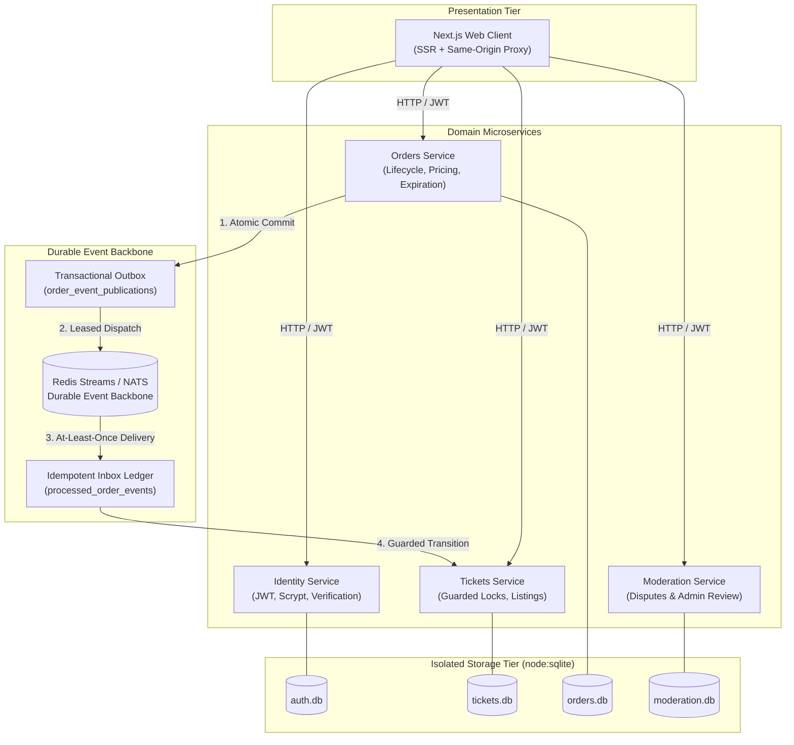

# Distributed Ticket Marketplace & Concurrency Engine

[](https://nodejs.org/)
[](https://www.typescriptlang.org/)
[](#system-architecture)
[](#architectural-decision-records-adrs)
[-003B57?logo=sqlite&logoColor=white)](#service-boundaries)

A production-grade distributed ticket reservation platform engineered to address real-world distributed systems failure modes: **high-contention ticket reservation races**, **dual-write database/broker hazards**, **atomic multi-replica worker leasing**, and **idempotent stream event convergence**.

> *"Most microservices tutorials demonstrate happy paths where networks never drop and services never crash. This system is designed around failure boundaries: what happens when 500 buyers hit the same seat simultaneously, when database commits succeed but message brokers drop connections, and when duplicate events redeliver out of order."*

---

## Highlights & Engineering Case Studies

1. **[Preventing Double-Booking Without Global Distributed Locks](docs/case-studies/01-preventing-double-booking-concurrency-without-distributed-locks.md)**
   * Eliminates distributed lock latency and split-brain risks (e.g. Redlock) by enforcing optimistic SQL row-level guards (`lockedByOrderId`) directly inside the Tickets service boundary.
2. **[Transactional Outbox with Atomic Worker Leasing in SQLite](docs/case-studies/02-transactional-outbox-with-atomic-worker-leasing.md)**
   * Solves the dual-write hazard by committing business state changes and outbox records in a single local transaction, claimed across multi-pod workers using atomic `BEGIN IMMEDIATE` row leases (`locked_until`).
3. **[Deep Module Design & Idempotent Stream Consumption](docs/case-studies/03-deep-modules-and-idempotent-event-driven-architecture.md)**
   * Encapsulates transport and broker mechanics behind clean domain interfaces (`enqueueOrderFact`, `startOrderEventsConsumer`), paired with an inbox deduplication ledger (`processed_order_events`) for guaranteed convergence under at-least-once delivery.
4. **[Engineering Outreach & System Design Interview Playbook](docs/portfolio/marketing-and-outreach-guide.md)**
   * Actionable guide detailing LinkedIn authority post copy, cold outreach scripts for hiring leaders, and STAR-format distributed systems interview talking points.

---

## 30-Second Concurrency & Outbox Smoke Drill

Prove the system's concurrency guarantees directly in your terminal with zero external dependencies:

```bash
npm run demo:concurrency
```

**What this drill exercises:**
* Fires 5 concurrent asynchronous purchase requests fighting for a single ticket.
* Proves that exactly **1 buyer wins** the reservation while **4 receive clean conflict rejections (409)** with zero double-booking.
* Verifies the winning order atomically commits an outbox event.
* Simulates 2 concurrent worker pods competing to dispatch the outbox record; verifies that atomic `BEGIN IMMEDIATE` leasing guarantees only **1 worker claims the event lease**.

---

## System Architecture

The platform strictly adheres to **Database-per-Service** isolation. No service shares database connections, tables, or internal schemas.



---

## Service Boundaries

| Service | Port | Core Responsibility | Persistence & Concurrency Guard |
| :--- | :--- | :--- | :--- |
| **`client`** | `3000` | Next.js frontend, SSR token refresh, countdown timers, checkout UX. | Browser / React State |
| **`auth`** | `3001` | Accounts, credentials, session refresh, scrypt hashing, JWT issuance. | `auth.db` (SQLite) |
| **`tickets`** | `3002` | Ticket inventory, price updates, authoritative reservation locks, release. | `tickets.db` (`lockedByOrderId` guard) |
| **`orders`** | `3003` | Purchase intent, locked price snapshots, expiration timers, outbox staging. | `orders.db` (`BEGIN IMMEDIATE` outbox) |
| **`moderation`** | `3004` | Post-sale seller reporting, dispute evidence, admin resolution. | `moderation.db` |

---

## Architectural Decision Records (ADRs)

| Decision | Chosen Approach | Rejected Alternative | Architectural Rationale |
| :--- | :--- | :--- | :--- |
| **Broker Transport** | **Redis Streams / NATS** | Redis Pub/Sub | Pub/Sub has fire-and-forget semantics: if a consumer is restarting during event delivery, the message is permanently lost. Streams provide persistent logs, consumer groups, and pending message recovery (`XAUTOCLAIM`). |
| **Ticket Reservation** | **Synchronous Guarded RPC** | Asynchronous Event Choreography | Reserving seats via eventual choreography allows multiple buyers to "think" they reserved a seat before a compensating transaction fails them. Synchronous guarded updates provide immediate, authoritative winner-takes-all decisions. |
| **Worker Leasing** | **Database Row Lease (`locked_until`)** | Distributed Redis Lock (Redlock) | Redlock introduces network latency, split-brain failure modes under GC pauses, and requires an external lock coordinator. A database row lease committed via `BEGIN IMMEDIATE` is atomic and shares the exact transactional failure domain of the service. |
| **Event Reliability** | **Transactional Outbox Pattern** | Direct Broker Calls in Handlers | Calling a broker inside an HTTP request handler creates the dual-write hazard: if the DB commit succeeds but the network drops before the broker call, the event is permanently lost. The outbox pattern guarantees atomic local staging. |
| **Module Boundaries** | **Deep Modules (Ousterhout)** | Layered "Classitis" (Shallow Wrappers) | In shallow architectures, transport details (Redis handles, stream keys, serialization) leak across controllers. In this codebase, domain code expresses intent (`enqueueOrderFact`), while internal modules own envelopes, retries, and leasing. |

---

## Core Business Invariants & Exact Code Anchors

Every critical business invariant is defended in code and covered by tests:

1. **Zero Double-Booking Guard:**
   * A ticket can only be reserved if its current status is `available` and `lockedByOrderId` is `NULL`.
   * *Code Anchor:* [`tickets/src/tickets/ticket-repo.ts`](tickets/src/tickets/ticket-repo.ts) (`reserveTicket`)
2. **Guarded Release Immunity:**
   * An expired or canceled order can only release a ticket if `lockedByOrderId` exactly matches that order's ID. Stale releases from earlier timed-out orders cannot unlock newer reservations.
   * *Code Anchor:* [`tickets/src/tickets/ticket-repo.ts`](tickets/src/tickets/ticket-repo.ts) (`releaseReservation`)
3. **Dual-Write Protection (Zero Lost Facts):**
   * Terminal order transitions (`order.completed`, `order.expired`) and their matching event publication rows are staged in the **exact same SQLite transaction**.
   * *Code Anchor:* [`orders/src/messaging/outbox-repo.ts`](orders/src/messaging/outbox-repo.ts) (`enqueueOrderFact`)
4. **Multi-Pod Outbox Worker Leasing:**
   * Multiple background worker replicas lease batches using `BEGIN IMMEDIATE` with `locked_by` and `locked_until` timestamps, preventing duplicate broker dispatches.
   * *Code Anchor:* [`orders/src/messaging/outbox-repo.ts`](orders/src/messaging/outbox-repo.ts) (`claimDueOrderEventPublications`)
5. **Idempotent Stream Consumption:**
   * Consumer groups process at-least-once messages through an inbox ledger (`processed_order_events`) and only issue transport ACKs (`XACK`) after database transaction commit.
   * *Code Anchor:* [`tickets/src/tickets/ticket-repo.ts`](tickets/src/tickets/ticket-repo.ts) (`applyOrderEventOnce`)

---

## Local Development & Setup

### Prerequisites
* **Node.js 24+** (utilizes native `node:sqlite` and `--experimental-strip-types`)
* **Docker Desktop** (with Kubernetes enabled) & **Skaffold** (for full containerized orchestration)

### Option 1: Fast Concurrency Drill (Zero Setup)
```bash
npm run demo:concurrency
```

### Option 2: Full Kubernetes Cluster
```bash
npm install
npm run dev
```

Skaffold deploys all services and proxies endpoints:
* **Web Application:** <http://localhost:3000>
* **Mailpit (Email Capture):** <http://localhost:8025>
* **Identity API:** `http://localhost:3001`
* **Tickets API:** `http://localhost:3002`
* **Orders API:** `http://localhost:3003`
* **Moderation API:** `http://localhost:3004`
* **Redis:** `localhost:6379`

Tear down local cluster:
```bash
npm run delete
```

---

## Verification & Workspace Quality Checks

```bash
# Typecheck all packages and workspaces
npm run typecheck

# Build client and shared libraries
npm run build
```

---

## Repository Documentation Index

* **Case Studies:**
  * [01: Preventing Double-Booking Without Distributed Locks](docs/case-studies/01-preventing-double-booking-concurrency-without-distributed-locks.md)
  * [02: Transactional Outbox with Atomic Worker Leasing](docs/case-studies/02-transactional-outbox-with-atomic-worker-leasing.md)
  * [03: Deep Modules & Idempotent Stream Consumption](docs/case-studies/03-deep-modules-and-idempotent-event-driven-architecture.md)
* **Engineering Outreach & Interview Prep:**
  * [Marketing, Promotion & Interview Playbook](docs/portfolio/marketing-and-outreach-guide.md)
* **Architectural Deep-Dives:**
  * [Service Boundaries & Data Ownership](docs/specifications/service-boundary.md)
  * [State Machine Specifications](docs/system_design/State%20Machines/)
  * [Order Data Capture & Verification Pattern](docs/patterns/order-data-capture-pattern.md)
  * [Messaging Architecture & Event Lifecycles](docs/patterns/messaging-architecture.md)
