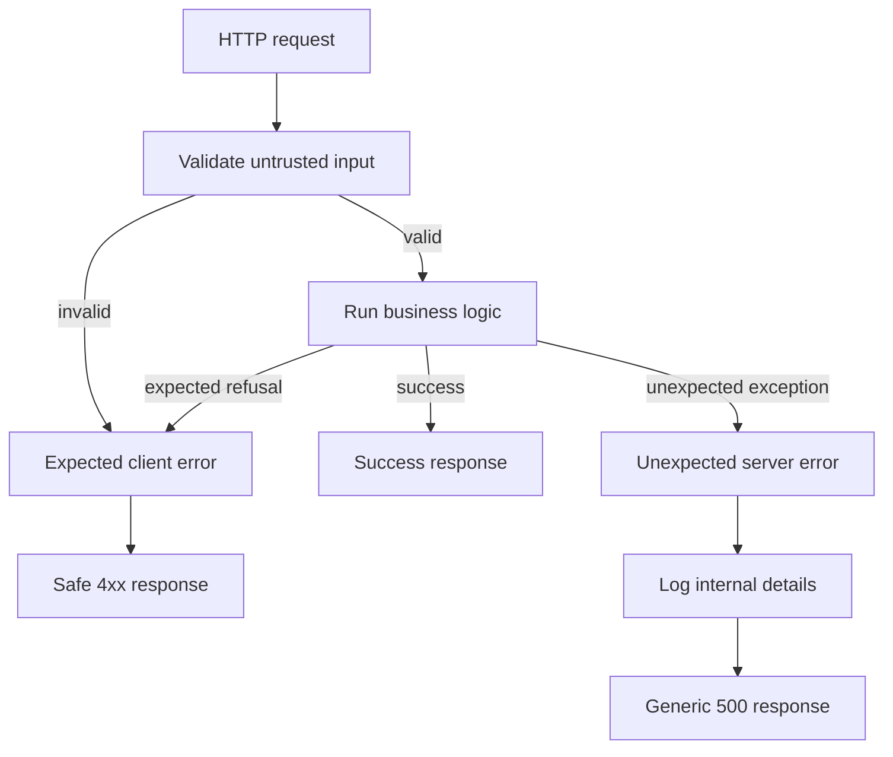

# Error Handling Fundamentals Walkthrough

This walkthrough explains the ideas behind the course sections on custom database
and request-validation errors without requiring the same class hierarchy in this
project. The goal is to understand the request flow, error ownership, HTTP
responses, and TypeScript contracts.

The current Identity implementation remains authoritative. It uses Express 5,
Zod, and the small `HttpError` class in `src/error-handler.ts`.

## 1. The complete mental model

Every request has one of three outcomes:



Examples:

| Outcome | Example | Typical status |
|---|---|---:|
| Success | Account created | `201` |
| Request-validation failure | Password is too short | `400` |
| Expected business refusal | Email is already registered | `409` |
| Authentication failure | Password is incorrect | `401` |
| Rate limit reached | Too many sign-in attempts | `429` |
| Unexpected database failure | SQLite cannot complete an operation | `500` |

An expected failure is part of normal application behavior. An unexpected failure
usually indicates a bug, unavailable dependency, corrupt state, or operational
problem.

## 2. The responsibilities

Keep these responsibilities separate:

1. **Schema:** decides whether untrusted input has the required shape.
2. **Route:** coordinates the request and recognizes expected business outcomes.
3. **Repository or service function:** performs authoritative business and data
   operations.
4. **Error object:** describes a failure in a form the application understands.
5. **Error middleware:** converts that failure into a safe HTTP response.

The route should not expose SQLite messages, stack traces, filesystem paths,
passwords, codes, or tokens. The client receives only information deliberately
chosen as public.

## 3. What a custom error actually is

A custom error is an ordinary JavaScript `Error` with additional information.
For example, the current project carries a safe HTTP status:

```ts
class HttpError extends Error {
  constructor(readonly status: number, message: string) {
    super(message);
  }
}
```

A route can then describe an expected failure:

```ts
throw new HttpError(409, "Email is already registered");
```

The central middleware converts it into HTTP:

```json
{
  "error": "Email is already registered"
}
```

The custom class is not doing the validation, database query, logging, or network
work. It is only carrying failure information from the code that detected the
problem to the code that creates the response.

## 4. Why the course introduces a base `CustomError`

The course likely wants every custom error to provide two things:

- an HTTP status code; and
- a consistent list of safe client-facing errors.

A simplified version of that contract is:

```ts
type SerializedError = {
  message: string;
  field?: string;
};

abstract class CustomError extends Error {
  abstract readonly statusCode: number;
  abstract serializeErrors(): SerializedError[];
}
```

The word `abstract` means the base class defines a rule but does not provide the
final value. Every concrete child must supply a `statusCode` and a compatible
`serializeErrors()` implementation.

This design is useful when one failure can contain several field errors:

```json
{
  "errors": [
    { "message": "Must be a valid email", "field": "email" },
    { "message": "Must be at least 8 characters", "field": "password" }
  ]
}
```

It is more machinery than the current service needs. The current service uses the
smaller response shape `{ "error": string }` and one `HttpError` class.

## 5. Request-validation error

### What problem it represents

Request validation protects a trust boundary. Everything arriving from an HTTP
client is untrusted until a runtime schema accepts it.

The current service uses Zod:

```ts
const credentialsSchema = z.object({
  email: z.string().trim().toLowerCase().max(320).pipe(z.email()),
  password: z.string().min(8).max(256),
});
```

A validation failure is expected and safe to report as `400 Bad Request`. It is
not a server crash.

### Why a specialized class can help

A request can have multiple invalid fields. A `RequestValidationError` can keep
those issues together and translate library-specific issue objects into the
application's public error format.

Conceptual example adapted to Zod:

```ts
class RequestValidationError extends CustomError {
  readonly statusCode = 400;

  constructor(private readonly issues: z.ZodIssue[]) {
    super("Invalid request");
  }

  serializeErrors(): SerializedError[] {
    return this.issues.map((issue) => ({
      message: issue.message,
      field: issue.path.join("."),
    }));
  }
}
```

The important boundary is:

```text
Zod issue objects
    ↓ RequestValidationError
Application error format
    ↓ error middleware
HTTP JSON response
```

The client should not depend directly on Zod's internal issue structure. If the
validation library changes, only the translation boundary should need changing.

### Current-project version

The current routes call `safeParse()` and either return a `400` response directly
or throw `HttpError`. That is valid for this small service. A dedicated
`RequestValidationError` becomes useful only if the client needs consistent,
field-level error arrays across several routes.

## 6. Database error

### What problem it represents

A real database failure is usually unexpected:

- the database file cannot be opened;
- a write cannot be completed;
- stored data violates an assumption;
- the database is unavailable; or
- an unexpected driver error occurs.

The client should normally receive a generic `500` response. The original error
must be logged on the server because operators need the real details.

Conceptual course-style class:

```ts
class DatabaseConnectionError extends CustomError {
  readonly statusCode = 500;

  constructor() {
    super("Database connection failed");
  }

  serializeErrors(): SerializedError[] {
    return [{ message: "Internal server error" }];
  }
}
```

The internal error and public response serve different audiences:

```text
Server log: SQLITE_BUSY: database is locked
Client body: { "errors": [{ "message": "Internal server error" }] }
```

### Do not turn every database outcome into `500`

Some database-backed outcomes are expected business results:

| Database-backed outcome | Public meaning | Status |
|---|---|---:|
| Unique email already exists | Conflict with an existing account | `409` |
| Requested record does not exist | Resource not found | `404` |
| Optimistic update loses a race | Conflict or domain-specific refusal | often `409` |
| Driver unexpectedly throws | Internal failure | `500` |

The repository should translate known storage outcomes into business results. An
unknown exception should remain unexpected and reach the generic error path.

### Current-project version

The current error middleware already handles unknown database exceptions:

1. the rejected repository promise reaches Express 5;
2. Express forwards the error to `errorHandler`;
3. the middleware logs the original error; and
4. the client receives `{ "error": "Internal server error" }` with status `500`.

A separate database error class would add value only if the application needs to
classify, monitor, or respond differently to a known database failure category.
It should not be added merely to rename every unknown exception.

## 7. `serializeErrors` and the TypeScript error

The course error:

> `serializeErrors` is not assignable to the same property in base type
> `CustomError`

means the child class broke the contract promised by the base class.

If the base class promises:

```ts
serializeErrors(): Array<{
  message: string;
  field?: string;
}>;
```

then this child is compatible:

```ts
serializeErrors() {
  return [{ message: "Invalid email", field: "email" }];
}
```

This child is not compatible:

```ts
serializeErrors() {
  return [{ msg: "Invalid email", param: "email" }];
}
```

`message` and `field` were promised, but `msg` and `param` were returned. The
fundamental rule is substitution: any child of `CustomError` must be usable
wherever a `CustomError` is expected.

Do not silence the mismatch with `as any`. Make the child return the agreed
public shape.

## 8. `param` and `AlternativeValidationError`

This lesson is mainly an `express-validator` version and union-type detail. It is
not an HTTP error-handling fundamental.

Recent `express-validator` versions distinguish several validation-error shapes.
A field error has a field path, while an alternative error can contain nested
errors. Therefore, TypeScript does not allow code to assume that every validation
error has `param`.

The correct general response is to:

1. use the API for the installed library version;
2. narrow the error by its discriminating property before reading variant-only
   fields; and
3. translate the narrowed result into the application's stable public shape.

The current Identity service does not use `express-validator`; it uses Zod, whose
issues expose a `path`. Do not copy the course's `param` mapping into this project.

## 9. Converting errors into responses

A course-style error handler might look like this:

```ts
const errorHandler: ErrorRequestHandler = (error, _request, response, next) => {
  if (response.headersSent) {
    next(error);
    return;
  }

  if (error instanceof CustomError) {
    response.status(error.statusCode).json({
      errors: error.serializeErrors(),
    });
    return;
  }

  console.error(error);
  response.status(500).json({
    errors: [{ message: "Internal server error" }],
  });
};
```

The current project uses the same idea with less ceremony:

```ts
if (error instanceof HttpError) {
  response.status(error.status).json({ error: error.message });
  return;
}

console.error(error);
response.status(500).json({ error: "Internal server error" });
```

Both designs implement the same fundamentals:

- recognize expected errors;
- preserve their chosen status and safe message;
- log unexpected errors;
- hide unexpected internal details; and
- send exactly one response.

## 10. Async error handling

Express must be able to observe an exception before the central middleware can
handle it.

The current service uses Express 5. A thrown error or rejected promise from an
`async` route is forwarded automatically:

```ts
router.post("/signup", async (request, response) => {
  const user = await createUser(request.body);
  if (!user) throw new HttpError(409, "Email is already registered");
  response.status(201).json({ user });
});
```

Older Express 4 courses often add `express-async-errors`, wrap every async route,
or manually call `next(error)`. Those techniques solve an older framework gap.
They are not required for promise-based Express 5 route handlers.

Callback APIs that Express cannot observe must still forward their errors with
`next(error)`.

The error middleware must be registered after the routes:

```ts
app.use(routes);
app.use(errorHandler);
```

## 11. How to study course sections 142–149

| Section | Learn deeply or skim? | Fundamental takeaway |
|---|---|---|
| 142. `param` on `AlternativeValidationError` | Skim | Validation libraries expose union types; narrow before reading variant-specific fields. |
| 143. Converting Errors to Responses | Learn deeply | Central middleware turns application failures into safe HTTP responses. |
| 144. Moving Logic Into Errors | Understand | Error classes can own status and serialization, but should not perform business work. |
| 145. `serializeErrors` type mismatch | Understand | A child class must honor the base class's return contract. |
| 146. Verifying Custom Errors | Learn deeply | Trigger each path and observe the actual status and response body. |
| 147. Final Error Related Code | Review | Trace the complete route-to-middleware flow; do not memorize files. |
| 148. Defining New Custom Errors | Understand | Add a class only for a genuinely distinct response shape or handling policy. |
| 149. Async Error Handling | Learn deeply | Rejected async work must reach the error middleware; Express 5 does this automatically for route promises. |

## 12. Manual verification checklist

For each error path, answer four questions:

1. What code detects the problem?
2. Is it expected or unexpected?
3. What status and body does the client receive?
4. What information is logged but hidden from the client?

Useful Identity examples:

### Invalid signup body

```text
Invalid JSON-compatible values
    → Zod rejects the credentials
    → expected request error
    → 400 response
```

### Duplicate signup email

```text
Valid request
    → repository finds the normalized email already exists
    → expected business conflict
    → HttpError
    → 409 response
```

### Unexpected SQLite exception

```text
Valid request
    → repository operation throws unexpectedly
    → Express 5 forwards the rejected promise
    → error middleware logs the original error
    → generic 500 response
```

### Too many sign-in requests

```text
Request reaches rate-limit middleware
    → IP and route bucket is already at 15
    → expected traffic refusal
    → 429 response with Retry-After
    → route business logic does not run
```

## 13. Fundamentals to retain

1. Validate all external input at the boundary.
2. Distinguish expected client or business failures from unexpected server
   failures.
3. Use HTTP statuses to describe the outcome; use JSON to provide safe details.
4. Keep public error messages separate from internal logs.
5. Centralize unexpected-error handling.
6. Ensure asynchronous failures reach the error middleware.
7. Keep one stable client-facing error shape.
8. Add specialized error classes only when they carry a distinct status,
   structure, or handling policy.
9. Never use type assertions to hide a broken error contract.
10. Verify the real status and response body by triggering each important path.

Once these rules are clear, custom classes such as `RequestValidationError` and
`DatabaseConnectionError` are implementation choices—not new fundamentals.
