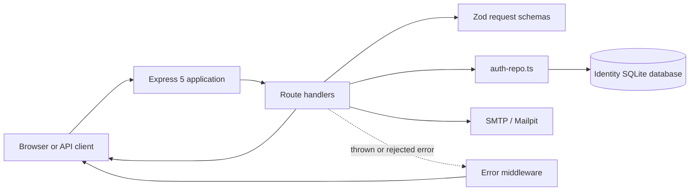
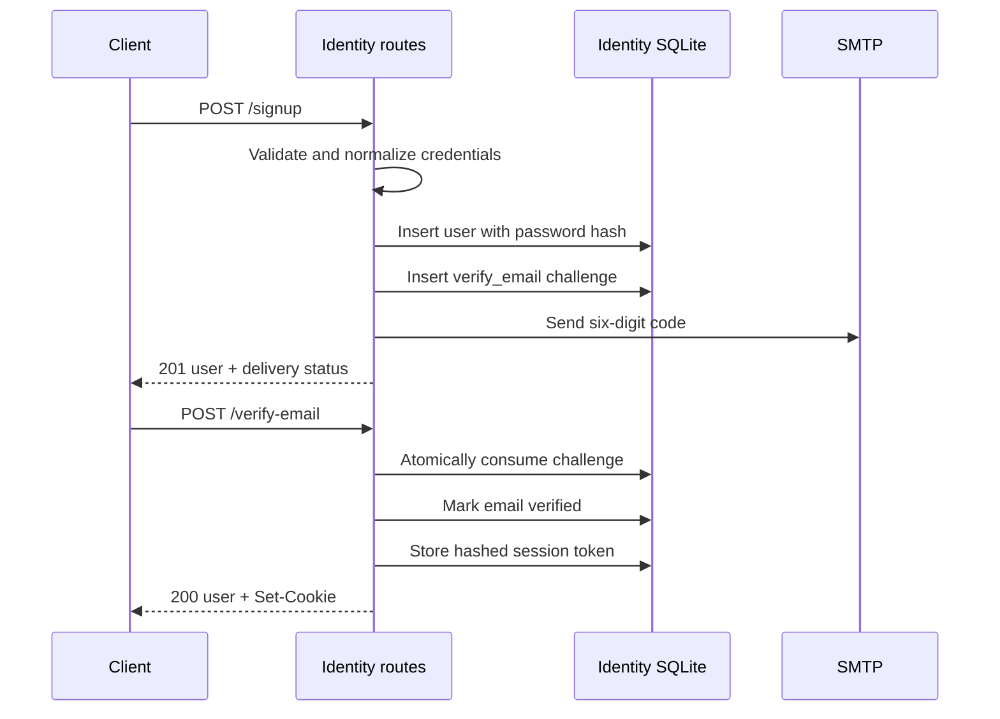
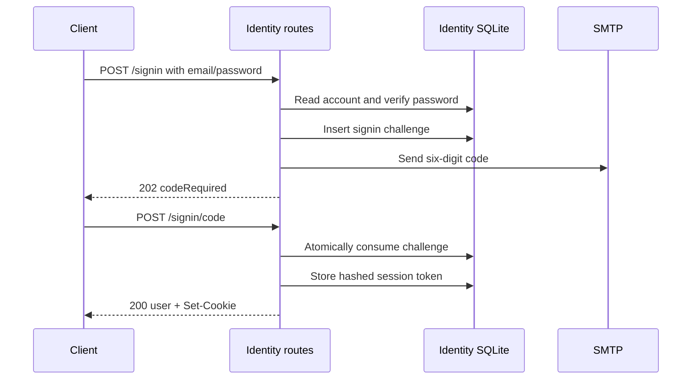

# Identity Service

The Identity service owns accounts, credentials, email verification, sign-in,
sign-out, and browser sessions for the StubHub learning project. The code lives
under `auth/`, while the runtime and Kubernetes resource are named `identity`.

This document describes the current implementation. Source code and migrations
remain authoritative when behavior changes.

## Ownership boundary

Identity owns:

- account creation and unique normalized email addresses;
- password hashing and password verification;
- email verification challenges;
- two-step sign-in using a password followed by an emailed code;
- session creation, lookup, expiration, and revocation; and
- the public user identity returned to clients.

Identity does not own:

- profiles, preferences, or buyer/seller roles;
- tickets, orders, payments, or reservations;
- authorization rules for another service's resources;
- credentials stored by Tickets or Orders; or
- the unresolved mechanism for propagating authenticated `userId` to other
  services.

Other services may use the stable user `id`, but must not read the Identity
SQLite database or receive password hashes, raw passwords, challenge codes, or
session tokens.

## Runtime architecture



The service is a Node.js 24 ESM application using:

- Express 5 for HTTP routing and middleware;
- Zod for runtime request validation;
- Node's built-in `node:sqlite` driver;
- Node's `crypto` module for scrypt, random values, and hashes; and
- Nodemailer for SMTP delivery.

## Source layout

| Path | Responsibility |
|---|---|
| `src/index.ts` | Builds the Express application, mounts routes and error middleware, and listens on the configured port. |
| `src/routes/` | HTTP request validation, status codes, and response bodies. |
| `src/routes/schemas.ts` | Shared Zod schemas for credentials, emails, and six-digit codes. |
| `src/auth-repo.ts` | Account, challenge, and session business operations against Identity-owned storage. |
| `src/database.ts` | SQLite connection, migration discovery, migration integrity checks, and startup migration execution. |
| `src/email.ts` | SMTP configuration and challenge-email delivery. |
| `src/error-handler.ts` | Typed expected HTTP errors and the fallback response for unexpected failures. |
| `migrations/` | Ordered, immutable SQL migrations. |

## HTTP pipeline

Requests pass through the application in this order:

1. `express.json({ limit: "16kb" })` parses JSON bodies.
2. The matching route validates request data with Zod.
3. The route calls `auth-repo.ts` for authoritative account, challenge, or
   session changes.
4. The route sends the success or expected business response.
5. A thrown exception or rejected route promise is forwarded to the error
   middleware.

Express 5 automatically forwards rejected promises from `async` handlers. Do
not wrap every `await` in `try/catch(next)`. Callback-based asynchronous APIs
that Express cannot observe must still call `next(error)` themselves.

The error middleware is mounted after every route. `HttpError` responses retain
their intended status and message. Unexpected errors are logged server-side and
returned as:

```json
{
  "error": "Internal server error"
}
```

Expected route errors use the same `{ "error": string }` response shape.

For a structured explanation of request-validation errors, database errors,
custom error contracts, serialization, and async propagation, read
[`ERROR_HANDLING_WALKTHROUGH.md`](./ERROR_HANDLING_WALKTHROUGH.md).

## Public user contract

No credential or session secret is returned as part of a user:

```ts
type PublicUser = {
  id: string;
  email: string;
  emailVerified: boolean;
};
```

## API reference

The local base URL is `http://localhost:3001`. Routes currently have no `/api`
prefix.

### Health

#### `GET /health`

Confirms that the HTTP process is responding.

```json
{
  "service": "identity",
  "status": "ok"
}
```

Status: `200`.

This is a shallow probe. It does not query SQLite or SMTP.

### Create an account

#### `POST /signup`

Request:

```json
{
  "email": "person@example.com",
  "password": "password123"
}
```

Validation and normalization:

- email must be a string and a valid email address;
- surrounding email whitespace is removed;
- email is converted to lowercase;
- normalized email length is at most 320 characters; and
- password length is 8 to 256 characters.

Success: `201`.

```json
{
  "user": {
    "id": "generated-uuid",
    "email": "person@example.com",
    "emailVerified": false
  },
  "verificationRequired": true,
  "emailSent": true
}
```

Expected failures:

| Status | Meaning |
|---|---|
| `400` | Invalid email or password shape. |
| `409` | The normalized email is already registered. |

Account creation is not rolled back when SMTP delivery fails. The response
remains `201`, with `emailSent: false`; `/verify-email/request` is the recovery
path.
Because challenge issuance has a 60-second cooldown, a failed delivery may
require waiting for the cooldown before requesting another email.

### Request another verification code

#### `POST /verify-email/request`

Request:

```json
{
  "email": "person@example.com"
}
```

Success: `202`.

```json
{
  "message": "If verification is available, a code has been sent"
}
```

Invalid email shape returns `400`. Every validly shaped request otherwise gets
the same `202` response, including unknown emails, already verified accounts,
challenge cooldowns, and SMTP failures. This prevents account enumeration.

### Verify an email

#### `POST /verify-email`

Request:

```json
{
  "email": "person@example.com",
  "code": "123456"
}
```

The code must contain exactly six digits. A successful request atomically
consumes the challenge, marks the email verified, creates a session, sets the
session cookie, and returns `200`:

```json
{
  "user": {
    "id": "generated-uuid",
    "email": "person@example.com",
    "emailVerified": true
  }
}
```

Expected failures:

| Status | Meaning |
|---|---|
| `400` | Invalid request shape or invalid, expired, consumed, or attempt-locked code. |

### Begin sign-in

#### `POST /signin`

Request:

```json
{
  "email": "person@example.com",
  "password": "password123"
}
```

A correct password is only the first sign-in step. The account must already be
email verified, after which the service issues a `signin` challenge and sends a
six-digit code.

Success: `202`.

```json
{
  "codeRequired": true
}
```

Expected failures:

| Status | Meaning |
|---|---|
| `400` | Invalid email or password shape. |
| `401` | Invalid email or password. The response does not identify which field was wrong. |
| `403` | Password is correct, but email verification is still required. |
| `429` | The account is temporarily locked after failed password attempts. Includes `Retry-After: 300`. |
| `503` | Password authentication succeeded, but sending a newly issued sign-in code failed. |

A request inside the 60-second challenge cooldown returns `202` without issuing
a replacement code; the existing active code remains valid.
If delivery of a newly issued sign-in code fails, the challenge remains active.
A retry inside the cooldown can therefore return `202` without sending another
email.

### Complete sign-in

#### `POST /signin/code`

Request:

```json
{
  "email": "person@example.com",
  "code": "123456"
}
```

Success: `200`, with the public user response and a new session cookie.

Expected failures:

| Status | Meaning |
|---|---|
| `400` | Invalid email or code shape. |
| `401` | Invalid, expired, consumed, or attempt-locked sign-in code. |

### Read the current user

#### `GET /current-user`

With a valid session:

```json
{
  "user": {
    "id": "generated-uuid",
    "email": "person@example.com",
    "emailVerified": true
  }
}
```

Without a valid session:

```json
{
  "user": null
}
```

Both cases return `200`.

### Sign out

#### `POST /signout`

Revokes the presented server-side session when one exists and sends an expired
session cookie. The operation is idempotent.

Status: `204`, with no response body.

## Account and session flows

### Signup and verification



### Sign-in



## Security behavior

### Passwords

- Raw passwords are never persisted or returned.
- Passwords use Node's `scrypt` with a random 16-byte salt and a 64-byte derived
  key.
- Stored values contain `salt:hash`, encoded as hexadecimal.
- Hash comparisons use `timingSafeEqual`.
- A missing-account sign-in still performs scrypt work to reduce user-existence
  timing differences.

### Failed password attempts

- Each incorrect password increments `failed_signin_attempts`.
- The fifth failed attempt sets `signin_locked_until` five minutes ahead.
- Requests during the lock still perform password-hash work and return `429`.
- A successful password after the lock window resets the attempt count and lock.

This is account-based protection only. There is currently no IP-based or global
rate limiter.

### Email challenges

- Purposes are limited to `verify_email` and `signin`.
- Codes contain six random digits.
- Only scrypt hashes of codes are stored.
- Codes expire after 10 minutes.
- Issuing another challenge has a 60-second cooldown.
- Issuing a replacement marks the previous active challenge used.
- Five incorrect attempts make a challenge unusable.
- Challenge consumption uses a guarded update inside a SQLite transaction, so
  concurrent requests cannot consume the same challenge twice.
- A missing challenge still performs scrypt work to reduce timing differences.

### Sessions

- Session tokens contain 32 random bytes encoded with base64url.
- Only a SHA-256 token hash is stored in SQLite.
- Sessions expire after 24 hours.
- Revocation sets `revoked_at`; it does not rely only on clearing the browser
  cookie.
- Expired sessions are deleted when a new session is created.

The cookie is configured as:

```text
session=<token>; HttpOnly; Path=/; SameSite=Lax; Max-Age=86400
```

`Secure` is added when `NODE_ENV=production`. JavaScript cannot read the cookie
because it is `HttpOnly`.

## Persistence and migrations

Identity exclusively owns its SQLite database.

### Tables

| Table | Purpose |
|---|---|
| `users` | Account identity, password hash, verification timestamp, and password lock state. |
| `sessions` | Hashed session tokens, expiration, and revocation state. |
| `email_challenges` | Hashed verification/sign-in challenges, purpose, expiry, use state, and failed attempts. |
| `schema_migrations` | Applied migration version, filename, checksum, and application time. Created by the migration runner. |

Important constraints include:

- `users.email` is unique;
- challenge purpose is restricted to `verify_email` or `signin`;
- only one unused challenge may exist per user and purpose; and
- sessions and challenges reference their user with `ON DELETE CASCADE`.

### Migration rules

Migrations are read from `auth/migrations/` in filename order. Filenames must use
contiguous versions such as `001_initial_auth.sql`.

Startup automatically applies unapplied migrations in individual transactions.
The migration ledger stores checksums and rejects renamed, modified, missing, or
gapped applied migrations. Never edit an applied migration; add the next
numbered migration.

SQLite runs with foreign keys enabled, WAL journal mode, a five-second busy
timeout, and one process-wide connection. The current deployment intentionally
uses one Identity replica with one writable volume.

## Configuration

| Variable | Default | Purpose |
|---|---|---|
| `PORT` | `3001` | HTTP listen port. |
| `IDENTITY_DB_PATH` | `auth/data/identity.sqlite` | SQLite database path. Use `:memory:` for an ephemeral manual run. |
| `SMTP_HOST` | `127.0.0.1` | SMTP host. Kubernetes uses `mailpit`. |
| `SMTP_PORT` | `1025` | SMTP port. |
| `EMAIL_FROM` | `StubHub Learning <identity@stubhub.local>` | Sender shown on challenge emails. |
| `NODE_ENV` | unset | `production` adds `Secure` to the session cookie. |

SMTP does not require TLS or configure authentication. With `secure: false`,
Nodemailer may upgrade with STARTTLS when a server offers it, but encrypted
transport is not enforced. This is appropriate for local Mailpit, not an
external production mail provider.

## Local development

All commands below run from the repository root.

Install workspace dependencies:

```bash
npm install
```

Run only Identity:

```bash
npm run dev:identity
```

This starts the service on port `3001`, rebuilds TypeScript when `auth/src` or
`auth/migrations` changes, and uses the default SQLite path. Email journeys need
an SMTP server on `127.0.0.1:1025`.

Run the complete local Kubernetes learning stack:

```bash
npm run dev
```

This command requires Docker, a local Kubernetes cluster, `kubectl`, and
Skaffold.

Skaffold builds and deploys Identity, provides Mailpit, and forwards:

- Identity API: `http://localhost:3001`
- Mailpit UI: `http://localhost:8025`

Useful checks:

```bash
npm run typecheck --workspace @stubhub/identity
npm run build --workspace @stubhub/identity
npm run migrate --workspace @stubhub/identity
curl http://localhost:3001/health
```

The explicit `migrate` command builds the service, applies migrations, and
prints the migration count. Normal service startup also applies migrations.

### Manual authentication journey

Create an account:

```bash
curl -i -X POST http://localhost:3001/signup \
  -H "Content-Type: application/json" \
  -d '{"email":"person@example.com","password":"password123"}'
```

Read the verification code from Mailpit, verify the account, and save the
session cookie:

```bash
curl -i -c auth.cookies -X POST http://localhost:3001/verify-email \
  -H "Content-Type: application/json" \
  -d '{"email":"person@example.com","code":"123456"}'
```

Read the current user:

```bash
curl -i -b auth.cookies http://localhost:3001/current-user
```

Sign out:

```bash
curl -i -b auth.cookies -X POST http://localhost:3001/signout
```

## Container and Kubernetes runtime

The shared root `Dockerfile` contains:

- `identity-dev`, used by Skaffold with source synchronization; and
- `identity`, the production-style image containing compiled JavaScript,
  migrations, and production dependencies.

The Kubernetes deployment:

- runs one replica as a non-root user;
- mounts the `identity-data` `ReadWriteOnce` PVC at `/data`;
- stores SQLite at `/data/identity.sqlite`;
- connects to the in-cluster Mailpit service;
- exposes port `3001` through the `identity` service;
- uses `/health` for readiness and liveness probes; and
- requests 25m CPU/64Mi memory with limits of 250m CPU/256Mi memory.

A valid image or Kubernetes manifest is not proof of a working deployment.
Verify source/build checks separately from container, cluster, and end-to-end
email/session journeys.

## Current limitations and deliberate scope
For a plain-language explanation of why each limit exists and when it matters,
read [`LIMITATIONS.md`](./LIMITATIONS.md).

- Authenticated identity propagation to Tickets and Orders is not implemented or
  accepted yet.
- Identity does not publish Redis Streams events.
- The service has no CORS middleware or same-origin gateway. A browser client on
  another origin cannot directly make credentialed requests until that
  integration policy is accepted.
- Password reset, email change, account deletion, OAuth, profiles, and roles are
  outside the current implementation.
- SQLite plus a `ReadWriteOnce` volume and one process-wide connection limits the
  service to one active writer replica.
- SMTP has no TLS or authentication configuration.
- The health endpoint does not prove database or SMTP availability.
- Malformed JSON raised by `express.json` currently reaches the generic error
  handler and is returned as `500`; valid JSON rejected by Zod returns `400`.
- Account lockout is not a substitute for edge rate limiting.

Add capabilities only when a concrete learning exercise or accepted service
contract requires them.
