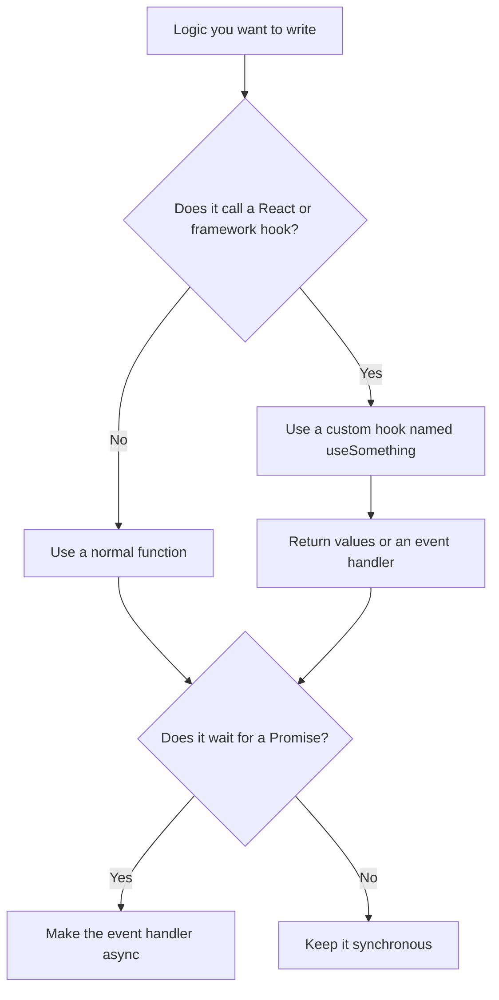

# Hooks versus normal functions

The most important rule is:

> Making an API request does not automatically require a React hook.

An API request only tells us that work finishes later. A hook is needed when the logic must use a React feature such as state, context, an Effect, or another hook like Next.js `useRouter`.

## Outcome

By the end of this guide, you should be able to:

- distinguish a normal function from a custom hook;
- explain why `async` does not mean “hook”;
- decide where an API request belongs;
- explain when sign-out can remain a normal function;
- recognize when sign-out has gained enough React behavior to justify a hook.

## Start with four separate questions

Words such as `export`, `async`, “event handler,” and “hook” describe different parts of a function. They are not alternatives to each other.

| Question | Relevant idea |
|---|---|
| Can another file import this function? | `export` |
| Does this function wait for a Promise? | `async` and `await` |
| Does a user interaction call this function? | Event handler |
| Does this logic use React features? | Hook |

One function can have several of these properties at once.

```ts
export async function loadTickets() {
  // exported: another file can import it
  // async: it can wait for a Promise
  // normal function: it does not use React hooks
}
```

`loadTickets` is still a normal function. Being exported or asynchronous does not turn it into a hook.

## What is a normal function?

A normal function is a reusable set of instructions.

```ts
function formatPrice(price: number) {
  return `$${price.toFixed(2)}`;
}
```

You give it a value, it performs work, and it returns a result. It does not need React.

Normal functions can:

- calculate values;
- validate input;
- format dates or prices;
- make API requests;
- parse responses;
- handle button clicks;
- be imported by other files;
- be synchronous or asynchronous.

A normal function can be called from React, but that does not make the function a hook.

## What does `async` mean?

`async` means a function returns a Promise. A Promise represents work that will finish later.

```ts
async function loadCurrentUser() {
  const response = await fetch("/api/identity/current-user");
  return response.json();
}
```

`await` pauses this function until the Promise settles. It does not freeze the browser or turn the function into a hook.

An API request is normally asynchronous because the browser must wait for another process to answer:

```text
browser sends request
        ↓
server handles request
        ↓
server sends response
        ↓
browser continues after await
```

The important distinction is:

- `async` is about **time**;
- a hook is about **React**.

## What is an event handler?

An event handler is a function that React calls after an interaction.

```tsx
async function handleSignOut() {
  await signout();
}

<button type="button" onClick={handleSignOut}>
  Sign out
</button>
```

The button receives the function without calling it:

```tsx
onClick={handleSignOut}
```

React calls it later when the user clicks.

This would call it immediately while rendering:

```tsx
onClick={handleSignOut()}
```

An event handler is usually a normal function. It can also be asynchronous when it needs to await work.

## What is a custom hook?

A custom hook is a function that packages reusable React logic.

A custom hook:

- starts with `use` followed by a capitalized word;
- calls at least one React or framework hook;
- follows the Rules of Hooks;
- runs while React renders the calling component;
- returns the values or functions the component needs;
- does not render JSX.

Example:

```tsx
import { useState } from "react";

export function useToggle() {
  const [isOpen, setIsOpen] = useState(false);

  function toggle() {
    setIsOpen(current => !current);
  }

  return { isOpen, toggle };
}
```

`useToggle` needs to be a hook because it calls `useState`. React owns that state and keeps it between renders.

## The decision tree



The first question is not “does this call an API?” The first question is “does this logic call a hook?”

## Apply the rule to this project

The sign-out flow has several small pieces. Each piece has one job.

### 1. The API client is a normal function

`client/lib/api/auth/signout.ts` owns the HTTP request:

```ts
export function signout(): Promise<void> {
  return authRequest("/signout", { method: "POST" }, parseNoContent);
}
```

This is not a hook because it does not use React. It only knows:

- the API path;
- the HTTP method;
- how to parse the response.

That is useful because the API function could be called from any appropriate JavaScript code, not only while React is rendering.

### 2. The button needs an event handler

The signed-in page needs to give `Navbar` a function:

```tsx
async function handleSignOut() {
  await signout();
}

<Navbar onSignOut={handleSignOut} />
```

`Navbar` puts that function on the button:

```tsx
<button type="button" onClick={onSignOut}>
  Sign out
</button>
```

This version does not need a custom hook. `handleSignOut` is a normal asynchronous event handler.

### 3. The current `useSignOut` does not yet need to be a hook

Consider this implementation:

```ts
export function useSignOut() {
  return async function handleSignOut() {
    await signout();
  };
}
```

It returns a function, but it does not call any hooks. Returning another function does not make it a hook.

This shape is called a **function factory**: one function creates and returns another function. Function factories are normal JavaScript. They are not automatically React hooks.

The `use` name currently adds restrictions without adding React behavior. The simpler version is an ordinary event handler inside `SignedInLanding`:

```tsx
export function SignedInLanding({ email }: SignedInLandingProps) {
  async function handleSignOut() {
    await signout();
  }

  return (
    <Navbar
      accountLabel={email}
      items={navigation}
      onSignOut={handleSignOut}
    />
  );
}
```

This is enough when the handler only sends the request.

## When sign-out really becomes a hook

Suppose sign-out must use the Next.js Pages Router after the server expires the cookie:

```tsx
import { useRouter } from "next/router";
import { signout } from "../../lib/api/auth/signout";

export function useSignOut() {
  // useRouter is a hook, so this wrapper is now genuinely a custom hook.
  const router = useRouter();

  // The returned handler runs later, after the user clicks.
  return async function handleSignOut() {
    await signout();
    await router.replace("/auth");
  };
}
```

Now the custom hook has a reason to exist: it calls `useRouter`, which is a framework hook tied to the React component.

The component calls the hook while rendering:

```tsx
export function SignedInLanding({ email }: SignedInLandingProps) {
  const handleSignOut = useSignOut();

  return (
    <Navbar
      accountLabel={email}
      items={navigation}
      onSignOut={handleSignOut}
    />
  );
}
```

The two functions run at different times:

1. React renders `SignedInLanding`.
2. `SignedInLanding` calls `useSignOut()`.
3. `useSignOut()` calls `useRouter()` and returns `handleSignOut`.
4. `Navbar` gives `handleSignOut` to the button.
5. The user clicks the button later.
6. React calls `handleSignOut`.
7. `handleSignOut` waits for the sign-out response.
8. The router replaces the page with `/auth`.

The API request still did not cause the hook. `useRouter` caused the hook.

## State can also justify a hook

A sign-out flow might eventually need React state so the UI can disable the button while the request is pending:

```tsx
const [isSigningOut, setIsSigningOut] = useState(false);
```

If the reusable sign-out behavior owns that state, a custom hook can return both the operation and the current state:

```ts
return { handleSignOut, isSigningOut };
```

The component could then render:

```tsx
<button disabled={isSigningOut} onClick={handleSignOut} type="button">
  {isSigningOut ? "Signing out..." : "Sign out"}
</button>
```

This is a valid reason for a hook because React must remember `isSigningOut` between renders.

Do not add state merely to justify a hook. Add it only when the UI needs that behavior.

## Reuse alone does not require a hook

Both normal functions and hooks can be reused.

Use a reusable normal function when the shared logic does not use hooks:

```ts
export function normalizeEmail(email: string) {
  return email.trim().toLowerCase();
}
```

Use a custom hook when the shared logic itself uses hooks:

```tsx
export function useCurrentUser() {
  const [user, setUser] = useState<User | null>(null);
  // More React coordination would live here.
  return user;
}
```

The deciding factor is React behavior, not the number of callers.

## A hook itself should not be `async`

The outer hook runs while React is rendering. It must call its hooks immediately and in a stable order.

Avoid this:

```tsx
export async function useSignOut() {
  const router = useRouter();
  // Incorrect shape: the hook itself returns a Promise.
}
```

Instead, keep the hook synchronous and return an asynchronous event handler:

```tsx
export function useSignOut() {
  const router = useRouter();

  return async function handleSignOut() {
    await signout();
    await router.replace("/auth");
  };
}
```

Therefore:

- the hook runs during rendering;
- the returned async function runs after the click.

## Why hooks cannot be called inside click handlers

React depends on hooks being called in the same order on every render.

Correct:

```tsx
function SignedInLanding() {
  // Called at the top level during every render.
  const handleSignOut = useSignOut();

  return <button onClick={handleSignOut}>Sign out</button>;
}
```

Incorrect:

```tsx
function SignedInLanding() {
  function handleSignOut() {
    // Called later inside an event handler.
    useSignOut();
  }

  return <button onClick={handleSignOut}>Sign out</button>;
}
```

The incorrect version hides the hook call inside a later event. React is no longer calling it as part of rendering.

## Why a click does not need `useEffect`

A button click has a clear cause: the user clicked the button. The event handler should perform the work directly.

```tsx
async function handleSignOut() {
  await signout();
}
```

An Effect is for synchronizing a rendered component with something outside React because a render or dependency changed. It is not an extra wrapper for ordinary button actions.

Avoid this pattern:

```tsx
useEffect(() => {
  return () => {
    signout();
  };
}, []);
```

The returned Effect function is cleanup. React runs it when the Effect must clean up, commonly when the component unmounts. It does not represent a button click.

## Quick classification examples

### Normal calculation

```ts
function calculateTotal(price: number, quantity: number) {
  return price * quantity;
}
```

Reason: calculation only; no hooks.

### Normal asynchronous API function

```ts
async function loadOrders() {
  const response = await fetch("/api/orders");
  return response.json();
}
```

Reason: waits for an API response but does not use React.

### Normal asynchronous event handler

```tsx
async function handlePurchase() {
  await createOrder();
}
```

Reason: a click or submit event starts the asynchronous work; no hooks are used inside this function.

### Custom hook

```tsx
function useOrderForm() {
  const [isSubmitting, setIsSubmitting] = useState(false);
  return { isSubmitting, setIsSubmitting };
}
```

Reason: uses React state.

## Decision checklist

Ask these questions in order:

1. Does the logic call `useState`, `useEffect`, `useContext`, `useRef`, `useRouter`, or another hook?
   - Yes: it belongs in a component or custom hook.
   - No: start with a normal function.
2. Does the function wait for a Promise?
   - Yes: make the function or returned event handler `async` when `await` improves the sequence.
   - No: keep it synchronous.
3. Does a user interaction start the work?
   - Yes: pass the function to `onClick`, `onSubmit`, or another event prop.
   - No: call it from the code path that owns the cause.
4. Is the same React behavior duplicated across components?
   - Yes: consider extracting a custom hook.
   - No: keeping it in the component may be simpler.

Do not start with “this calls an API, so it needs a hook.” Start with “which React feature does this logic need?”

## Practice

Classify each function before opening the answer.

### A. Format a venue name

```ts
function formatVenue(name: string) {
  return name.trim();
}
```

<details>
<summary>Answer</summary>

Normal function. It performs a calculation and uses no hooks.

</details>

### B. Send a ticket creation request

```ts
async function createTicket(input: TicketInput) {
  return apiRequest("/tickets", input);
}
```

<details>
<summary>Answer</summary>

Normal asynchronous function. Calling an API does not make it a hook.

</details>

### C. Track whether a request is pending

```tsx
function useTicketCreation() {
  const [isPending, setIsPending] = useState(false);
  // Request coordination follows.
}
```

<details>
<summary>Answer</summary>

Custom hook. It calls `useState`, so React owns memory used by this logic.

</details>

### D. Submit after a click

```tsx
async function handleCreateTicket() {
  await createTicket(input);
}
```

<details>
<summary>Answer</summary>

Normal asynchronous event handler. The click determines when it runs.

</details>

### E. Redirect after sign-out with `useRouter`

```tsx
function useSignOut() {
  const router = useRouter();
  // Return the sign-out handler.
}
```

<details>
<summary>Answer</summary>

Custom hook. The API request is not the reason; calling `useRouter` is the reason.

</details>

## Final mental model

```text
Normal function = ordinary reusable JavaScript behavior
Async function  = a function whose result arrives through a Promise
Event handler   = a function called after a user interaction
Custom hook     = reusable logic that calls React or framework hooks
```

For sign-out:

```text
HTTP request only                  → normal async function
HTTP request from a button         → normal async event handler
HTTP request + useRouter/useState  → custom hook returning an async handler
```

Start with a normal function. Upgrade it to a hook only when React behavior creates a real reason.

## Related material

- [React hooks from first principles](./react-hooks.md)
- [React: Rules of Hooks](https://react.dev/reference/rules/rules-of-hooks)
- [React: Reusing Logic with Custom Hooks](https://react.dev/learn/reusing-logic-with-custom-hooks)
- [Next.js Pages Router: `useRouter`](https://nextjs.org/docs/pages/api-reference/functions/use-router)
- Project API function: `client/lib/api/auth/signout.ts`
- Project landing component: `client/features/landing/SignedInLanding.tsx`
