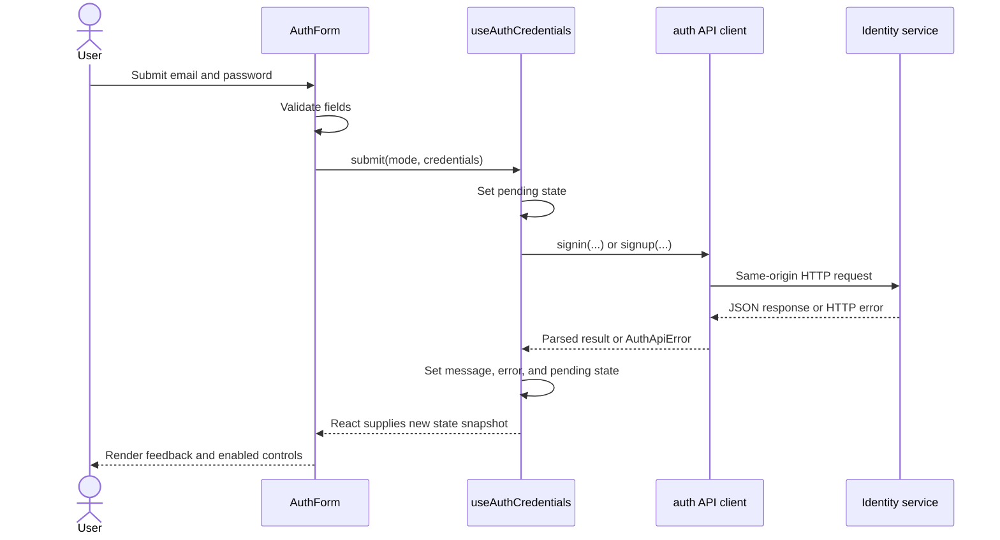

# React Hooks from first principles

This course builds one mental model and then applies it to the real authentication flow in this client. Work through the lessons in order. Predict each result before opening its answer.

## Outcome

By the end, you should be able to:

- explain why a component function runs repeatedly;
- distinguish an ordinary variable from React state;
- predict state values before and after a setter call;
- apply the Rules of Hooks without memorizing arbitrary restrictions;
- explain what a custom hook shares and what it does not share;
- trace `AuthForm` through `useAuthCredentials` and the Identity API client;
- debug loading, success, and failure renders in an asynchronous hook.

## Vocabulary

| Term | Meaning in this course |
|---|---|
| Component | A function React calls to calculate part of the UI. |
| Render | One call to a component and the UI snapshot calculated by that call. |
| Re-render | A later call to the same mounted component so React can calculate a new snapshot. |
| State | Component memory stored by React between renders. |
| Hook | A function that lets a component use React features such as state. |
| Custom hook | A function named `useSomething` that composes hooks into reusable stateful logic. |
| Event handler | A function invoked because the user interacted with the rendered UI. |
| API client | Framework-free code that owns HTTP paths, request options, and response parsing. |

---

## Lesson 1: Rendering calls your component again

### Problem

A normal JavaScript function does not remember its local variables after it returns:

```ts
function calculate() {
  let value = 0;
  value += 1;
  return value;
}

calculate(); // 1
calculate(); // 1
```

Each call creates a new `value`. React components are still JavaScript functions, so their ordinary local variables follow the same rule.

### Establish the render model

```tsx
function Counter() {
  let count = 0;

  return <button onClick={() => count += 1}>{count}</button>;
}
```

React calls `Counter()` during rendering. That call creates `count`, calculates JSX, and returns. Clicking the button changes the old call's local variable, but it does not ask React to calculate new JSX. If React later calls `Counter()` again, a fresh `count` starts at `0`.

A render therefore produces a **snapshot**:

1. React calls the component.
2. The component reads its current props and state.
3. The component creates local variables and event handlers.
4. The component returns JSX.
5. React commits the necessary DOM changes.

React does not continuously execute the component. It calls it when a render is required.

### Connection to `AuthForm`

Every render of `AuthForm` recreates:

- `selectMode`;
- `handleSubmit`;
- `nextErrors` when a submission occurs;
- `isSignin` from the current `mode` snapshot;
- the JSX returned at the bottom.

React must store `mode`, `errors`, and the hook's request state elsewhere, or those values would reset on every call.

### Practice

```tsx
function Example() {
  let label = "first";
  label = "second";
  return <p>{label}</p>;
}
```

What text is calculated each time React calls `Example()`?

<details>
<summary>Answer</summary>

`second`. Each call creates `label` as `"first"`, immediately changes that call's variable to `"second"`, and returns it. Nothing persists from an earlier call.

</details>

---

## Lesson 2: State is memory stored by React

### Problem

Interactive UI needs values to survive component calls. Ordinary local variables cannot provide that memory.

### Establish `useState`

```tsx
const [count, setCount] = useState(0);
```

This expression gives the current render two values:

1. `count`: the state snapshot for this render;
2. `setCount`: a function that queues a state change and requests another render.

The initial value `0` is used when this component state is first created. It is not reapplied on every re-render.

Conceptually, React keeps the memory outside the component:

```text
React's stored state: 0
        ↓
React calls Counter and gives that render count = 0
        ↓
Counter returns JSX and event handlers using count = 0
```

Calling `setCount(1)` asks React to store `1` and render again. On that later call, `useState` returns `1` as the new snapshot.

### State belongs to a mounted component position

State is not stored inside the source-code function itself. Two rendered instances receive independent state:

```tsx
<Counter />
<Counter />
```

Clicking the first counter does not update the second. React associates each state cell with the corresponding mounted component and hook position.

### Connection to `useAuthCredentials`

The hook declares three state cells:

```tsx
const [isSubmitting, setIsSubmitting] = useState(false);
const [message, setMessage] = useState("");
const [hasError, setHasError] = useState(false);
```

Those values survive re-renders of the `AuthForm` instance that called the hook. A second `AuthForm` instance would get a separate set of three cells.

### Practice

Suppose two components both call `useAuthCredentials()`. The first calls `setMessage("Failed")`. What message does the second component receive?

<details>
<summary>Answer</summary>

Its own previous message. Custom hooks share logic, not one global state object.

</details>

---

## Lesson 3: Destructuring does not make state mutable

### Problem

This syntax resembles an ordinary variable declaration:

```tsx
const [message, setMessage] = useState("");
```

That resemblance can suggest that `setMessage` changes the local `message`. It does not.

### Derive the two returned values

`useState` returns a two-item array. Array destructuring names those items:

```tsx
const statePair = useState("");
const message = statePair[0];
const setMessage = statePair[1];
```

`message` is still a constant local variable for one component call. It cannot be reassigned. The setter communicates with React's stored state.

```tsx
function handleClick() {
  setMessage("Saved");
  console.log(message);
}
```

The log reads the current render's snapshot. React has not gone backward and rewritten the `message` constant captured by this handler.

### Why setters exist

Direct mutation would hide the fact that the UI needs recalculation. A setter does both necessary jobs:

- records the requested next state;
- tells React that another render is needed.

This is wrong:

```tsx
message = "Saved";
```

It attempts to reassign a constant and would not be the React state protocol even if `let` were used.

### Practice

If the current render has `message === ""`, what does the handler below log?

```tsx
setMessage("Ready");
console.log(message);
```

<details>
<summary>Answer</summary>

The empty string. A later render receives `"Ready"`.

</details>

---

## Lesson 4: Each render has a fixed state snapshot

### Problem

Multiple state updates can be misread as immediate assignments:

```tsx
setCount(count + 1);
setCount(count + 1);
```

### Substitute the current snapshot

If this render has `count === 0`, both expressions mean the same thing:

```tsx
setCount(0 + 1);
setCount(0 + 1);
```

The next render receives `1`, not `2`.

When the next state depends on the previous queued state, pass an updater function:

```tsx
setCount(previous => previous + 1);
setCount(previous => previous + 1);
```

React applies the queued functions in order:

```text
0 → 1 → 2
```

### Snapshots also matter after `await`

An asynchronous handler keeps the values captured by the render that created it:

```tsx
async function handleSave() {
  setMessage("Saving");
  await save();
  console.log(message);
}
```

The log still sees the old `message` from this handler's render. Other renders may have happened while `save()` was pending, but they created different handler closures with different snapshots.

### Connection to the auth hook

Inside `submit`, this line queues a loading render:

```tsx
setIsSubmitting(true);
```

It does not synchronously change that invocation's `isSubmitting` variable. The hook does not read `isSubmitting` again inside `submit`, so it does not rely on an impossible immediate change.

After the request settles, `finally` queues:

```tsx
setIsSubmitting(false);
```

The next render then enables the controls again.

### Practice

Starting from `count === 3`, what is the next count?

```tsx
setCount(previous => previous + 2);
setCount(previous => previous * 2);
```

<details>
<summary>Answer</summary>

`10`. React applies the updater queue in order: `(3 + 2) * 2`.

</details>

---

## Lesson 5: Hook call order must stay stable

### Problem

React must match every `useState` call in a new render with the state cell created during earlier renders.

### Derive the top-level rule

Consider this unsupported component:

```tsx
function Form({ showMessage }: { showMessage: boolean }) {
  const [email, setEmail] = useState("");

  if (showMessage) {
    const [message, setMessage] = useState("");
  }

  const [password, setPassword] = useState("");
  // ...
}
```

When `showMessage` changes, the number and order of hook calls change. The state position that previously represented `message` could now be mistaken for `password`.

Hooks must therefore be called:

- at the top level of a function component or custom hook;
- before conditional returns;
- never inside conditions, loops, nested functions, event handlers, or `try` blocks.

The condition belongs **after** the hook call or inside ordinary logic:

```tsx
const [message, setMessage] = useState("");

if (!showMessage) {
  return null;
}
```

### Only React functions may call hooks

Valid callers:

```tsx
function AuthForm() {
  const auth = useAuthCredentials();
  // ...
}

function useAuthCredentials() {
  const [message, setMessage] = useState("");
  // ...
}
```

An ordinary utility must not call hooks:

```tsx
function formatMessage() {
  // useState(...) is not valid here.
}
```

### Practice

Which call is valid?

```tsx
// A
if (mode === "signin") useAuthCredentials();

// B
const auth = useAuthCredentials();
if (mode === "signin") return <Signin auth={auth} />;
```

<details>
<summary>Answer</summary>

B. The hook is called unconditionally at the top level. Conditional rendering happens afterward.

</details>

---

## Lesson 6: Custom hooks share logic, not state

### Problem

A component should describe presentation and interaction without owning every transport detail. Copying the same loading/error/request coordination into several components would also create drift.

### Establish a custom hook

A custom hook is a JavaScript or TypeScript function that:

- has a name beginning with `use` followed by a capitalized word;
- calls at least one hook;
- obeys the Rules of Hooks;
- returns whatever values and operations its caller needs;
- does not render JSX.

Example:

```tsx
function useToggle(initialValue = false) {
  const [value, setValue] = useState(initialValue);

  function toggle() {
    setValue(previous => !previous);
  }

  return { toggle, value };
}
```

Two calls create two independent state sets:

```tsx
const menu = useToggle();
const dialog = useToggle();
```

They reuse the implementation of `toggle`; they do not share one `value`.

### Why `useAuthCredentials` is a hook

It owns stateful request coordination:

- whether a credential request is pending;
- the current backend or success message;
- whether that message represents an error;
- the operation that submits credentials;
- the operation that clears feedback.

`AuthForm` consumes that behavior but still owns presentation and immediate field validation.

### What should not become a hook

A pure calculation needs only a normal function:

```ts
function isValidPassword(password: string) {
  return password.length >= 8 && password.length <= 256;
}
```

Naming this `useValidPassword` would falsely imply that it uses React features and would unnecessarily restrict where it can be called.

### Practice

Does extracting logic into a custom hook prevent the calling component from re-rendering when the hook's state changes?

<details>
<summary>Answer</summary>

No. The hook's state is part of the calling component instance. Updating it requests a re-render of that component.

</details>

---

## Lesson 7: Event-driven async work belongs in the event path

### Problem

A request has observable phases:

1. idle;
2. pending;
3. success or failure;
4. no longer pending.

The UI needs state for those phases, and every exit path must restore a usable form.

### Use `try`, `catch`, and `finally`

```tsx
async function submit() {
  setIsSubmitting(true);

  try {
    const result = await request();
    setMessage(result.message);
  } catch (error) {
    setHasError(true);
    setMessage(error instanceof Error ? error.message : "Request failed");
  } finally {
    setIsSubmitting(false);
  }
}
```

Responsibilities:

- `try` contains the request and success transition;
- `catch` converts a rejected promise into visible failure state;
- `finally` runs after either outcome and clears loading state.

### Why this flow does not need `useEffect`

The request exists because the user submitted the form. The submission handler is the known cause, so it should call `submit` directly.

An Effect is for synchronizing a rendered component with an external system because of rendering or dependency changes. Using an Effect for a directly caused button action would separate the action from its cause and introduce extra state solely to trigger the Effect.

### Backend authority remains intact

The form checks email shape and password length for immediate feedback. The Identity service still decides whether:

- credentials are valid;
- an account already exists;
- an email is verified;
- rate limits apply;
- a code can be issued.

The hook displays those results; it does not reproduce those decisions.

### Practice

Why is `setIsSubmitting(false)` in `finally` rather than repeated at the end of `try` and `catch`?

<details>
<summary>Answer</summary>

Both paths require the same cleanup. `finally` expresses that invariant once and also covers unexpected errors thrown while processing either path.

</details>

---

## Lesson 8: Dissecting `useAuthCredentials`

The implemented hook is in `client/hooks/auth/useAuthCredentials.ts`.

### Imports define the dependency direction

```tsx
import { useState } from "react";
import { signin } from "../../lib/api/auth/signin";
import { signup } from "../../lib/api/auth/signup";
import type { Credentials } from "../../lib/api/auth/types";
```

- React supplies state storage.
- The API modules own HTTP endpoint details.
- `Credentials` documents the input shape at compile time.
- The hook does not call `fetch` directly and does not import UI components.

### The mode is a closed set

```tsx
type AuthMode = "signin" | "signup";
```

The hook accepts only the two operations supported by this credential form. TypeScript rejects another string at compile time. The server must still validate runtime request data because TypeScript types do not exist after compilation.

### Three state cells model observable request state

```tsx
const [isSubmitting, setIsSubmitting] = useState(false);
const [message, setMessage] = useState("");
const [hasError, setHasError] = useState(false);
```

These are separate because the UI reads them independently:

- `isSubmitting` disables controls and changes button copy;
- `message` supplies accessible feedback;
- `hasError` selects error styling and `role="alert"`.

No additional state stores information the UI does not currently use.

### Feedback reset is one named operation

```tsx
function clearFeedback() {
  setMessage("");
  setHasError(false);
}
```

The form calls this when switching modes or beginning a new submission. React normally batches these setters into one render when they occur in the same event path.

`clearFeedback` is recreated on each render. That is acceptable: it is small, is not passed to a memoized child, and does not need `useCallback`.

### `submit` owns the request state machine

```tsx
async function submit(mode: AuthMode, credentials: Credentials) {
  setIsSubmitting(true);
  clearFeedback();

  try {
    if (mode === "signin") {
      await signin(credentials);
      setMessage("Check your email for the six-digit sign-in code.");
      return;
    }

    const result = await signup(credentials);
    setMessage(
      result.emailSent
        ? "Account created. Check your email for the verification code."
        : "Account created, but the verification email could not be sent. Request another code.",
    );
  } catch (error) {
    setHasError(true);
    setMessage(error instanceof Error ? error.message : "Identity request failed");
  } finally {
    setIsSubmitting(false);
  }
}
```

Trace the sign-in branch:

1. Queue pending state.
2. Clear old feedback.
3. Call `signin(credentials)`.
4. Wait for `POST /signin` to settle.
5. On success, show instructions for the next factor.
6. On rejection, expose the normalized error message.
7. In either case, clear pending state.

The `return` leaves the `try` block after successful sign-in, but JavaScript still runs `finally`.

Trace the sign-up branch:

1. Perform the same pending/reset steps.
2. Call `signup(credentials)`.
3. Runtime-parse the returned user and delivery status in the API client.
4. Explain whether the verification email was sent.
5. Handle errors and pending cleanup through the same shared paths.

### The returned object is the hook's public contract

```tsx
return { clearFeedback, hasError, isSubmitting, message, submit };
```

`AuthForm` receives only the state and operations it renders or invokes. Internal setters stay private, so the component cannot create impossible combinations accidentally by setting them independently.

### Important current boundary

This hook connects only the credential step:

- sign-in requests a six-digit sign-in code;
- sign-up creates an unverified account and requests a verification code.

It does not yet collect those codes, complete authentication, or retain the returned access token. Those require a defined next-step UI and app-level in-memory authentication state; they should not be hidden inside the current two-field form.

### Practice

Why does the hook branch on `mode` before calling the API rather than letting `AuthForm` call `signin` or `signup` itself?

<details>
<summary>Answer</summary>

The hook owns React-to-API coordination, including loading and response state. `AuthForm` owns presentation and validation. Keeping both operations in the hook preserves that layer boundary and one request-state implementation.

</details>

---

## Lesson 9: Trace the complete credential request

This is the one relationship to keep visible while debugging:



### Transport details below the hook

The API client:

- sends browser requests to `/api/identity/*`;
- includes cookies with `credentials: "include"`;
- sets JSON content headers when a body exists;
- converts non-success responses into `AuthApiError`;
- runtime-validates successful JSON before returning it.

Next.js rewrites the same-origin browser path to the configured Identity service URL. The component does not need to know the service hostname.

### Failure trace

For an invalid password:

1. local length validation may reject an obviously invalid length without a request;
2. otherwise the hook calls `signin`;
3. Identity authoritatively rejects invalid credentials;
4. the API client throws `AuthApiError` with the safe backend message;
5. the hook catches it and sets `hasError` plus `message`;
6. `finally` clears `isSubmitting`;
7. `AuthForm` re-renders an enabled form with an announced error.

### Debugging checklist

When the UI looks stuck, inspect the layers in order:

1. Did the form's `onSubmit` run?
2. Did local validation return early?
3. Did the hook set pending state?
4. Which API branch ran?
5. What HTTP status and body came back?
6. Did runtime response parsing accept the body?
7. Did `catch` or the success branch set feedback?
8. Did `finally` clear pending state?
9. What state snapshot did the next render receive?

---

## Lesson 10: Demonstrate the model

### Exercise A: Run a state queue lab

Put this component temporarily into a React playground or a disposable page:

```tsx
import { useState } from "react";

export default function HookQueueLab() {
  const [count, setCount] = useState(0);

  return (
    <main>
      <p>Count: {count}</p>
      <button
        onClick={() => {
          setCount(count + 1);
          setCount(count + 1);
        }}
      >
        Snapshot +2
      </button>
      <button
        onClick={() => {
          setCount(previous => previous + 1);
          setCount(previous => previous + 1);
        }}
      >
        Updater +2
      </button>
      <button onClick={() => setCount(0)}>Reset</button>
    </main>
  );
}
```

Before running it, predict:

1. The result of clicking **Snapshot +2** from `0`.
2. The result of clicking **Updater +2** from `0`.
3. Why both event handlers continue to see their original render's `count` while running.

<details>
<summary>Expected evidence</summary>

1. **Snapshot +2** produces `1` because both calls request `0 + 1`.
2. **Updater +2** produces `2` because React applies both updater functions in sequence.
3. Each handler is a closure created during one render and therefore captures that render's state snapshot.

</details>

### Exercise B: Predict the auth renders

Start with this hook state:

```text
isSubmitting = false
message = "Old failure"
hasError = true
```

A valid sign-in submission succeeds. Write the state you expect for each conceptual render:

1. after the request starts;
2. after the request succeeds and cleanup finishes.

<details>
<summary>Expected reasoning</summary>

Pending render:

```text
isSubmitting = true
message = ""
hasError = false
```

Successful render:

```text
isSubmitting = false
message = "Check your email for the six-digit sign-in code."
hasError = false
```

React may batch nearby updates, so debugging tools do not have to expose every setter as a separate visible render. The final observable states and their ordering constraints are what matter.

</details>

### Exercise C: Explain the architecture aloud

Without reading earlier sections, explain these four boundaries:

1. Why `AuthForm` performs only immediate field validation.
2. Why `useAuthCredentials` owns loading and feedback state.
3. Why `lib/api/auth` owns HTTP and runtime response parsing.
4. Why the Identity service remains authoritative.

If one answer requires phrases such as “because React says so,” return to the lesson that derives that boundary and restate it from the underlying problem.

## Final transfer questions

1. Why does calling a setter not change the state variable already captured by an event handler?
2. When do you need a functional state updater?
3. Why would conditionally calling `useAuthCredentials` corrupt React's hook matching?
4. If two components call `useAuthCredentials`, which parts are shared?
5. Why is the submit request initiated by an event handler instead of an Effect?
6. Which layer turns a non-success HTTP response into a normalized error?
7. What does the current hook intentionally leave unfinished after the first credential step?

You understand this topic when you can answer all seven from the render-and-state model rather than from memorized slogans.

## Primary references

- [React: State as a Snapshot](https://react.dev/learn/state-as-a-snapshot)
- [React: Queueing a Series of State Updates](https://react.dev/learn/queueing-a-series-of-state-updates)
- [React: Rules of Hooks](https://react.dev/reference/rules/rules-of-hooks)
- [React: Reusing Logic with Custom Hooks](https://react.dev/learn/reusing-logic-with-custom-hooks)
- Project implementation: `client/hooks/auth/useAuthCredentials.ts`
- Form integration: `client/features/auth/AuthForm.tsx`
- API transport: `client/lib/api/auth/request.ts`
