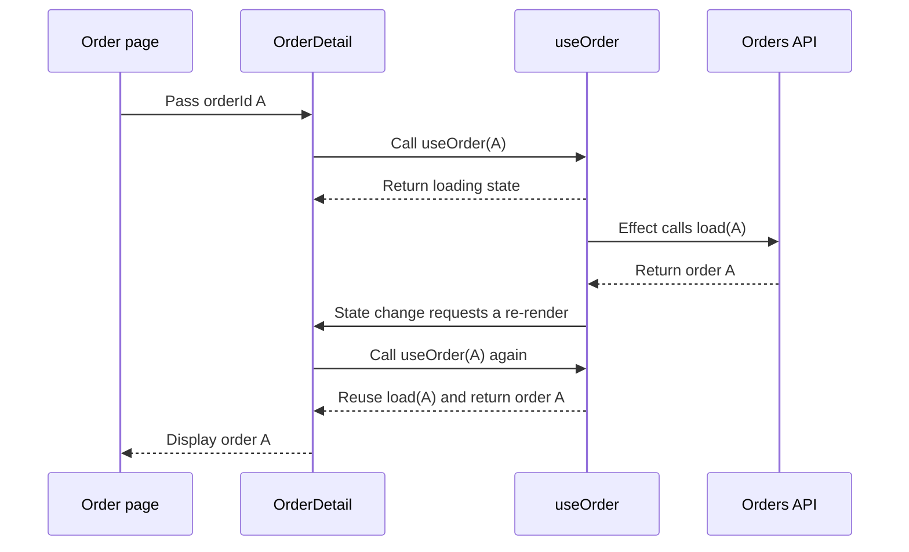

# `useCallback` in the order page

## The simple idea

`load` is a task card that says:

> Fetch the order with this `orderId` and put the result into state.

Calling `load()` performs the task. `useCallback` keeps the same task card while `orderId` stays the same.

## The page flow



During the re-render, `useOrder(A)` runs again. Because `orderId` is still `A`, `useCallback` returns the same `load` function. The effect therefore does not mistake the re-render for a new loading task.

If the URL changes to order `B`, `orderId` changes. `useCallback` creates `load(B)`, and the effect fetches order `B`.

```text
Same orderId     → keep the same load function
Different orderId → create a new load function
Leave and revisit → create a new page and fetch again
```

## Why it is useful here

`load` is used in several places:

- the first order request;
- the retry button;
- payment-status polling.

Both effects also watch `load`. Keeping it stable prevents a normal state re-render from looking like a new loading instruction.

## When should I use `useCallback`?

Use it when a function must keep the same identity between re-renders, especially when an effect depends on that function.

Do **not** add it to every function. A normal click handler or small local function usually does not need it.

For this hook, the short explanation is:

> `useCallback` keeps `load` unchanged while `orderId` is unchanged, so the effects run for a real dependency change instead of every re-render.

## Inspect the code

1. The page passes the URL ID to `OrderDetail`: [`pages/orders/[orderId].tsx:5-13`](../../pages/orders/%5BorderId%5D.tsx#L5-L13).
2. `OrderDetail` calls `useOrder(orderId)`: [`features/orders/OrderDetail.tsx:12-13`](../../features/orders/OrderDetail.tsx#L12-L13).
3. The hook creates `load`, runs the effects, and updates state: [`hooks/orders/useOrder.ts:6-42`](../../hooks/orders/useOrder.ts#L6-L42).
4. `getOrder` makes the request: [`lib/api/orders/queries.ts:14-18`](../../lib/api/orders/queries.ts#L14-L18).
