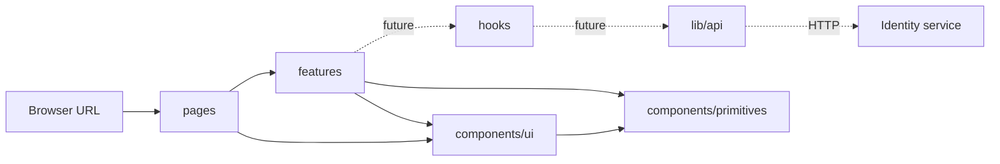

# Next.js Routing and Component Layers

This note explains how the current `client/` application works. It describes the code that exists now and clearly separates future integration from implemented behavior.

## 1. The basic mental model

The browser works with URLs. Next.js connects those URLs to React page components.

```text
Browser URL → Next.js route → page component → child components → rendered HTML
```

A `Link` navigates to a URL. It does not directly import or load a source file. Next.js owns the mapping between the URL and the page file.

## 2. Pages Router file mapping

This project uses the Next.js **Pages Router**. Files inside `pages/` define routes by filename.

| File | Browser URL | Current responsibility |
|---|---|---|
| `pages/index.tsx` | `/` | Renders the signed-in landing demo |
| `pages/auth.tsx` | `/auth` | Renders the authentication shell |
| `pages/_app.tsx` | Special file; not a normal URL | Wraps every page and imports global CSS |
| `pages/globals.css` | Not a route | Holds document-wide styles |
| `pages/auth.module.css` | Not a route | Holds styles used only by `auth.tsx` |

The important convention is:

```text
pages/index.tsx       → /
pages/auth.tsx        → /auth
pages/tickets.tsx     → /tickets             (future example)
pages/orders/[id].tsx → /orders/123          (future dynamic-route example)
```

A page component must be the file's default export:

```tsx
export default function AuthPage() {
  return <main>Authentication</main>;
}
```

Next.js discovers that default export and renders it when the matching URL is requested.

## 3. What `Link` does

Next.js provides `Link` from `next/link`:

```tsx
import Link from "next/link";

<Link href="/auth">Authentication</Link>
```

When clicked:

1. `Link` reads `href="/auth"`.
2. The Next.js router matches `/auth` to `pages/auth.tsx`.
3. Next.js renders `AuthPage` without normally reloading the entire document.

The custom navbar click handler has a different responsibility:

```tsx
<Link href={item.href} onClick={() => setOpen(false)}>
  {item.label}
</Link>
```

- `href={item.href}` tells Next.js where to navigate.
- `onClick={() => setOpen(false)}` closes the navbar menu.
- `key={item.href}` helps React track the generated list item.
- `style={{ animationDelay: ... }}` controls animation only.

### Hash links

A hash link navigates to an element on the current page instead of selecting another page file:

```tsx
<Link href="#market">Marketplace</Link>
<section id="market">...</section>
```

The browser finds the matching `id="market"` and scrolls to that element.

## 4. Props: passing data from parent to child

A React component is a function. Props are the function's external inputs.

The navbar declares its accepted inputs:

```tsx
type NavbarItem = {
  href: string;
  label: string;
};

type NavbarProps = {
  accountLabel?: string;
  items: readonly NavbarItem[];
};
```

Meaning:

- `items` is required.
- `accountLabel?` is optional because it has `?`.
- every item requires an `href` and visible `label`.

A parent creates the data:

```tsx
const navigation = [
  { href: "/", label: "Demo home" },
  { href: "/auth", label: "Authentication" },
] as const;
```

The parent passes that data through JSX attributes:

```tsx
<Navbar items={navigation} />
```

The child receives the props by destructuring them:

```tsx
export function Navbar({ accountLabel, items }: NavbarProps) {
```

The navbar then converts the array into visible links:

```tsx
{items.map((item) => (
  <Link href={item.href} key={item.href}>
    {item.label}
  </Link>
))}
```

`map()` loops over the array and returns one React element for every item. It is not the JavaScript spread operator.

## 5. Props versus state

Props come from a parent. State is memory owned by the current component.

```tsx
const [open, setOpen] = useState(false);
```

The navbar owns `open` because only the navbar needs to remember whether its menu is expanded.

```tsx
<Button onClick={() => setOpen((current) => !current)}>
  Menu
</Button>
```

The state transition is:

```text
false → click → true  → menu is rendered
true  → click → false → menu is removed
```

Conditional rendering uses that value:

```tsx
{open ? <div>Menu contents</div> : null}
```

If `open` is `true`, React renders the menu. If it is `false`, React renders nothing in that location.

## 6. Current component layers

Each layer has one kind of responsibility.

| Layer | Current examples | Responsibility |
|---|---|---|
| Routes | `pages/index.tsx`, `pages/auth.tsx` | Connect URLs to feature-level UI |
| Features | `features/landing/SignedInLanding.tsx`, `features/auth/AuthForm.tsx` | Own feature-specific presentation and interaction |
| Shared UI | `components/ui/Navbar.tsx` | Reusable application-level composition |
| Primitives | `components/primitives/Button.tsx`, `TextField.tsx` | Small application-agnostic controls |
| Hooks | `hooks/auth/` | Future React state orchestration for auth requests |
| API clients | `lib/api/auth/` | Future framework-free HTTP communication with Identity |

The intended dependency flow is:



Imports should follow the arrows. Lower layers must not import pages or feature components.

## 7. Current `/` route trace

The homepage request follows this path:

```text
GET /
  → pages/index.tsx
  → SignedInLanding
  → Navbar
  → Button
```

`pages/index.tsx` is intentionally small:

```tsx
<SignedInLanding />
```

`SignedInLanding` owns the landing-page sections and passes navigation data into `Navbar`:

```tsx
<Navbar accountLabel="demo@stubhub.local" items={navigation} />
```

The account label is currently static demo data. It is not authenticated user state.

## 8. Current `/auth` route trace

The authentication route follows this path:

```text
GET /auth
  → pages/auth.tsx
  ├→ Navbar
  └→ AuthForm
      ├→ TextField
      └→ Button
```

`pages/auth.tsx` owns route composition. `AuthForm` owns authentication-specific presentation, form state, and client-side feedback. `TextField` and `Button` remain generic controls that know nothing about authentication.

The form currently validates its shell locally but does not contact the Identity service.

## 9. Future auth request flow

The folders `hooks/auth/` and `lib/api/auth/` are intentionally empty scaffolds. When auth integration is requested, the intended flow is:

```text
AuthForm
  → auth hook
  → auth API client
  → HTTP request
  → Identity service route
  → response
  → auth hook updates React state
  → AuthForm renders the result
```

Responsibilities must remain separate:

- `AuthForm` collects input and displays loading or errors.
- the auth hook coordinates React state.
- the API client owns `fetch`, endpoint paths, headers, cookies, JSON, and HTTP errors.
- the Identity service remains authoritative for credentials and authentication decisions.

The frontend must communicate through HTTP. It must not import runtime code directly from `auth/src`.

## 10. Where new code belongs

Use this decision guide:

| Question | Location |
|---|---|
| Does it create a URL? | `pages/` |
| Is it specific to tickets, orders, auth, or landing behavior? | `features/<feature>/` |
| Is it shared application UI composed from smaller controls? | `components/ui/` |
| Is it a generic button, field, dialog, or similar control? | `components/primitives/` |
| Does it coordinate React state with a service call? | `hooks/<feature>/` |
| Does it perform an HTTP request or parse its response? | `lib/api/<service>/` |

The goal is not to create the maximum number of folders. The goal is to put each responsibility in one predictable place.

## 11. Terms used in this project

- **Route:** a URL that Next.js maps to a page component.
- **Page:** the route entry component under `pages/`.
- **Component:** a React function that returns UI.
- **Props:** inputs passed from a parent component to a child component.
- **State:** values remembered and updated by a component.
- **Conditional rendering:** rendering different UI based on a value.
- **Feature:** UI and interaction code belonging to one product capability.
- **Primitive:** a small reusable control with no business knowledge.
- **Hook:** reusable React state and lifecycle logic.
- **API client:** framework-free code that communicates with an HTTP service.
