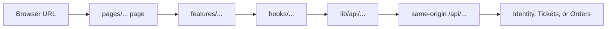

# Next.js Routing and Component Layers

This guide describes the current `client/` application. It uses the Pages
Router and keeps browser UI, React state, and service HTTP calls in separate
layers.

## One request, from URL to service



`Link` navigates to a URL; Next.js maps that URL to a page file. A component
outside `pages/` does not create a URL. Keep imports moving in the direction
of the arrows: lower layers must not import pages or feature components.

## Pages Router map

Files under `pages/` are route entry points, and each page is a default
export. `[ticketId]` and `[orderId]` are dynamic route segments.

| File | URL | Current responsibility |
|---|---|---|
| `pages/index.tsx` | `/` | SSR auth refresh, then signed-in landing |
| `pages/auth.tsx` | `/auth` | Authentication shell |
| `pages/tickets/index.tsx` | `/tickets` | Ticket discovery |
| `pages/tickets/[ticketId].tsx` | `/tickets/:ticketId` | Ticket detail |
| `pages/tickets/new.tsx`, `mine.tsx` | `/tickets/new`, `/tickets/mine` | Create listing and owned inventory |
| `pages/orders/index.tsx`, `[orderId].tsx` | `/orders`, `/orders/:orderId` | Order history and checkout/detail |
| `pages/_app.tsx` | Special file, no URL | Wraps pages, loads global CSS, restores the in-memory access token |

For example, `/tickets/123` selects `pages/tickets/[ticketId].tsx`; it does
not select a component because that component happens to have a similar name.

## One auth route

The implemented `/auth` flow is:

```text
GET /auth
  → pages/auth.tsx
  → AuthForm
  → useAuthCredentials
  → lib/api/auth/{signin,signup}
  → POST /api/identity/{signin,signup}
  → Identity service response
  → hook state → AuthForm feedback
```

`AuthForm` owns credential inputs and feedback. The hook coordinates React
state. The API client owns `fetch`, endpoint paths, headers, cookies, JSON, and
HTTP errors. Identity remains authoritative; the client must not import runtime
code from `auth/src`.

Browser auth calls stay same-origin under `/api/identity/*`. `next.config.ts`
rewrites that prefix to `IDENTITY_SERVICE_URL`, so refresh-token cookies remain
on the client origin without requiring cross-origin access to Identity.
`/api/tickets/*`, `/api/orders/*`, and `/ticket-images/*` use the same rewrite
pattern for their services.

The `/` page is the SSR/server-reachable auth boundary, not the browser auth
flow: `getServerSideProps` calls the server-only
`refreshAuthenticationOnServer`, sends the incoming refresh-token cookie to
Identity's `/refresh`, and copies Identity's rotated `Set-Cookie` onto the
page response. An unauthenticated request redirects to `/auth` when refresh
fails; a successful refresh passes only `authentication.user.email` to
`SignedInLanding`. Server code therefore uses the absolute `IDENTITY_SERVICE_URL`,
while browser code uses the relative same-origin prefix.

For protected service requests, `lib/api/request.ts` attaches the in-memory
Bearer token, performs one single-flight refresh and one retry after `401`,
and public Ticket reads omit authorization.

## Small Link, props, and state example

```tsx
type NavItem = { href: string; label: string };

function Navbar({ items }: { items: readonly NavItem[] }) {
  const [open, setOpen] = useState(false); // state belongs to this component

  return (
    <>
      <Button onClick={() => setOpen((current) => !current)}>Menu</Button>
      {open && (
        <nav>
          {items.map((item) => (
            <Link href={item.href} key={item.href} onClick={() => setOpen(false)}>
              {item.label}
            </Link>
          ))}
        </nav>
      )}
    </>
  );
}
```

The parent supplies `items` as props; the navbar owns `open` and can change it.
`Link` chooses navigation, `key` identifies a repeated item, and the click
handler closes the menu. A hash such as `href="/#market"` targets an element on
that page rather than creating another page file.

## Where new code belongs

| Need | Location |
|---|---|
| Create a URL or handle route parameters | `pages/` |
| Feature-specific UI and interaction | `features/<feature>/` |
| Shared application composition | `components/ui/` |
| Generic controls such as buttons and fields | `components/primitives/` |
| React state plus service-call orchestration | `hooks/<feature>/` |
| HTTP requests and response parsing | `lib/api/<service>/` |

This is a placement guide, not a reason to create folders for every small
value. Keep each responsibility in one predictable layer.

## Current and future

**Current:** this client uses the Pages Router, same-origin `/api/*` browser
requests, and explicit server-side auth refresh/cookie forwarding.

**Future:** a new feature should follow the existing URL → page → feature →
hook → API shape. An App Router migration, a different proxy, or direct
service-runtime imports would be separate design changes, not behavior to
assume in this guide.
