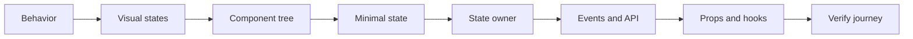

# Modern React page-building framework

Design pages in this order. Hooks come after behavior, state, and ownership are clear.



## Worksheet

```text
Goal: What can the user see and do?
States: Initial, loading, success, empty, error, unauthorized.
Tree: Page → feature → reusable children.
Data: Classify each value as static, prop, state, derived, URL, or server data.
Owner: Keep state local; lift it to the closest common parent only when shared.
Events: For each action, name the state transition and API call.
API: User action → handler → feature hook → API client → service.
Props: Data goes down; intention callbacks go up.
Hooks: Choose useState, a custom hook, or useReducer only after the model is clear.
Check: Run one complete user journey through success and failure.
```

## Rules

- Do not make every static element a component; extract a separate responsibility or reused unit.
- Do not store values that can be calculated from current props or state.
- Use event handlers for user-triggered requests; reserve Effects for external synchronization.
- Use a server-data tool such as SWR only when caching, deduplication, or revalidation is needed.
- Complete one vertical journey before building the next.

## Primary references

- [React: Thinking in React](https://react.dev/learn/thinking-in-react)
- [React: Choosing the State Structure](https://react.dev/learn/choosing-the-state-structure)
- [React: You Might Not Need an Effect](https://react.dev/learn/you-might-not-need-an-effect)
- [Next.js: Client-side Fetching](https://nextjs.org/docs/pages/building-your-application/data-fetching/client-side)
