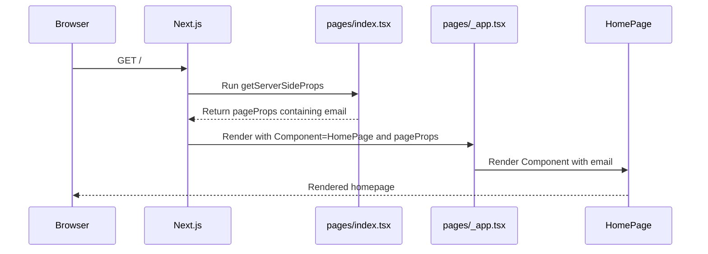

# The Pages Router `_app.tsx` component

## Simple idea

`pages/_app.tsx` is a special Next.js Pages Router file that wraps every page in
the client application.

Next.js recognizes the reserved `_app.tsx` filename and uses it automatically.
Application code does not import it manually, and it does not create a
`/_app` URL.

## The basic structure

This project's custom App component is:

```tsx
import { GeistSans } from "geist/font/sans";
import type { AppProps } from "next/app";
import "./globals.css";

export default function App({ Component, pageProps }: AppProps) {
  return (
    <div className={`${GeistSans.className} ${GeistSans.variable}`}>
      <Component {...pageProps} />
    </div>
  );
}
```

It has two current responsibilities:

1. apply the Geist font classes around every page; and
2. render the active page with that page's props.

## `Component` means the active page

Next.js chooses `Component` from the current URL.

```text
URL       Component
/         pages/index.tsx
/auth     pages/auth.tsx
```

This line renders whichever page Next.js selected:

```tsx
<Component {...pageProps} />
```

For a request to `/`, Next.js behaves roughly like this:

```tsx
<App
  Component={HomePage}
  pageProps={{ email: "user@example.com" }}
/>
```

The custom App then renders the equivalent of:

```tsx
<div className={`${GeistSans.className} ${GeistSans.variable}`}>
  <HomePage email="user@example.com" />
</div>
```

## `pageProps` means the active page's data

A page can prepare data before it renders. The homepage uses
`getServerSideProps`:

```tsx
export const getServerSideProps = async ({ req, res }) => {
  const { authentication, setCookie } =
    await refreshAuthenticationOnServer(req.headers.cookie);

  if (setCookie) res.setHeader("Set-Cookie", setCookie);
  if (!authentication) {
    return { redirect: { destination: "/auth", permanent: false } };
  }

  return { props: { email: authentication.user.email } };
};
```

Next.js places the returned `props` inside `pageProps`. `_app.tsx` then passes
them to the active page:

```tsx
<Component {...pageProps} />
```

The data flow is:

```text
pages/index.tsx getServerSideProps
  -> returns { props: { email } }
Next.js
  -> supplies { email } as pageProps
pages/_app.tsx
  -> renders <Component {...pageProps} />
HomePage
  -> receives email
```

`_app.tsx` does not create the homepage's `email`. It only passes the prepared
page props to the page that needs them.

## Why global CSS is imported here

The file imports:

```tsx
import "./globals.css";
```

Global CSS affects the entire application. In the Pages Router, the custom App
is the normal place to import it because `_app.tsx` wraps every page.

Page-specific styles can still use CSS Modules or component-scoped styling.

## What belongs in `_app.tsx`

Because `_app.tsx` wraps every page, it is suitable for genuinely app-wide
concerns such as:

- global CSS;
- global fonts;
- a navigation or footer shared by every page;
- React context providers; and
- application-wide state providers.

For example, a shared layout could be added around the active page:

```tsx
export default function App({ Component, pageProps }: AppProps) {
  return (
    <SiteLayout>
      <Component {...pageProps} />
    </SiteLayout>
  );
}
```

Only concerns needed by every page should be placed here. Page-specific data,
UI, and authorization remain with the page or its feature components.

## Why homepage authentication is not in `_app.tsx`

The current homepage protects `/` inside `pages/index.tsx`. It checks the
refresh-token session and redirects unauthenticated users to `/auth`.

Keeping that check on the homepage means public pages remain public. Moving the
same redirect into `_app.tsx` without distinguishing routes would also wrap and
potentially block `/auth`, which must be reachable before a user signs in.

The current separation is:

```text
pages/_app.tsx
  -> global CSS and font wrapper

pages/index.tsx
  -> authentication requirement for /
  -> homepage data
  -> homepage UI

pages/auth.tsx
  -> public authentication page
```

## Complete rendering flow



## Summary

`pages/_app.tsx` is Next.js's automatic application-wide wrapper. Next.js gives
it the active page as `Component` and that page's prepared data as `pageProps`.
This project uses it only for global CSS, the Geist font, and rendering the
selected page.