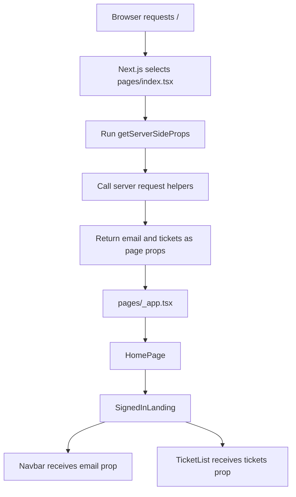

# Pages, parent components, and child components

## First correction: props, not prompts

The phrase is:

> Pass the results down as ordinary React **props**.

A prop is an input given to a React component. It works like a function
argument:

```tsx
function Welcome({ email }: { email: string }) {
  return <p>Welcome, {email}</p>;
}

<Welcome email="user@example.com" />;
```

`email` is a prop. React prompts are not involved.

## Simple idea

A Next.js page is still a React component. What makes it special is its file
location: Next.js treats files inside `pages/` as URL entry points.

Think of a page as the front door selected by an address. Parent and child
components are the rooms and objects reached after entering that door. They are
all React components, but only the front door is connected directly to the URL.

## How Next.js recognizes a page

In the Pages Router, filenames under `pages/` define routes:

```text
File                              URL
pages/index.tsx                   /
pages/auth.tsx                    /auth
pages/orders.tsx                  /orders
pages/tickets/[ticketId].tsx      /tickets/123
```

Next.js recognizes these files without application code registering them.

A component outside `pages/` does not define a route:

```text
features/landing/SignedInLanding.tsx
components/ui/Navbar.tsx
```

Those components appear only when another component imports and renders them.
There is no automatic `/SignedInLanding` or `/Navbar` URL.

## A page is a role, not a different React species

Consider the current homepage:

```tsx
export default function HomePage({ email }: HomePageProps) {
  return <SignedInLanding email={email} />;
}
```

`HomePage` is all of the following at the same time:

- a React component;
- the Next.js page for `/` because it is exported from `pages/index.tsx`;
- a child of the custom App component in `pages/_app.tsx`; and
- the parent of `SignedInLanding` because it renders `SignedInLanding`.

The words "parent" and "child" only describe positions in the rendered React
tree:

```text
App                         parent of HomePage
└── HomePage                child of App, parent of SignedInLanding
    └── SignedInLanding     child of HomePage, parent of Navbar
        └── Navbar          child of SignedInLanding
```

A component can therefore be a parent and a child simultaneously. Being a page
is different: it means Next.js selected that component from the URL.

## Why `getServerSideProps` belongs to the page

A browser requests one URL and receives one HTTP response:

```text
Browser -> GET / -> one rendered response
```

Before rendering that response, Next.js needs one route-level place that can
decide:

- which server data the route requires;
- whether to render the page;
- whether to redirect;
- whether to return `notFound`;
- which props become browser-visible page data; and
- which response headers, such as `Set-Cookie`, must be set.

In the Pages Router, that place is the page's `getServerSideProps` export:

```tsx
export const getServerSideProps: GetServerSideProps<HomePageProps> = async ({
  req,
  res,
}) => {
  // Make route-level server decisions here.
};
```

Next.js discovers this export from the page module before React renders the
component tree. It does not search every nested React component for additional
`getServerSideProps` functions.

Therefore these locations differ:

```text
Location                              Can export getServerSideProps?
pages/index.tsx                       Yes
pages/orders.tsx                      Yes
features/landing/SignedInLanding.tsx  No
components/ui/Navbar.tsx              No
pages/_app.tsx                        No
```

Each route page can have its own `getServerSideProps`, but each route has only
one such server-side coordinator.

## What "let the page collect everything" means

It does not mean every HTTP implementation must be written directly inside the
page file.

It means the page coordinates the server work required for that route. Small,
focused helper functions can perform the actual requests:

```text
lib/api/auth/refresh-server.ts
  -> knows how to request authentication

lib/api/tickets/list-server.ts
  -> knows how to request tickets

pages/index.tsx getServerSideProps
  -> calls the required helpers
  -> handles redirect and response decisions
  -> returns the combined page props
```

A simplified example is:

```tsx
type HomePageProps = {
  email: string;
  tickets: Ticket[];
};

export const getServerSideProps: GetServerSideProps<HomePageProps> = async ({
  req,
  res,
}) => {
  const { authentication, setCookie } =
    await refreshAuthenticationOnServer(req.headers.cookie);

  if (setCookie) res.setHeader("Set-Cookie", setCookie);

  if (!authentication) {
    return {
      redirect: { destination: "/auth", permanent: false },
    };
  }

  const tickets = await fetchTickets();

  return {
    props: {
      email: authentication.user.email,
      tickets,
    },
  };
};
```

The page has collected the route's required results even though separate helper
functions performed the network requests.

## How the results reach parent and child components

`getServerSideProps` returns:

```tsx
return {
  props: {
    email: authentication.user.email,
    tickets,
  },
};
```

Next.js gives those values to the page component:

```tsx
export default function HomePage({ email, tickets }: HomePageProps) {
  return <SignedInLanding email={email} tickets={tickets} />;
}
```

The page then passes relevant values to its children as ordinary React props:

```tsx
function SignedInLanding({ email, tickets }: HomePageProps) {
  return (
    <main>
      <Navbar email={email} />
      <TicketList tickets={tickets} />
    </main>
  );
}
```

The complete flow is:



`SignedInLanding`, `Navbar`, and `TicketList` do not need to know where the
server data came from. They receive inputs and render UI.

## Why child components do not receive their own server-side lifecycle

If every child independently controlled the route response, conflicting
questions would appear:

```text
What if one child redirects but another child wants to render?
What if two children both replace Set-Cookie?
What if one child returns notFound after another already produced data?
When is the single HTTP response ready to send?
```

The route page resolves those decisions once, before rendering. Children then
focus on presentation and browser interactions.

A child can still fetch data after the page loads with a hook such as
`useEffect`, but that is client-side fetching:

```text
Server-side page fetching:
request -> fetch data -> render complete HTML -> browser

Child client-side fetching:
request -> initial HTML -> load JavaScript -> fetch data -> rerender child
```

Use route-level server fetching when the initial response needs the data. Use
client-side fetching when the data is optional, interactive, or expected to
change after the page has loaded.

## Current project example

For `/`, the current responsibilities are:

```text
pages/index.tsx
  -> represents the / route
  -> receives req and res through getServerSideProps
  -> refreshes authentication
  -> redirects unauthenticated users
  -> returns the authenticated email as a page prop

pages/_app.tsx
  -> wraps the selected page
  -> passes pageProps to that page

SignedInLanding
  -> receives email as a React prop
  -> renders the signed-in landing UI
```

## Summary

A page is a React component chosen directly from the URL. It owns the route's
single `getServerSideProps` entry point. Parent and child components are simply
components in the page's rendered tree, so they receive the route's server data
through normal React props.