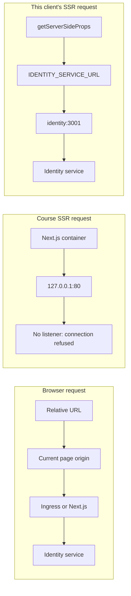

# SSR and container networking

## The course problem

Browser code and server-rendering code run in different network locations.

The diagram shows why the browser succeeds, the course SSR call fails, and this
client's SSR call succeeds:
 


In a browser, a relative request inherits the page's origin:

```ts
axios.get("/api/users/currentuser");
```

If the page is `http://ticketing.dev`, the browser requests:

```text
http://ticketing.dev/api/users/currentuser
```

That request can reach the machine's port 80 and be routed by Ingress.

During server-side rendering, `getInitialProps` or `getServerSideProps` runs in the Next.js Node process inside the client container. Node has no browser origin to inherit. Older Axios Node adapters could attempt the relative request against `127.0.0.1:80`; modern `fetch` normally rejects a relative URL instead. The underlying mistake is the same: server-side code was not given an absolute destination.

Inside a container, `127.0.0.1` means that container only. It does not mean the developer's computer, the Kubernetes Ingress controller, or another service. A request to `127.0.0.1:80` fails unless that same container listens on port 80.

## Why this client does not encounter the problem

This client deliberately uses different transports for browser and server-side requests:

```text
Browser
  → /api/identity/*
  → Next.js rewrite
  → http://identity:3001/*

Next.js getServerSideProps
  → refreshAuthenticationOnServer
  → http://identity:3001/refresh
```

### Browser requests

Browser calls use the same-origin `/api/identity/*` prefix from `lib/api/auth/request.ts`. The browser supplies the current origin, and `next.config.ts` rewrites the request to `IDENTITY_SERVICE_URL`.

### Server-side requests

The homepage does not reuse the relative browser API client during SSR. `pages/index.tsx` calls the server-only `lib/api/auth/refresh-server.ts`, which constructs an absolute URL from `IDENTITY_SERVICE_URL`.

The Kubernetes client deployment sets this variable to:

```text
http://identity:3001
```

`identity` is the Kubernetes Service name. Cluster DNS therefore routes the request directly from the client pod to the Identity service.

The `http://localhost:3001` fallback only works when Identity is reachable from the same network namespace. A containerized client still needs `IDENTITY_SERVICE_URL` set explicitly.

## Cookie forwarding

The browser sends the refresh-token cookie to Next.js with the page request. Node does not automatically attach that cookie to its request to Identity.

`refreshAuthenticationOnServer` therefore:

1. reads `req.headers.cookie` from the incoming page request;
2. sends that cookie to Identity's `/refresh` endpoint; and
3. copies Identity's rotated `Set-Cookie` header onto the page response.

Without those steps, the network request could succeed while authentication still fails.

## Course design compared with this project

The course sends its SSR request back through Ingress. This project calls the known Identity service directly.

Both designs work. The required rules are:

- server-side code must use a resolvable absolute address;
- `localhost` always refers to the current machine or container;
- Kubernetes services should be addressed through their Service DNS names; and
- SSR code must explicitly forward required authentication headers and cookies.

## One-sentence summary

The course failed because its server-side request used a browser-style relative URL, while this client avoids the failure by giving SSR an absolute Kubernetes service address and forwarding the authentication cookie explicitly.
