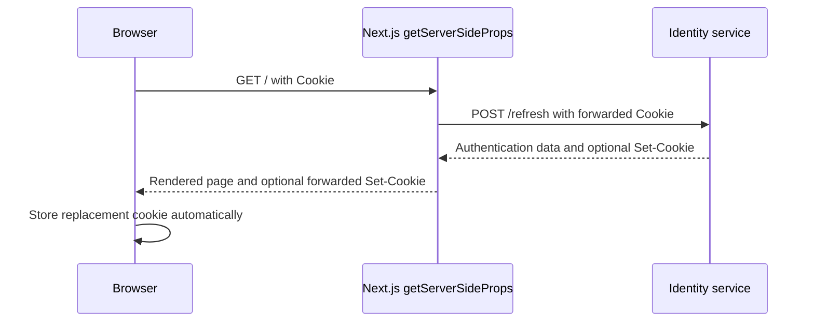

# SSR cookie forwarding without NGINX

## Simple idea

NGINX is not what creates the cookie-forwarding problem. The problem exists
whenever server-side rendering makes a second request on behalf of the browser.

This project has the same browser-to-server cookie boundary as the course. The
difference is only the destination of the server-side request:

```text
Course: Browser -> Next.js -> NGINX -> Auth service
Project: Browser -> Next.js -> Identity service
```

NGINX is omitted here because Next.js already knows the Identity service's
address through `IDENTITY_SERVICE_URL`.

## Browser requests and server requests are different

### Request made by the browser

The browser owns its cookies. For an eligible request, it can attach them
automatically:

```text
Browser -> API
           Cookie: refreshToken=...
```

The browser auth client in `lib/api/auth/request.ts` opts into sending cookies
with:

```ts
credentials: "include"
```

### Request made during server-side rendering

`getServerSideProps` runs in the Next.js Node process, not in the browser.

```text
Browser -> Next.js getServerSideProps -> Identity service
```

The browser's cookie reaches Next.js with the page request, but Node's `fetch`
does not automatically copy that cookie into a new request. The Next.js server
must forward it explicitly.

## What the homepage does

The homepage receives the incoming request and response objects:

```ts
export const getServerSideProps = async ({ req, res }) => {
  const { authentication, setCookie } =
    await refreshAuthenticationOnServer(req.headers.cookie);

  if (setCookie) res.setHeader("Set-Cookie", setCookie);

  // ...
};
```

There are two separate cookie transfers here.

### 1. Browser cookie to Identity

The browser's cookie is available as:

```ts
req.headers.cookie
```

`pages/index.tsx` passes that value to `refreshAuthenticationOnServer`. The
helper then places it on the direct request to Identity:

```ts
const response = await fetch(`${identityServiceUrl}/refresh`, {
  method: "POST",
  headers: { Cookie: cookieHeader },
});
```

This line performs the forwarding:

```ts
headers: { Cookie: cookieHeader }
```

Without it, Identity receives a refresh request without the refresh-token
cookie and cannot identify the session.

### 2. Identity's replacement cookie to the browser

Identity may rotate the refresh token and return a new cookie:

```ts
const setCookie = response.headers.get("Set-Cookie");
```

Next.js copies that header onto its page response:

```ts
if (setCookie) res.setHeader("Set-Cookie", setCookie);
```

The browser automatically stores the cookie only after it receives this
`Set-Cookie` response header. Setting the response header is explicit; storing
the resulting cookie is automatic browser behavior.

## Complete request flow



In plain text:

```text
Browser
  -> sends its refresh-token cookie to Next.js
Next.js
  -> manually forwards that cookie to Identity
Identity
  -> validates the session and may rotate the refresh token
Next.js
  -> manually forwards Identity's Set-Cookie header to the browser
Browser
  -> stores the replacement cookie automatically
```

## Why this project does not forward every header

The course forwards `req.headers` because its request goes through NGINX, which
may need headers such as `Host` to select a backend.

This project calls the known Identity address directly, so it only forwards the
header required for authentication:

```ts
headers: { Cookie: cookieHeader }
```

That is simpler and avoids passing unrelated browser headers to another
service.

## Summary

This project still forwards cookies during SSR. It does not need NGINX because
Next.js calls Identity directly, but `req.headers.cookie` and `Set-Cookie` must
still be copied across the two server-side request boundaries.