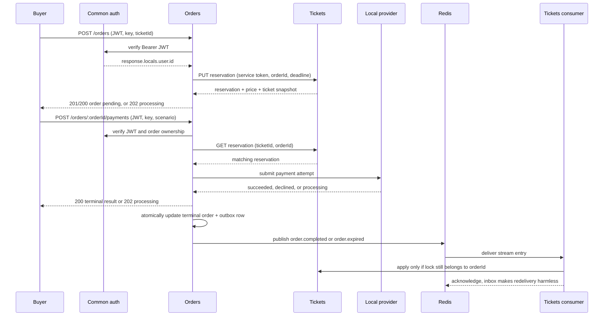

# Backend walkthrough: one purchase across services

This guide follows one ticket from a Tickets listing through an Orders reservation, payment, and terminal event. The useful question at every step is **who owns this fact?** A service owns its database and rules; another service asks it through an API instead of editing its rows.

## The ownership boundary

| Boundary | Owns | Does not own |
|---|---|---|
| **Tickets** | Listings, seller ownership, price while a listing is available, ticket status (`available`, `reserved`, `sold`), and the lock `(ticketId, orderId, expiresAt)` | Order status, payment, or the buyer's captured price |
| **Orders** | Purchase operations, order lifecycle, captured price and ticket snapshot, payment attempts, expiration decisions, and outgoing order events | Ticket availability; it never writes the Tickets SQLite database |
| **Common** | Verification of the shared access JWT and the `AuthenticatedUser` placed in `response.locals.user` | User records and refresh-token storage |
| **Redis** | Delivery of the `orders.events` stream | Durable business state; it is transport, not a source of truth |

Both services use their own SQLite/WAL database. Orders calls the private Tickets reservation API with `INTERNAL_SERVICE_TOKEN`; Tickets checks that token before changing a lock. Public ticket reads do not need that internal token.



## Before the purchase: where `ticketId` and price come from

A seller creates a listing with `POST /tickets`, an `Idempotency-Key`, multipart ticket fields, and one image. `requireAuth` supplies the seller ID; there is no trusted `ownerId` body field. Tickets validates the fields, stores the image under a generated filename, and inserts an `available` row.

`GET /tickets` and `GET /tickets/:ticketId` are public. The list query filters only `status = 'available'`, so a buyer discovers a ticket ID and its current `priceCents`. A seller can change price only while the ticket is still available and only when the authenticated seller ID matches `owner_id`. Once reservation changes the status to `reserved`, that update cannot change the price.

That last rule matters: the price shown during discovery is not the price Orders trusts. Tickets returns its authoritative price in the reservation response, and Orders captures that response.

## One ticket → reservation → order

### 1. Authenticate the buyer and create durable work

`POST /orders` accepts:

- `Authorization: Bearer <JWT>`
- `Idempotency-Key: <printable ASCII, 1–128 characters>`
- exactly `{ "ticketId": "..." }` in the JSON body

The buyer ID is the verified JWT `sub`, read as `response.locals.user.id`. A caller cannot select another buyer by adding `userId` to the body. Common verifies the JWT signature, issuer (`stubhub-identity`), audience (`stubhub-api`), algorithm, and typed claims before Orders runs.

Orders first inserts `purchase_operations` in a transaction. This private work row allocates `orderId`, records the buyer, ticket ID, idempotency key, request fingerprint, and an expiration deadline (15 minutes by default). The initial state is `reserving`. Creating this row before the network call gives a retry something durable to find.

### 2. Ask Tickets to reserve

Orders sends:

```text
PUT /internal/tickets/{ticketId}/reservation
Authorization: Bearer <internal service token>
{ "orderId": "O", "expiresAt": "<future ISO timestamp>" }
```

Tickets validates both UUIDs and the future deadline, then uses a write transaction. The important outcomes are:

- `available` → `reserved`, with `locked_by_order_id = O` and `lock_expires_at = deadline`;
- the same ticket already reserved by `O` with the same deadline → `replayed`, returning the existing reservation;
- the same reservation with a different deadline → `reservation_conflict`;
- missing ticket → `ticket_not_found`;
- any other non-available status → `ticket_unavailable`.

A partial unique index also prevents one order from holding multiple tickets. Tickets returns the lock identity, deadline, authoritative `priceCents`/`currency`, and a small event/place/info snapshot.

### 3. Capture the result in Orders

Orders does not trust a stale request price or re-read a mutable listing. `completePurchase` checks that the durable operation is still `reserving`, its deadline is unchanged, and it has not expired. In one Orders transaction it then:

1. inserts `orders` with `amount_cents` copied from Tickets;
2. copies the reservation's ticket details into the order snapshot;
3. uses the same `orderId` as the order primary key and Tickets lock owner;
4. marks the purchase operation `completed`.

The result is a buyer-owned `pending` order. A first successful request returns `201`; a replay of the same key returns `200`; if the reservation is still being retried, the route returns `202` with `Retry-After: 2`. A deterministic Tickets failure is recorded as a rejected purchase. Network or unexpected failures keep the operation retryable with a persisted retry count, next-attempt time, and bounded error text.

### Concrete retry example

Suppose Tickets commits `available → reserved` but the HTTP response is lost. Orders still has a `reserving` operation for order `O`. A retry of the original `POST /orders` with the same buyer, key, and ticket calls Tickets again with the same `O` and deadline. Tickets recognizes the matching lock and returns `replayed`; Orders passes its completion guard and creates the order exactly once. The caller receives the same order rather than a second lock or a second order.

If that key is reused for a different ticket, the persisted fingerprint rejects it with `idempotency_conflict`. If the deadline has passed before completion, Orders enters its release path and asks Tickets to release **only `(ticketId, O)`**; a different order's lock cannot be released by this operation.

## Payment and the local provider

The buyer submits:

```text
POST /orders/{orderId}/payments
Authorization: Bearer <JWT>
Idempotency-Key: <new payment key>
{ "paymentMethodToken": "local.processing-success" }
```

The current `paymentMethodToken` is not a card token. It must be one of four local scenarios:

- `local.success`
- `local.decline`
- `local.processing-success`
- `local.processing-decline`

Orders first loads the order by both `orderId` and the authenticated buyer ID. It rejects an order that is not payable, verifies Tickets still has reservation `(ticketId, orderId)`, then atomically changes `pending` to `payment_processing` and creates one payment attempt. A second payment request with the same `(orderId, Idempotency-Key)` and scenario replays; the same key with another scenario conflicts. A partial unique index permits at most one processing attempt and one successful attempt per order.

The local provider is a deterministic, persisted stand-in in the Orders database. It stores the attempt ID, amount, USD currency, scenario fingerprint, provider reference, planned terminal outcome, and status. Immediate scenarios resolve in the submit call. Processing scenarios remain `processing` until `LOCAL_PROVIDER_PROCESSING_MS` (3 seconds by default), then the Orders worker looks them up. Provider calls are idempotent by `payment_attempt_id` and `local:{attemptId}`; no card number is accepted or persisted.

Resolution is transactional:

- provider success: attempt → `succeeded`, order `payment_processing` → `complete`;
- provider decline before the order deadline: attempt → `failed`, order → `pending`;
- provider decline after the deadline: attempt → `failed`, order → `expired`.

A terminal HTTP response is `200`; a processing response is `202` with `Retry-After: 2`. An already-terminal attempt is returned without applying the transition again.

## Terminal event: outbox → Redis → Tickets

When Orders changes an order to `complete` or `expired`, it inserts an outbox row in the **same SQLite transaction**. The row contains a stable `messageId`, order aggregate ID/version, event type/version, creation time, and `{ "ticketId" }`. A uniqueness constraint on aggregate identity/version/event identity prevents the same logical event from being enqueued twice.

The Orders worker publishes due unpublished rows to the `orders.events` Redis stream. Publish failures leave the row unpublished and schedule a retry. A crash after Redis accepts a message but before Orders marks it published can produce duplicate delivery; this is expected at-least-once behavior.

The Tickets consumer uses a Redis consumer group, reads new entries, and periodically `XAUTOCLAIM`s abandoned entries. It validates the event envelope. Poison events go to `orders.events.dead-letter`; valid events are passed to Tickets' repository and acknowledged only after processing.

Tickets checks the event's `payload.ticketId` and `aggregateId` (the order ID) against its current row:

- `order.completed` and a matching reservation → `sold`;
- `order.expired` and a matching reservation → `available`, clearing the lock;
- already sold/available, a different lock owner, or a missing row → record a diagnostic outcome without changing the row.

The inbox primary key `(consumer, message_id)` is written in the same Tickets transaction as the state change. A redelivered message finds that marker and is acknowledged without applying the business update twice. The `locked_by_order_id = aggregateId` predicate is the stale-release guard: an old expiration event cannot free a newer order's reservation.

## Compact state, idempotency, and guard summary

| Resource | Normal states | Retry identity | Main guard |
|---|---|---|---|
| Ticket | `available → reserved → sold`; expiration/release can return `reserved → available` | Listing creation: `(ownerId, key)` + normalized fields/image fingerprint | SQL updates require the expected status; release/sale requires the expected `orderId` |
| Purchase operation | `reserving → completed`, or `reserving → releasing → rejected` | `(buyerId, key)` + `ticketId` | Unique `(user_id, idempotency_key)` and deadline/state checks |
| Order | `pending → payment_processing → complete`; pending can become `expired` | Looked up by authenticated buyer; payment key is separate | `user_id` ownership, unexpired pending status, conditional status updates |
| Payment attempt | `processing → succeeded` or `failed` | `(orderId, key)` + provider scenario | One active attempt; terminal resolution is harmless when repeated |
| Provider payment | `processing → succeeded` or `declined` | `payment_attempt_id` + attempt/amount/currency/scenario fingerprint | Persistent provider row returns the original result for a duplicate call |
| Order event | Outbox unpublished → published; Tickets inbox unseen → processed | Outbox event identity; inbox `(consumer, messageId)` | Durable outbox and inbox make retries safe, not exactly-once |

The recurring implementation pattern is:

> **Capture at the edge → carry identity explicitly → authenticate the caller → re-read authoritative facts → validate invariants → persist atomically/idempotently → return the server result.**

## Short source map

- **Authentication:** `common/src/index.ts` — `verifyAccessToken`, `requireAuth`, and `AuthenticatedUser`.
- **Ticket HTTP and ownership:** `tickets/src/http/routes/create-ticket.ts`, `list-tickets.ts`, `list-my-tickets.ts`, and `update-ticket-price.ts`.
- **Ticket state and reservation:** `tickets/src/tickets/ticket-repo.ts` — `reserveTicket`, `findReservation`, `releaseReservation`, and event convergence; `tickets/src/http/routes/internal-ticket-reservations.ts` — the private API.
- **Purchase:** `orders/src/http/routes/create-order.ts` — HTTP input/output mapping; `orders/src/orders/purchase-workflow.ts` — validation, reservation retries, guarded release, and purchase results; `orders/src/orders/order-repo.ts` — purchase rows, order creation, expiration, and terminal outbox writes.
- **Service boundary:** `orders/src/tickets-client.ts` — the only Orders-to-Tickets client and its status mapping.
- **Payment:** `orders/src/http/routes/submit-payment.ts` — HTTP input/output mapping; `orders/src/payments/payment-workflow.ts` — validation, eligibility, idempotency, reservation verification, and provider coordination; `orders/src/payments/payment-attempt-repo.ts` and `local-provider.ts` — durable attempts and the simulated provider.
- **Workers and events:** `orders/src/workers.ts`, `orders/src/messaging/outbox-repo.ts`, and `tickets/src/orders/order-events-consumer.ts`.
- **Durable contracts:** `orders/migrations/005_create_purchase_operations.sql`, `006_rebuild_orders.sql`, `007_create_local_provider_payments.sql`, `003_create_outbox_messages.sql`, and `tickets/migrations/002_rebuild_ticket_locks_and_inbox.sql`.

## Caveats in the current implementation

- The local provider is the only provider. It is deterministic test infrastructure, not a payment gateway, webhook receiver, or card authorization service.
- A provider success resolves the unconditional success branch from `payment_processing`, even if it arrives after `expiresAt`. The expiration scanner selects `pending` orders only; a stuck processing attempt waits for reconciliation.
- The direct Tickets release route returns HTTP 200 with an outcome such as `not_matching`, and the Orders release helper treats any 2xx as transport success without interpreting that JSON. The Tickets SQL predicate still prevents a stale lock mutation.
- An expired `reserved` row can remain reserved until the retry/expiration path runs; reservation lookup itself does not sweep expired locks.
- Redis delivery is at least once, not exactly once. Stable event IDs and Tickets' inbox make duplicate application safe, while poison messages are sent to the dead-letter stream.
- Historical migrations may contain placeholder ticket snapshot values (`Unavailable`) for orders created before snapshot fields existed; those are compatibility data, not a fresh Tickets read.
