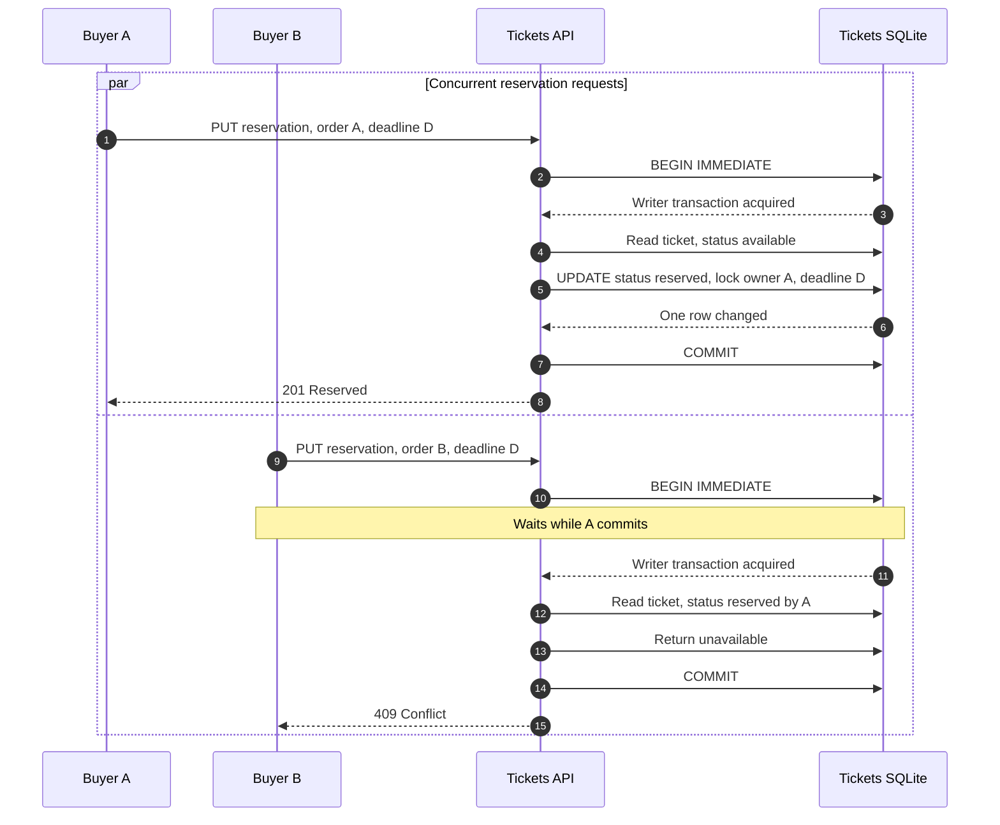

# Case Study 1: Preventing Double Booking Without a Distributed Lock

A ticket marketplace has one non-negotiable invariant: **one Ticket can have at most one active reservation**. Two buyers may click at the same time, but the system must choose one winner at the authoritative write boundary, return a deterministic business response to the loser, and never let a late timeout or retry steal the winner's reservation.

This case study shows how StubHub keeps that decision in the Tickets service's SQLite transaction rather than adding a Redis or Redlock coordination layer.

## The failure mode

A naive reservation flow looks like this:

1. Read `tickets.status`.
2. If it is `available`, call a lock service.
3. Update the ticket to `reserved`.
4. Return success.

Two requests can both read `available` before either update commits. A lock added around the read does not automatically make the database write authoritative. It creates another failure boundary: the lock can expire while a process is paused, a response can be lost after the database write, or the lock service can be partitioned from one application replica. A Redlock-style design also adds network round trips and depends on timing assumptions about lease expiry, process pauses, and quorum visibility. During a partition or long GC pause, different participants can disagree about which lease is live. Even when the lock algorithm is correctly implemented, the lock and the Ticket row are separate systems that can commit at different times.

For this bounded write path, the simpler correctness boundary is the database that owns availability. Tickets is the sole writer of `status`, `locked_by_order_id`, and `lock_expires_at`.

## The state invariant

The storage migration makes the state machine explicit in `tickets/migrations/002_rebuild_ticket_locks_and_inbox.sql`:

```sql
CHECK (
  (status = 'available' AND locked_by_order_id IS NULL AND lock_expires_at IS NULL)
  OR (status = 'reserved' AND locked_by_order_id IS NOT NULL AND lock_expires_at IS NOT NULL)
  OR (status = 'sold' AND locked_by_order_id IS NOT NULL AND lock_expires_at IS NULL)
)
```

The same migration adds a partial unique index:

```sql
CREATE UNIQUE INDEX tickets_one_per_order
  ON tickets(locked_by_order_id)
  WHERE locked_by_order_id IS NOT NULL;
```

The row therefore carries both the state and the identity authorized to finish or release it. `tickets/src/tickets/ticket.ts` models those fields as `locked_by_order_id` and `lock_expires_at`; they are deliberately not exposed as ordinary public listing fields.

## The winning write

`reserveTicket` in `tickets/src/tickets/ticket-repo.ts` is the authoritative command. It begins a SQLite `BEGIN IMMEDIATE` transaction, so competing writers serialize at the database boundary. It handles retries before attempting a new reservation:

```ts
database.exec("BEGIN IMMEDIATE");
try {
  const row = readTicketById(ticketId);
  if (!row) return commit({ outcome: "not_found" });

  const sameReservation =
    row.status === "reserved" && row.locked_by_order_id === orderId;
  if (sameReservation && row.lock_expires_at !== expiresAt) {
    return commit({ outcome: "conflict" });
  }
  if (sameReservation) {
    return commit({ outcome: "replayed", reservation: toReservation(row) });
  }
  if (row.status !== "available") {
    return commit({ outcome: "unavailable" });
  }
```

After checking that this Order does not already hold another Ticket, the repository performs the state transition with a guarded update:

```sql
UPDATE tickets
SET status = 'reserved',
    locked_by_order_id = ?,
    lock_expires_at = ?,
    updated_at = ?
WHERE id = ? AND status = 'available'
```

The code requires exactly one changed row. A caller does not get to infer success from an earlier read; success is the result of the guarded write inside the transaction.

The HTTP boundary maps the domain outcome to the business response in `tickets/src/http/routes/internal-ticket-reservations.ts`:

- `reserved` → `201` with the reservation snapshot
- same `orderId` and same deadline → `200` replay
- `not_found` → `404`
- another reservation or a deadline mismatch → `409 Conflict`

That gives the race a useful contract: the winner receives the reservation, while the loser receives a conflict rather than a late compensating failure.

## Concurrent requests, one winner

The winner is determined by the Tickets database, not by request arrival at an API gateway, Redis stream order, or a lock-service response. The first transaction to acquire the SQLite write reservation checks `available`, commits `reserved`, and records its Order identity. The second transaction waits for the writer, then reads the committed row and returns `unavailable`.



This is often called an optimistic concurrency guard because the update predicates the write on the expected state. `BEGIN IMMEDIATE` is the local SQLite serialization mechanism; the `WHERE status = 'available'` predicate is still valuable defense in depth and makes the business condition visible in SQL.

## TTL expiration without zombie locks

A TTL is a deadline, not an autonomous unlock. Orders calculates and persists `expiresAt`; Tickets stores it as `lock_expires_at` with the reservation. The durable Orders worker decides that an unpaid Order is eligible to expire, then calls the guarded release path. There is no separate expiration microservice and no key-expiration notification treated as an authoritative business fact.

`releaseReservation` clears the deadline and owner only when the current row still belongs to the same Order:

```sql
UPDATE tickets
SET status = 'available',
    locked_by_order_id = NULL,
    lock_expires_at = NULL,
    updated_at = ?
WHERE id = ?
  AND status = 'reserved'
  AND locked_by_order_id = ?
```

That final predicate is the zombie-lock protection. Suppose Order A expires late, after its deadline has passed but after a retry has allowed a newer reservation by Order B. A's release affects zero rows because the owner is now B. The stale request cannot clear B's lock. An already available or sold Ticket is also treated as a non-mutating outcome.

The safety rule is simple:

> Never release “the reservation for this Ticket.” Release only “the reservation for this Ticket if this exact Order still owns it.”

## Why not Redlock here?

A distributed lock can be appropriate when multiple independent databases must coordinate and no single database owns the invariant. It is unnecessary for this command because Tickets already owns the row and can atomically guard it. Adding Redlock would:

- add a second authority whose lease and database commit can diverge;
- add network latency to the hot path and new timeout/retry behavior;
- require careful reasoning about partitions, quorum reachability, clock drift, and process pauses;
- still require the guarded database predicate to prevent stale unlocks and retries.

The database transaction is not a claim that distributed locks are universally incorrect. It is a deliberate boundary choice: keep the invariant beside the data, and use a conditional write instead of a second coordination service.

## Design boundary and limitations

This approach assumes every Tickets writer uses the same authoritative SQLite database. It does not make independent per-replica databases safe. If the system later shards Tickets or moves the authority to a replicated database, the same invariant must move with the shard's transactional write boundary; a lock should not be added as a substitute for defining ownership.

The result is a compact correctness proof: one owner service, one transaction, one guarded transition, explicit lease metadata, and release predicates that carry the Order identity all the way to SQL.

### Source anchors

- `tickets/src/tickets/ticket-repo.ts:392-466` — reservation transaction, replay/conflict outcomes, and guarded `available → reserved` update.
- `tickets/src/tickets/ticket-repo.ts:490-539` — owner-checked release and `reserved → available` update.
- `tickets/src/http/routes/internal-ticket-reservations.ts:18-65` — synchronous internal API and `409` mapping.
- `tickets/migrations/002_rebuild_ticket_locks_and_inbox.sql:15-40` — state `CHECK` and one-order-per-ticket index.
- `tickets/src/tickets/ticket.ts:31-50` — internal Ticket row fields.
