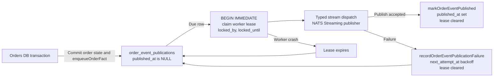

# Case Study 2: Transactional Outbox With Atomic Worker Leasing

An Order can reach a terminal state in SQLite and still fail to publish its corresponding fact. The process may crash after `COMMIT` but before a broker call, or the broker may accept a message while the process dies before recording publication progress. These are not unusual edge cases; they are the normal dual-write hazard whenever one request touches a database and an event broker.

StubHub solves the first half with a transactional outbox and the multi-replica worker race with a short database lease. The result is durable, retryable, at-least-once publication without pretending that the broker call and the database update are one atomic operation.

## The dual-write hazard

This sequence is unsafe:

```text
UPDATE orders SET status = 'complete';  -- commits
publishToBroker(order.completed);       -- process crashes or network fails
```

If the update commits and the broker call never happens, downstream services never learn the fact. Reversing the order creates the opposite inconsistency: consumers receive an event for a database change that rolled back. A distributed transaction coordinator would expand the failure surface and operational cost for a fact that can be recovered from local durable state.

The outbox pattern changes the unit of durability. The business transition and a row saying “publish this fact” commit in the same local transaction. A worker can then retry publication until it succeeds or an operator investigates a persistent failure.

## Stage the fact with the business transaction

Orders wraps work in `orders/src/database.ts::withTransaction`, which uses the process-wide SQLite connection and explicit `BEGIN IMMEDIATE`, `COMMIT`, and `ROLLBACK`:

```ts
function withTransaction<T>(work: () => T): T {
  database.exec("BEGIN IMMEDIATE");
  try {
    const result = work();
    database.exec("COMMIT");
    return result;
  } catch (error) {
    database.exec("ROLLBACK");
    throw error;
  }
}
```

The business workflow calls `enqueueOrderFact` from `orders/src/messaging/outbox-repo.ts` before that transaction returns. The repository inserts into `order_event_publications` with `published_at` initially `NULL`, a stable generated `id`, aggregate identity and version, serialized payload, and the next attempt due immediately:

```ts
database.prepare(`
  INSERT INTO order_event_publications (
    id, aggregate_type, aggregate_id, aggregate_version,
    event_type, event_version, payload, created_at, updated_at,
    next_attempt_at, correlation_id
  ) VALUES (?, 'order', ?, ?, ?, ?, ?, ?, ?, ?, ?)
`).run(
  id,
  input.orderId,
  input.orderVersion,
  input.eventType,
  input.eventVersion ?? 1,
  payloadStr,
  now,
  now,
  now,
  input.correlationId ?? null,
);
```

The durable row is not proof that a broker has accepted the event. It is a retryable publication instruction. If the process dies immediately after commit, the next worker scan sees `published_at IS NULL` and resumes.

## Leasing a batch without a worker race

Multiple Orders replicas may run the same polling worker. A plain `SELECT` followed by an `UPDATE` permits two workers to read the same due row and both publish it. `claimDueOrderEventPublications` closes that race with one `BEGIN IMMEDIATE` transaction:

```sql
SELECT id, aggregate_type, aggregate_id, aggregate_version,
       event_type, event_version, payload, created_at, updated_at,
       published_at, attempt_count, next_attempt_at, last_error,
       locked_by, locked_until, correlation_id
FROM order_event_publications
WHERE published_at IS NULL
  AND next_attempt_at <= ?
  AND (locked_until IS NULL OR locked_until <= ?)
ORDER BY next_attempt_at, created_at, id
LIMIT ?
```

The repository then assigns the selected rows to the current worker and gives them a bounded lease:

```ts
const lockedUntil = now + leaseDurationMs;
const lockStmt = database.prepare(`
  UPDATE order_event_publications
  SET locked_by = ?, locked_until = ?, updated_at = ?
  WHERE id = ? AND published_at IS NULL
`);

for (const row of rows) {
  lockStmt.run(workerId, lockedUntil, now, row.id);
}
```

The default lease is 30 seconds. The transaction commits before network publication begins. A second worker cannot claim the same due rows while the first claim transaction is active, and it will ignore rows whose `locked_until` is still in the future. If a worker crashes, the lease eventually becomes eligible again. The lease is recovery metadata, not a permanent lock.

## End-to-end publication flow

The requested “stream dispatch” stage is implemented by the Orders messaging deep module. The current source uses typed NATS Streaming publishers (`orders/src/messaging/outbox-dispatcher.ts` and `orders/src/messaging/nats-client.ts`); older design prototypes discussed Redis Streams. The durability argument does not depend on the transport name: the database row is the ledger and the stream is the delivery mechanism.



`orders/src/messaging/outbox-dispatcher.ts` turns a claimed row into a typed event whose `messageId` is the stable outbox `id`, then publishes it. Only after the publisher resolves does it call `markOrderEventPublished`, which increments the attempt count, sets `published_at`, clears `locked_by` and `locked_until`, and removes `last_error`.

That ordering deliberately leaves a duplicate window: a broker publish can succeed, followed by a process crash before `markOrderEventPublished`. The row will be retried. At-least-once consumers must therefore deduplicate by the stable `messageId`; trying to avoid every duplicate by weakening the durable retry rule would risk losing facts.

## Failure handling and backoff

A connection failure or unsupported event type is caught by `dispatchOutboxPublication`. The dispatcher calls `recordOrderEventPublicationFailure`, which updates only an unpublished row and uses the persisted attempt count as a compare-and-update guard:

```sql
UPDATE order_event_publications
SET attempt_count = attempt_count + 1,
    next_attempt_at = ?,
    locked_by = NULL,
    locked_until = NULL,
    last_error = ?,
    updated_at = ?
WHERE id = ?
  AND published_at IS NULL
  AND attempt_count = ?
```

The delay is computed by `orders/src/retry-delay.ts`. Its defaults are a 2-second base and a 5-minute cap. The exponent doubles the ceiling until the cap, then adds uniform jitter between half and the full capped delay. Jitter prevents a fleet of workers that observed the same outage from retrying in lockstep.

Poison handling belongs at the consumer boundary, where malformed payloads and repeatedly failing handlers can otherwise block a durable subscription. `common/src/events/base-listener.ts` tracks attempts by message sequence. The default `maxRetries` is 5. Parse failures go directly to `onPoisonMessage`; processing failures are retried until the limit, then `onPoisonMessage` logs and acknowledges the message. A listener may override that hook to route a quarantine/dead-letter record before acknowledging. This is intentionally separate from outbox backoff: producer failures remain durable and retryable, while an unprocessable consumer payload must not deadlock the stream forever.
The default poison hook is intentionally small and explicit:

```ts
async onPoisonMessage(msg: Message, error: unknown): Promise<void> {
  console.error(
    `[DLQ/Poison Handler] Acknowledging poison message seq ${msg.getSequence()} on ${this.subject}:`,
    error,
  );
  if (this.manualAck) {
    msg.ack();
  }
}
```


## What this guarantees

The design provides:

- **Atomic local intent:** an accepted Order transition and its publication instruction commit together.
- **Multi-worker claim exclusion:** `BEGIN IMMEDIATE` plus `locked_by` and `locked_until` prevents two workers from claiming the same due row at once.
- **Crash recovery:** an unpublished row or expired lease remains discoverable.
- **At-least-once publication:** a crash after stream acceptance may produce a duplicate, but it does not silently lose the fact.
- **Bounded retry pressure:** exponential backoff with jitter reduces hot-looping during outages.

It does not provide exactly-once broker delivery, a distributed transaction with the stream, or automatic proof that a poison payload was semantically correct. Those properties belong to downstream idempotency, observability, and explicit operational policy.

### Source anchors

- `orders/src/database.ts:149-166` — transaction boundary used by Orders workflows.
- `orders/src/messaging/outbox-repo.ts:53-103` — transactional outbox insertion via `enqueueOrderFact`.
- `orders/src/messaging/outbox-repo.ts:105-153` — `BEGIN IMMEDIATE` worker lease claim.
- `orders/src/messaging/outbox-repo.ts:175-211` — publication marking and failure backoff update.
- `orders/src/messaging/outbox-dispatcher.ts:22-115` — typed stream dispatch, success marking, and failure recording.
- `orders/src/retry-delay.ts:18-35` — capped exponential delay with jitter.
- `common/src/events/base-listener.ts:143-211` — retry counting and poison-message acknowledgement.
- `orders/migrations/012_add_outbox_lease_and_correlation.sql:1-9` — durable lease columns and due index.
