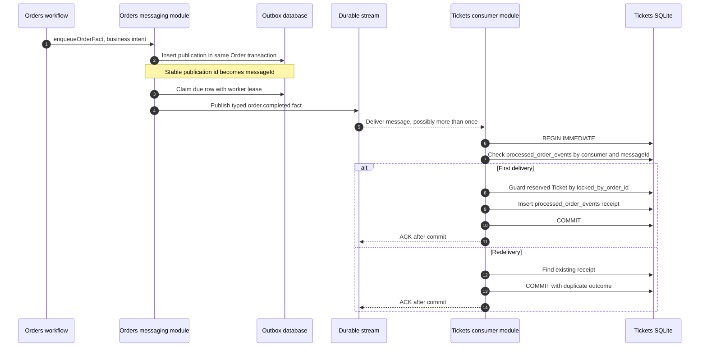

# Case Study 3: Deep Modules and Idempotent Event-Driven Architecture

Distributed messaging is easy to make verbose and hard to make safe. A shallow implementation lets every caller know about broker clients, subjects, envelopes, serialization, retry timing, leasing, and acknowledgement ordering. Each new caller then reimplements part of the protocol, and the system accumulates classitis: many wrappers, little hidden complexity, and no single place to audit failure behavior.

StubHub takes the opposite approach. Callers express domain intent through a small messaging boundary. The boundary owns transport mechanics, durable publication, listener lifecycle, and recovery. Tickets then combines at-least-once delivery with an inbox ledger so redelivery is harmless.

## Deep modules: simple intent, substantial hidden work

John Ousterhout's useful test for a module is not whether it has a class. It is whether the module hides more complexity than it exposes. The Orders messaging surface in `orders/src/messaging/index.ts` exports intent-oriented operations:

```ts
export {
  enqueueOrderFact,
  claimDueOrderEventPublications,
  listDueOrderEventPublications,
  markOrderEventPublished,
  recordOrderEventPublicationFailure,
} from "./outbox-repo.js";
export {
  dispatchOutboxPublication,
  dispatchDueOrderEvents,
  dispatchDueOrderEvents as dispatchOutboxBatch,
} from "./outbox-dispatcher.js";
```

A business workflow can say “stage the Order fact” with `enqueueOrderFact(...)`. It does not need to know the outbox table shape, JSON serialization, publication IDs, worker leases, retry backoff, NATS client lifecycle, or typed publisher selection. `orders/src/workers.ts` keeps the caller correspondingly small:

```ts
async function scanOrderEventPublications(): Promise<void> {
  await dispatchDueOrderEvents();
}
```

The complexity has not disappeared. It has one owner: the messaging module. That is a deep boundary because its implementation can change from NATS Streaming to another durable stream, change batching, or revise retry policy without making every Order workflow understand the transport.

Tickets uses the same shape at the inbound edge. `tickets/src/orders/order-events-consumer.ts` exports `startOrderEventsConsumer()`. That function owns connection setup, durable listener creation, queue grouping, and graceful shutdown. Service startup receives one lifecycle operation instead of assembling broker subscriptions itself:

```ts
const completedListener = new OrderCompletedListener(client);
const expiredListener = new OrderExpiredListener(client);

completedListener.listen();
expiredListener.listen();

return async () => {
  await Promise.allSettled([
    completedListener.close(10_000),
    expiredListener.close(10_000),
  ]);
  client.close();
};
```

The domain listeners remain intentionally thin. That is not a failure of abstraction; they translate a typed transport message into the repository's domain event shape. The consumer module owns the lifecycle and the repository owns the state transition.

## At-least-once is a contract, not a bug

A durable stream can redeliver when a consumer crashes before acknowledgement. The producer can also publish twice when it crashes after broker acceptance but before marking its outbox row published. Exactly-once end to end would require coordination that is expensive, brittle, or unavailable across the database and broker.

The practical contract is:

1. Give each publication a stable `messageId`.
2. Make the consumer's side effect idempotent.
3. Commit the side effect and its receipt atomically.
4. Acknowledge the transport only after the database commit.

The stable identity originates in `enqueueOrderFact` and is carried into the typed event in `orders/src/messaging/outbox-dispatcher.ts`:

```ts
const eventData = {
  id: pub.aggregateId,
  version: pub.aggregateVersion,
  messageId: pub.id,
  ticketId,
  ticket: { id: ticketId },
  occurredAt: pub.createdAt,
  correlationId: pub.correlationId ?? undefined,
};
```

The event can now be delivered more than once without becoming more than one business effect.

## The inbox ledger and atomic convergence

Tickets stores processed event identities in `processed_order_events`. The migration gives `(consumer, message_id)` a primary key, so the same message can be deduplicated independently for each consumer:

```sql
CREATE TABLE inbox_messages (
  consumer TEXT NOT NULL,
  message_id TEXT NOT NULL,
  event_type TEXT NOT NULL,
  event_version INTEGER NOT NULL CHECK (event_version > 0),
  aggregate_id TEXT NOT NULL,
  aggregate_version INTEGER NOT NULL CHECK (aggregate_version > 0),
  ticket_id TEXT NOT NULL,
  outcome TEXT NOT NULL,
  processed_at INTEGER NOT NULL,
  PRIMARY KEY (consumer, message_id)
) STRICT;
```

`tickets/migrations/003_rename_inbox_messages.sql` renames that table to `processed_order_events`; the schema's primary key remains the `(consumer, message_id)` deduplication boundary.

`applyOrderEventOnce` in `tickets/src/tickets/ticket-repo.ts` runs the inbox check, guarded Ticket transition, receipt insert, and commit in one SQLite transaction:

```ts
database.exec("BEGIN IMMEDIATE");
try {
  const duplicate = database
    .prepare(`
      SELECT 1
      FROM processed_order_events
      WHERE consumer = ? AND message_id = ?
    `)
    .get(consumer, event.messageId);
  if (duplicate) return commit({ duplicate: true });

  const row = readTicketById(event.payload.ticketId);
  const outcome = convergenceOutcome(row, event);
  if (outcome === "sold") {
    applySoldConvergence(event);
  } else if (outcome === "released") {
    applyReleaseConvergence(event);
  }

  database
    .prepare(`
      INSERT INTO processed_order_events (
        consumer, message_id, event_type, event_version,
        aggregate_id, aggregate_version, ticket_id, outcome, processed_at
      ) VALUES (?, ?, ?, ?, ?, ?, ?, ?, ?)
    `)
    .run(
      consumer,
      event.messageId,
      event.eventType,
      event.eventVersion,
      event.aggregateId,
      event.aggregateVersion,
      event.payload.ticketId,
      outcome,
      Date.now(),
    );
  return commit({ duplicate: false, outcome });
} catch (error) {
  database.exec("ROLLBACK");
  throw error;
}
```

The transition itself carries a second guard. A completion can change a Ticket only when it is still `reserved` by the event's Order:

```sql
UPDATE tickets
SET status = 'sold',
    lock_expires_at = NULL,
    updated_at = ?
WHERE id = ?
  AND status = 'reserved'
  AND locked_by_order_id = ?
```

An expiration uses the same ownership predicate while setting `available` and clearing both lock fields. A late event for Order A therefore cannot release or sell a Ticket that has since been reserved by Order B. A valid but stale event is recorded as a non-mutating outcome such as `not_matching`.

## ACK after commit, every time

The listener adapters call `applyOrderEventOnce(orderEvent)` and then `msg.ack()`:

```ts
applyOrderEventOnce(orderEvent);
msg.ack();
```

This ordering is the essential crash proof:

- Crash before commit: no receipt exists, the unacknowledged message is redelivered, and the effect is attempted again.
- Commit then crash before ACK: the Ticket effect and receipt exist, the message is redelivered, the receipt returns `duplicate`, and the second delivery does not mutate the Ticket.
- ACK only after commit: an acknowledged message always has a durable Tickets-side record of its result, subject to the broker's delivery contract.



The transport may be NATS Streaming in the current implementation, while the repository's architectural material also describes Redis Streams. That transport choice is intentionally hidden from Order workflows and Tickets domain code. The correctness argument is transport-independent as long as the stream offers durable redelivery and consumers preserve the commit-before-ACK rule.

## Trade-offs and explicit limits

This design chooses at-least-once delivery plus idempotent effects over an expensive exactly-once claim. It does not claim generic event ordering. `aggregateVersion` is validated and recorded for diagnostics, but the current Tickets repository does not maintain a generic high-water mark or version-ordered replay mechanism. Safety comes from the local state and exact lock-owner predicate, not from stream order.

Poison messages are another deliberate boundary. `common/src/events/base-listener.ts` retries processing failures up to the configured maximum, then invokes `onPoisonMessage`; malformed JSON is handled immediately. The default hook acknowledges the poison message to prevent infinite redelivery, while a domain listener can override it to route a quarantine record. A poison message is therefore not silently retried forever, and a transient database failure remains retryable because `applyOrderEventOnce` rolls back and does not ACK.

The architecture is small enough to audit:

- **Intent API:** workflows call `enqueueOrderFact`; startup calls `startOrderEventsConsumer`.
- **Mechanics owner:** messaging modules hide table schemas, leases, serialization, broker clients, subscriptions, and retry policy.
- **State authority:** Orders and Tickets mutate only their own databases.
- **Duplicate safety:** stable IDs plus `(consumer, message_id)` inbox receipts.
- **Crash safety:** database effect and receipt commit before transport acknowledgement.

That is the practical application of deep-module design to distributed systems: callers see a few domain operations, while the module absorbs the protocol complexity needed to make those operations durable and repeatable.

### Source anchors

- `orders/src/messaging/index.ts:1-33` — public deep-module messaging surface.
- `orders/src/messaging/outbox-repo.ts:53-153` — intent staging and atomic worker leasing.
- `orders/src/messaging/outbox-dispatcher.ts:22-72` — event envelope and transport dispatch.
- `orders/src/workers.ts:108-115` — worker invokes `dispatchDueOrderEvents()` without transport mechanics.
- `tickets/src/orders/order-events-consumer.ts:16-61` — consumer startup, listener ownership, and graceful shutdown.
- `tickets/src/tickets/ticket-repo.ts:611-674` — inbox check, guarded convergence, receipt insert, and transaction.
- `tickets/migrations/002_rebuild_ticket_locks_and_inbox.sql:42-65` — processed-event ledger schema and primary key.
- `tickets/migrations/003_rename_inbox_messages.sql:1-9` — final `processed_order_events` table name.
- `common/src/events/base-listener.ts:143-211` — at-least-once retry tracking and poison handling.
