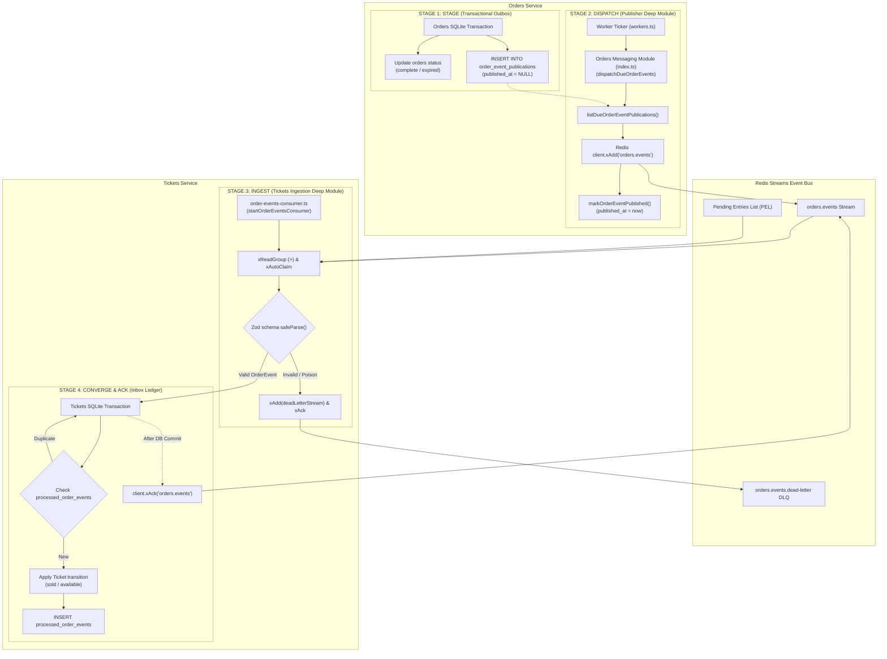

# Event-Driven Messaging Architecture: Orders & Tickets

This guide explains how asynchronous messaging works between **Orders** and **Tickets**, detailing the four-stage lifecycle pipeline, the durability patterns used (Transactional Outbox + Redis Streams + Idempotent Inbox), and how to trace an event from inception to convergence.

---

## 1. Architectural Philosophy & Patterns

In a microservices architecture, services must communicate state changes without:
1. Sharing databases directly (violates bounded contexts).
2. Relying on synchronous HTTP calls for terminal business facts (risks network loss, cascading failures, and coupling).
3. Losing events during unexpected server crashes.
4. Causing duplicate state changes if an event is delivered more than once (at-least-once delivery).

To solve this, our system implements three core architectural patterns:

| Pattern | Where Used | Problem It Solves |
| :--- | :--- | :--- |
| **Transactional Outbox** | Orders Service | Guarantees an event is saved in the local DB within the *exact same transaction* as the order status update. If the DB commits, the event fact is durably staged. |
| **Redis Streams Transport** | Event Bus | Provides durable, cursor-backed, group-acknowledged streaming transport (`orders.events`). Unlike Redis Pub/Sub, disconnected consumers do not lose messages. |
| **Idempotent Inbox Ledger** | Tickets Service | Tracks consumed message IDs in `processed_order_events` table before applying changes. Ensures safe at-least-once message delivery without double-processing. |

---

## 2. The 4-Stage Lifecycle Pipeline

Every event lifecycle traverses four standardized stages across Orders and Tickets:



---

## 3. Detailed Walkthrough: Stage by Stage

### Stage 1: STAGE (Orders Outbox)
When an order reaches a terminal state (`order.completed` or `order.expired`), the state transition and the event publication are saved **atomically** in SQLite.

- **Trigger Points:**
  - `orders/src/payments/payment-attempt-repo.ts::resolveAttempt` (order completes upon payment success, or expires on decline past deadline)
  - `orders/src/orders/order-repo.ts::enqueueTerminal` (order expires when unpaid checkout expires)
- **Mechanism:**
  Within `withTransaction(() => { ... })`:
  1. The `orders` table updates to `complete` or `expired`.
  2. Callers invoke `enqueueOrderFact(...)` via `orders/src/messaging`:
     ```ts
     enqueueOrderFact({
       orderId,
       orderVersion: row.version,
       eventType,
       payload: { ticketId: row.ticket_id },
     });
     ```
     *Deep Module Design:* Business callers express intent (`enqueueOrderFact`); the messaging deep module internally handles UUID generation, payload JSON serialization, aggregate classification, and table staging.
- **Durability Guarantee:** If the database commits, the event cannot be lost. If the process crashes immediately after, the event is safely sitting in `order_event_publications` with `published_at = NULL`.

---

### Stage 2: DISPATCH (Orders Outbox Dispatcher)
The Orders background worker (`orders/src/workers.ts`) executes `scan()` every interval (default 2 seconds).

- **Files:** `orders/src/messaging/index.ts`, `orders/src/workers.ts`
- **Mechanism:**
  1. `workers.ts` calls `dispatchDueOrderEvents()` without passing or managing Redis connection handles.
  2. The messaging module checks for due rows:
     ```sql
     SELECT * FROM order_event_publications
     WHERE published_at IS NULL AND next_attempt_at <= ?
     ORDER BY next_attempt_at, created_at, id LIMIT ?
     ```
  3. For each row, formats the envelope:
     ```json
     {
       "messageId": "UUID",
       "eventType": "order.completed",
       "eventVersion": 1,
       "aggregateType": "order",
       "aggregateId": "order-id",
       "aggregateVersion": 2,
       "occurredAt": "2026-09-03T12:00:00.000Z",
       "payload": { "ticketId": "ticket-id" }
     }
     ```
  4. Appends to Redis Stream:
     ```ts
     await redis.xAdd("orders.events", "*", { event: JSON.stringify(envelope) });
     ```
  5. Marks published:
     ```sql
     UPDATE order_event_publications
     SET published_at = ?, attempt_count = attempt_count + 1
     WHERE id = ? AND published_at IS NULL
     ```
- **Failure Handling & Retries:** If Redis is down or `xAdd` fails, `recordOrderEventPublicationFailure` increments `attempt_count` and calculates an exponential backoff stored in `next_attempt_at`.

---

### Stage 3: INGEST (Tickets Consumer Loop)
The Tickets service continuously listens to the stream via a durable Consumer Group (`tickets-order-convergence`).

- **File:** `tickets/src/orders/order-events-consumer.ts`
- **Mechanism:**
  1. **Lifecycle Orchestration:** `tickets/src/index.ts` invokes `startOrderEventsConsumer()`. The consumer encapsulates its Redis client lifecycle, consumer group setup, autoclaim loops, and graceful shutdown without leaking transport internals to the HTTP server.
  2. **Group Setup:** Automatically registers group `tickets-order-convergence` on stream `orders.events` (`XGROUP CREATE ... MKSTREAM`).
  3. **Pending Recovery (`XAUTOCLAIM`):** Before reading new messages, checks the Pending Entries List (PEL) for messages that other instances started processing but crashed before acknowledging (`claimIdleMs` default 30s).
  4. **New Entries (`XREADGROUP`):** Reads new messages (`>`) in batches with a 1s blocking timeout.
  5. **Schema Validation & Poison Filtering:** Each message is parsed against `orderEventSchema` (Zod).
     - **Valid Event:** Forwarded to Stage 4.
     - **Poison Message (Malformed):** Written immediately to dead-letter stream `orders.events.dead-letter` and acknowledged (`XACK`) to prevent infinite poison crash loops.

---

### Stage 4: CONVERGE & ACK (Tickets Inbox Ledger & Convergence)
The consumer hands the validated event to the repository to safely apply business state changes.

- **Files:** `tickets/src/tickets/ticket-repo.ts::applyOrderEventOnce`, `tickets/src/orders/order-events-consumer.ts`
- **Mechanism:**
  In a single `BEGIN IMMEDIATE` database transaction:
  1. **Duplicate Check (Inbox Ledger):**
     ```sql
     SELECT 1 FROM processed_order_events
     WHERE message_id = ? AND consumer = 'tickets-order-convergence'
     ```
     If found $\rightarrow$ returns `{ duplicate: true }` and commits immediately without re-applying state.
  2. **Domain State Convergence:**
     - `order.completed` $\rightarrow$ Transitions Ticket from `reserved` to `sold`. Checks that `locked_by_order_id == event.aggregateId`.
     - `order.expired` $\rightarrow$ Transitions Ticket from `reserved` to `available` and clears `locked_by_order_id`. Stale expiration events cannot unlock tickets reserved by a newer order.
  3. **Ledger Record:**
     ```sql
     INSERT INTO processed_order_events (message_id, consumer, event_type, processed_at)
     VALUES (?, 'tickets-order-convergence', ?, ?)
     ```
  4. **Transport Acknowledgment (`XACK`):**
     Only *after* the SQLite transaction successfully commits, `client.xAck("orders.events", group, entry.id)` is called.
- **Crash Safety:** If the service crashes right before `XACK`, Redis redelivers the message on recovery. On redelivery, Step 1 catches the duplicate in `processed_order_events`, skips domain mutation, and safely calls `XACK`.

---

## 4. Key Configuration Settings

Both services allow fine-tuning worker and consumer intervals through environment variables:

| Setting | Service | Default | Purpose |
| :--- | :--- | :--- | :--- |
| `ORDERS_WORKER_INTERVAL_MS` | Orders | `2000` | Polling frequency for due outbox publications, expirations, and payments |
| `TICKETS_EVENTS_CLAIM_IDLE_MS` | Tickets | `30000` | Idle threshold before `XAUTOCLAIM` reclaims abandoned pending messages |
| `TICKETS_EVENTS_CLAIM_INTERVAL_MS`| Tickets | `10000` | How often the consumer scans for stale pending messages |
| `TICKETS_EVENTS_BATCH_SIZE` | Tickets | `50` | Maximum message batch size per stream read |
| `REDIS_URL` | Both | `redis://redis:6379` | Redis connection endpoint |

---

## 5. Summary Cheat Sheet for Developers

When modifying or debugging messaging code:

1. **Need to publish a new business fact?**
   Do **not** call Redis directly from HTTP handlers. Call `enqueueOrderFact({ orderId, orderVersion, eventType, payload })` inside your DB transaction (`STAGE 1`). Let `orders/src/messaging` handle envelope structure, SQL persistence, and outbox dispatching (`STAGE 2`).
2. **Need to consume an event in Tickets?**
   Tickets starts the ingestion consumer with `startOrderEventsConsumer()`. Define event schemas in `tickets/src/tickets/schemas.ts` and apply state convergence inside `applyOrderEventOnce` wrapped by `processed_order_events` (`STAGE 4`).
3. **What if Redis goes down?**
   Orders will continue committing transactions locally without failing customer requests. Outbox records simply accumulate in SQLite and will back off and auto-dispatch when Redis recovers.
