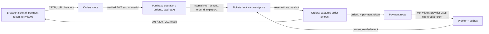

# Ticket purchase data capture: seven steps that survive boundaries

A browser can choose a **ticket identifier** and a **demo payment outcome**. It
cannot choose the buyer, the current price, the reservation deadline, or the
final order state. Those decisions belong to the services that own the facts.

This guide derives one reusable pattern from the current implementation:

> **Capture → Carry → Authenticate → Re-read → Validate → Persist → Return**

The point is not to memorize seven words. For each value, ask: where did it
start, how did it cross the next boundary, who was allowed to decide it, and
what durable write made retries and races safe?

## One compact map



The Next.js `/api/*` paths are same-origin carriers for the browser; rewrites
forward them to the services. The internal Tickets call uses a service token,
which authenticates Orders as a service and is different from the buyer's
access token. (Sources: `client/next.config.ts :: nextConfig.rewrites`;
`orders/src/tickets-client.ts :: reserve`; `tickets/src/http/require-internal-auth.ts
:: requireInternalAuth`.)

## The five fields worth tracing

This is the whole provenance map for the purchase. “Authority” means the
service that gets the final say, not merely the component that first displayed
the value.

| Field | First source and carriers | Authority and durable home |
|---|---|---|
| `ticketId` | Listing link → `/tickets/:ticketId` → `TicketPage`/`TicketDetail` → `useStartOrder` → create-order JSON → internal reservation path | Orders checks UUID shape; Tickets checks existence, availability, and lock. Tickets keeps `tickets.id`; Orders copies it to `purchase_operations.ticket_id` and `orders.ticket_id`. |
| `userId` | Verified JWT `sub` → `Authorization: Bearer` header → `response.locals.user.id` → SQL parameters | `common` verifies the token; Orders uses the authenticated ID in ownership predicates and stores it in `purchase_operations.user_id` and `orders.user_id`. It is never a browser body field. |
| `orderId` | `randomUUID()` in `createPurchase` → purchase operation → internal reservation JSON → returned order ID → order/payment URLs and Tickets lock | Orders creates and persists it. Tickets accepts it only as the lock owner (`locked_by_order_id`); payment attempts and terminal events use the same aggregate identity. |
| `amountCents` | Tickets `price_cents` → `Reservation.priceCents` → Orders `orders.amount_cents` → provider argument and provider row | Tickets decides the current price; Orders snapshots it in the order transaction. The provider receives that persisted snapshot, never a browser amount. |
| `expiresAt` | Orders `now + ORDER_EXPIRATION_MS` → purchase operation → internal reservation JSON → Tickets lock and public order | Orders calculates and guards the deadline; Tickets requires a future deadline and exact replay match. Both services persist it and compare it before later work. |

The seller's `owner_id` is intentionally not in the purchase reservation or
Orders order row. Do not imply that a seller crossed this boundary unless the
source contract changes. (Sources: `tickets/src/tickets/ticket.ts ::
TicketRow`, `Reservation`; `orders/src/tickets-client.ts :: Reservation`;
`orders/src/orders/order.ts :: OrderRow`.)

## 1. Capture at the edge

Capture means recording a value where a user or a server first supplies it.

- `TicketPage` accepts one string `ticketId` from the dynamic route and passes
  it to `TicketDetail`; the first `useTicket(ticketId)` request is a display
  read, not a reservation.
- `Checkout` captures one of the four allow-listed local payment scenarios:
  `local.success`, `local.decline`, `local.processing-success`, or
  `local.processing-decline`.
- `useStartOrder` creates one idempotency key for a logical ticket attempt.
  `usePayment` does the same for a logical payment attempt. A retry is another
  delivery of the same action, not a new action with a new key.

The page's displayed `priceCents` is useful for rendering but is only a
snapshot taken before the purchase. It is not captured as an order input.
(Sources: `client/pages/tickets/[ticketId].tsx :: TicketPage`;
`client/features/tickets/TicketDetail.tsx :: TicketDetail`;
`client/features/orders/Checkout.tsx :: Checkout`;
`client/hooks/orders/useStartOrder.ts :: useStartOrder`; `client/hooks/orders/usePayment.ts :: usePayment`.)

## 2. Carry explicitly

Carry means giving every hop a named carrier. The public requests contain
only the values the browser is allowed to choose:

```text
POST /api/orders/orders
Authorization: Bearer <access token>
Idempotency-Key: K
{"ticketId":"T"}

POST /api/orders/O/payments
Authorization: Bearer <access token>
Idempotency-Key: Kp
{"paymentMethodToken":"local.processing-success"}
```

`startOrder(ticketId, key)` places `ticketId` in JSON and `key` in the
`Idempotency-Key` header. `submitPayment(orderId, token, key)` puts `orderId`
in the URL, the token in JSON, and the payment key in a header. Orders then
turns its generated `orderId` and `expiresAt` into the internal Tickets
reservation command:

```text
PUT /internal/tickets/T/reservation
Authorization: Bearer <internal service token>
{"orderId":"O","expiresAt":"<ISO E>"}
```

Explicit carriers make omission visible. There is no public `userId`, price,
seller, or expiry field to accidentally trust. (Sources:
`client/lib/api/orders/commands.ts :: startOrder`, `submitPayment`;
`orders/src/tickets-client.ts :: reserve`.)

## 3. Authenticate identity

Identity is not another browser input. `requireAuth` reads the bearer token,
checks the configured JWT algorithm, issuer, audience, type, and claims
schema, then maps the verified `sub` claim to `response.locals.user.id`.
Missing or invalid credentials receive HTTP 401.

Orders uses that local value for `createPurchase`, order lookup, and
`beginPayment`. `findOrderByIdForUser(userId, orderId)` means changing an
order ID in the URL cannot reveal another user's order. The internal token on
the Tickets call proves the caller is Orders; it does not replace buyer
authentication. (Sources: `common/src/index.ts :: verifyAccessToken`,
`requireAuth`; `orders/src/http/routes/create-order.ts :: router.post`;
`orders/src/http/routes/submit-payment.ts :: router.post`;
`orders/src/orders/order-repo.ts :: findOrderByIdForUser`.)

## 4. Re-read authoritative facts

The screen can be stale between its GET and the click. Orders therefore asks
Tickets to reserve the ticket instead of trusting the screen's status or
price.

`reserve(ticketId, orderId, expiresAt)` reaches `reserveTicket` inside a
Tickets `BEGIN IMMEDIATE` transaction. Tickets reads its own row and decides:

- missing ticket → `not_found`;
- the same order and same deadline → replay the reservation;
- the same order with another deadline → conflict;
- anything other than an available ticket → unavailable;
- an available row → reserve it and read back its current `price_cents` and
  ticket snapshot.

Before payment, Orders re-reads the order by authenticated user, checks that
it is pending and unexpired, and calls `verify(ticketId, orderId)`. The
provider receives `order.amountCents`, the already captured server snapshot,
not the amount in the browser (there is no browser amount). (Sources:
`tickets/src/tickets/ticket-repo.ts :: reserveTicket`, `findReservation`,
`toReservation`; `orders/src/payments/payment-workflow.ts :: submitOrderPayment`;
`orders/src/tickets-client.ts :: verify`; `orders/src/payments/local-provider.ts
:: submit`.)

## 5. Validate invariants at each boundary

Validation is more than “is this a string?” It checks meaning, ownership,
freshness, and replay identity:

- The create-order workflow requires a 1–128 printable-ASCII idempotency key
  and a strict body containing exactly one UUID `ticketId`.
- `createPurchase` records the request fingerprint. Reusing the same
  `(userId, key)` for another ticket is an `idempotency_conflict`; repeating
  the same ticket is a replay.
- Tickets validates UUIDs, a future expiry, availability, and its
  one-ticket-per-order constraint.
- The payment workflow requires one recognized scenario and a valid key. A
  reused order/key pair must have the same scenario fingerprint.
- Payment also requires the authenticated owner, `pending` status, a future
  deadline, and a reservation whose lock owner is that order. A failed check
  is not permission to guess or continue.

Known reservation failures are durable rejection outcomes: missing ticket is
404 `ticket_not_found`; deadline mismatch is 409 `reservation_conflict`; other
unavailability is 409 `ticket_unavailable`. Temporary dependency or
completion failures leave the purchase operation retryable. A 202 response
means work is still processing, never that payment or the order succeeded.
(Sources: `orders/src/orders/purchase-workflow.ts :: idempotencyKey`,
`processPurchase`, `rejectedPurchaseError`; `tickets/src/tickets/schemas.ts ::
reservationCommandSchema`; `orders/src/payments/payment-workflow.ts ::
parsePaymentCommand`, `submitOrderPayment`; `orders/src/payments/payment-attempt-repo.ts :: beginPayment`.)

## 6. Persist atomically and idempotently

Persistence turns a request into durable intent before asynchronous work can
continue without the browser.

1. `createPurchase` runs in `withTransaction` (`BEGIN IMMEDIATE`), generates
   `orderId`, calculates `expiresAt = now + ORDER_EXPIRATION_MS` (15 minutes by
   default), and inserts a `reserving` purchase operation. A unique
   `(user_id, idempotency_key)` constraint makes a retry find the same
   operation.
2. After Tickets returns the reservation, `completePurchase` opens another
   transaction and re-reads the operation. It proceeds only when the
   operation is still `reserving`, its deadline is unchanged and in the
   future, and Tickets returned that exact deadline. It inserts the order with
   `amount_cents = reservation.priceCents`, the verified user, and the ticket
   snapshot, then marks the operation `completed` in the same transaction.
3. `beginPayment` guards the pending-to-`payment_processing` transition and
   creates one payment attempt in an Orders transaction. The local provider
   uses `local:<attemptId>` for its own idempotency and stores the same
   server-owned amount. A duplicate request replays the attempt; a
   same-key/different-scenario request conflicts.
4. If the provider is delayed, the worker reconciles it. `resolveAttempt`
   atomically changes the attempt and order: success leads to `complete`;
   decline returns to `pending` only if the deadline is still in the future,
   otherwise it becomes `expired`. Terminal changes write an outbox event.

Reservation ownership is a safety invariant, not just a convenience:
Tickets releases or marks a ticket sold only when both `ticketId` and
`orderId` match the current reserved lock. An old release or terminal event
therefore cannot free or sell a newer owner's reservation. The Tickets
consumer records message IDs in `inbox_messages`, so duplicate events are
also harmless. (Sources: `orders/src/database.ts :: withTransaction`;
`orders/src/orders/order-repo.ts :: createPurchase`, `completePurchase`;
`orders/src/payments/payment-attempt-repo.ts :: beginPayment`, `resolveAttempt`;
`tickets/src/tickets/ticket-repo.ts :: releaseReservation`,
`applySoldConvergence`, `applyReleaseConvergence`, `consumeOrderEvent`.)

## 7. Return only the server result

The response is a statement of what the backend knows now:

- Create order returns `{ outcome: "created", order }` with HTTP 201 for the
  first completed operation, `{ outcome: "replayed", order }` with HTTP 200
  for the same logical request, or `{ outcome: "processing" }` with HTTP 202
  while reservation work is still retrying.
- Payment returns the order and a public payment attempt. It uses HTTP 200
  for a terminal `succeeded`/`declined` result and HTTP 202 with
  `Retry-After: 2` while processing.
- Parsers accept only the documented outcomes and reject malformed service
  output. The UI displays the returned amount and expiry; it does not
  manufacture an order, recalculate a trusted amount, or expose internal
  idempotency keys and provider scenario details.

The order page may poll while payment is processing. Polling observes the
worker's durable result; it does not submit a second payment action.
(Sources: `orders/src/http/routes/create-order.ts :: router.post`;
`orders/src/http/routes/submit-payment.ts :: router.post`;
`orders/src/payments/payment-workflow.ts :: paymentResult`;
`client/lib/api/orders/parsers.ts :: parseStartOrder`, `parsePayment`;
`client/hooks/orders/useOrder.ts :: useOrder`.)

## Worked example: one purchase and a delayed-success payment

Use symbols so the reasoning stays focused: `T` is the ticket UUID from the
URL, `U` is the verified JWT `sub`, `O` is the generated order ID, `P` is the
current Tickets price in cents, `E` is the server deadline, `K` is the
start-order key, `Kp` is the payment key, and `A` is the payment-attempt ID.

1. The browser is viewing `/tickets/T`. It may display `P` from the earlier
   ticket GET, but that value is not sent as a purchase amount.
2. The click sends `{ ticketId: T }` with key `K` and a bearer token. It sends
   neither `U`, `P`, nor `E`.
3. Orders verifies the token, derives `U`, and transactionally creates
   `purchase_operations` with `O`, `T`, `U`, key `K`, state `reserving`, and
   `E = now + ORDER_EXPIRATION_MS`.
4. Orders asks Tickets to reserve `T` for `O` until `E`. Tickets atomically
   changes an available row to `reserved`, then returns its current price `P`
   and snapshot.
5. Orders verifies the deadline did not change or expire, inserts order `O`
   with `user_id = U`, `amount_cents = P`, `expires_at = E`, and status
   `pending`, and marks the operation completed in one transaction.
6. The browser receives 201 and navigates to `/orders/O`. Repeating the same
   request with `K` returns the same order as a 200 replay, not a second order.
7. The user chooses `local.processing-success`. Payment carries `O`, the
   scenario, and key `Kp`. Orders again derives `U`, checks ownership,
   pending/unexpired state, and verifies that Tickets still holds `T` for `O`.
8. `beginPayment` atomically creates attempt `A` and changes the order to
   `payment_processing`. The provider receives the persisted amount `P`; it
   returns a processing result, so the first response is HTTP 202.
9. The worker later resolves `A` as succeeded, changes `O` to `complete`, and
   writes an `order.completed` event for `T`. Tickets consumes it once and
   marks `T` sold only if the reservation is still owned by `O`.

If an old expiry or release event arrives after a new reservation owns `T`,
the lock-owner predicate rejects it. If the payment declines, the same
transaction returns the order to `pending` only before `E`; after `E`, the
order becomes `expired`. These are the same seven steps under a different
outcome, not special client-side repairs. (Sources: `orders/src/orders/order-repo.ts
:: completePurchase`, `enqueueTerminal`; `orders/src/payments/payment-attempt-repo.ts
:: resolveAttempt`; `tickets/src/tickets/ticket-repo.ts :: consumeOrderEvent`.)

## One small exercise

Trace `paymentMethodToken` through the seven verbs without opening another
flow. The expected answer is: `Checkout` captures an allow-listed scenario;
`usePayment` and `submitPayment` carry it as JSON; authentication still comes
from JWT `sub`; Orders re-reads the owned order and reservation; validation
checks the scenario and replay fingerprint; `beginPayment` persists it
internally as `provider_scenario`; the response returns outcome and public
attempt fields, not the token or payment key. (Sources:
`client/features/orders/Checkout.tsx :: Checkout`;
`client/hooks/orders/usePayment.ts :: usePayment`;
`orders/src/payments/payment-attempt-repo.ts :: beginPayment`;
`orders/src/payments/payment-attempt.ts :: toPaymentAttempt`.)

## Concise checklist for a new field

- **Capture:** Where is it first created or selected?
- **Carry:** What named argument, URL segment, JSON field, header, or column
  carries it at every hop?
- **Authenticate:** If it represents identity, which verified credential
  supplies it instead of the browser?
- **Re-read:** Which owning service can return the current authoritative fact?
- **Validate:** Which shape, enum, owner, freshness, state, and replay
  conditions reject a bad or stale value?
- **Persist:** Which transaction, unique key, fingerprint, and guarded update
  make retries, duplicates, and stale releases safe?
- **Return:** Which public result does the next screen need, and which internal
  keys, credentials, or untrusted inputs must stay out?

A field is ready only when each answer names its carrier, authority, durable
owner, and failure behavior. That is the pattern: **Capture → Carry →
Authenticate → Re-read → Validate → Persist → Return**.