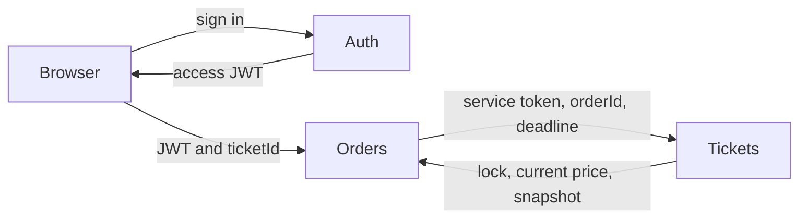

# Start Here: Orders, Tickets, and Auth

This is the smallest useful path through the purchase diff. Do not read the
whole commit from top to bottom.

Your first question is:

> How does one authenticated user reserve one ticket?

Ignore payment, Redis, workers, migrations, Kubernetes, CSS, and most frontend
code until you can answer that question in your own words.

## The three jobs

- **Auth proves who the user is.**
- **Orders manages the purchase process.**
- **Tickets decides whether the ticket can be reserved.**

The most important boundary is:

> Orders asks Tickets to reserve a ticket. Orders never edits the Tickets
> database.



Auth does not receive a network request every time Orders or Tickets handles a
user request. Auth issues the access JWT during sign-in. `requireAuth` from the
Common package then verifies that JWT locally inside each service.

## What deserves the most attention?

### 1. Orders: learn the request flow

Orders is the coordinator. It:

1. receives the buyer's `ticketId`;
2. gets the buyer's `userId` from the verified JWT;
3. creates a durable purchase operation and `orderId`;
4. asks Tickets to reserve the ticket;
5. stores the authoritative price returned by Tickets.

Orders does not decide whether the ticket is available.

### 2. Tickets: learn authority and state changes

Tickets owns:

- the listing;
- the current price while available;
- `available`, `reserved`, and `sold` status;
- which `orderId` owns a reservation;
- guarded release of that reservation.

This is where the important concurrency rule lives: only one order can win the
reservation.

### 3. Auth: learn the identity handoff

Auth matters, but it is smaller in this purchase flow:

1. Auth signs a JWT whose subject is the user's ID.
2. The browser sends that JWT to Orders or Tickets.
3. `requireAuth` verifies it locally.
4. The route reads `response.locals.user.id`.

The browser is therefore not allowed to choose `userId` in the order body.

## First reading session: reservation only

Spend about 20 minutes. Read only the named ranges.

### Step 1: the public Orders endpoint

Read:

`orders/src/http/routes/create-order.ts:1-35`

Notice that this file now contains only HTTP concerns:

- it registers `POST /orders`;
- it passes authenticated identity, the idempotency header, and the body to the
  purchase workflow;
- it maps `processing` to HTTP 202;
- it maps `created` or `replayed` to HTTP 201 or 200;
- it forwards errors to the Orders error handler.

The route does not reserve tickets, schedule retries, or edit purchase state.

### Step 2: the purchase workflow

Read:

1. `orders/src/orders/purchase-workflow.ts:16-64`
2. `orders/src/orders/purchase-workflow.ts:178-205`

The first range defines and validates the command. The second starts or replays
durable purchase work, processes it, and returns one application result to the
route.

When that entry point feels clear, read
`orders/src/orders/purchase-workflow.ts:66-162`. This is where Orders retries a
reservation, compensates by releasing an expired lock, and maps known Tickets
failures to durable rejection.

The background worker imports `processPurchase(...)` from this workflow. It no
longer imports business logic from an HTTP route.

### Step 3: Orders calls Tickets

Read:

`orders/src/tickets-client.ts:19-79`

This is a real HTTP client for the Tickets service. It is not a payment
provider.

Pay attention to two functions:

- `call(...)` supplies `INTERNAL_SERVICE_TOKEN`, the JSON content type, and a
  five-second timeout;
- `reserve(...)` sends `orderId` and `expiresAt` to the private Tickets API.

The reservation response contains the price and ticket snapshot that Orders
will store. Orders does not trust a price previously displayed in the browser.

### Step 4: Tickets receives the reservation command

Read:

`tickets/src/http/routes/internal-ticket-reservations.ts:15-55`

Notice:

- the private route requires internal service authentication;
- the ticket ID, order ID, and future deadline are validated;
- the route calls `reserveTicket(...)`;
- the repository result is translated into an HTTP response.

This route is the boundary. The next file contains the authoritative decision.

### Step 5: Tickets performs the actual lock

Read:

`tickets/src/tickets/ticket-repo.ts:308-367`

Focus on these outcomes:

- an available ticket becomes reserved by this `orderId`;
- the same request can be replayed safely;
- the same order with a different deadline conflicts;
- a non-available ticket is rejected.

The guarded SQL update at lines 346-355 is the moment the ticket reservation
actually happens.

### Step 6: add Auth after the reservation flow is clear

Read:

1. `auth/src/tokens/access-token.ts:12-25`
2. `common/src/index.ts:40-83`

The first file signs the access JWT. The second reads and verifies the bearer
JWT and places the authenticated user in `response.locals.user`.

There is no Orders-to-Auth HTTP call during `POST /orders`.

## Four values to trace

Trace only these values during the first session:

| Value | Created or chosen by | Authoritative owner |
|---|---|---|
| `ticketId` | Browser selects a listing | Tickets |
| `userId` | Authenticated JWT subject | Auth |
| `orderId` | Orders creates it | Orders |
| `priceCents` | Tickets returns it during reservation | Tickets at reservation; Orders captures it |

If you can explain where those four values come from, the first session is
complete.

## `tickets-client.ts` is not the payment provider

The names can be confusing because payment checks the ticket reservation before
charging.

`orders/src/tickets-client.ts` provides:

- `reserve(...)`: lock the ticket for an order;
- `verify(...)`: confirm that the same order still owns the lock;
- `release(...)`: ask Tickets to remove that order's lock.

The actual fake third-party payment provider is:

`orders/src/payments/local-provider.ts`

It provides:

- `submit(...)`: simulate submitting a payment;
- `lookup(...)`: simulate checking a delayed payment result;
- local scenarios such as `local.success` and `local.decline`.

The payment order is therefore:

1. verify the ticket reservation through `tickets-client.ts`;
2. create a durable payment attempt;
3. call `local-provider.ts` to simulate the provider result.

## What to ignore on the first pass

Do not read these yet:

- `client/features/**` and CSS;
- Kubernetes and Docker files;
- migrations;
- Redis Streams, the event publication ledger (outbox pattern), and the processed-event ledger (inbox pattern) code;
- expiration workers;
- payment reconciliation;
- complete repository files from top to bottom.

Those are later layers. They do not help with the first reservation mental
model.

## Second session: payment and final ticket state

Only continue after the first session feels clear.

Read in this order:

1. `orders/src/http/routes/submit-payment.ts:1-43` (`submitPayment`)
2. `orders/src/payments/payment-workflow.ts:39-84` (`parsePaymentCommand`)
3. `orders/src/payments/payment-workflow.ts:86-198` (`paymentResult`, `submitOrderPayment`)
4. `orders/src/orders/order-repo.ts:300-354` (`enqueueTerminal`)
5. `orders/src/messaging/order-event-publication-repo.ts` (publication repository functions)
6. `orders/src/workers.ts:130-194` (`publishOrderEventPublication`, `scanOrderEventPublications`)
7. `tickets/src/orders/order-events-consumer.ts:60-209` (`startOrderEventsConsumer`, including pending recovery)
8. `tickets/src/tickets/ticket-repo.ts:609-671` (`applyOrderEventOnce`)

This later path is:

> verify reservation -> process payment -> update Order -> publish terminal
> event through the event publication ledger -> make Ticket sold or available

Do not combine this with the first session.

## How to read each file

Ask only four questions:

1. Who called this function?
2. Which inputs are trusted, and why?
3. Which service owns the state being changed?
4. What prevents a duplicate or stale request from corrupting that state?

Do not try to memorize every helper or type.

## Reading the Git change without becoming overwhelmed

The original purchase commit is `1b8c9a8`. It changes 94 files, so reading the
entire patch sequentially is not useful.

For the current route refactors, read only:

1. `orders/src/http/routes/create-order.ts`
2. `orders/src/orders/purchase-workflow.ts`
3. `orders/src/http/routes/submit-payment.ts`
4. `orders/src/payments/payment-workflow.ts`
5. `orders/src/workers.ts:1-48`

The dependency direction is now:

> HTTP routes -> use-case workflows -> repositories and service/provider
> clients

The background worker also calls the purchase workflow directly; it does not
depend on an HTTP route.

To compare the original routes with the current ones:

```bash
git show 1b8c9a8:orders/src/http/routes/create-order.ts
git show 1b8c9a8:orders/src/http/routes/submit-payment.ts
git diff -- orders/src/http/routes/create-order.ts orders/src/http/routes/submit-payment.ts orders/src/workers.ts
```

Open `purchase-workflow.ts` and `payment-workflow.ts` directly for the extracted
logic; untracked files do not appear in a normal `git diff` until Git begins
tracking them.

## Small completion check

Stop after you can say this without looking at the code:

> Auth proves the buyer's identity. Orders creates the purchase and asks Tickets
> to reserve. Tickets atomically decides whether the reservation wins and
> returns the current price. Orders stores that price with the pending order.

That is enough for the first session.

## Git safety note

`tickets/data/uploads/` currently contains local uploaded runtime data. The
SQLite files are ignored, but uploaded images are not covered by the current
`.gitignore`. Check staged files carefully before using `git add .` so local
uploads are not committed accidentally.
