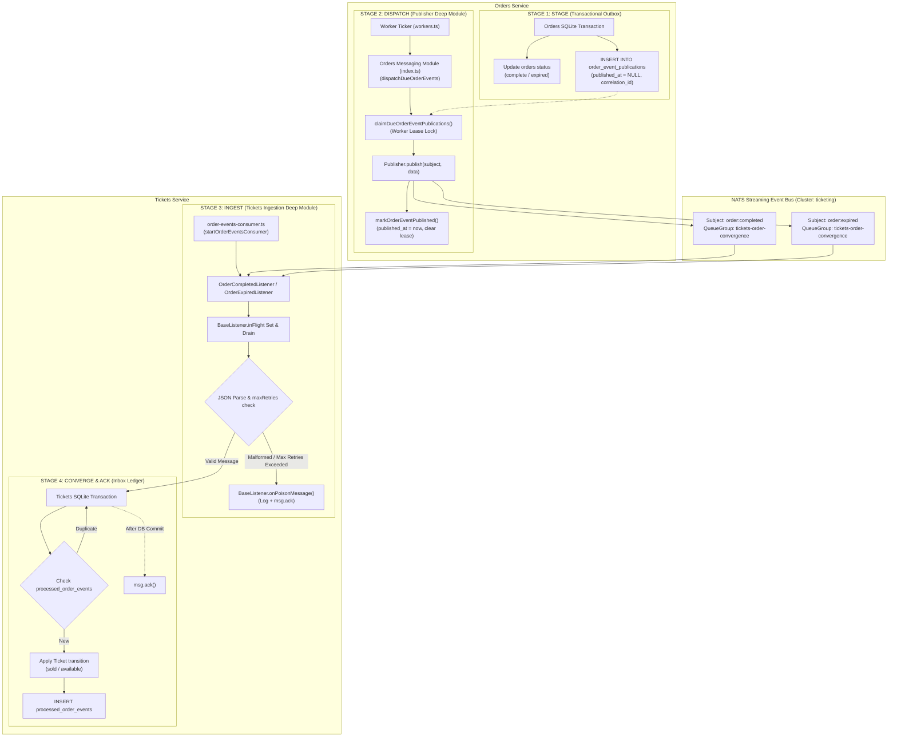

# Event-Driven Messaging Architecture: Orders & Tickets

This guide explains how asynchronous messaging works between **Orders** and **Tickets**, detailing the four-stage lifecycle pipeline, the durability patterns used (Transactional Outbox with Worker Lease Claim + NATS Streaming + Idempotent Inbox Ledger), poison-pill protection, graceful shutdown draining, and distributed tracing.

---

## 1. Architectural Philosophy & Patterns

In a microservices architecture, services must communicate state changes without:
1. Sharing databases directly (violates bounded contexts).
2. Relying on synchronous HTTP calls for terminal business facts (risks network loss, cascading failures, and coupling).
3. Losing events during unexpected server crashes.
4. Causing duplicate state changes if an event is delivered more than once (at-least-once delivery).

To solve this, our system implements four core architectural patterns:

| Pattern | Where Used | Problem It Solves |
| :--- | :--- | :--- |
| **Transactional Outbox with Lease Claim** | Orders Service | Guarantees an event is saved in the local DB within the *exact same transaction* as the order status update. Worker lease claiming (`claimDueOrderEventPublications`) prevents multi-replica worker races. |
| **Strongly-Typed NATS Streaming** | Broker Transport | Provides durable, channel-backed, queue-grouped streaming transport (`order:completed`, `order:expired`) with bounded generics in `@stubhub/common`. |
| **Poison-Pill & Retry Protection** | Consumer Framework | In `BaseListener`, malformed JSON or unhandled processing errors that exceed `maxRetries` are safely acknowledged via `onPoisonMessage` to prevent queue deadlock. |
| **Idempotent Inbox Ledger** | Tickets Service | Tracks consumed message IDs in `processed_order_events` table before applying changes. Ensures safe at-least-once message delivery without double-processing. |

> ℹ️ **Historical Note**: Early design prototypes explored raw Redis Streams (`xAdd`, `xReadGroup`). The architecture subsequently pivoted to strongly-typed NATS Streaming contracts in `@stubhub/common` to enforce compile-time payload safety and channel typing across all services.

---

## 2. The 4-Stage Lifecycle Pipeline

Every event lifecycle traverses four standardized stages across Orders and Tickets:



---

## 3. Detailed Walkthrough: Stage by Stage

### Stage 1: STAGE (Orders Outbox)
When an order reaches a terminal state (`order.completed` or `order.expired`), the state transition and the event publication are saved **atomically** in SQLite.

- **Trigger Points:**
  - `orders/src/payments/payment-attempt-repo.ts::resolveAttempt` (order completes upon payment success, or expires on decline past deadline)
  - `orders/src/orders/order-repo.ts::enqueueTerminal` (order expires when unpaid checkout expires)
- **Mechanism:**
  Within `withTransaction(() => { ... })`:
  1. The `orders` table updates to `complete` or `expired`.
  2. Callers invoke `enqueueOrderFact(...)` via `orders/src/messaging`:
     ```ts
     enqueueOrderFact({
       orderId,
       orderVersion: row.version,
       eventType,
       correlationId: optionalCorrelationId,
       payload: { ticketId: row.ticket_id },
     });
     ```
- **Durability Guarantee:** If the database commits, the event cannot be lost. If the process crashes immediately after, the event is safely stored in `order_event_publications` with `published_at = NULL`.

---

### Stage 2: DISPATCH (Orders Outbox Dispatcher with Lease Claim)
The Orders background worker (`orders/src/workers.ts`) executes `scan()` periodically (default 2 seconds).

- **Files:** `orders/src/messaging/outbox-dispatcher.ts`, `orders/src/messaging/outbox-repo.ts`
- **Mechanism:**
  1. `workers.ts` calls `dispatchDueOrderEvents()`.
  2. The messaging module atomically claims due rows with a worker lease:
     ```sql
     SELECT * FROM order_event_publications
     WHERE published_at IS NULL
       AND next_attempt_at <= ?
       AND (locked_until IS NULL OR locked_until <= ?)
     ORDER BY next_attempt_at, created_at, id LIMIT ?
     ```
     Sets `locked_by = workerId` and `locked_until = now + 30000` to prevent competing worker pods from duplicating dispatches.
  3. Formats the strongly-typed event data:
     ```ts
     const eventData = {
       id: pub.aggregateId,
       version: pub.aggregateVersion,
       messageId: pub.id,
       ticketId,
       ticket: { id: ticketId },
       occurredAt: pub.createdAt,
       correlationId: pub.correlationId ?? undefined,
     };
     ```
  4. Publishes via typed publisher (`OrderCompletedPublisher` or `OrderExpiredPublisher`).
  5. On success:
     ```sql
     UPDATE order_event_publications
     SET published_at = ?, attempt_count = attempt_count + 1,
         locked_by = NULL, locked_until = NULL, last_error = NULL
     WHERE id = ? AND published_at IS NULL
     ```
  6. On failure: `recordOrderEventPublicationFailure` clears the lock and applies exponential backoff stored in `next_attempt_at`.

---

### Stage 3: INGEST (Tickets Consumer Loop & Resilience)
The Tickets service continuously listens to the stream via a durable Queue Group (`tickets-order-convergence`).

- **File:** `tickets/src/orders/order-events-consumer.ts`, `common/src/events/base-listener.ts`
- **Mechanism:**
  1. **Lifecycle Orchestration:** `tickets/src/index.ts` invokes `startOrderEventsConsumer()`.
  2. **In-Flight Tracking & Draining:** `BaseListener` tracks all active message promises in an `inFlight` set. On shutdown, `close()` stops incoming subscription messages and awaits all in-flight handlers up to 10s before closing the NATS connection.
  3. **Poison-Pill Protection:**
     - Malformed JSON payloads immediately trigger `onPoisonMessage` which logs and calls `msg.ack()`.
     - Processing exceptions track attempt count per message sequence. After `maxRetries` (default 5), the message is abandoned and acknowledged to prevent subscription deadlocks.

---

### Stage 4: CONVERGE & ACK (Tickets Inbox Ledger & Convergence)
The consumer hands the validated event to the repository to safely apply business state changes.

- **Files:** `tickets/src/tickets/ticket-repo.ts::applyOrderEventOnce`, `tickets/src/orders/listeners/`
- **Mechanism:**
  In a single `BEGIN IMMEDIATE` database transaction:
  1. **Duplicate Check (Inbox Ledger):**
     ```sql
     SELECT 1 FROM processed_order_events
     WHERE message_id = ? AND consumer = 'tickets-order-convergence'
     ```
     If found $\rightarrow$ returns `{ duplicate: true }` and commits immediately without re-applying state.
  2. **Domain State Convergence:**
     - `order.completed` $\rightarrow$ Transitions Ticket from `reserved` to `sold`. Checks that `locked_by_order_id == event.aggregateId`.
     - `order.expired` $\rightarrow$ Transitions Ticket from `reserved` to `available` and clears `locked_by_order_id`. Stale expiration events cannot unlock tickets reserved by a newer order.
  3. **Ledger Record:**
     ```sql
     INSERT INTO processed_order_events (message_id, consumer, event_type, processed_at)
     VALUES (?, 'tickets-order-convergence', ?, ?)
     ```
  4. **Transport Acknowledgment (`msg.ack()`):**
     Only *after* the SQLite transaction successfully commits, `msg.ack()` is called.
- **Crash Safety:** If the service crashes right before `msg.ack()`, NATS redelivers the message on recovery. On redelivery, Step 1 catches the duplicate in `processed_order_events`, skips domain mutation, and safely calls `msg.ack()`.

---

## 4. Key Configuration Settings

| Setting | Service | Default | Purpose |
| :--- | :--- | :--- | :--- |
| `ORDERS_WORKER_INTERVAL_MS` | Orders | `2000` | Polling frequency for due outbox publications, expirations, and payments |
| `NATS_URL` | Both | `http://nats-srv:4222` | NATS Streaming connection endpoint |
| `NATS_CLUSTER_ID` | Both | `ticketing` | NATS Streaming cluster identifier |
