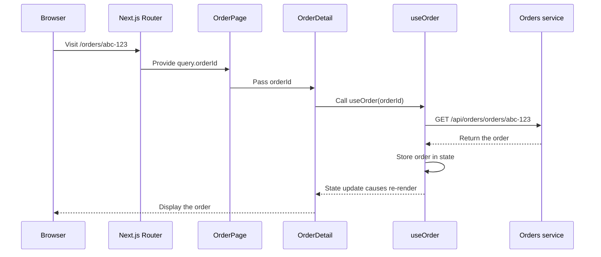

# Where the order ID comes from



The page's `orderId` variable is **not fetched from the backend**. Next.js copies it from the current URL.

Example URL:

```text
/orders/abc-123
```

Because the page is named `pages/orders/[orderId].tsx`, Next.js produces:

```ts
useRouter().query.orderId === "abc-123"
```

## Inspect the code

### How the ID reaches the browser

1. The Orders service creates the ID with `randomUUID()` and stores it: [`orders/src/orders/order-repo.ts:98-116`](../../orders/src/orders/order-repo.ts#L98-L116).
2. After a purchase, the frontend puts `result.order.id` into the URL: [`client/features/tickets/TicketDetail.tsx:14-18`](../../client/features/tickets/TicketDetail.tsx#L14-L18).
3. From My Orders, the link puts `order.id` into the URL: [`client/features/orders/OrderCard.tsx:11-20`](../../client/features/orders/OrderCard.tsx#L11-L20).

### How that ID fetches the order

1. The page reads `orderId` from the URL and passes it to `OrderDetail`: [`client/pages/orders/[orderId].tsx:5-13`](../../client/pages/orders/%5BorderId%5D.tsx#L5-L13).
2. `OrderDetail` passes the ID to `useOrder`: [`client/features/orders/OrderDetail.tsx:12-13`](../../client/features/orders/OrderDetail.tsx#L12-L13).
3. `useOrder` requests the order and stores the response in state: [`client/hooks/orders/useOrder.ts:6-24`](../../client/hooks/orders/useOrder.ts#L6-L24).
4. `getOrder` builds the GET request: [`client/lib/api/orders/queries.ts:14-18`](../../client/lib/api/orders/queries.ts#L14-L18).
5. Next.js forwards `/api/orders/*` to the Orders service: [`client/next.config.ts:21-24`](../../client/next.config.ts#L21-L24).
6. The backend reads `request.params.orderId`: [`orders/src/http/routes/list-orders.ts:17-29`](../../orders/src/http/routes/list-orders.ts#L17-L29).
7. The repository queries the database using the ID and authenticated user: [`orders/src/orders/order-repo.ts:61-65`](../../orders/src/orders/order-repo.ts#L61-L65).
