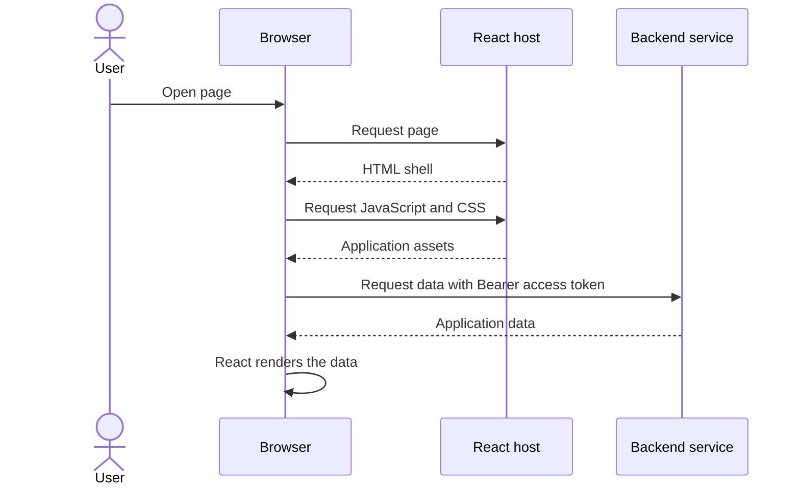
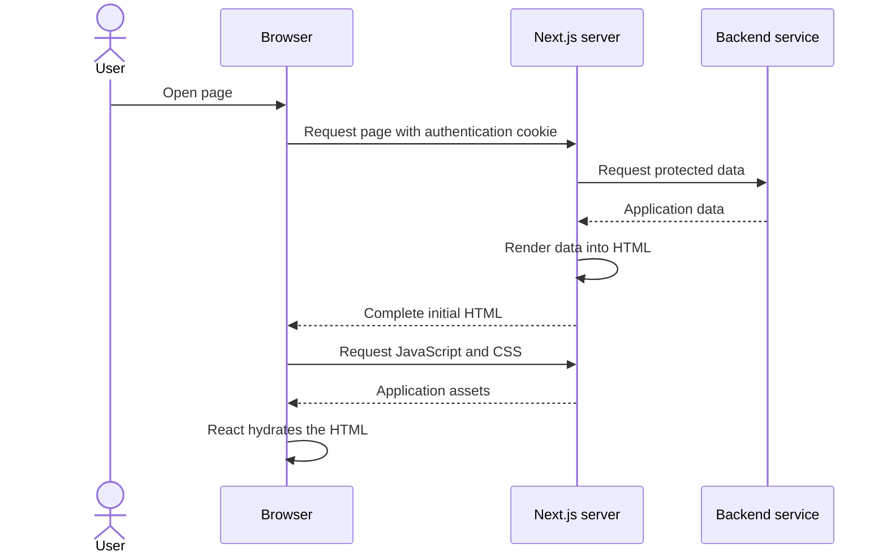
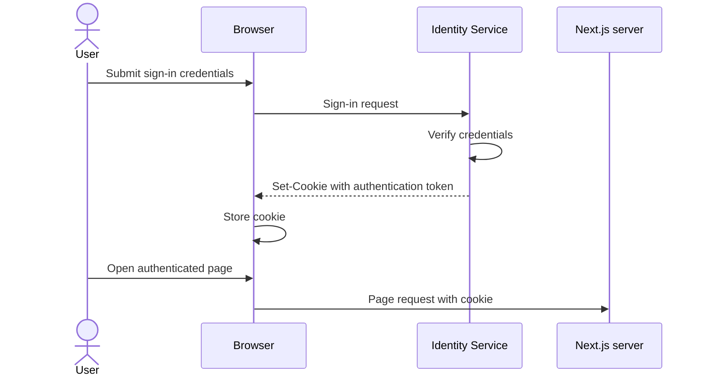

# SSR, JWTs, and cookies

## Purpose

This document explains why server-side rendering changes how authentication information must reach the application during an initial page request.

## Client-side rendering

A typical client-rendered React application loads in stages:



Authentication is usually required when JavaScript requests protected data. At that point, application code can add an access token to the request:

```http
Authorization: Bearer <access-token>
```

## Server-side rendering

With server-side rendering, Next.js performs the initial data fetch and HTML rendering:



SSR does not eliminate JavaScript, CSS, image, or later API requests. Its main benefit is avoiding the initial client-side data-fetching and rendering waterfall, which can improve time to visible content and make public content available to search engines.

### Advantages

- **Earlier visible content:** the browser receives useful HTML before React finishes loading and fetching data.
- **Better public-page discovery:** search engines and link-preview crawlers can read rendered ticket content without executing application JavaScript.
- **Better experience on slower devices:** initial rendering uses server resources instead of depending entirely on the user's device.
- **Fewer initial data waterfalls:** Next.js can fetch required data before returning the page instead of waiting for the browser to load JavaScript and then request it.
- **Server-only data access:** Next.js can call internal services without exposing internal addresses or server credentials to browser code.

### Disadvantages

- **More server work:** dynamic pages consume server CPU and memory on every uncached render.
- **Backend latency delays the whole page:** slow or unavailable services increase time to first byte or prevent the initial render.
- **Personalized pages are harder to cache:** authenticated HTML varies by user and must not be served to another user.
- **JavaScript is still required:** the browser normally downloads the client bundle and hydrates the HTML before the page becomes fully interactive.
- **Hydration can fail:** differences between server and browser output can cause warnings, flicker, or incorrect UI.
- **Authentication is more complex:** the initial request needs cookie-accessible authentication, correct cookie forwarding, refresh handling, and CSRF protection.
- **Higher operational complexity:** Next.js becomes part of the runtime request path rather than only serving static application assets.

SSR is most valuable for public, content-heavy pages such as ticket discovery and ticket details. Private, highly interactive pages should use SSR only when authenticated first-load content provides a measurable benefit.

## The initial-request authentication problem

When a user enters a URL or refreshes the page, the browser sends the navigation request before the application's JavaScript has loaded. Application code therefore cannot add an `Authorization` header or request body to that initial navigation.

A matching cookie is different: the browser automatically includes it with the request.

```http
GET /orders HTTP/1.1
Cookie: accessToken=<jwt>
```

This allows Next.js to identify the user before rendering. It can verify the token or forward the authenticated identity when requesting protected data from Orders, Tickets, or another service.

## How the cookie arrives

The browser does not invent the authentication cookie during page loading. It normally receives the cookie after successful authentication:



A production authentication cookie should normally use appropriate controls:

```http
Set-Cookie: accessToken=<jwt>; HttpOnly; Secure; SameSite=Lax; Path=/
```

- `HttpOnly` prevents browser JavaScript from reading the token.
- `Secure` restricts transmission to HTTPS.
- `SameSite` helps limit cross-site request forgery.
- `Path` controls which requests receive the cookie.

Cookies sent automatically by the browser introduce CSRF considerations. State-changing routes still need an intentional CSRF strategy based on the deployed domain and cross-origin design.

## JWTs and cookies have different jobs

- A **JWT** is a signed token containing authentication claims and an expiration time.
- A **cookie** is a browser storage and transport mechanism.
- **SSR** means the server fetches initial data and produces the initial HTML.

JWTs and cookies are not competing technologies. A JWT can be transported inside a cookie.

A JWT is normally signed, not encrypted. A user can usually decode its claims, but cannot alter them without invalidating its signature. Passwords, payment details, refresh tokens, and other secrets must never be placed inside a JWT.

## Project impact

The current Identity implementation returns the access token for use as a Bearer token and stores the opaque refresh token in an HTTP-only cookie. This works for browser API calls after the application has started.

An authenticated SSR page needs an explicit design because an in-memory Bearer access token is unavailable during a fresh navigation. Viable designs include:

1. Transport the access JWT in an HTTP-only cookie so Next.js receives it on the initial request.
2. Let a trusted Next.js server layer use the refresh-token cookie to obtain an access token and propagate the rotated cookie correctly.
3. Keep authenticated pages client-rendered and use SSR only for public content.

This document explains those options; it does not select or implement a new access-token transport. That decision must also define cookie scope, CSRF protection, refresh rotation, cross-origin behavior, and how Next.js authenticates its backend requests.

## Summary

SSR moves the initial data fetch and HTML rendering to Next.js. A previously issued cookie can carry authentication on the first browser request because the browser attaches it automatically before application JavaScript runs.
