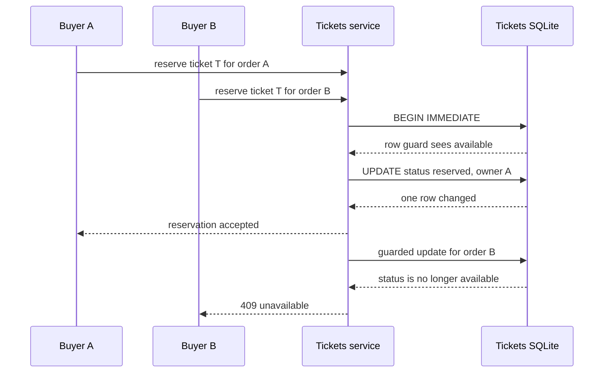

# StubHub Promotion, Marketing, and Interview Playbook

This playbook turns the repository into a proof-of-work asset for remote **Senior Backend Engineer**, **Staff Engineer**, and **Distributed Systems Engineer** roles across the US and EU. It is intentionally evidence-led: every technical claim below maps to code, a migration, or a runnable repository artifact.

- Repository: <https://github.com/h19overflow/stubhub>
- Fast proof: `npm run demo:concurrency`
- Case studies: [`docs/case-studies/`](../case-studies/)
- System-design source: [`docs/system_design/`](../system_design/)

## 0. Positioning in one sentence

> I build backend systems that preserve business invariants when requests race, processes crash, and events are delivered more than once, demonstrated by a TypeScript ticket marketplace with guarded SQLite reservations, a transactional outbox with leased workers, and idempotent event convergence.

Use this sentence as the spine of a profile, cover letter, outreach note, or interview introduction. Change the final noun to match the role: **commerce**, **payments**, **platform reliability**, or **event-driven architecture**.

## 1. Executive resume and LinkedIn positioning

### 1.1 Headline formulas

Keep the headline searchable and specific. Put the role you want first, then the engineering problems you solve, then the technologies that make the claim credible.

**Formula A — Senior Backend / API-heavy roles**

> `Senior Backend Engineer | Concurrency-Safe APIs | Data Consistency and Reliable Events | TypeScript, Node.js, SQLite`

**Formula B — Staff / distributed systems roles**

> `Staff Backend Engineer | Distributed Systems and Failure-First Design | Outbox, Idempotency, Concurrency`

**Formula C — Platform and reliability roles**

> `Backend / Distributed Systems Engineer | At-Least-Once Delivery, Safe Retries, Worker Leases | TypeScript + SQL`

**Formula D — Recruiter-readable version**

> `Senior Backend Engineer open to remote US/EU roles | Event-Driven Systems | Consistency, Concurrency, Reliability`

**Formula E — Domain-specific version**

> `Senior Backend Engineer | Reliable Commerce Workflows | Ticket Reservation Races, Payment Recovery, Transactional Outbox`

Do not write “expert in everything,” “10x,” or “guaranteed zero downtime.” The repository supports a stronger and more credible claim: **the design makes failure modes explicit and makes important state transitions recoverable and idempotent**.

### 1.2 LinkedIn About / executive summary formula

Use four short paragraphs. The first establishes scope, the next two show proof, and the last gives a low-friction reason to contact you.

**Copy-ready template**

> I’m a [Senior/Staff] backend engineer focused on distributed systems where correctness matters: high-contention writes, retries, partial failure, and asynchronous delivery. I design around the business invariant first, then choose the smallest mechanism that protects it.
>
> In my StubHub marketplace proof-of-work, Tickets is the authority for availability. Reservations run in SQLite `BEGIN IMMEDIATE` transactions and use guarded state transitions with `locked_by_order_id` (`lockedByOrderId` in the domain language), so two buyers cannot both win the same ticket. Release and sale operations verify the matching Order identity, which prevents a delayed operation from changing a newer reservation.
>
> Orders keeps terminal state changes and their event-publication rows in one transaction. The `order_event_publications` ledger is claimed with `locked_by` and `locked_until` leases, retried with backoff, and dispatched by a messaging module rather than by HTTP handlers. Tickets consumes at-least-once events through `applyOrderEventOnce`: it checks `processed_order_events`, applies a guarded transition, records the receipt, and acknowledges only after the database transaction commits.
>
> I’m interested in remote US/EU teams solving consistency, reliability, commerce, payments, or platform problems. If a short code walkthrough is useful, start with the concurrency drill or the three case studies in [repository link].

**Shorter 500-character version**

> Backend engineer designing for races, crashes, retries, and duplicate delivery. My StubHub proof-of-work uses SQLite `BEGIN IMMEDIATE` and guarded `locked_by_order_id` transitions for ticket reservations, an Orders transactional outbox with `locked_until` worker leases, and a Tickets inbox ledger (`processed_order_events`) for idempotent convergence. Open to remote Senior/Staff backend and distributed systems roles in US/EU teams: [repository link].

### 1.3 Resume bullet formula

Use this structure for every bullet:

> **Action + hard problem + mechanism + invariant or observable outcome + evidence.**

Avoid listing a technology without the failure mode it addresses. “Used SQLite” is weak. “Made a ticket reservation race resolve to one authoritative winner with a guarded SQLite transition” is specific.

### 1.4 Ready-to-use resume bullets

Select four to six bullets that fit the role. Do not paste all of them into one resume.

- Designed a concurrency-safe ticket reservation path in the Tickets service using SQLite `BEGIN IMMEDIATE`, a guarded `UPDATE ... WHERE id = ? AND status = 'available'`, and `locked_by_order_id` ownership, so concurrent buyers resolve to one authoritative winner rather than a best-effort application decision. Evidence: [`tickets/src/tickets/ticket-repo.ts`](../../tickets/src/tickets/ticket-repo.ts), `reserveTicket`.
- Enforced reservation lifecycle invariants with database lock-shape checks and a partial unique index on `locked_by_order_id`, preserving `available -> reserved -> sold` and preventing one Order from owning multiple Tickets. Evidence: [`tickets/migrations/002_rebuild_ticket_locks_and_inbox.sql`](../../tickets/migrations/002_rebuild_ticket_locks_and_inbox.sql).
- Prevented stale expiration or completion work from mutating a newer reservation by requiring release and sale transitions to match the current `locked_by_order_id`. Evidence: `releaseReservation`, `applyOrderEventOnce`, and [`docs/system_design/invariants.md`](../system_design/invariants.md).
- Implemented a transactional outbox for terminal Order facts: the Order transition and `order_event_publications` row commit within the same Orders SQLite transaction, removing the database-commit/broker-publish dual-write gap. Evidence: [`orders/src/database.ts`](../../orders/src/database.ts), `withTransaction`, and [`orders/src/messaging/outbox-repo.ts`](../../orders/src/messaging/outbox-repo.ts), `enqueueOrderFact`.
- Made outbox dispatch safe across concurrent workers with an atomic `BEGIN IMMEDIATE` claim, `locked_by` worker identity, and `locked_until` lease expiry. Failed publications clear the lease and schedule a retry with backoff rather than disappearing. Evidence: `claimDueOrderEventPublications` and `recordOrderEventPublicationFailure`.
- Encapsulated serialization, publication records, broker-client lifecycle, leasing, retry state, and dispatch behind the Orders messaging module; worker code expresses `dispatchDueOrderEvents()` rather than manipulating streams or envelopes directly. Evidence: [`orders/src/messaging/index.ts`](../../orders/src/messaging/index.ts) and [`orders/src/workers.ts`](../../orders/src/workers.ts).
- Built an idempotent Tickets consumer path for at-least-once delivery: `applyOrderEventOnce` checks `(consumer, message_id)`, applies a guarded Ticket convergence transition, records `processed_order_events`, and commits before transport acknowledgment. Duplicate delivery becomes a safe no-op. Evidence: [`tickets/src/tickets/ticket-repo.ts`](../../tickets/src/tickets/ticket-repo.ts).
- Added consumer resilience around malformed and repeatedly failing messages with bounded retry handling and graceful draining of in-flight handlers before closing the event connection. Evidence: [`common/src/events/base-listener.ts`](../../common/src/events/base-listener.ts) and [`tickets/src/orders/order-events-consumer.ts`](../../tickets/src/orders/order-events-consumer.ts).
- Preserved service ownership boundaries: Tickets owns authoritative availability and lock state, Orders owns lifecycle, captured price, payment eligibility, and expiration decisions, and neither service writes the other service’s database. Evidence: [`docs/specifications/service-boundary.md`](../specifications/service-boundary.md).
- Created a zero-dependency concurrency demonstration that fires competing purchase attempts at one ticket and exercises outbox worker leasing. Evidence: `npm run demo:concurrency`.

### 1.5 Keyword map for applicant tracking systems

Use only keywords you can discuss from the repository. Pair each keyword with a concrete example in the resume or interview.

| Role keyword | Repository evidence to name |
|---|---|
| Distributed systems | Separate Identity, Tickets, Orders, and frontend boundaries with explicit ownership |
| Concurrency control | `reserveTicket`, `BEGIN IMMEDIATE`, guarded status update, `locked_by_order_id` |
| Data consistency | Ticket and Order state machines, price snapshot, guarded completion and release |
| Transactional outbox | `enqueueOrderFact`, `order_event_publications`, same-transaction staging |
| Worker coordination | `claimDueOrderEventPublications`, `locked_by`, `locked_until`, retry backoff |
| Event-driven architecture | Orders publication and Tickets durable consumer/convergence path |
| At-least-once delivery | `processed_order_events`, duplicate check, ACK after commit |
| Idempotency | Purchase idempotency, repeated reservation replay, consumer message identity |
| Failure handling | Retryable durable work, poison-message path, shutdown drain |
| Deep modules | `orders/src/messaging/index.ts`, `startOrderEventsConsumer()` |
| SQL / SQLite | Strict tables, check constraints, indexes, `BEGIN IMMEDIATE`, WAL |
| TypeScript / Node.js | Native Node 24 `node:sqlite`, typed service modules, Zod validation |

## 2. LinkedIn authority posts

### Publishing instructions

- Publish one post per week for three weeks rather than all three at once.
- Keep the first two lines intact: LinkedIn truncates the post after the opening hook.
- Add one diagram or code image, not five screenshots.
- Replace `[repo]` with <https://github.com/h19overflow/stubhub> if the platform does not render Markdown.
- Invite a technical question at the end. Do not ask for a job in the post itself.
- Pin the repository and the most relevant case study to the profile while the series is live.

#### Accuracy note before publishing

The posts use `redis.publish()` and Redis/Redlock as recognizable examples of failure modes. The current source implementation keeps the same durable-outbox and idempotent-consumer boundaries but the live Orders/Tickets transport is NATS Streaming behind those modules (`orders/src/messaging/nats-client.ts` and `tickets/src/orders/order-events-consumer.ts`). Earlier design documents discuss Redis Streams. This distinction is a strength: the business guarantees do not depend on leaking a broker client into domain code. Never claim that the current source directly calls `redis.publish()`.

### Post 1 — Why `redis.publish()` in microservices is a ticking time bomb

**Hook**

> Why `redis.publish()` in microservices is a ticking time bomb.
>
> Not because Redis is fast. Because a business state change and a broker publish are two different writes.

**Body — ready to publish**

> Imagine this checkout handler:
>
> ```ts
> await db.commit();
> await redis.publish("order.completed", payload);
> ```
>
> The database commit can succeed. Then the process can crash, the network can drop, or Redis can reject the connection. The Order says `complete`, but the Tickets service never sees the fact. That is the dual-write problem.
>
> Reversing the order is not a fix. If Redis accepts the event and the database commit fails, consumers act on a fact the source of truth never committed.
>
> My rule is simple: **commit the business decision and a durable publication record in the same local transaction.**
>
> In this repository, Orders uses `withTransaction()` with SQLite `BEGIN IMMEDIATE`. A terminal Order transition stages an `order_event_publications` row through `enqueueOrderFact(...)`. A worker later claims due rows with `locked_by` and `locked_until`, publishes them, and marks them published. A crash leaves durable work to be retried instead of silently erasing it.
>
> This does not pretend networks are reliable. It moves the failure boundary to a place we can recover from.
>
> The consumer is also idempotent. Tickets checks `processed_order_events` before applying a guarded transition, writes the receipt in the same transaction, and acknowledges only after commit. A publication can be delivered more than once without selling or releasing a Ticket twice.
>
> The useful question is not “Can my broker publish quickly?” It is “What durable record tells me what still needs publishing after a crash?”
>
> Source and runnable drill: [repo]

**Code / diagram suggestion**

Use a two-panel image:

1. **Unsafe:** `DB commit -> process crash -> redis.publish never runs`.
2. **Recoverable:** `DB BEGIN IMMEDIATE -> Order transition + order_event_publications INSERT -> COMMIT -> leased worker -> broker -> published_at`.

Put this small code excerpt under the second panel:

```ts
withTransaction(() => {
  transitionOrderToTerminalState();
  enqueueOrderFact({ orderId, orderVersion, eventType, payload });
});
```

Caption: “The outbox is not a second source of truth. It is a durable recovery record in the source service.”

**Call to action**

> I wrote the implementation walkthrough here: [Transactional Outbox case study](../case-studies/02-transactional-outbox-with-atomic-worker-leasing.md). What failure boundary does your service use between its database and event broker?

### Post 2 — Distributed Locks (Redlock) vs. Database Row Guards

**Hook**

> Distributed Locks (Redlock) vs. Database Row Guards: why we chose SQL constraints to prevent ticket double-booking.
>
> The fastest lock is still the wrong authority if the write it protects can disagree with the database.

**Body — ready to publish**

> A ticket marketplace has one unforgiving invariant:
>
> **At most one active Order can own one Ticket.**
>
> A common first design is:
>
> 1. acquire a Redis distributed lock,
> 2. read the Ticket,
> 3. decide it is available,
> 4. write the reservation,
> 5. release the lock.
>
> That introduces another networked coordination system into the critical path. Lock expiry, process pauses, network partitions, retries, and clients that do not acquire the lock all need their own correctness rules. The lock can reduce contention, but it is not the business invariant.
>
> In StubHub, Tickets owns availability. `reserveTicket()` starts a SQLite `BEGIN IMMEDIATE` transaction and performs the authoritative state transition:
>
> ```sql
> UPDATE tickets
> SET status = 'reserved',
>     locked_by_order_id = ?,
>     lock_expires_at = ?,
>     updated_at = ?
> WHERE id = ? AND status = 'available';
> ```
>
> The schema also validates the legal lock shape: `available` means no lock, `reserved` means an Order and deadline exist, and `sold` retains the Order identity without a deadline. A partial unique index prevents one Order identity from owning two Tickets.
>
> This is not “never use Redis.” Redis is useful infrastructure. It is a decision about authority: let the database that owns Ticket state atomically decide who won.
>
> Expiration is guarded too. A release must match `locked_by_order_id`, so a late release from Order A cannot unlock a newer reservation held by Order B.
>
> One row. One authority. One winner.
>
> Try the race drill and inspect the guarded transition: [repo]

**Code / diagram suggestion**

Show a sequence diagram with two buyers converging on one Tickets database:



If using a static image, label the rejected path “database guard, not retry timing.”

**Call to action**

> Full write-up: [Preventing Double-Booking Without Global Distributed Locks](../case-studies/01-preventing-double-booking-concurrency-without-distributed-locks.md). Where does your system keep the final authority for scarce inventory?

### Post 3 — Stop building tutorial microservices: the 3 failure modes you must design for on day 1

**Hook**

> Stop building tutorial microservices around happy paths.
>
> On day 1, design for these three failures or the architecture is only a distributed demo.

**Body — ready to publish**

> **1. Two requests win the same scarce resource**
>
> A stale frontend list is not an authorization decision. Two buyers can click at the same time. The owning service must perform one guarded state transition and return one winner. Tickets uses SQLite transactions, `status = 'available'` guards, and `locked_by_order_id` ownership. The client never decides availability.
>
> **2. The database commits but the event does not publish**
>
> `UPDATE orders ...` followed by `broker.publish(...)` is a dual write. A crash between those lines creates silent divergence. Orders stages the terminal event in `order_event_publications` in the same transaction as the Order transition. A worker lease (`locked_by`, `locked_until`) makes unfinished work recoverable across replicas.
>
> **3. The consumer processes the same event twice**
>
> At-least-once delivery is normal. A timeout after processing but before acknowledgment is enough to cause redelivery. Tickets’ `applyOrderEventOnce` checks the durable `processed_order_events` inbox, applies the guarded convergence transition and records the receipt together, then acknowledges after commit. Duplicate delivery becomes a no-op instead of a second business action.
>
> The pattern is repeatable:
>
> **capture identity -> carry it explicitly -> re-read authoritative facts -> validate invariants -> persist atomically -> acknowledge only after commit.**
>
> Microservices are not impressive because there are more processes. They are impressive when the failure boundaries are deliberate and the system can explain what happens after a crash.
>
> Code, case studies, and a runnable concurrency drill: [repo]

**Code / diagram suggestion**

Create a three-card carousel:

- Card 1: “Race” — two buyers, one guarded SQL update, one winner.
- Card 2: “Dual write” — Order transition plus outbox row inside one transaction, worker lease after commit.
- Card 3: “Duplicate delivery” — inbox lookup, guarded transition, receipt, then ACK.

Add a footer to every card: “Authority first. Recovery second. Transport last.”

**Call to action**

> Which of these failure modes has caused the most expensive incident in your systems? The repository’s failure-first walkthrough starts here: [Deep Modules and Idempotent Event-Driven Architecture](../case-studies/03-deep-modules-and-idempotent-event-driven-architecture.md).

## 3. Cold outreach DM and email playbook

### 3.1 The low-friction formula

A good first message takes less than 30 seconds to read and asks for one small action.

> **Specific observation about their work + relevant proof-of-work problem + one link + low-pressure question.**

Rules:

1. Personalize one sentence from the team’s product, engineering blog, job description, or open-source work.
2. Lead with a problem they recognize, not a life story.
3. Give one proof link, not a folder of links.
4. Ask whether the problem is relevant or whether a 15-minute technical exchange would be useful. Do not ask for a referral in the first sentence.
5. Follow up once after five to seven business days, then stop.
6. Never claim production scale, incident metrics, or customer impact that this repository does not demonstrate.

### 3.2 Heads of Engineering / VPs / Engineering Managers

#### LinkedIn connection note

> Hi [Name] — I noticed [specific product/engineering challenge] at [Company]. I build backend systems around the failure boundary: guarded SQL reservations, transactional outboxes, and idempotent event consumers. I wrote a runnable ticket-marketplace case study that may be relevant to [Company’s domain]: [repo]. Open to connecting?

#### LinkedIn message after connection

> Thanks for connecting. One design question I keep coming back to is how teams protect a scarce-resource write when requests race and a process can crash between a database commit and broker publish. In my StubHub proof-of-work, Tickets owns the guarded reservation decision and Orders stages terminal facts in `order_event_publications` with leased workers. Here is the 2-minute entry point: [case-study or repo].
>
> Is consistency/reliability an active problem for your team, or is there another backend problem you expect to hire around this quarter? Either answer is useful.

#### Email subject options

- `A small proof-of-work on [Company’s] consistency problem`
- `Question about reliable events at [Company]`
- `Guarded inventory writes and outbox recovery`

#### Email template

> Hi [Name],
>
> I’m a [Senior/Staff] backend engineer focused on correctness under concurrency and partial failure. I saw [specific signal: role, engineering post, product behavior] and thought the consistency boundary might be relevant to your team.
>
> I built a compact ticket marketplace to make the failure modes inspectable: Tickets resolves competing reservations with a guarded SQLite transition and `locked_by_order_id`; Orders commits terminal state and an `order_event_publications` row together, then uses `locked_until` worker leases; Tickets deduplicates at-least-once delivery through `processed_order_events`.
>
> The repository and 30-second drill are here: [repo].
>
> If this overlaps with [Company’s] current work, would you be open to a 15-minute exchange about the trade-offs? If not, no action needed — I’d still value knowing which reliability problem is more important for your team.
>
> Best,
> [Name]
> [LinkedIn] | [Email]

### 3.3 Staff Engineers / Principal Engineers

#### LinkedIn connection note

> Hi [Name] — your work on [specific system, post, or architecture] caught my attention. I’m exploring the same consistency questions in a small distributed ticket marketplace: row-guarded reservations, a leased transactional outbox, and idempotent event convergence. This is the technical entry point: [repo]. I’d enjoy comparing design trade-offs.

#### LinkedIn message or email

> Hi [Name],
>
> I’m looking for teams where “what happens after the timeout?” is part of the design review. My current proof-of-work focuses on three edges: one Ticket must have one active reservation, a committed Order fact must remain recoverable if publication fails, and a redelivered event must not reapply a state change.
>
> The implementation keeps transport details behind `orders/src/messaging/index.ts` and keeps Tickets convergence behind `applyOrderEventOnce`. The interesting trade-off is not “which broker is fastest,” but where authority and recovery live.
>
> Here is the focused case study: [case-study]. If you have a different answer for one of those boundaries, I’d genuinely like to learn why. Would a short technical exchange be useful?

#### Follow-up after five to seven business days

> Quick follow-up, [Name]. The smallest useful artifact is the concurrency drill: `npm run demo:concurrency`. It shows competing buyers and outbox worker leasing without a cloud account. If distributed consistency is not on your roadmap, feel free to ignore this — I’ll close the loop here.

### 3.4 Technical Recruiters

Recruiters need role fit, location, authorization, seniority, and a short proof link. Do not send a deep architecture lecture in the first note.

#### LinkedIn connection note

> Hi [Name] — I’m a [Senior/Staff] backend engineer targeting remote US/EU roles in distributed systems, commerce, and platform reliability. My portfolio demonstrates concurrency-safe reservations, transactional outbox recovery, and idempotent event processing in TypeScript/Node.js. I’d be glad to connect: [repo].

#### Recruiter LinkedIn message

> Hi [Name],
>
> I’m exploring remote [US/EU / timezone] [Senior/Staff] backend roles. My strongest areas are TypeScript/Node.js, SQL/SQLite, concurrency control, data consistency, event-driven services, and safe retries. I can walk through a runnable proof-of-work rather than only a technology list: [repo].
>
> I’m especially interested in teams working on [commerce/payments/platform infrastructure/reliability]. Are you currently recruiting for a role where those problems matter? If yes, I can send a tailored resume and availability. If not, no worries.

#### Recruiter email

> Subject: `Remote [Senior/Staff] backend engineer — distributed systems`
>
> Hi [Name],
>
> I’m [Name], a [Senior/Staff] backend engineer seeking remote roles compatible with [location/time zone] and [work authorization, if relevant].
>
> Relevant proof-of-work:
>
> - concurrency-safe ticket reservations with authoritative Tickets ownership and guarded SQL transitions,
> - Orders transactional outbox staging with `BEGIN IMMEDIATE` and `locked_until` worker leases,
> - idempotent event convergence through `processed_order_events`, with ACK after commit.
>
> Repository: [repo]
> Resume: [resume link]
>
> My target is [role level] work on [domain]. If you have a matching search, would you send the job description and interview stages? I can reply with a focused project-to-requirement map.
>
> Thank you,
> [Name]

### 3.5 Outreach tracking and follow-up

Use a simple spreadsheet; no CRM or automation is required.

| Field | Example |
|---|---|
| Company / person | [Company], [Name], [role] |
| Why this person | Owns platform reliability / authored eventing post |
| Relevant problem | Inventory race, payments recovery, durable events |
| Proof link sent | Case study 1, 2, or 3 |
| Date sent | YYYY-MM-DD |
| Follow-up date | +5 to +7 business days |
| Response / next step | Technical exchange, role link, no response |

Follow-up sequence:

1. **Day 0:** personalized note plus one proof link.
2. **Day 5–7:** one sentence that offers the runnable drill or a specific trade-off.
3. **After that:** stop. Continue publishing useful technical material instead of sending repeated nudges.

## 4. System design interview STAR talking points

### How to use these answers

Start with the invariant and scope, then tell the story in STAR order. Name one trade-off. End with what the design does **not** guarantee. That last sentence signals Staff-level judgment better than an absolute claim.

A concise structure:

> **Invariant -> owner -> transaction boundary -> failure/retry behavior -> trade-off.**

### 4.1 “Tell me about a time you handled complex data consistency.”

**One-sentence answer**

> I handled consistency across an Orders-owned purchase lifecycle and Tickets-owned inventory by giving each service one authority, making the Ticket reservation synchronous and guarded, and making terminal Order facts durable through a transactional outbox rather than pretending a cross-service transaction existed.

**Situation**

> A purchase touches scarce inventory, an Order lifecycle, and asynchronous convergence. Two buyers can race for one Ticket. Separately, an Order can commit a terminal state while the broker or process fails before the downstream service observes it. The services must not share a database or quietly create a second authority.

**Task**

> Preserve three invariants: one active reservation per Ticket, only the matching Order can complete or release it, and a committed terminal Order fact must remain recoverable for publication and downstream convergence.

**Action**

> I assigned availability and lock ownership to Tickets and Order lifecycle, captured price, payment eligibility, and expiration to Orders. `reserveTicket()` runs inside Tickets’ SQLite `BEGIN IMMEDIATE` transaction and uses a guarded update from `available` to `reserved`, storing `locked_by_order_id` and `lock_expires_at`. Release and sale verify that the lock still belongs to the Order, so stale work cannot mutate a newer reservation.
>
> For terminal Order transitions, `withTransaction()` commits the Order change and `enqueueOrderFact()` staging together in `order_event_publications`. Publication is separate work: `claimDueOrderEventPublications()` atomically leases due rows using `locked_by` and `locked_until`, then retries failed dispatches. Tickets applies downstream facts through `applyOrderEventOnce`, which checks and records `processed_order_events` in the same transaction as the guarded Ticket transition, then acknowledges after commit.

**Result**

> The consistency model has an explicit owner and recovery path at every boundary. A reservation race has one database winner. A process crash after an Order commit leaves a durable publication row. A redelivered event is a recorded duplicate rather than a second state mutation. I would not describe this as a distributed ACID transaction or exactly-once delivery; it is local atomicity plus at-least-once delivery and idempotent convergence.

**Evidence to open during the interview**

- [`docs/specifications/service-boundary.md`](../specifications/service-boundary.md)
- [`tickets/src/tickets/ticket-repo.ts`](../../tickets/src/tickets/ticket-repo.ts), `reserveTicket` and `applyOrderEventOnce`
- [`orders/src/database.ts`](../../orders/src/database.ts), `withTransaction`
- [`orders/src/messaging/outbox-repo.ts`](../../orders/src/messaging/outbox-repo.ts)

### 4.2 “How do you handle race conditions under high concurrency?”

**One-sentence answer**

> I avoid a read-then-write race by making the authority perform one guarded state transition inside its database transaction, then making retries and stale operations identity-aware and idempotent.

**Situation**

> Ticket availability is scarce. A list page can be stale, and hundreds of buyers can submit a purchase for the same Ticket at nearly the same time. A distributed lock adds another failure-prone coordinator, and a client-side check cannot decide the winner.

**Task**

> Ensure that exactly one active reservation wins for a Ticket, return a clean conflict to losing callers, preserve the accepted price snapshot, and ensure expiration cannot unlock a Ticket that was re-reserved by another Order.

**Action**

> Tickets is the sole authority for availability. `reserveTicket(ticketId, orderId, expiresAt)` opens `BEGIN IMMEDIATE`, reads the current row, handles exact replay for the same Order and deadline, rejects an Order deadline mismatch, rejects non-available state, and checks that the Order does not already hold another Ticket. The final SQL update requires `id = ? AND status = 'available'`. The schema’s lock-shape check and `tickets_one_per_order` unique index reinforce the state model.
>
> The reservation carries the winning Ticket price and immutable snapshot to Orders. Expiration and completion operations include the Order identity in their guards. A delayed release therefore affects only the reservation it was created for. At the application boundary, retries reuse stable purchase identity rather than creating another active Order.

**Result**

> Under contention, the database serializes the conflicting write and one request observes the successful transition; other requests observe `unavailable` or a safe replay/conflict result. The business invariant lives beside the row it protects, not in a Redis lock that every caller must remember. The trade-off is SQLite’s single-writer behavior and bounded local throughput. If measured contention or deployment topology outgrows it, I would revisit storage and partitioning while preserving the guarded transition and ownership contract.

**Evidence to open during the interview**

- [`tickets/src/tickets/ticket-repo.ts`](../../tickets/src/tickets/ticket-repo.ts), `reserveTicket` and `releaseReservation`
- [`tickets/migrations/002_rebuild_ticket_locks_and_inbox.sql`](../../tickets/migrations/002_rebuild_ticket_locks_and_inbox.sql)
- `npm run demo:concurrency`
- [`docs/system_design/invariants.md`](../system_design/invariants.md), TP-2 through TP-9 and EX-5

### 4.3 “How do you guarantee zero event loss across microservices?”

**Lead with the honest answer**

> I do not promise an absolute zero-loss guarantee across arbitrary broker retention failure or total data-center destruction. I remove the silent loss window after a committed local state change, make publication recoverable, and make downstream effects idempotent under at-least-once delivery.

**Situation**

> A terminal Order transition and a downstream Ticket update live in different service databases. Directly publishing from an HTTP handler after commit creates a crash window. Even with a durable broker, a consumer can crash after its database commit and before its ACK, causing redelivery.

**Task**

> Ensure every committed terminal fact has a recoverable publication record, prevent competing workers from corrupting publication progress, and ensure retries or duplicate delivery cannot apply the business action twice.

**Action**

> Orders runs the state transition and `enqueueOrderFact()` within `withTransaction()` using SQLite `BEGIN IMMEDIATE`. The resulting `order_event_publications` row starts unpublished and carries stable message and aggregate identity. `dispatchDueOrderEvents()` delegates to the messaging module, which uses `claimDueOrderEventPublications()` to atomically set `locked_by` and `locked_until`. Successful dispatch marks `published_at`; failure clears the lease and records retry timing and error details.
>
> Tickets uses a durable listener with manual acknowledgment. `applyOrderEventOnce()` checks `(consumer, message_id)` in `processed_order_events`, applies the guarded `sold` or `released` transition when appropriate, inserts the receipt, and commits. Only then does the listener ACK. If the process dies before ACK, redelivery sees the receipt and safely no-ops. Malformed or repeatedly failing messages follow the bounded poison-message path, and the consumer drains in-flight handlers during shutdown.

**Result**

> A database commit is not stranded merely because the broker call failed later, and a duplicate delivery does not create a duplicate Ticket mutation. The actual guarantee is **durable local staging plus at-least-once delivery and idempotent convergence**, bounded by database durability, broker retention, dead-letter operations, and the recovery policy. I would monitor unpublished age, lease expiry, attempt count, consumer lag, duplicate count, and poison/dead-letter volume in production.

**Evidence to open during the interview**

- [`orders/src/messaging/outbox-repo.ts`](../../orders/src/messaging/outbox-repo.ts), `enqueueOrderFact` and `claimDueOrderEventPublications`
- [`orders/src/messaging/outbox-dispatcher.ts`](../../orders/src/messaging/outbox-dispatcher.ts), `dispatchDueOrderEvents`
- [`tickets/src/tickets/ticket-repo.ts`](../../tickets/src/tickets/ticket-repo.ts), `applyOrderEventOnce`
- [`common/src/events/base-listener.ts`](../../common/src/events/base-listener.ts), retry, poison, and drain behavior

## 5. Interview follow-up and proof pack

### 5.1 The 90-second repository tour

1. **Start at the invariant:** “One Ticket, one active reservation.”
2. Open `tickets/src/tickets/ticket-repo.ts::reserveTicket` and point to `BEGIN IMMEDIATE` and the guarded `status = 'available'` update.
3. Open `orders/src/messaging/outbox-repo.ts::enqueueOrderFact` and show the durable publication row.
4. Point to `claimDueOrderEventPublications` and explain `locked_until` as a lease, not a permanent lock.
5. Open `applyOrderEventOnce` and show duplicate check, guarded convergence, receipt insert, and post-commit ACK.
6. Run `npm run demo:concurrency` if the interviewer wants an executable proof.

### 5.2 Questions to ask the interviewer

Use questions that reveal engineering maturity and invite a technical conversation:

- Which service owns the authoritative decision for scarce inventory or account state?
- When a local database commit succeeds but downstream publication fails, what record drives recovery?
- Is event delivery at-most-once, at-least-once, or treated as exactly-once by convention? Where is idempotency enforced?
- What does a worker lease or retry policy do during a long process pause or deployment?
- Which invariants are enforced by a database constraint, and which are only application assumptions?
- What is the current operational pain: concurrency contention, consumer lag, replay, reconciliation, or schema evolution?

### 5.3 Proof pack checklist

Before sending an application or outreach message, verify:

- [ ] Headline names the target level and distributed-systems problem.
- [ ] Resume has two bullets about concurrency/data consistency and one about outbox/eventing.
- [ ] About section links to the repository and says what the code proves.
- [ ] Repository opens on the executive README, not an unexplained source file.
- [ ] One case study is pinned for the target role.
- [ ] `npm run demo:concurrency` is runnable with Node 24 and no cloud credentials.
- [ ] Post copy does not claim exactly-once delivery, production traffic, or absolute zero loss.
- [ ] Outreach names one specific reason the recipient is relevant.
- [ ] The first message asks for a low-friction technical exchange, not a referral demand.

### 5.4 Three-week publishing cadence

| Week | Asset | Audience signal |
|---|---|---|
| 1 | Post 2 plus double-booking case study | Concurrency control and database authority |
| 2 | Post 1 plus outbox case study | Data consistency and recovery thinking |
| 3 | Post 3 plus deep-module/inbox case study | Staff-level systems judgment and failure-first design |

After each post, respond to comments with one concrete code anchor or one trade-off. The goal is not to maximize impressions; it is to create a public trail that a hiring manager can inspect in under five minutes.

## 6. Claim discipline

Use these phrases:

- “prevents the silent post-commit publication gap” rather than “events can never be lost.”
- “at-least-once delivery with idempotent convergence” rather than “exactly once.”
- “database row guards and leases” rather than “a distributed lock is impossible.”
- “runnable proof-of-work” rather than “production scale.”
- “current source uses NATS Streaming behind a messaging boundary” rather than “the service directly uses Redis Pub/Sub.”
- “designed for multi-worker safety” where the evidence is the atomic lease implementation, rather than claiming an observed multi-region benchmark.

This restraint is part of the portfolio signal. Senior and Staff engineers are expected to state the boundary of a guarantee, the failure mode it covers, and the failure mode it intentionally leaves for operations or a future design.
