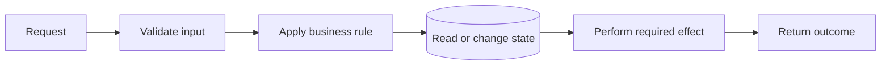

# 1. Start with One Program

## Goal

Understand the smallest useful backend before introducing services, networks, or
brokers.

## Unconditional truths

A backend exists because somebody asks software to do work.

For each request, the software must:

1. receive input;
2. decide whether the action is allowed;
3. read or change state;
4. perform any required side effect; and
5. report an outcome.



This is true whether the backend is one process or one hundred services.

## The five things to name

| Part | Question | Ticket example |
|---|---|---|
| Input | What is being requested? | Create a listing with a title and price |
| Rule | What must be true? | The caller is authenticated and the price is valid |
| State | What fact survives the request? | The new Ticket record |
| Effect | What else must happen? | Usually nothing for a simple create |
| Outcome | What may the caller observe? | Created, rejected, temporarily failed, or unknown |

A **business rejection** means the system reached a decision such as “price is
invalid.” A **temporary failure** means it could not currently decide or finish.
An **unknown outcome** means the caller does not know whether the system committed
before the response was lost.

Keep these three outcomes separate. They require different user messages and
retry behavior.

## Why one program is the default

One process has useful properties:

- function calls do not fail because a network link disappeared;
- one database transaction can protect several related writes;
- there is one deployment and one set of logs to inspect; and
- there are fewer partial-success states.

A microservice split must earn the extra failure modes it creates. “The code is
getting large” is usually a reason to improve modules first, not automatically a
reason to add a network boundary.

## Checkpoint

Before continuing, choose one StubHub action and write five lines:

```text
Input:
Rule:
State:
Effect:
Outcomes:
```

## Exit gate

Continue only when you can explain:

> A backend receives work, protects business rules and durable state, performs
> required effects, and returns an outcome. Microservices do not remove these
> responsibilities.