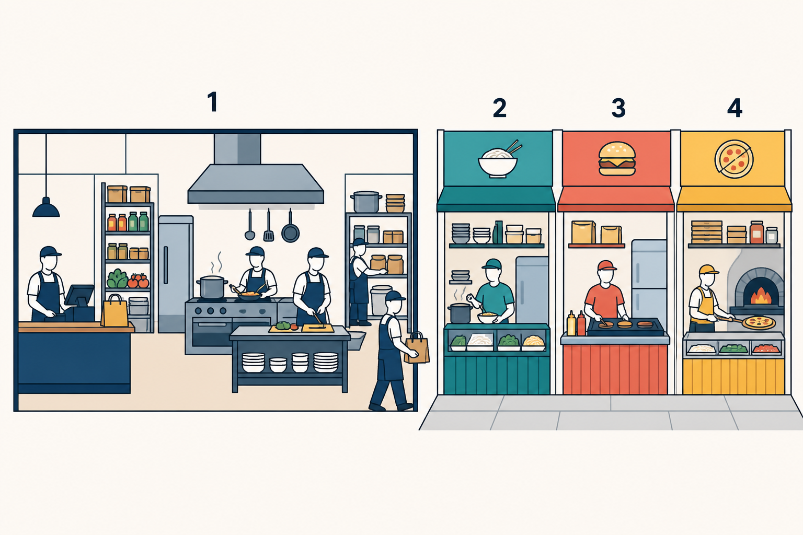

# 2. What a Microservice Is

## Goal

Derive the idea of a microservice from ownership rather than from size or
technology.

## Working definition

For this course, a microservice is:

> An independently deployable runtime boundary that owns a focused business
> capability, its authoritative decisions, and its private state.

In the image:

- **1** is one application that performs several capabilities together.
- **2–4** are separately operated capabilities. Each stall controls its own work
  and supplies.

Neither side is automatically better. The right side is useful only when the
independence is worth the communication and failure cost.

## What does not make something a microservice

A microservice is not merely:

- a small folder;
- one HTTP endpoint;
- one database table;
- one Docker container;
- a process named `service`; or
- code that publishes an event.

Those are implementation details. The boundary is meaningful when it owns
business decisions and can change or deploy without another service reading its
database or reaching into its internals.

## What the split adds

Moving from **1** to **2–4** adds real costs:

| New property | New design problem |
|---|---|
| Separate processes | Either process may be unavailable |
| Network calls | Responses may be delayed or lost |
| Private databases | One transaction cannot cover both owners |
| Independent deployment | Old and new contract versions coexist |
| Copied data | Copies may become stale |
| Messages | Delivery may be duplicated, delayed, or reordered |

The split is justified by a concrete need such as independent business
ownership, independent deployment, failure isolation, or materially different
scaling. Do not split only because microservices sound more advanced.

## StubHub examples

| Capability | Owner | Authoritative decisions |
|---|---|---|
| Identity | Identity | Credentials, sessions, current account access |
| Listings | Tickets | Ticket data, availability, reservation, sold state |
| Purchases | Orders | Order lifecycle, captured price, payment eligibility |

Orders may store `ticketId`. That reference does not let Orders declare a Ticket
available. Tickets still owns that decision.

## Boundary test

A proposed service should answer all four questions clearly:

1. What focused business capability does it own?
2. Which decisions can only it make?
3. Which durable records does it own?
4. How does every other component interact without reading its database?

If the answers are vague, the boundary is not ready.

## Checkpoint

Explain why `Payments` should remain an internal Orders capability in the current
project. Use ownership and independent lifecycle, not file size, as the reason.

## Exit gate

Continue only when you can explain:

> A microservice is an ownership and deployment boundary. Its value is
> independence. Its price is distributed failure.