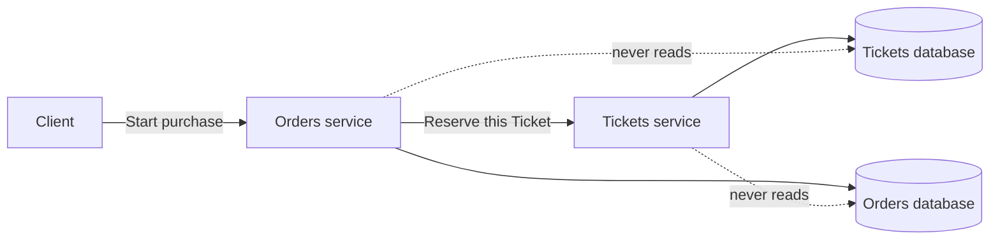

# 4. Boundaries and Data Ownership

## Goal

Place each decision and record behind one authoritative owner.

## The central rule

> Every business decision has one authoritative owner.

That owner protects the current state and decides whether a transition is
allowed. Other services may hold references, snapshots, or projections, but a
copy does not transfer authority.



Orders asks Tickets to reserve a Ticket. Orders does not update the Tickets
database, even if direct database access would be faster to code.

## Start from entities and decisions

For each stateful business entity, write:

```text
Entity:
States:
Allowed transitions:
Decision owner:
Owned records:
```

Do not merge different lifecycles. Ticket, Order, Payment Attempt, and Moderation
Case each need their own state machine even when one user journey touches all of
them.

## Classify every copied field

| Classification | Meaning | Example |
|---|---|---|
| Local owned data | This service creates and controls it | Order status in Orders |
| External identifier | A stable reference to another owner | `ticketId` stored by Orders |
| Historical snapshot | A value captured at a named past moment | Purchase-time Ticket title |
| Current authoritative value | The owner's answer is needed now | Current Ticket availability |
| Local projection | A delayed copy used for safe local reads | A ban-status projection |

Ask:

> If this value is missing or stale, which business decision becomes unsafe?

If no decision becomes unsafe, remove the communication or use a bounded copy.

## Three boundary checks

### Decision check

Which service can say “yes” or “no” to this transition?

### Data check

Which database is the authoritative record? No other service writes it.

### Failure check

If the other service is unavailable, can this owner preserve its invariants and
record what must recover later?

A boundary is incomplete if the answer to any check is “both services.”

## Checkpoint

Classify these fields without looking back:

1. `orderId` stored on a Moderation Case.
2. Ticket description captured when purchase begins.
3. Current Ticket availability before reservation.
4. Locally stored banned-user status updated from Identity facts.

## Exit gate

Continue only when you can name one owner for every state transition and explain
why a copied value does not become new authority.