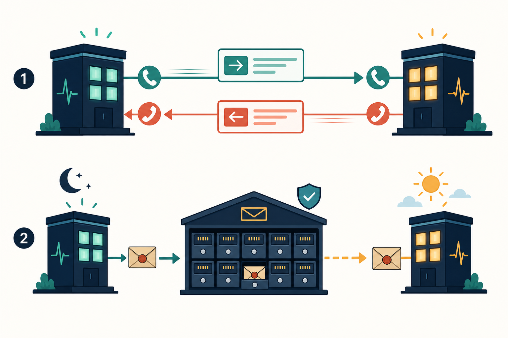

# 5. Communication Before Transport

## Goal

Choose whether an interaction must happen now or may converge later before
choosing HTTP, Redis, Kafka, or any other tool.



## Why communication exists

A service communicates only because a business decision or observable result
needs information or work owned elsewhere.

First name the interaction:

| Interaction | Meaning | Example |
|---|---|---|
| Query | Ask for information without changing owner state | Get an Order for its owner |
| Command | Ask an owner to make a decision or change state | Reserve this Ticket |
| Committed fact | Announce something the owner already committed | Order completed |
| Internal durable job | Ask this owner to resume its own work later | Expire this pending Order |

A fact is written in the past tense because the decision already happened. An
event bus must not be used to ask who won a race or whether work is currently
allowed.

## Lane 1: immediate request

Use a direct request when the caller cannot safely continue without the owner's
current answer.

The top lane in the image requires both services to participate now:

```text
caller sends request -> owner decides -> owner returns result
```

Examples:

- Tickets must decide whether a reservation wins.
- Orders must decide whether payment is eligible.
- A user needs a definite business rejection now.

A direct request still has three non-success outcomes:

- **business rejection:** the owner decided no;
- **temporary failure:** the owner could not currently finish; and
- **unknown outcome:** the caller lost the response and cannot tell whether the
  owner committed.

## Lane 2: durable asynchronous delivery

Use an asynchronous committed fact when:

- the owner already committed its decision;
- downstream work may safely happen later; and
- temporary consumer failure must not undo the original decision.

The bottom lane stores the message between the services. The producer and
consumer do not need to be available at the same moment.

Examples:

- Orders completed, so Tickets may converge the matching reservation to sold.
- Identity banned a user, so other services may update local enforcement
  projections.

## Decision table

| Question | If yes | If no |
|---|---|---|
| Must the owner answer before the caller continues? | Immediate request candidate | Continue |
| Did the owner already commit a fact? | Async fact candidate | Do not invent an event yet |
| Is this owner's own unfinished work? | Internal durable job | Continue |
| Is a past value needed for history? | Snapshot | Continue |
| Is repeated local reading safe with delay? | Projection | Return to the owner for current truth |

These are candidates. Failure behavior may still make a candidate unsafe.

## Checkpoint

Classify each interaction as query, command, committed fact, or internal job:

1. Orders asks Tickets to reserve a Ticket.
2. Orders records work to expire its own pending Order later.
3. Orders announces that an Order completed.
4. The client reads its Order history.

Then decide which ones require an immediate answer.

## Exit gate

Continue only when you can choose timing without naming a transport product.