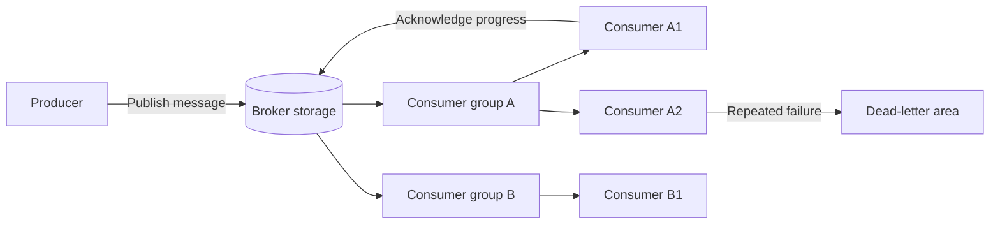
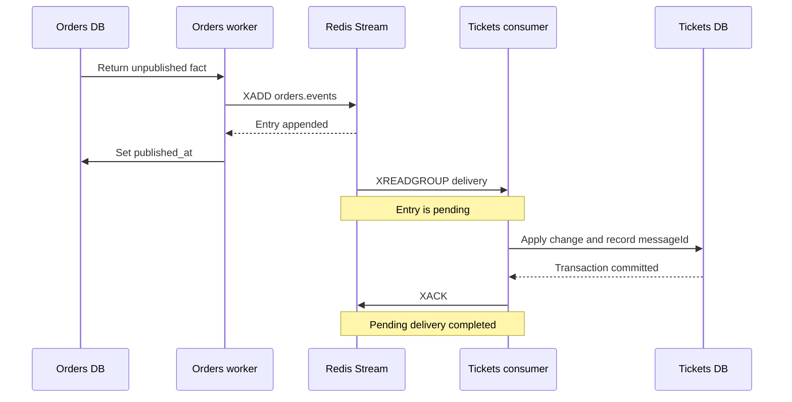

# 6. Message Brokers, Queues, and Event Buses

## Goal

Understand the parts of asynchronous messaging without tying the design to one
product.

## The core idea

A message broker is a durable intermediary that accepts messages from producers,
stores or routes them, and makes them available to consumers.



## The nouns

| Part | Responsibility |
|---|---|
| Producer | Creates a message after a named trigger |
| Message | Stable envelope carrying one command, fact, or job |
| Broker | Stores, routes, and tracks delivery progress |
| Queue, topic, or stream | Named location or log containing messages |
| Consumer | Processes messages |
| Consumer group | Shares one logical subscription across instances |
| Acknowledgement | Records that processing reached its safe completion point |
| Retry or pending area | Retains uncompleted delivery for another attempt |
| Dead-letter area | Quarantines work that cannot be processed normally |

## Queue, pub-sub, stream, and event bus

Product terminology overlaps, so reason from behavior:

| Shape | Normal intent |
|---|---|
| Work queue | One logical worker group performs each job |
| Pub-sub topic | Several independent subscribers receive a publication |
| Durable stream or log | Messages remain ordered in an append-only history for a retention period |
| Event bus | An architectural role where services publish committed facts for independent consumers |

Redis Streams, RabbitMQ, Kafka, and cloud brokers expose different combinations.
Choose after the required delivery, ordering, retention, and recovery behavior is
known.

## A minimum message envelope

```text
messageId       stable identity for duplicate detection
type            what happened or what work is requested
version         contract version
entityId        business entity this concerns
entityVersion   position in that entity's history when needed
occurredAt      when the owner committed the fact
payload         smallest data required by the consumer
```

Broker entry IDs are transport identities. A stable application `messageId` must
survive republication.

## The eight broker questions

Before choosing a product, answer:

1. What exact message contract is stored?
2. How long must it survive?
3. Who receives it?
4. When is it acknowledged?
5. How is unfinished work retried or reclaimed?
6. How are poison messages quarantined?
7. Which entity requires ordering?
8. What metric or query exposes stuck delivery?

## Delivery promises

- **At-most-once:** a message may be lost, but is not intentionally redelivered.
- **At-least-once:** the broker redelivers unfinished work, so duplicates are
  expected.
- **Exactly-once business effect:** requires application state and duplicate
  identity to cooperate. A broker label alone cannot provide this across your
  databases and side effects.

## How the current StubHub setup uses acknowledgement

The current path is:

```text
Orders database -> Orders worker -> Redis Stream -> Tickets consumer -> Tickets database -> XACK
```

There are two different success signals in that path:

| Signal | What it proves | What it does not prove |
|---|---|---|
| Orders sets `published_at` | Redis accepted the producer's `XADD` | Tickets processed the event |
| Tickets sends `XACK` | The Tickets consumer group reached its safe completion point | Redis deleted the stream entry or another consumer group processed it |

### 1. Orders publishes, but does not ACK

`publishOrderEventPublication` in `orders/src/workers.ts` loads a durable
publication from the Orders database and appends its envelope to
`orders.events` with `XADD`. Only after Redis accepts that append does Orders
call `markOrderEventPublished`.

The publication ledger in
`orders/src/messaging/order-event-publication-repo.ts` keeps rows with
`published_at IS NULL` available for retry. Therefore, `published_at` means:

> Orders successfully handed this durable publication to Redis.

It is producer-side progress, not a consumer acknowledgement.

If Orders crashes after `XADD` but before setting `published_at`, the next scan
publishes the row again. The new Redis entry has a new transport ID, but the
event keeps the same application `messageId`.

### 2. Redis tracks delivery as pending

`startOrderEventsConsumer` in
`tickets/src/orders/order-events-consumer.ts` reads `orders.events` through the
`tickets-order-convergence` consumer group.

`XREADGROUP` with the `>` cursor asks for entries never delivered to this group.
After Redis delivers an entry, that entry remains in the group's Pending Entries
List until the group acknowledges it.

### 3. Tickets commits before sending `XACK`

For a valid event, `processEntry` preserves this order:

```text
applyOrderEventOnce(event)
XACK orders.events tickets-order-convergence <redis-entry-id>
```

`applyOrderEventOnce` in `tickets/src/tickets/ticket-repo.ts` performs one
database transaction:

1. check `processed_order_events` for the stable application `messageId`;
2. apply the guarded Ticket transition when this is the first delivery;
3. insert the processed-event receipt; and
4. commit.

Tickets sends `XACK` only after that transaction succeeds. Here acknowledgement
means:

> The Tickets service durably handled this Redis entry, so this consumer group
> no longer needs to recover it.

If parsing, database work, or Redis communication fails before `XACK`, the entry
remains pending.

### 4. Pending entries are reclaimed

The Tickets consumer periodically calls `XAUTOCLAIM`. It takes entries that
have remained pending longer than `TICKETS_EVENTS_CLAIM_IDLE_MS` and gives them
to a live consumer instance for another processing attempt.

This recovery produces at-least-once delivery: the same business message may be
processed more than once, so duplicate handling is required.

### 5. The processed-event ledger makes redelivery safe

Consider a crash in this gap:

```text
Tickets database commit -> process crash -> XACK was never sent
```

Redis still sees the entry as pending and `XAUTOCLAIM` later delivers it again.
On redelivery, `applyOrderEventOnce` finds the existing
`processed_order_events` row by consumer name and `messageId`. It commits no
second Ticket change, returns the duplicate result, and the Redis caller can
then send `XACK`.

Redis provides redelivery. The Tickets database provides idempotency. Both are
needed for one business effect under at-least-once delivery.

### 6. Poison messages are dead-lettered before ACK

When an entry cannot be parsed or fails schema validation, `processEntry` first
copies it to `orders.events.dead-letter` with `XADD` and only then acknowledges
the original entry.

If dead-letter storage fails, the original entry is not acknowledged and
remains recoverable. A poison message reaches its safe completion point only
after its evidence has been preserved for inspection.

### 7. What `XACK` does and does not do

For this setup, `XACK` removes the entry from the Pending Entries List for
`tickets-order-convergence`.

It does not:

- delete the entry from the Redis Stream;
- notify Orders that Tickets processed it;
- acknowledge it for a different consumer group; or
- create exactly-once business effects without the processed-event ledger.

The ordering of the complete flow is:



## Checkpoint

Explain why adding another Tickets consumer instance to the same consumer group
should not make every instance apply every message.

## Exit gate

Continue only when you can draw producer, durable broker state, consumer group,
acknowledgement, retry, and dead-letter handling without naming Redis or Kafka.