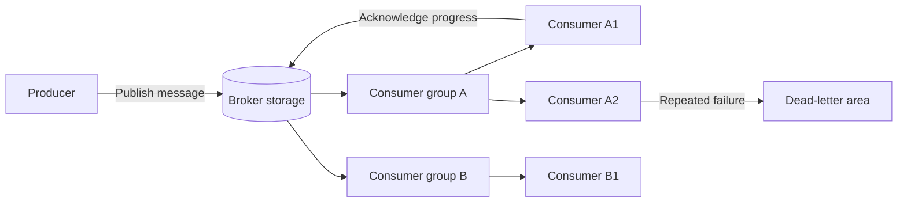

# 6. Message Brokers, Queues, and Event Buses

## Goal

Understand the parts of asynchronous messaging without tying the design to one
product.

## The core idea

A message broker is a durable intermediary that accepts messages from producers,
stores or routes them, and makes them available to consumers.



## The nouns

| Part | Responsibility |
|---|---|
| Producer | Creates a message after a named trigger |
| Message | Stable envelope carrying one command, fact, or job |
| Broker | Stores, routes, and tracks delivery progress |
| Queue, topic, or stream | Named location or log containing messages |
| Consumer | Processes messages |
| Consumer group | Shares one logical subscription across instances |
| Acknowledgement | Records that processing reached its safe completion point |
| Retry or pending area | Retains uncompleted delivery for another attempt |
| Dead-letter area | Quarantines work that cannot be processed normally |

## Queue, pub-sub, stream, and event bus

Product terminology overlaps, so reason from behavior:

| Shape | Normal intent |
|---|---|
| Work queue | One logical worker group performs each job |
| Pub-sub topic | Several independent subscribers receive a publication |
| Durable stream or log | Messages remain ordered in an append-only history for a retention period |
| Event bus | An architectural role where services publish committed facts for independent consumers |

Redis Streams, RabbitMQ, Kafka, and cloud brokers expose different combinations.
Choose after the required delivery, ordering, retention, and recovery behavior is
known.

## A minimum message envelope

```text
messageId       stable identity for duplicate detection
type            what happened or what work is requested
version         contract version
entityId        business entity this concerns
entityVersion   position in that entity's history when needed
occurredAt      when the owner committed the fact
payload         smallest data required by the consumer
```

Broker entry IDs are transport identities. A stable application `messageId` must
survive republication.

## The eight broker questions

Before choosing a product, answer:

1. What exact message contract is stored?
2. How long must it survive?
3. Who receives it?
4. When is it acknowledged?
5. How is unfinished work retried or reclaimed?
6. How are poison messages quarantined?
7. Which entity requires ordering?
8. What metric or query exposes stuck delivery?

## Delivery promises

- **At-most-once:** a message may be lost, but is not intentionally redelivered.
- **At-least-once:** the broker redelivers unfinished work, so duplicates are
  expected.
- **Exactly-once business effect:** requires application state and duplicate
  identity to cooperate. A broker label alone cannot provide this across your
  databases and side effects.

## Checkpoint

Explain why adding another Tickets consumer instance to the same consumer group
should not make every instance apply every message.

## Exit gate

Continue only when you can draw producer, durable broker state, consumer group,
acknowledgement, retry, and dead-letter handling without naming Redis or Kafka.