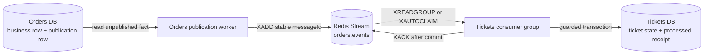

# 6. Message Brokers and Event Buses — NATS Ideas in Redis Streams

## Goal

Learn the ideas taught in course lectures **314–349** without mentally rewriting
NATS Streaming code into Redis code while you study.

The course uses NATS Streaming. This repository uses Redis Streams. The products
are different; the reliability questions are the same.

## Start here

Use this lesson beside these course blocks:

| Course lectures | Course topic | Use in this repository |
|---|---|---|
| 314–324 | Reusable listeners and typed events | Concrete Redis consumer plus a validated event schema |
| 325–329 | Publishers and common event definitions | Durable Orders publication rows plus service-owned contracts |
| 330–340 | NATS client setup and startup | Redis clients, consumer groups, lifecycle, and graceful shutdown |
| 341–349 | Publishing failures, mocks, and environment | Retryable publication, real integration boundaries, and `REDIS_URL` |

For the exact title-by-title classification, keep
[`async-systems/lecture-map-314-450.md`](async-systems/lecture-map-314-450.md)
open. `KEEP` means the concept transfers directly. `TRANSLATE` means use the
Redis/SQLite implementation named there. `SKIP` means the lesson depends on a
course-specific tool or abstraction that this codebase intentionally does not
need.

## Foundation: what problem forces a broker to exist?

Two services own different databases:

- Orders owns whether an Order is complete or expired.
- Tickets owns whether a Ticket is available, reserved, or sold.

When Orders commits `complete`, it cannot update the Tickets database directly.
Tickets must learn the committed fact and make its own guarded state change.

An HTTP call alone is not enough for this later convergence. Tickets may be down
after Orders has committed. Orders therefore needs durable work that survives
process and dependency failure. The broker transports that work when both sides
can participate.

## The course-to-repository translation

This is the complete mental replacement to use while watching NATS lectures:

| Course term | Redis Streams equivalent here | Important difference |
|---|---|---|
| NATS subject | Redis stream key, currently `orders.events` | A stream is a retained log, not merely a routing name |
| Publisher class | Orders publication worker | It relays durable database rows instead of publishing inside a route |
| Listener class | `startOrderEventsConsumer` and `processEntry` | Concrete functions are clearer because there is one real consumer flow |
| Queue group | Redis consumer group `tickets-order-convergence` | Instances share work for one logical Tickets subscription |
| NATS message | Redis stream entry | The Redis entry ID is transport identity, not business identity |
| `msg.ack()` | `XACK` | ACK removes the entry from this group’s pending list only |
| Redelivery | Pending-entry recovery with `XAUTOCLAIM` | The consumer must make duplicates safe |
| Common event interface | Runtime schema plus TypeScript type | Runtime validation is still required because Redis carries bytes |
| NATS environment variables | `REDIS_URL` and consumer timing variables | Product-specific connection and recovery settings differ |

Do not translate NATS syntax line by line. Translate each lecture into one of
four questions:

1. What durable fact exists?
2. How does the producer publish it?
3. How does the consumer safely apply it?
4. What survives a crash between steps?

## One message, three identities

The course’s listener abstractions can make “the message ID” sound singular.
This repository deliberately separates three identities:

| Identity | Example | Purpose |
|---|---|---|
| Business entity | `orderId` | Says which Order the fact describes |
| Application message | `messageId` | Identifies one logical publication across retries |
| Broker entry | Redis-generated stream ID | Identifies one physical append inside Redis |

If Orders appends a fact, crashes, and appends it again, the two Redis entries
have different stream IDs but retain the same `messageId`. Tickets deduplicates
by the stable application identity, not the transport identity.

## The actual path in this repository

This visual shows the one relationship to remember: durable state exists on
both sides of Redis, so Redis is transport rather than business authority.



Trace it in code:

1. `orders/src/messaging/order-event-publication-repo.ts` stores publication
   work in the Orders database.
2. `orders/src/workers.ts` reads due publication rows, calls `XADD`, and only
   then marks publication progress.
3. `tickets/src/orders/order-events-consumer.ts` reads new entries with
   `XREADGROUP` and reclaims abandoned pending entries with `XAUTOCLAIM`.
4. `tickets/src/tickets/schemas.ts` validates the decoded event at runtime.
5. `tickets/src/tickets/ticket-repo.ts` applies the Ticket transition and records
   the processed `messageId` in one transaction.
6. The consumer calls `XACK` only after that transaction commits.

## Replacing the reusable Listener class

Lectures 314–323 build an abstract Listener to centralize subject, queue group,
ACK behavior, and type validation. Keep the responsibilities; skip the class.

The current concrete consumer makes the safety order visible:

```text
read Redis entry
  -> decode bytes
  -> validate envelope
  -> apply event once in Tickets transaction
  -> ACK Redis entry
```

A base class would save little because this repository has one accepted business
consumer path. Add an abstraction only after a second concrete consumer reveals
real repeated behavior and the same failure semantics.

### Runtime validation still matters

A TypeScript interface disappears at runtime. Redis can contain malformed JSON,
an old schema, or a message written by another language. Therefore the Tickets
consumer must validate the decoded value before touching business state.

For the current contract, inspect `orderEventSchema` in
`tickets/src/tickets/schemas.ts`. It accepts the supported terminal Order facts
and rejects unknown shapes.

A poison message follows a different safe path:

```text
invalid entry -> append evidence to orders.events.dead-letter -> XACK original
```

If dead-letter storage fails, the original is not acknowledged. Evidence must be
preserved before Redis is told the entry is complete.

## Replacing the custom Publisher class

Lectures 325–327 publish through a reusable NATS Publisher. The key lesson is not
the class. It is that publication is asynchronous and must be awaited.

This repository goes further: an HTTP request does not make a database commit
and then hope an immediate broker call succeeds. The Orders transaction records
the business transition and publication work together. A worker later publishes
that durable row.

The required ordering is:

```text
Orders transaction commits publication row
worker XADD succeeds
worker marks publication row published
```

If the worker crashes after `XADD` but before marking the row, it republishes the
same logical `messageId`. That is expected at-least-once behavior.

## Replacing the NATS singleton

Lectures 333–340 introduce a NATS client singleton and lifecycle hooks. Keep the
lifecycle lesson; skip the global singleton pattern.

The current services create scoped Redis clients for their worker or consumer
lifecycle. Shutdown must:

1. stop accepting another loop iteration;
2. let in-flight database or Redis work finish;
3. close Redis connections; and
4. close service resources.

The point of graceful shutdown is not a clean terminal. It reduces abandoned
in-flight work. Durable pending state still provides recovery if shutdown cannot
finish cleanly.

## Failure meanings

| Failure | Durable evidence | What happens next |
|---|---|---|
| Redis is down before publication | Unpublished Orders publication row | Orders worker retries later |
| Orders crashes after `XADD` | Publication may still look unpublished | Same `messageId` may be appended again |
| Tickets crashes before DB commit | Redis entry remains pending | A live consumer reclaims it |
| Tickets crashes after DB commit, before `XACK` | Processed receipt exists and entry remains pending | Redelivery becomes a duplicate, then ACK |
| Entry is malformed | Original remains pending until dead-letter copy succeeds | Consumer preserves evidence before ACK |

## Course-aligned practice

After lectures 314–340, answer these without using NATS terms:

1. What replaces the course Listener abstract class?
2. What value replaces the course subject?
3. What value replaces the queue group?
4. Why is the Redis entry ID insufficient for duplicate detection?
5. Why must runtime validation remain even when TypeScript compiles?
6. Which database row exists when Redis is unavailable?

Then trace one real event:

```text
order.completed
  -> Orders publication row
  -> orders.events
  -> tickets-order-convergence
  -> applyOrderEventOnce
  -> Ticket reserved to sold
```

## Checkpoint

Explain this sentence in your own words:

> Redis owns delivery progress; Orders owns Order truth; Tickets owns Ticket
> truth; the stable `messageId` connects retries without transferring authority.

## Exit gate

Continue to
[Lesson 7: How Durable Delivery Works](07-how-durable-delivery-works.md) only
when you can watch a NATS publisher/listener lecture and immediately identify:
producer durability, transport identity, consumer durability, ACK timing, and
recovery ownership in the Redis implementation.