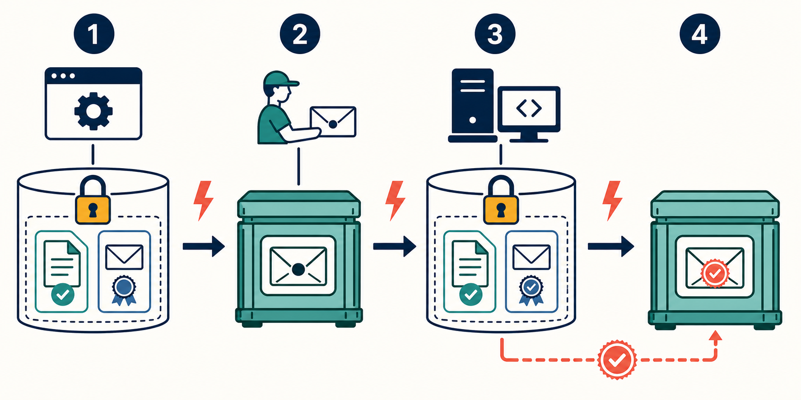

# 7. How Durable Delivery Works

## Goal

Understand why reliable asynchronous behavior requires durable records on both
sides of the broker.



## The problem

A database commit and a broker append are two separate operations. A process may
die between them. The consumer also has a database commit and a broker
acknowledgement, creating another failure window.

Reliable design does not pretend these windows disappear. It leaves durable
evidence that makes recovery safe.

## The four-stage relay

### 1. Commit business state and publication work together

The producer commits both:

- its authoritative business change; and
- an event publication ledger row containing a stable `messageId`.

They must be in one local database transaction. Either both exist or neither
exists. This is the **outbox pattern** using a descriptive ledger name.

### 2. Publish from the durable ledger

A worker reads unpublished ledger rows, appends the message to the broker, then
marks the row published.

If the process dies after append but before marking progress, it republishes the
same logical message. Therefore duplicates are normal.

### 3. Commit the consumer effect and receipt together

The consumer commits both:

- its guarded business state change; and
- a processed-event ledger row keyed by consumer and stable `messageId`.

They must share one local transaction. This is the **inbox pattern** using a
descriptive ledger name.

A duplicate finds the receipt and does not repeat the business mutation.

### 4. Acknowledge only after commit

The consumer acknowledges broker progress only after stage 3 commits.

If it dies after commit but before acknowledgement, the broker redelivers. The
processed-event ledger turns that redelivery into a safe duplicate.

## Crash-window table

| Crash point | Durable evidence left | Recovery |
|---|---|---|
| Before producer commit | No business change and no message work | Caller may make the logical attempt again |
| After producer commit, before publish | Unpublished ledger row | Producer worker republishes |
| After publish, before publish progress | Same ledger row still unpublished | Republish same `messageId` |
| Before consumer commit | Broker still owns unacknowledged delivery | Redeliver or reclaim |
| After consumer commit, before ACK | Processed receipt and business effect exist | Redeliver, detect duplicate, then ACK |

## Idempotency comes before retry

Before permitting retries, define:

```text
Stable identity:
Identity scope:
Request or message fingerprint:
Stored original result:
Behavior on exact replay:
Behavior when the identity is reused for different content:
```

For a message consumer, the stable application `messageId` identifies one
logical fact even if the broker creates several transport entries.

## Ordering still matters

Duplicate detection does not make old messages safe. Also define:

- the entity whose messages require order;
- any entity version or sequence used for diagnosis or enforcement; and
- the current-state guard that rejects stale work.

A stale Ticket release must check `lockedByOrderId`. It cannot unlock a newer
Order's reservation merely because the old message is unique.

## Recovery owner

After partial cross-service success, one service needs a durable record that says
work is unfinished. That service retries until it reaches a definitive result.
The broker transports work but does not own business recovery.

## Runtime proof

Name evidence before shipping:

- unpublished publication rows;
- oldest unpublished age;
- pending broker entries;
- repeated delivery count;
- processed-event outcomes;
- dead-letter count; and
- reconciliation queries for state that failed to converge.

## Checkpoint

Cover the image and redraw stages 1–4. At each lightning bolt, name the durable
record that survives.

## Exit gate

Continue only when you can explain why duplicates are expected and why commit
before acknowledgement makes them harmless rather than impossible.