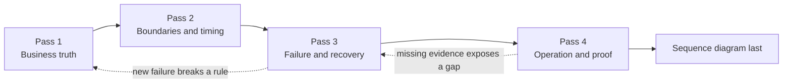

# 8. The Durable Service-Design Loop

## Goal

Turn service design into a fixed sequence so routes, events, and diagrams do not
arrive before the business rules.

## Work in four passes

Do one pass, review it, and stop. Do not complete all four in one rush.



## Pass 1: business truth

Do not name routes, events, queues, or tables yet.

| Step | Artifact | Questions |
|---|---|---|
| Journey | Chronological success, rejection, abandonment, and visible failure | What is the user trying to accomplish? |
| Invariants | Rules that must survive retries, races, delay, and restart | What must never become false? |
| Entities | One state machine per stateful business entity | What changes state independently? |
| Decision owners | One service for each authoritative yes or no | Who alone may decide? |

**Gate:** every state transition has one entity, one invariant, and one owner.

## Pass 2: boundaries and timing

Apply **FACTS** to every cross-boundary field or decision:

| Letter | Question |
|---|---|
| Function | What exact decision or visible field forces communication? |
| Authority | Which service owns the truth? |
| Currency | Is the value local, a reference, a snapshot, current truth, or a projection? |
| Timing | Must the owner answer now, or may another service converge later? |
| Safety | What happens under failure, retry, duplicate delivery, and stale data? |

Then write one communication card per interaction. Name the initiator, owner,
required result, timing, and smallest safe data contract.

**Gate:** every interaction exists for a named function. Transport is still
unnamed.

## Pass 3: failure and recovery

Generate this matrix without waiting for prompts:

```text
Business rejection
Temporary failure
Unknown outcome after possible commit
Caller retry
Duplicate delivery
Late or reordered delivery
Dependency outage
Process restart
Broker restart
Partial cross-service success
Unresolved in-flight work
```

For each state-changing interaction, define:

- stable logical identity;
- request or message fingerprint;
- exact replay result;
- conflicting identity reuse behavior;
- durable unfinished-work record;
- one recovery owner;
- duplicate guard;
- current-state or version guard for stale work; and
- definitive condition that ends recovery.

**Gate:** you can stop the process at every commit boundary and point to what
survives and who resumes.

## Pass 4: operation and proof

Only now choose transport and contract details.

Also define:

| Concern | Required decision |
|---|---|
| Security staleness | Maximum time old authorization may remain accepted |
| Compatibility | How old and new producers, consumers, tokens, and schemas coexist |
| Rollback | Which additive changes make reversal safe |
| Runtime evidence | Logs, metrics, rows, broker state, and reconciliation queries |
| Stuck work | Threshold and alert that reveal permanent non-completion |

Draw the sequence diagram last. It may render accepted decisions but may not
invent a new owner, contract, retry, or recovery rule.

## Connection to the growth gaps

This loop directly practices every item in
[`service-design-growth-gaps.md`](../goals/service-design-growth-gaps.md):
invariants first, separate state machines, FACTS classification, failure classes,
idempotency, commit windows, duplicates, ordering, recovery ownership, in-flight
protection, security delay, rollout, and operational evidence.

The longer reference remains
[`service_communication_design_guide.md`](../system_design/service_communication_design_guide.md).

## Checkpoint

Take one proposed feature and produce only Pass 1. Stop before Pass 2. On the next
study session, review Pass 1 from memory before continuing.

## Exit gate

Continue only when the order feels automatic:

> Business truth → boundaries and timing → failure and recovery → operation and
> proof → diagram.