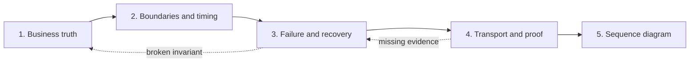

# 8. The Durable Design Loop — Rebuilding the Course Flow Correctly

## Goal

Use course lectures **350–450** as implementation evidence while learning a
repeatable order for designing Orders, Tickets, events, locks, and expiration.

The course often introduces the next route, model, listener, or service because
it is building a project chronologically. In your own design work, do not copy
that chronology. Derive transport from business truth.

## Course bridge

| Course block | Design question this lesson extracts |
|---|---|
| 350–377 Orders routes and models | Which entity changes, who owns it, and which rules constrain it? |
| 378–393 Orders events and Tickets listeners | Which committed facts need later convergence? |
| 394–415 concurrency and versions | What prevents races, duplicates, and stale delivery? |
| 418–431 reservation and edit locking | Which synchronous decision must remain authoritative now? |
| 432–450 expiration service and Bull | Who owns the deadline and what durable work survives restarts? |

The repository translation is deliberate:

- Mongoose models become SQLite tables, constraints, and transactions.
- NATS publishers/listeners become durable Redis publication and consumption.
- The separate Bull Expiration service becomes an Orders-internal durable due
  worker.
- Generic base classes become concrete functions until repetition justifies an
  abstraction.
- `order.cancelled` from the course is not silently renamed. The accepted local
  fact is `order.expired`, with narrower business meaning.

## The loop

This is the one visual for the lesson. The arrows force the design order; the
back edges show that recovery evidence may expose a broken earlier assumption.



## Pass 1: business truth

Do not name HTTP routes, Redis streams, events, queues, or tables yet.

### 1. Write the journey

Describe chronological behavior from the actor’s view:

```text
Actor:
Goal:
Successful path:
Business rejection:
Abandonment:
Visible failure:
```

For Ticket purchase, the actor wants to begin a purchase. Success creates one
pending Order and reserves one Ticket. Rejection includes an unavailable Ticket.
A dependency failure may leave the outcome unknown to the client.

### 2. Write invariants

An invariant must survive retries, races, delays, and restarts.

Current examples:

- one Ticket cannot be reserved by two active Orders;
- a reserved Ticket cannot be edited;
- the Order captures the price when purchase begins;
- complete and expired are mutually exclusive terminal Order states;
- an old expiration cannot release a newer reservation;
- an on-time payment already in `payment_processing` resolves before release.

The course’s “find reserved tickets” code is not the invariant. The invariant is
the rule that forces an atomic reservation guard to exist.

### 3. Separate state machines

```text
Ticket: available -> reserved -> sold
                    reserved -> available on guarded release

Order: pending -> payment_processing -> complete
       pending -> expired
       payment_processing -> pending after failure with time remaining
       payment_processing -> expired after failure past deadline
```

Do not merge these into one distributed state machine. Orders can decide an
Order transition; Tickets can decide a Ticket transition. Communication causes
convergence without transferring ownership.

### 4. Assign one decision owner

| Decision | Owner | Why |
|---|---|---|
| Is this Ticket currently reservable? | Tickets | Tickets owns authoritative availability and the reservation lock |
| May this Order accept payment? | Orders | Orders owns lifecycle and expiration deadline |
| Is the Ticket sold? | Tickets | Tickets alone changes Ticket state |
| Is the Order complete or expired? | Orders | Orders alone changes Order state |

**Pass 1 gate:** every transition names one entity, one invariant, and one owner.

## Pass 2: boundaries and timing

Now decide why services communicate. Use **FACTS** for every value and decision.

| Letter | Question |
|---|---|
| Function | What exact business decision or visible field requires communication? |
| Authority | Which service owns the truth? |
| Currency | Is the value local, a reference, immutable snapshot, current truth, or projection? |
| Timing | Must the owner answer now, or may another service converge later? |
| Safety | What happens under failure, retry, duplicate, and stale data? |

### Derive synchronous reservation

Function: starting an Order requires winning the Ticket reservation.

Authority: Tickets owns availability.

Timing: Orders cannot honestly return success before knowing whether the guarded
reservation won.

Decision: use an immediate internal Tickets request for reservation. Do not use
an event to ask “may I reserve?” because the caller needs the authoritative
answer now.

### Derive asynchronous completion convergence

Function: after Orders commits complete, Tickets must become sold.

Authority: Orders owns the committed Order fact; Tickets still owns the Ticket
transition.

Timing: Tickets may converge later. A Tickets outage after payment success must
not reverse a completed Order.

Decision: Orders records a durable `order.completed` fact; Tickets consumes it
asynchronously and performs its own guarded transition.

### Classify the values

| Value | Currency | Owner |
|---|---|---|
| `ticketId` on Order | External reference | Tickets owns referenced Ticket |
| `priceCents` on Order | Immutable purchase snapshot | Orders owns captured amount |
| Ticket availability | Current authoritative truth | Tickets |
| Order status | Current authoritative truth | Orders |
| Completed event payload | Committed fact snapshot | Orders |

**Pass 2 gate:** every interaction exists for a named business function. You
still have not selected NATS, Redis, HTTP library, or queue package.

## Pass 3: failure and recovery

For every state-changing interaction, write this matrix before implementation:

```text
Business rejection
Temporary failure
Unknown outcome after possible commit
Caller retry
Duplicate request or message
Late or reordered message
Dependency outage
Process restart
Broker restart
Partial cross-service success
Unresolved in-flight work
```

Then define:

- stable logical identity;
- immutable fingerprint or request content;
- exact replay result;
- conflicting reuse behavior;
- durable unfinished-work record;
- one recovery owner;
- atomic duplicate guard;
- current-state or version guard;
- definitive condition that ends recovery.

### Example: purchase begins but response is lost

Orders uses an idempotency identity for the logical purchase attempt. A retry
with the same identity must return the original outcome rather than create a
second Order. Reusing it with different content must be rejected.

### Example: publication succeeds but progress write is lost

The Orders publication row remains unfinished. Orders owns retry. Republishing
the same `messageId` is safe because Tickets records processed identities.

### Example: old expiration arrives late

Unique does not mean current. Tickets releases only if `lockedByOrderId` still
matches the expiring Order. This protects a newer reservation.

### Example: payment is in flight at the deadline

Expiration cannot blindly release the Ticket while an on-time accepted payment
has an unresolved result. Orders owns both payment eligibility and expiration,
so one service can serialize the decision and preserve the in-flight rule.

**Pass 3 gate:** you can stop the process at every commit boundary and name what
survives, who resumes, and what ends recovery.

## Pass 4: transport and proof

Only now choose the mechanism.

| Need | Current mechanism |
|---|---|
| Immediate authoritative reservation | Internal HTTP request to Tickets |
| Durable terminal Order fact | Orders publication ledger plus Redis Stream |
| Shared Tickets subscription | Redis consumer group |
| Abandoned delivery recovery | Pending entries plus `XAUTOCLAIM` |
| Duplicate business-effect prevention | Tickets processed-event ledger |
| Durable expiration scheduling | Orders deadline rows and due scans |
| Poison-message evidence | Redis dead-letter stream |

### Why no separate Expiration service?

Course lectures 432–450 add a Bull-backed Expiration service. The current system
does not need a new service boundary. Orders already owns:

- the Order deadline;
- whether payment is eligible or in flight;
- whether the Order may expire; and
- the durable state required to retry expiration.

A separate service would require more contracts and failure modes without owning
an independent business decision. Keep expiration as an Orders capability until
measured operational needs justify a boundary.

### Define runtime proof

Do not stop at “add logs.” Name observable evidence:

- number and oldest age of unpublished Orders publication rows;
- Redis pending-entry count and idle age;
- publication retry count and next retry time;
- processed-event result: applied, duplicate, or ignored stale;
- dead-letter count and payload evidence;
- overdue non-terminal Orders;
- Orders complete while matching Ticket remains reserved;
- Orders expired while matching Ticket remains locked by that Order.

**Pass 4 gate:** every permanent recovery path has a row, broker state, metric,
or query that shows progress and reveals stuck work.

## Draw last

A sequence diagram is a rendered result, not a design generator. Reject a diagram
that introduces any owner, event, field, retry, or recovery rule not accepted in
the four passes.

This prevents a common course-copying mistake: drawing NATS or Bull because the
video uses them before deciding whether the local system needs their behavior.

## Study procedure for lectures 350–450

For each course lecture:

1. Write the business problem in one sentence.
2. Mark it `KEEP`, `TRANSLATE`, `SKIP`, or `GAP` using the lecture map.
3. Name the local owner and invariant.
4. Find the current Redis/SQLite symbol when one exists.
5. Write the crash or race the implementation prevents.
6. If classified `GAP`, do not pretend it exists. Record what proof is missing.

Use the focused modules in [`async-systems/index.md`](async-systems/index.md)
when the course reaches a specific block.

## Checkpoint

Take “cancel an Order” from lectures 376–377. Do not implement it. Run Pass 1:

- Who may request cancellation?
- Which Order states permit it?
- Is cancellation the same business fact as expiration?
- What happens to an in-flight payment?
- Which matching Ticket lock may be released?

If those answers are unresolved, routes and events would be premature.

## Exit gate

Continue to [Lesson 9: Guided Practice](09-guided-practice.md) only when this
order is automatic:

> business truth → boundaries and timing → failure and recovery → transport and
> proof → diagram.