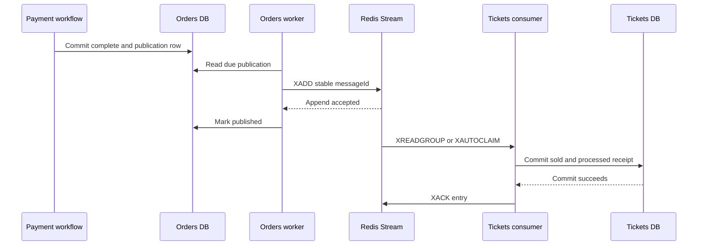

# 9. Guided Practice — Rebuild the Course Order Flow with Redis

## Goal

Apply course lectures **350–450** to one complete local flow without translating
NATS, Mongoose, or Bull yourself.

The scenario is intentionally narrow:

> Payment succeeds. Orders commits the Order as complete. Tickets eventually
> changes the matching reserved Ticket to sold.

Complete one phase at a time. Write your answer before opening the reference
answer. The exercise is learning material, not a request to add product code.

## Course landmarks

| When the course reaches | Do this practice section |
|---|---|
| 350–377 Orders service and model | Phase 1 and Phase 2 |
| 378–393 events and listeners | Phase 3 |
| 394–415 concurrency and versions | Phase 4 |
| 418–431 reservation and Ticket guards | Phase 5 |
| 432–450 expiration | Transfer exercise |

Use the exact title map in
[`async-systems/lecture-map-314-450.md`](async-systems/lecture-map-314-450.md)
when a lecture’s local treatment is unclear.

## Phase 1: derive the business truth

Fill this before looking at code:

```text
Actor and goal:
Successful visible outcome:
Business rejection:
Unknown technical outcome:

Invariant 1:
Invariant 2:
Invariant 3:
Invariant 4:

Order transition:
Order owner:
Ticket transition:
Ticket owner:
```

<details>
<summary>Reference answer</summary>

- The buyer wants a paid purchase.
- Payment success completes the Order.
- A complete Order never becomes expired.
- Only the Ticket reserved by this Order may become sold.
- A sold Ticket never becomes available again.
- Orders owns `payment_processing -> complete`.
- Tickets owns `reserved -> sold`, guarded by matching Order identity.
- A response failure after commit creates an unknown client outcome, not an
  automatic business failure.

</details>

### Diagnostic question

Why may Orders not update `tickets.status = 'sold'` directly?

<details>
<summary>Answer</summary>

Tickets owns Ticket truth and its database. Direct cross-database writes would
split the Ticket invariant across services and make independent recovery
impossible.

</details>

## Phase 2: classify the boundary with FACTS

Fill every field:

```text
Function:
Authority:
Currency:
Timing:
Safety:

Fact producer:
Consumer decision:
Minimum payload:
Excluded payload:
Must Tickets finish before payment returns success? Why?
```

<details>
<summary>Reference answer</summary>

- Function: make the Ticket converge to sold after the Order completes.
- Authority: Orders owns the completed Order fact; Tickets owns the Ticket
  transition.
- Currency: the event is a committed snapshot; Ticket state is current truth in
  Tickets.
- Timing: later convergence is acceptable after Orders commits complete.
- Safety: publication and consumption must survive crashes, retries, duplicates,
  and stale delivery.
- Producer: Orders.
- Consumer decision: Tickets checks current status and matching reservation.
- Minimum payload: stable `messageId`, event type/version, `orderId`, `ticketId`,
  aggregate identity/version, and occurrence time required by the contract.
- Exclude current Ticket data and mutable user profile fields. Tickets already
  owns Ticket truth; unrelated data expands coupling.
- Tickets need not finish before the completed Order response. A Tickets outage
  must delay convergence, not invalidate successful payment.

</details>

### Course translation

In lectures 378–383, do not copy a generic `OrderCreatedPublisher` into this
flow. The locally accepted external facts are terminal Order outcomes. The
important event here is `order.completed`, published from durable Orders state.

## Phase 3: design producer durability

Fill the crash table:

| Point | What could be lost? | Durable evidence | Recovery owner | Completion condition |
|---|---|---|---|---|
| Before the Orders transaction |  |  |  |  |
| After Order complete, before Redis |  |  |  |  |
| After Redis append, before publication progress |  |  |  |  |
| Redis unavailable for ten minutes |  |  |  |  |

<details>
<summary>Reference answer</summary>

| Point | What could be lost? | Durable evidence | Recovery owner | Completion condition |
|---|---|---|---|---|
| Before the Orders transaction | The attempted transition has not committed | No new completion fact | The payment workflow resolves or retries using its own durable identity | A definitive committed payment/Order result |
| After Order complete, before Redis | Ticket convergence has not been transported | Unpublished Orders publication row committed with Order state | Orders worker | Redis accepts the stored envelope and progress is persisted |
| After Redis append, before publication progress | Progress write is missing; duplicate append is possible | Same publication row and stable `messageId` | Orders worker | Publication progress is persisted |
| Redis unavailable for ten minutes | Delivery is delayed, not forgotten | Unpublished row plus retry metadata | Orders worker | Successful `XADD` followed by durable progress |

</details>

### Derive the ordering

Number these operations:

```text
__ mark publication row published
__ append envelope to Redis
__ commit Order complete
__ commit publication row
```

<details>
<summary>Answer</summary>

1. Commit Order complete and publication row together.
2. Append the stored envelope to Redis.
3. Mark the publication row published.

The first two listed commits are one local transaction. Appending before marking
prefers a recoverable duplicate over permanent loss.

</details>

## Phase 4: design consumer durability

Fill the table:

| Point | Redis state | Tickets database state | Safe next action |
|---|---|---|---|
| Entry delivered, parsing fails |  |  |  |
| Valid entry, crash before DB commit |  |  |  |
| DB commits, crash before `XACK` |  |  |  |
| Same `messageId` delivered again |  |  |  |
| Unique old event targets a newer lock |  |  |  |

<details>
<summary>Reference answer</summary>

| Point | Redis state | Tickets database state | Safe next action |
|---|---|---|---|
| Entry delivered, parsing fails | Entry remains pending | No Ticket mutation | Preserve it in dead-letter storage, then ACK original |
| Valid entry, crash before DB commit | Entry remains pending | Transaction rolled back | Retry or reclaim and process again |
| DB commits, crash before `XACK` | Entry remains pending | Ticket effect and processed receipt exist | Reclaim, detect duplicate, then ACK |
| Same `messageId` delivered again | New or pending transport entry | Processed receipt already exists | Do not repeat mutation; ACK after duplicate result commits |
| Unique old event targets a newer lock | Entry is deliverable | Ticket lock belongs to another Order | Record handled no-op or stale outcome; never release/change newer lock |

</details>

### Version question

What does `aggregateVersion` prove by itself?

<details>
<summary>Answer</summary>

It records the producer’s position for the Order aggregate. By itself it does not
make the Tickets consumer reject every old or gapped event. That requires an
implemented per-aggregate high-water rule. Current safety relies on terminal
event contracts, processed `messageId` receipts, current Ticket state, and
matching `lockedByOrderId` guards.

</details>

## Phase 5: trace the real implementation

Read in this order and answer only the prompt beside each file:

1. `orders/src/payments/payment-workflow.ts`
   - Where does successful payment become authoritative Order state?
2. `orders/src/messaging/order-event-publication-repo.ts`
   - Which row proves publication is unfinished?
3. `orders/src/workers.ts`
   - Why does marking publication happen after `XADD`?
4. `tickets/src/orders/order-events-consumer.ts`
   - Where can an entry become pending, reclaimed, dead-lettered, and ACKed?
5. `tickets/src/tickets/schemas.ts`
   - Which event types and envelope fields can cross the runtime boundary?
6. `tickets/src/tickets/ticket-repo.ts`
   - Which transaction combines duplicate detection with the guarded Ticket
     transition?

Track these values through all six locations:

```text
messageId = one logical fact across publication retries
orderId = business identity and reservation guard
ticketId = target Ticket reference
aggregateVersion = producer-owned Order history position
Redis entry ID = one physical broker append
```


## Complete sequence

Compare only after you finish Phases 1–5.



## Transfer exercise: expiration without Bull

Course lectures 432–450 introduce a separate Expiration service and Bull queue.
Solve the same business need with the accepted local boundary.

Fill this:

```text
Deadline owner:
Durable deadline location:
Worker selection rule:
In-flight payment guard:
Terminal Order fact:
Publication recovery record:
Tickets release guard:
Duplicate guard:
Stale-event guard:
Operational evidence:
```

<details>
<summary>Reference answer</summary>

- Orders owns the deadline and expiration decision.
- The deadline and Order state are durable in Orders SQLite.
- The Orders worker scans due eligible work rather than consuming a Bull job.
- `payment_processing` work that began on time must resolve before release.
- The terminal fact is `order.expired`, not a generic cancellation alias.
- The Orders publication ledger retries Redis publication.
- Tickets releases only when `lockedByOrderId` matches the expired Order.
- The processed-event ledger prevents a repeated business effect.
- Current Ticket state and matching lock reject a late stale release.
- Proof includes overdue non-terminal Orders, due publication age, Redis pending
  age, processed outcomes, and mismatched Order/Ticket reconciliation.

</details>

## Manual failure drill

Do not run this until the local services are available. Prediction comes first.
For each drill, write expected durable evidence before interrupting anything:

1. stop Redis while an Order publication is due;
2. restart Redis and observe the same publication row complete;
3. interrupt Tickets after its database commit but before ACK;
4. reclaim the pending entry and observe duplicate handling;
5. append malformed event JSON and confirm dead-letter-before-ACK behavior;
6. create a newer reservation before replaying an old expiration.

A log line alone is not proof. Pair it with a database row, Redis pending state,
or final Order/Ticket state.

## Recall schedule

- **Next day:** redraw the sequence and name both crash windows.
- **Day 3:** complete the expiration transfer without opening the answer.
- **One week:** choose a different cross-service fact and reproduce all five
  phases plus one failure drill.

## Exit gate

The practice is complete when you can derive the Redis implementation from the
business rules, explain how each relevant course block maps to it, and predict
recovery without saying only “the broker retries.”