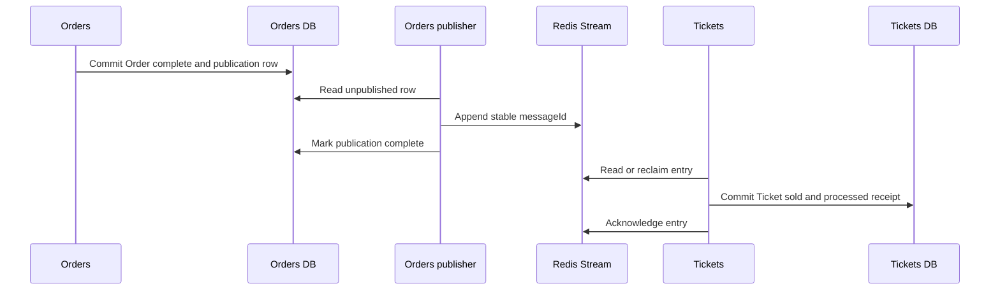

# 9. Guided Practice: Order Completion Converges a Ticket

## Goal

Apply the full loop to one familiar asynchronous flow without designing the
whole marketplace at once.

## Scenario

Payment succeeds. Orders commits the Order as complete. Tickets must eventually
make the matching reserved Ticket sold.

Complete one pass per study session. Write your answers before opening the
reference answer.

## Pass 1: business truth

```text
User-visible journey:

Invariant 1:
Invariant 2:
Invariant 3:

Stateful entities:

Order transition and owner:
Ticket transition and owner:
```

<details>
<summary>Reference answer</summary>

- Payment success makes the Order complete.
- A complete Order never becomes expired.
- Only the Ticket reserved by this Order may become sold.
- Orders owns `payment_processing -> complete`.
- Tickets owns `reserved -> sold` guarded by the matching Order identity.

</details>

## Pass 2: boundaries and timing

```text
Business function forcing communication:
Authoritative producer fact:
Consumer decision:
Required fields:
Currency of each field:
Must Tickets update before Orders returns success? Why?
Data explicitly excluded:
```

<details>
<summary>Reference answer</summary>

Orders needs Tickets to converge after the Order has already committed complete.
The committed fact is `OrderCompleted`. Tickets still owns the guarded Ticket
transition. The minimum fields include stable message identity, Order identity,
Ticket identity, fact version, and any ordering metadata required by the accepted
contract. Tickets may converge later because its temporary outage must not undo
the completed Order.

</details>

## Pass 3: failure and recovery

Fill every row.

| Failure | Durable evidence | Recovery owner | Safe final behavior |
|---|---|---|---|
| Orders dies after Order commit, before publish |  |  |  |
| Orders dies after broker append, before publish progress |  |  |  |
| Tickets dies before consumer commit |  |  |  |
| Tickets dies after commit, before ACK |  |  |  |
| Same fact arrives five times |  |  |  |
| Old fact targets a newer reservation |  |  |  |
| Redis is unavailable |  |  |  |

<details>
<summary>Reference answer</summary>

- The Orders event publication ledger survives producer crashes and Redis outage.
- Orders owns publication retry until the stable fact is published.
- Redis retains unacknowledged or pending delivery for Tickets.
- Tickets commits the guarded Ticket change and processed-event ledger receipt
  together.
- A duplicate stable `messageId` returns the stored duplicate outcome without a
  second mutation.
- The current `lockedByOrderId` guard rejects stale facts targeting another
  reservation.
- Tickets acknowledges only after its transaction commits.

</details>

## Pass 4: operation and proof

```text
Maximum acceptable convergence delay:
Mixed-version contract rule:
Unpublished-work metric:
Pending-delivery metric:
Duplicate evidence:
Stale-message evidence:
Reconciliation query:
Alert threshold:
```

Do not use “check the logs” as the whole answer. Name the row, field, count, age,
or state comparison that proves health or exposes stuck work.

## Final sequence

Compare your accepted design with this sequence only after completing the four
passes.



The diagram does not show every retry arrow. The durable records and rules from
Pass 3 define what each participant does after a crash or redelivery.

## Checkpoint

Close this file. Recreate the four pass headings, the seven failure rows, and the
final sequence from memory. Reopen the file and mark every missing recovery
record or owner.

## Transfer question

Now change the consumer effect from `Ticket reserved -> sold` to “send the buyer
an email receipt.” Which owner, invariant, durable record, duplicate guard, and
operational evidence change? Which parts remain the same?

## Exit gate

The exercise is complete only when you can reproduce all four passes for a new
cross-service feature without using the reference answers.