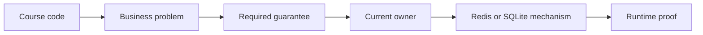

# 10. Course-to-Redis Pocket Checklist

Use this page while watching lectures **314–450**. It prevents accidental NATS,
Mongoose, or Bull design from leaking into this Redis Streams and SQLite project.

## The one rule

Translate the **problem and guarantee**, not the course library call.



## Fast lecture classification

For every lecture, use one label from
[`async-systems/lecture-map-314-450.md`](async-systems/lecture-map-314-450.md):

| Label | Meaning | Action |
|---|---|---|
| `KEEP` | Concept transfers directly | Learn and apply it |
| `TRANSLATE` | Concept matters but implementation differs | Use the named Redis/SQLite equivalent |
| `SKIP` | Tool-specific work is unnecessary here | Understand context, then move on |
| `GAP` | Valuable behavior or proof is not implemented | Record it honestly; do not pretend it exists |

## Course term replacements

| When the course says | Think here |
|---|---|
| NATS subject | Redis stream key such as `orders.events` |
| NATS publisher | Orders worker relaying a durable publication row |
| NATS listener | Concrete Tickets Redis consumer function |
| Queue group | Redis consumer group `tickets-order-convergence` |
| NATS message ACK | `XACK` after Tickets database commit |
| NATS redelivery | Pending Entries List plus `XAUTOCLAIM` |
| Common event class | Service-owned schema plus runtime validation |
| Mongoose model | SQLite table, constraint, and explicit transaction |
| Mongoose ref | External ID; ownership stays in the other service |
| Mongoose OCC plugin | Guarded SQL update, transaction, and current-state check |
| Bull queue | Orders-owned durable deadline and due scan |
| Expiration service | Orders-internal expiration capability |
| `order.cancelled` | Do not alias automatically; current accepted fact is `order.expired` |
| Mock invocation proof | Prefer real boundary/state evidence in this learning repo |

## Lecture blocks

### 314–324: listeners and typed events

Ask:

- What stream does this consumer read?
- What consumer group shares the work?
- Which runtime schema validates bytes from Redis?
- Where does ACK happen?
- Does a base class actually remove repeated behavior?

Current answer: concrete consumer functions in
`tickets/src/orders/order-events-consumer.ts`, with schemas in
`tickets/src/tickets/schemas.ts`. No reusable Listener hierarchy is needed yet.

### 325–349: publishers, client setup, and failures

Ask:

- Which local transaction creates publication work?
- Which stable `messageId` survives republication?
- Is broker success awaited before publication progress is stored?
- What row remains when Redis is unavailable?
- Does graceful shutdown stop new work and close Redis cleanly?

Current answer: Orders publication ledger and `orders/src/workers.ts`. No NATS
singleton or suite-wide NATS mock is required.

### 350–377: Orders service, models, and routes

Ask:

- Which Order transition is being implemented?
- Which invariant constrains it?
- Is Ticket data a reference, snapshot, or current authority?
- Must Tickets answer immediately?
- Is the route thin while a workflow owns the use case?

Current answer: Orders owns lifecycle and captured price. Tickets owns
availability and reservation. Reservation is an immediate internal decision.

### 378–393: events and consumers

Ask:

- Is this a command asking another service to decide, or a committed fact?
- Does the fact need an external consumer?
- Is publication durable before Redis?
- Is the consumer effect durable before ACK?

Current answer: terminal facts `order.completed` and `order.expired` converge
Tickets. There is no accepted external `order.created` fact merely because the
course publishes one.

### 394–415: concurrency, versions, and ordering

Ask:

- Who owns and increments the aggregate version?
- Is the version a contract version or an entity-history version?
- What atomic guard wins a race?
- What rejects a unique but stale event?
- Is ordered high-water enforcement implemented or only represented in data?

Current answer: Orders owns Order aggregate versions. Tickets uses SQLite
transactions, status guards, matching `lockedByOrderId`, and processed
`messageId` receipts. General per-aggregate high-water ordering is a current gap.

### 418–431: reservation and Ticket locking

Ask:

- Can two attempts reserve the same available Ticket?
- Can a reserved or sold Ticket be edited?
- Can an old Order release another Order’s lock?
- Does the Tickets database enforce the decision atomically?

Current answer: Tickets alone performs guarded reservation, release, sold, and
price transitions. The matching Order lock prevents stale release.

### 432–450: expiration

Ask:

- Who owns the deadline?
- What durable record survives restarts?
- How is due work selected and retried?
- What protects on-time payment already in flight?
- Which terminal fact is emitted?
- What guard releases only the matching reservation?

Current answer: Orders owns expiration internally. SQLite state and worker scans
replace Bull. `order.expired` is durably published; Tickets conditionally
releases only the matching lock.

## Durable design order

Never start from the broker:

```text
JOURNEY
  -> RULES
  -> OWNERS
  -> FACTS
  -> FAILURES
  -> RECOVERY
  -> TRANSPORT
  -> PROOF
  -> DRAW
```

### 1. Journey

- What is the actor trying to accomplish?
- What are success, rejection, abandonment, and visible failure?

### 2. Rules

- What must remain true during races, retries, delays, and restarts?
- Which in-flight result must remain protected while its outcome is unknown?

### 3. Owners

- What are the separate entities and state machines?
- Which one service owns each authoritative yes/no decision?
- Which database may that service change?

### 4. FACTS

For each cross-boundary interaction:

- **Function:** what exact decision or visible field requires it?
- **Authority:** who owns the truth?
- **Currency:** local, reference, snapshot, current truth, or projection?
- **Timing:** immediate answer or later convergence?
- **Safety:** failure, retry, duplicate, and stale behavior?

### 5. Failures

Write all outcomes:

- business rejection;
- temporary failure;
- unknown outcome after possible commit;
- duplicate request or delivery;
- late or reordered work;
- dependency outage;
- process or broker restart;
- partial cross-service success; and
- unresolved in-flight work.

### 6. Recovery

- What stable identity names one logical request or fact?
- What durable record survives each commit window?
- Who retries?
- How is duplicate application prevented atomically?
- What current-state or version guard rejects stale work?
- What definitive result ends recovery?

### 7. Transport

Choose only after the earlier answers:

- local function call;
- immediate HTTP decision;
- internal durable job;
- asynchronous committed fact;
- external reference;
- immutable snapshot; or
- local projection.

Then choose Redis Streams or another mechanism only if its behavior fits.

### 8. Proof

- Which row proves unfinished publication?
- Which Redis state proves pending delivery?
- Which receipt proves duplicate handling?
- Which age or count reveals stuck work?
- Which query exposes Orders/Tickets divergence?
- Which dead-letter evidence preserves poison input?

### 9. Draw

Draw the sequence last. Reject any diagram that invents a route, fact, field,
retry, or owner not accepted earlier.

## ACK safety card

```text
Producer:
  commit business state + publication row
  XADD stored envelope
  mark publication progress

Consumer:
  read or reclaim entry
  validate runtime schema
  commit guarded effect + processed receipt
  XACK
```

Wrong orders to recognize immediately:

- commit business state, then create no durable publication record;
- mark published before `XADD`;
- ACK before consumer commit;
- record duplicate receipt outside the business transaction;
- release a Ticket without checking `lockedByOrderId`;
- treat Redis entry ID as stable logical identity.

## Three anti-rush questions

Before writing a route, event, listener, queue, or worker, ask:

1. What must never become false?
2. Who alone decides whether this state may change?
3. If the process dies at this exact line, what durable evidence survives and
   who resumes?

If any answer is vague, return to the earlier design step. Do not compensate by
adding infrastructure.

## Current gaps to say aloud

These course-adjacent proofs are not currently complete:

- broad Orders consumer/worker integration coverage;
- focused ACK-after-commit failure tests;
- general aggregate-version high-water enforcement;
- full out-of-order event proof;
- complete manual broker interruption drills;
- consumer-aware readiness beyond a basic service health response.

A `GAP` is a learning target, not permission to assume behavior.

## Start learning now

1. Keep this checklist open.
2. Start at lecture 314.
3. Find the lecture in the
   [exact map](async-systems/lecture-map-314-450.md).
4. Read the linked focused module only when the map tells you to.
5. After each block, complete the matching checkpoint in Lessons 6–9.
6. Do not pause to redesign NATS code into Redis code; the translation above is
   the accepted path for this repository.