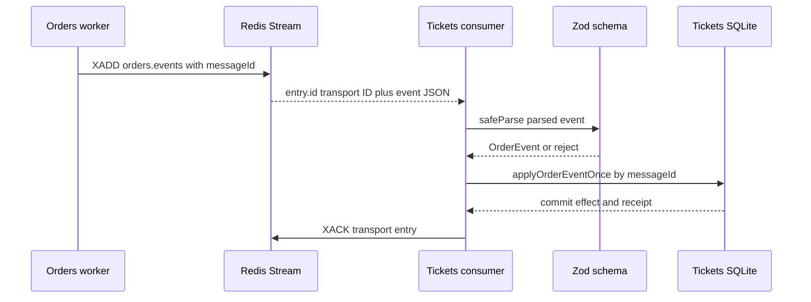

# 1. Typed Event Contracts

[Companion index](./index.md) · [Exhaustive lecture map](./lecture-map-314-450.md)

## Goal

By the end of this module, you can trace one Order event from its durable
publication row to the Tickets database, name the two different IDs involved,
and explain why TypeScript and Zod solve different parts of the contract
problem.

## Course mapping

The course's lecture titles are reproduced exactly below. The classification
says what to do with the idea in this repository. A title is not proof of the
video's implementation details; where this table only uses a title, it says so.

| Lecture | Classification | Keep, translate, skip, or treat as a gap |
|---|---|---|
| **314 — Reusable NATS Listeners** | `TRANSLATE` | Keep the problem of consuming a durable event. Translate the NATS listener to the concrete Redis consumer in `tickets/src/orders/order-events-consumer.ts`. |
| **315 — The Listener Abstract Class** | `SKIP` | The abstract base class is course-specific architecture. The current flow has one focused consumer function, not a reusable class hierarchy. |
| **316 — Extending the Listener** | `SKIP` | Do not copy inheritance for a second event shape that the current product does not need. |
| **317 — Quick Refactor** | `TRANSLATE` | **Title-only inference:** retain the goal of making the flow readable, but follow the current concrete functions rather than assuming the course refactor applies literally. |
| **318 — Leveraging TypeScript for Listener Validation** | `KEEP` | TypeScript is useful for the local `OrderEvent` shape and the `applyOrderEventOnce(event: OrderEvent)` call. It cannot validate JSON that arrives at runtime. |
| **319 — Subjects Enum** | `TRANSLATE` | A NATS subject becomes the Redis stream `orders.events` plus the validated `eventType`; do not add a central event enum without a current reuse need. |
| **320 — Custom Event Interface** | `KEEP` | An explicit event shape is useful. Here `tickets/src/tickets/ticket.ts` owns the concrete `OrderEvent` type, while Orders' publication record remains deliberately generic. |
| **321 — Enforcing Listener Subjects** | `TRANSLATE` | `orderEventSchema` enforces accepted event names at the Tickets broker boundary instead of a NATS subject type parameter. |
| **322 — Quick Note: readonly in TypeScript** | `TRANSLATE` | **Title-only inference:** `readonly` can communicate local non-mutation intent, but it does not make broker JSON trustworthy and is not the event contract used here. |
| **323 — Enforcing Data Types** | `KEEP` | The current schema checks UUIDs, literals, timestamps, positive aggregate versions, and the `ticketId` payload before the Ticket effect runs. |
| **324 — Where Does this Get Used?** | `TRANSLATE` | Trace the parsed value from `parseEvent` to `applyOrderEventOnce`; the current use site is a Redis consumer, not a generic listener subclass. |
| **325 — Custom Publisher** | `TRANSLATE` | The publisher is the concrete `publishOrderEventPublication` function in the Orders worker. |
| **326 — Using the Custom Publisher** | `TRANSLATE` | The worker reads due publication rows and invokes `redis.xAdd` with the serialized envelope. |
| **327 — Awaiting Event Publication** | `KEEP` | `await redis.xAdd(...)` matters: publication is an asynchronous I/O operation, and the worker marks the row published only after that operation succeeds. |
| **328 — Common Event Definitions Summary** | `TRANSLATE` | Keep the habit of writing down event metadata and payload fields. Keep ownership local rather than pretending a shared package already exists. |
| **329 — Updating the Common Module** | `SKIP` | There is no shared compiled event module for Orders and Tickets. Do not introduce one merely to resemble the course. |
| **390 — ID Adjustment** | `KEEP` | Stable application identity and broker transport identity are different. The Redis entry ID is for transport progress; `messageId` is for business deduplication. |
| **403 — Including Versions in Events** | `KEEP` | The envelope carries both `eventVersion` and `aggregateVersion`, which answer different questions. |
| **404 — Updating Tickets Event Definitions** | `KEEP` | Tickets' local `OrderEvent` type and `orderEventSchema` enumerate the two event kinds it currently accepts. |
| **405 — Property version is missing TS Errors After Running Skaffold** | `GAP` | **Title-only inference:** the useful lesson is that version fields must stay consistent in each compiled consumer. There is no shared producer/consumer compile-time contract in the current repository to catch such drift across services. |
| **424 — Missing Update Event** | `TRANSLATE` | Use the missing-event question to inspect the product boundary. `ticket.updated`, `order.created`, and `order.cancelled` are not current cross-stream facts; do not invent them from the title. |

The exhaustive map remains the source for every lecture from 314 through 450.
This module focuses only on the contract questions above.

## Plain-language model: a fact has two identities

Imagine sending one signed package through a mail depot:

- The **depot tracking number** identifies this physical handling of the
  package. If the depot accidentally sends it through twice, each handling can
  receive a different tracking number.
- The **package's own reference number** identifies the one logical package. A
  recipient can see the same reference twice and know not to apply its contents
  twice.

Redis Streams supplies the first identity. Orders supplies the second.

| Identity | Current value | Owned by | What it is for |
|---|---|---|---|
| Transport identity | Redis Stream entry `entry.id`, generated by `XADD` when the worker uses `"*"` | Redis | Reading, pending-entry recovery, and `XACK` of one delivery |
| Stable application identity | Envelope `messageId`, copied from the durable publication row's `id` | Orders, then honored by Tickets | Identifying one logical event and deduplicating its business effect |

The transport ID is not inside the application envelope. In
[`publishOrderEventPublication`](../../../orders/src/workers.ts#L137-L161), Orders
creates an envelope whose `messageId` is `publication.id`, then calls
`redis.xAdd("orders.events", "*", ...)`. Redis chooses the Stream entry ID.
Tickets receives that transport ID as `entry.id` in
[`order-events-consumer.ts`](../../../tickets/src/orders/order-events-consumer.ts#L35-L57),
but parses the nested `event` field and uses `event.messageId` when it calls
[`applyOrderEventOnce`](../../../tickets/src/tickets/ticket-repo.ts#L611-L673).

That distinction closes a real crash window. If Orders successfully performs
`XADD` and dies before `markOrderEventPublished`, a later worker scan can append
the same durable publication again. The two Redis entries can have different
transport IDs, but their `messageId` is the same. Tickets' processed-event
ledger is keyed by the consumer and that stable message ID, so the second
arrival becomes a duplicate instead of a second Ticket mutation.

## What is in the current envelope?

For the accepted Order facts, the producer constructs this shape:

```json
{
  "messageId": "one-durable-publication-uuid",
  "eventType": "order.completed",
  "eventVersion": 1,
  "aggregateType": "order",
  "aggregateId": "the-order-uuid",
  "aggregateVersion": 3,
  "occurredAt": "2026-09-01T12:00:00.000Z",
  "payload": {
    "ticketId": "the-ticket-uuid"
  }
}
```

The fields have separate jobs:

| Field | Meaning in this repository |
|---|---|
| `messageId` | Stable identity of this one publication. Orders gets it from the publication row ID. |
| `eventType` | The named fact. Tickets currently accepts only `order.completed` and `order.expired`. |
| `eventVersion` | Version of this event's wire shape. It is currently the literal `1`. |
| `aggregateType` | The kind of entity whose fact changed. It is currently the literal `order`. |
| `aggregateId` | The Order ID. Tickets uses it to ensure a reservation belongs to the Order named by the event. |
| `aggregateVersion` | The Order version after the terminal transition. It is useful metadata and evidence, but is not a generic replay high-water mark in the current code. |
| `occurredAt` | The publication record's creation time, copied by the worker as `publication.createdAt`. |
| `payload.ticketId` | The Ticket ID that Tickets may converge to `sold` or back to `available`. |

The durable publication application's generic shape is visible in
[`OrderEventPublication`](../../../orders/src/messaging/order-event-publication.ts#L4-L19):
`eventType` is `string`, `eventVersion` is `number`, and the payload is
`unknown`. That is important evidence, not an omission to paper over: the
current producer does not import a compiled Tickets event type. The terminal
transition in [`enqueueTerminal`](../../../orders/src/orders/order-repo.ts#L363-L417)
creates the publication row in the same Orders transaction as the guarded
Order state change. It writes a fresh UUID, the Order's new `row.version`, the
terminal event name, and `{ ticketId: row.ticket_id }`.

## TypeScript and Zod do different jobs

### TypeScript is a compile-time guard

TypeScript helps code in one compilation unit agree about a value's shape. The
Tickets type
[`OrderEvent`](../../../tickets/src/tickets/ticket.ts#L116-L127) says that the
local consumer handles:

- `messageId: string`;
- `eventType: "order.completed" | "order.expired"`;
- `eventVersion: 1`;
- `aggregateType: "order"`;
- a string `aggregateId` and numeric `aggregateVersion` (positivity is checked
  by Zod, not by this TypeScript type); and
- a payload containing `ticketId: string`.

That type makes the call to `applyOrderEventOnce(event)` readable and gives
Tickets compile-time feedback when local code uses a wrong field or event
name. But TypeScript types are erased when JavaScript runs. They cannot inspect
bytes that Redis returns, and they cannot stop a producer, operator, old
version, or malformed client from writing unexpected JSON into a stream.

### Zod is the runtime gate

The Redis consumer crosses from untrusted serialized data into application
logic in [`parseEvent`](../../../tickets/src/orders/order-events-consumer.ts#L45-L57):

1. It reads the Redis `event` field.
2. It calls `JSON.parse`.
3. It passes the resulting runtime value to
   [`orderEventSchema`](../../../tickets/src/tickets/schemas.ts#L34-L46).
4. It returns the parsed value only when `safeParse` succeeds.

The schema checks the UUID-shaped `messageId`, the two allowed `eventType`
values, literal versions and aggregate type, the Order ID, a positive integer
`aggregateVersion`, an offset-aware ISO timestamp, and a UUID `payload.ticketId`.
A value that fails is not allowed to reach the Ticket repository.

This is the trust boundary even though Redis is an internal dependency. A
broker transports bytes and delivery state; it does not prove that those bytes
are a valid business fact. In `processEntry`, malformed data is written to
`orders.events.dead-letter` before its transport entry is acknowledged. Valid
data is sent to `applyOrderEventOnce`, which commits the Ticket effect and the
processed-event receipt before `XACK`.

There is deliberately **no shared compiled event type** between Orders and
Tickets in this repository. Orders constructs the outgoing envelope in the
worker, using its generic publication record. Tickets owns the concrete runtime
schema because Tickets is the service that must protect its own Ticket state.
The local `OrderEvent` type and `orderEventSchema` agree at the Tickets boundary,
but the agreement is not an imported, cross-service TypeScript contract.

## Current StubHub flow

Follow this path in order:

1. **Orders changes its own state and records publication work.**
   [`enqueueTerminal`](../../../orders/src/orders/order-repo.ts#L363-L417) uses a
   guarded transition: `payment_processing -> complete` for
   `order.completed`, or an already-due `pending -> expired` for
   `order.expired`. In the same SQLite transaction it inserts the publication
   row with the stable UUID, event metadata, and Ticket payload. The terminal
   facts are therefore durable even when Redis is unavailable.
2. **The Orders worker selects due rows.**
   [`scanOrderEventPublications`](../../../orders/src/workers.ts#L164-L192)
   reads a bounded batch through
   `listDueOrderEventPublications` and retries rows whose `published_at` is
   still null.
3. **The producer constructs the wire envelope.**
   [`publishOrderEventPublication`](../../../orders/src/workers.ts#L129-L161)
   maps publication fields to the JSON envelope, calls `await redis.xAdd` on
   `orders.events`, and only then calls `markOrderEventPublished`. `XADD`'s
   `"*"` creates the transport entry identity; it does not replace
   `messageId`.
4. **Tickets reads at its broker boundary.**
   [`startOrderEventsConsumer`](../../../tickets/src/orders/order-events-consumer.ts#L67-L107)
   uses the `tickets-order-convergence` consumer group. Its `parseEvent` helper
   parses and validates the nested JSON before `processEntry` chooses a
   dead-letter path or a valid-event path.
5. **Tickets applies one logical event once.**
   [`applyOrderEventOnce`](../../../tickets/src/tickets/ticket-repo.ts#L611-L673)
   checks `processed_order_events` by consumer plus `event.messageId`. For a
   first delivery it reads the Ticket, applies only the guarded transition that
   matches `event.aggregateId`, inserts the processed receipt, and commits. A
   duplicate commits no Ticket change. The consumer acknowledges the Redis
   transport entry only after this transaction returns.



The visual intentionally shows two identities without pretending they are the
same: Redis chooses `entry.id` for a delivery, while the nested event carries
Orders' stable `messageId` for logical deduplication.

## Why concrete schemas beat abstract Listener and Publisher hierarchies

The useful abstraction here is the **contract**, not a speculative class tree.

- An abstract `Listener` can require a method such as `onMessage`, but it does
  not parse arbitrary Redis JSON, reject an unknown event name, or define what a
  valid `payload.ticketId` is.
- An abstract `Publisher` can hide a call, but it does not decide which durable
  row is due, which event metadata belongs in the envelope, or whether
  publication progress is safe to mark.
- The current flow has one clear producer and one clear consumer. The focused
  functions expose the reliability boundaries directly:
  `publishOrderEventPublication`, `parseEvent`, `processEntry`, and
  `applyOrderEventOnce`.
- A concrete schema says exactly what this consumer can safely act on. It also
  makes the rejection path visible. A broad base class usually makes reuse
  visible while leaving the wire contract implicit.

This does not mean abstraction is always bad. It means the current repository
has not demonstrated a second independent flow that would justify a shared
Listener or Publisher hierarchy. Do not add inheritance, factories,
singletons, or a central event registry merely to match the course's original
architecture.

## Event names that are absent on purpose

The current stream is not a change-log for every CRUD action. It carries only
accepted terminal Order facts that Tickets needs for convergence.

| Event | Current status | Why |
|---|---|---|
| `order.completed` | **Accepted terminal fact** | Orders records it from the guarded payment-completion transition. Tickets validates it and can move the matching reservation to `sold`. |
| `order.expired` | **Accepted terminal fact** | Orders' durable due-work scan records it when an eligible pending Order expires. Tickets validates it and can release the matching reservation. |
| `ticket.updated` | **Deliberate non-event** | `PATCH /tickets/:ticketId/price` is a synchronous Tickets-owned operation. The route validates and applies the guarded update locally; no current Orders consumer needs a ticket-update fact. It is not in `orderEventSchema` or `OrderEvent`. Lecture 424 is a prompt to ask whether an update fact is needed, not permission to add one. |
| `order.created` | **Deliberate non-event** | Order creation and reservation are part of the immediate purchase workflow. `completePurchase` writes the Order locally after the authoritative Tickets reservation; the current cross-service stream does not need an Order-created notification. There is no `order.created` branch in `enqueueTerminal` or accepted schema. |
| `order.cancelled` | **Capability gap, not an invented event** | User-driven Order cancellation is not implemented. The absence of an event name is therefore deliberate under the current scope, while cancellation itself remains an explicit product gap. Do not create a cancellation schema or listener until a cancellation owner, state transition, and downstream need exist. |

A missing event name is not automatically a missing feature. First ask who
needs the fact, which service owns the decision, and what state the consumer
would change. The current answer is intentionally narrow: Orders owns terminal
Order facts, and Tickets reacts only to the two concrete facts it can safely
converge.

## Failure analysis

### Duplicate publication

If the worker dies after `XADD` and before `markOrderEventPublished`, the
publication row remains unpublished. A later scan publishes it again. Redis
may assign a new transport ID, but the envelope still carries the same
`messageId`. This is expected at-least-once delivery, not evidence that the
contract has two logical events.

### Consumer crash before commit

If `applyOrderEventOnce` fails before its SQLite transaction commits, neither
the guarded Ticket transition nor the processed-event receipt is durable. The
consumer does not acknowledge the transport entry. Redis keeps it pending for
redelivery or `XAUTOCLAIM` recovery.

### Consumer crash after commit and before `XACK`

The Ticket change and processed-event receipt can already be committed when the
process dies. Redis can redeliver the same logical event under another
transport delivery. The receipt lookup by `messageId` returns a duplicate, so
Tickets does not repeat the business effect; it then acknowledges the new
transport entry.

### Poison or unsupported event

Missing JSON, invalid UUIDs, the wrong literal version, or an unsupported
`eventType` fails `orderEventSchema`. `processEntry` writes the original Redis
fields to `orders.events.dead-letter` before `XACK`, and no Ticket state change
is attempted. A dead-letter record is durable evidence that the input was
rejected, not evidence that the business event was applied.

### Stale but well-formed event

A valid shape is not the same as a current fact. `aggregateVersion` is validated
as a positive integer and recorded, but the current code does not implement a
generic aggregate-version high-water mark or ordered replay. Duplicate detection
also does not reject every stale message. The Ticket transition still uses the
stronger local guard: the Ticket must be reserved by the event's
`aggregateId`. If the lock belongs to another Order, the outcome is
`not_matching` and the stale event does not unlock that reservation.

### Restart

Orders restarts by rereading durable unpublished publication rows in its worker
scan. Tickets starts by recovering stale pending entries with `XAUTOCLAIM`
before reading new entries. The event contract is therefore tied to durable
records and guards, not to an in-memory listener object or a browser staying
open.

## What not to copy

- Do not use a Redis Stream transport ID as the business deduplication key.
- Do not assume TypeScript types validate JSON received from Redis.
- Do not skip `orderEventSchema` because Redis is an internal broker.
- Do not create a shared compiled `common` event package when the current code
  has service-owned concrete validation.
- Do not add abstract `Listener` or `Publisher` base classes, factories,
  singletons, or mocks merely to reproduce course structure.
- Do not add `ticket.updated`, `order.created`, or `order.cancelled` just because
  a CRUD action exists or a lecture title mentions an update/cancellation.
- Do not confuse `eventVersion` (wire-shape revision) with
  `aggregateVersion` (Order state version), or claim that either one currently
  provides generic ordered replay.

## Practice

Use the source links above, then close the file and write your prediction before
checking the implementation.

1. Orders has a publication row with `id = M`. The worker calls `XADD` and
   receives transport ID `1710000000000-0`, then crashes before marking the row
   published. On restart it publishes again and Redis returns
   `1710000002000-0`. Which ID should Tickets use to deduplicate, and which ID
   should it use for `XACK`?
2. Construct the smallest valid event envelope for an expired Order. Name every
   field that is metadata and the one payload field that Tickets needs.
3. An event arrives with `eventType: "ticket.updated"` and a valid UUID
   `messageId`. Does `applyOrderEventOnce` run? What durable evidence should you
   expect instead?
4. Point to the exact function that constructs the envelope and the exact
   function that performs runtime validation. Why are they in different
   services?
5. A message has `aggregateVersion: 1`, but the Ticket is now reserved by a
   different Order. Does a valid schema authorize a release? Which guard
   decides?

## Checkpoint

Without this file open, answer in writing:

- What is the difference between a Redis transport entry ID and `messageId`?
- Where is `messageId` first made durable, and where is it checked for a
  duplicate?
- What can TypeScript catch here, and what can only Zod catch?
- Which service constructs the outgoing envelope? Which service owns concrete
  runtime validation and the Ticket effect?
- Why are `ticket.updated`, `order.created`, and `order.cancelled` different
  cases rather than three missing enum members?
- Why does `eventVersion` not prove that an old aggregate event is safe to
  replay?

## Exit gate

Continue to the next module only when you can do all of the following without
looking at the answer:

1. Draw the path `publication row -> XADD -> transport entry -> safeParse ->
   applyOrderEventOnce -> XACK` and label both IDs correctly.
2. Explain the crash after `XADD` and before publication progress, including why
   two transport deliveries can share one stable `messageId` safely.
3. Locate `publishOrderEventPublication`, `parseEvent`, `orderEventSchema`,
   `OrderEvent`, and `applyOrderEventOnce` in the current repository.
4. Explain why a compile-time type is not a runtime trust boundary and why the
   current design intentionally has no shared compiled producer/consumer event
   type.
5. Classify `ticket.updated` as a deliberate non-event, `order.created` as a
   current non-event, and `order.cancelled` as an unimplemented capability
   rather than inventing schemas for any of them.
