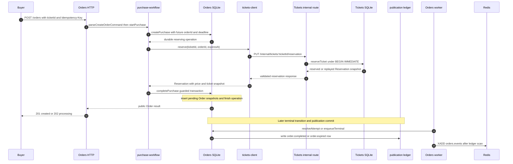

# Orders Boundary and Synchronous Reservation

[Async-systems companion index](./index.md) · [Exhaustive lecture map](./lecture-map-314-450.md)

This module assumes you have completed the ten beginner lessons in
[`docs/service-design`](../index.md). The external course's lecture titles are
useful prompts, not permission to copy its database, broker, or service
boundaries into StubHub.

## Goal

By the end, you can explain, from the source code, why **Tickets owns the
winner of an availability race**, why **Orders owns the purchase operation and
Order lifecycle**, and why the first reservation call is synchronous while
terminal facts are published durably later.

## Course mapping: lectures 350–383

The lecture numbers and titles below are copied from the user-provided lecture
list. A title does not prove what the video implemented. Rows marked
**title-only inference** are classified from the title and current repository
shape only; do not treat an inferred detail as an external-course fact. Every
lecture in this range appears exactly once.

### KEEP — study the concept directly in the current code

| Lecture | Current meaning and evidence | Learner action |
|---|---|---|
| **350 — The Orders Service** | **KEEP.** Orders is a real ownership boundary. `orders/src/app.ts` registers the Orders HTTP routes, while `orders/src/orders/purchase-workflow.ts` and `orders/src/orders/order-repo.ts` own purchase and Order state. | Name the buyer-side rules that must remain in Orders without mentioning a broker. |
| **358 — The Need for an Enum** | **KEEP.** A finite state vocabulary protects transitions. The TypeScript `OrderStatus` union in `orders/src/orders/order.ts` is paired with the SQL `CHECK` in `orders/migrations/001_create_orders.sql`. | Explain why accepting an arbitrary status string would make a transition unsafe. |
| **365 — Order Expiration Times** | **KEEP.** A deadline is durable business data, not a timer-only detail. `purchaseTtlMs` and `createPurchase` persist `expires_at`; `duePending` selects overdue rows for Orders-owned expiration. | Point to the database value that survives an Orders restart. |
| **372 — Fetching a User's Orders** | **KEEP.** `GET /orders/mine` calls `listOrdersForUser`. Its SQL filters by `user_id` and returns only `pending`, `payment_processing`, and `complete` rows. Expired rows are not silently reconstructed by reading Tickets. | State whose database answers the list query and whose identity comes from auth. |
| **374 — Fetching Individual Orders** | **KEEP.** `GET /orders/:orderId` calls `findOrderByIdForUser(userId, orderId)`. The combined owner predicate makes “missing” and “not yours” the same public `order_not_found` result. | Explain why loading by ID first and checking ownership afterward is a weaker boundary. |

### TRANSLATE — retain the problem, replace the course mechanism

| Lecture | Current replacement and evidence | Learner action |
|---|---|---|
| **351 — Scaffolding the Orders Service** | **TRANSLATE.** The current service is already shaped as `orders/src/app.ts` plus focused route, workflow, repository, payment, and worker modules. Do not recreate the external course's scaffold or technology choices. | Trace `app.ts` → `create-order.ts` → `purchase-workflow.ts` before reading any framework setup. |
| **353 — Ingress Routing Rules** | **TRANSLATE, title-only inference.** The title suggests edge routing. In this repository, Orders owns `/orders` route registration in `orders/src/app.ts`; a client proxy or deployment edge is transport, not ownership. No current ingress rule authorizes a Ticket reservation. | Separate “which process receives an HTTP request?” from “which service may change a Ticket?” |
| **354 — Scaffolding a Few Route Handlers** | **TRANSLATE.** The current handlers are concrete files: `orders/src/http/routes/create-order.ts` for POST, and `orders/src/http/routes/list-orders.ts` for list/detail reads. The route layer authenticates, maps HTTP, and delegates; it does not become a generic route framework. | Identify the business work that is deliberately outside the route callback. |
| **355 — Subtle Service Coupling** | **TRANSLATE.** The coupling question is retained, but the safe boundary is different: `orders/src/tickets-client.ts` makes an authenticated HTTP call to Tickets. Orders does not import the Tickets SQLite connection or write its rows. | Predict what breaks if Orders keeps a local copy of `status` and treats it as availability truth. |
| **356 — Associating Orders and Tickets** | **TRANSLATE.** `ticketId` and `orderId` are opaque string identities carried across an HTTP contract. `tickets/src/tickets/ticket-repo.ts` uses `locked_by_order_id`; there is no cross-service foreign key or document reference. | Say “Orders refers to a Ticket by ID” rather than “Orders owns a Ticket reference.” |
| **357 — Order Model Setup** | **TRANSLATE.** Mongoose documents become `OrderRow` and public `Order` types in `orders/src/orders/order.ts`, projected by `toOrder`. SQLite rows, transactions, and constraints are the model behavior. | Compare the raw snake-case row to the API's ISO-date and nested-snapshot shape. |
| **359 — Creating an Order Status Enum** | **TRANSLATE.** The current equivalent is a TypeScript string union plus a SQLite `CHECK`, not a runtime Mongoose enum. `OrderStatus` lists `pending`, `payment_processing`, `complete`, and `expired`; the migration enforces the same set at the storage boundary. | Explain why compile-time narrowing alone cannot protect a database write. |
| **360 — More on Mongoose Refs** | **TRANSLATE.** Replace refs with opaque IDs and explicit calls. `reserve` in `orders/src/tickets-client.ts` sends `ticketId`, the future `orderId`, and a deadline to Tickets. No Orders query dereferences a Ticket document. | Draw the dependency as Orders → Tickets API, never Orders → Tickets table. |
| **361 — Defining the Ticket Model** | **TRANSLATE.** Tickets' authoritative row is defined by its own migrations and `TicketRow` in `tickets/src/tickets/ticket.ts`. Orders needs only the reservation response and captures selected fields. | List which service can change `status`, `locked_by_order_id`, and `lock_expires_at`. |
| **362 — Order Creation Logic** | **TRANSLATE.** `startPurchase` calls `createPurchase` before reservation, then `processPurchase`, then `completePurchase` after a successful reservation. The durable purchase operation receives an Order ID before an Orders `orders` row exists. | Trace the difference between “purchase operation created” and “Order row completed.” |
| **363 — Finding Reserved Tickets** | **TRANSLATE.** Orders does not search a local Ticket table. `tickets-client.reserve` calls `PUT /internal/tickets/:ticketId/reservation`, whose route invokes `reserveTicket`; the response is the authority and includes a reservation snapshot. | Explain why a stale Orders read cannot decide the winner. |
| **364 — Convenience Document Methods** | **TRANSLATE.** Document methods become focused functions such as `createPurchase`, `completePurchase`, `findOrderByIdForUser`, `reserveTicket`, and `releaseReservation`. They expose concrete transactions and guards without an abstract repository hierarchy. | Match each function to its owning database and one business responsibility. |
| **369 — Asserting Tickets Exist** | **TRANSLATE.** `reserveTicket` returns `not_found` from Tickets, and the internal route maps it to 404. Orders does not perform a separate existence read first, which avoids a check-then-act race. `tickets/src/tickets/schemas.ts` validates the ID shape at the route boundary. | Explain why “exists” and “can be reserved” are different answers. |
| **370 — Asserting Reserved Tickets** | **TRANSLATE.** The reservation response is produced by `toReservation` after the guarded write, or replayed for the same Order and deadline. Later, payment calls `verify` in `orders/src/tickets-client.ts`, which uses `findReservation` to re-check the matching lock. | Distinguish a reservation command from a read-only reservation verification. |
| **371 — Testing the Success Case** | **TRANSLATE, title-only inference.** A success case should now observe HTTP plus SQLite state: reservation in Tickets, captured fields in Orders, and the expected response. Do not replace this with a mocked Mongoose document or mocked broker assertion. | Write down the durable rows that prove success, not only the 201 response. |
| **373 — A Slightly Complicated Test** | **TRANSLATE, title-only inference.** Whatever test complexity the title refers to, the current proof should follow the real boundary: authenticated POST, internal reservation response, and repository state. The exact external test arrangement is not established by the title. | Describe one observable scenario and its durable evidence before inventing fixtures. |
| **375 — Does Fetching Work?** | **TRANSLATE, title-only inference.** Current list/detail behavior is concrete HTTP over Orders-owned queries: `listOrdersForUser` and `findOrderByIdForUser`. The source, not a title, defines whether expired rows appear and how ownership is checked. | Test your explanation against the SQL predicates, not against an assumed UI result. |
| **376 — Cancelling an Order** | **TRANSLATE.** User cancellation is not a current endpoint or state transition. The useful deadline concept is replaced by Orders-owned expiration: `duePending` plus `enqueueTerminal(..., "order.expired", ...)`. Tickets is later asked to release only the matching lock. | Say why expiration is a server decision based on persisted time, not a browser button. |
| **378 — Orders Service Events** | **TRANSLATE.** The current accepted terminal facts are `order.completed` and `order.expired`. They travel through Redis Stream `orders.events`; there is no need to reproduce the external event set or emit every intermediate Order state. | Classify a proposed event by whether another service has a real current reason to consume it. |
| **379 — Creating the Events** | **TRANSLATE.** `enqueueTerminal` and `resolveAttempt` create event-publication rows with aggregate identity/version, event type, version, and `{ ticketId }` payload. The concrete event envelope is assembled in `publishOrderEventPublication` in `orders/src/workers.ts`. | Identify the business transition and the publication record as one durable decision. |
| **380 — Implementing the Publishers** | **TRANSLATE.** The publisher is a focused function, not a custom class hierarchy: `scanOrderEventPublications` selects due rows, `publishOrderEventPublication` calls Redis `xAdd`, and `markOrderEventPublished` records progress. | Explain why the database row, not the Redis connection, owns retryable work. |
| **383 — Testing Event Publishing** | **TRANSLATE, title-only inference.** Current evidence should inspect `order_event_publications`, Redis `orders.events`, and retry behavior. The companion's known gaps include crash-window and ACK-ordering integration tests, so do not claim those tests exist. | Name what you would observe after a crash between `XADD` and `published_at`. |

### SKIP — obsolete, product-specific, or deliberately absent

| Lecture | Why it is skipped in this module | Learner action |
|---|---|---|
| **352 — A Touch More Setup** | **SKIP, title-only inference.** The title is too vague to establish a current business rule, and generic setup details do not define Orders ownership. | Skip implementation copying; study the named current symbols instead. |
| **366 — globalThis has no index signature TS Error** | **SKIP.** This is a compiler-error detour, not a durable Orders boundary concept. | Learn the error only if it appears while reading current code. |
| **367 — Test Suite Setup** | **SKIP, title-only inference.** Test scaffolding from another codebase is not a production contract and must not pull mocked infrastructure into this design. | Prefer an observable scenario over copying test harness structure. |
| **368 — Small Update for Value of type typeof ObjectId is not callable Error** | **SKIP.** This is Mongoose/ObjectId-specific repair work. Current IDs are validated strings and SQLite primary-key values. | Do not add ObjectId or Mongoose compatibility code. |
| **381 — Publishing the Order Creation** | **SKIP.** `order.created` is not an accepted current fact. Orders creates a durable purchase operation and later an Order row, but Tickets only needs terminal completion or expiration. | Do not add an event merely because an Order row was inserted. |

### GAP — valuable question not implemented or not proven here

| Lecture | Current gap | Learner action |
|---|---|---|
| **377 — Can We Cancel?** | **GAP.** There is no user-driven cancellation route or `cancelled` Order status. This is an explicit current absence, not an invitation to hide cancellation inside expiration. | Design the cancellation rule as an exercise: owner, allowed states, Ticket effect, retries, and fact name. Do not implement it in this module. |
| **382 — Publishing Order Cancellation** | **GAP.** There is no `order.cancelled` event because user cancellation is absent. The implemented terminal alternative is `order.expired`, created with the expiration transition. | Explain what downstream evidence a future cancellation would need before proposing an event. |

## Plain-language model

Imagine two ledgers for one marketplace purchase:

- **Tickets is the shelf ledger.** It owns whether a listing is `available`,
  `reserved`, or `sold`, who holds a reservation, when that lock expires, and
  whether a seller may edit it. Only Tickets can decide which buyer won a
  reservation race.
- **Orders is the buyer's purchase ledger.** It owns the purchase intent,
  buyer identity, Order lifecycle, payment coordination, deadline decision,
  and the durable work needed to finish or reject an interrupted purchase.

The services share identifiers, not tables. `ticketId` is like a claim number
printed on a receipt: Orders can carry it and ask Tickets about it, but Orders
cannot infer the shelf's current truth from its own copy. There is no Mongoose
`ref`, no cross-service foreign key, and no shared database connection.

A **snapshot** answers “what did the buyer agree to at this moment?” The
successful reservation response includes seller identity, price, currency, and
ticket details. `completePurchase` stores those values in the Orders row as
`seller_user_id`, `amount_cents`, and `ticket_*` fields. Later Ticket edits do
not rewrite this historical Order. A **current authority check** answers “what
is true right now?” Before payment, `verify` asks Tickets whether the same
Order still owns the reservation. These are different questions and need
 different data.

Reservation is a synchronous **command** because POST `/orders` cannot safely
claim success until an authority has chosen a winner. Terminal completion and
expiration are durable **facts** that can be published later. The request may
return `202 { outcome: "processing" }` if the call cannot finish, because the
purchase operation remains in SQLite for the Orders worker to resume.

## Current StubHub flow

### 1. HTTP edge carries trusted identity and a retry key

`orders/src/http/routes/create-order.ts` registers `POST /orders` with
`requireAuth`. It passes the authenticated `user.id`, the `Idempotency-Key`,
and the body to `parseCreateOrderCommand` in
`orders/src/orders/purchase-workflow.ts`. The parser requires one UUID
`ticketId` and a bounded printable key. The caller does not choose `userId` in
the body.

### 2. Orders creates durable unfinished work before calling Tickets

`startPurchase` calls `createPurchase` in
`orders/src/orders/order-repo.ts`. In a transaction, `createPurchase` allocates
the future Order ID, persists the ticket ID, deadline, request fingerprint,
and `state='reserving'` in `purchase_operations`, and uses
`UNIQUE (user_id, idempotency_key)` to distinguish a replay from a conflict.
The operation is the recovery handle even when the HTTP request disappears.

`processPurchase` rereads the operation. A terminal operation returns its
existing result. Otherwise it calls `reserve` in `orders/src/tickets-client.ts`
with the same `ticketId`, the allocated `orderId`, and the persisted deadline.

### 3. Tickets makes the authoritative reservation decision

`tickets-client.reserve` sends an authenticated `PUT` to
`/internal/tickets/:ticketId/reservation`. The route in
`tickets/src/http/routes/internal-ticket-reservations.ts` validates the IDs,
Order ID, and future ISO deadline, then calls `reserveTicket`.

`reserveTicket` in `tickets/src/tickets/ticket-repo.ts` runs under
`BEGIN IMMEDIATE` and checks, in order:

1. missing Ticket → `not_found`;
2. same Order and same deadline → safe `replayed` result;
3. same Order and different deadline → `conflict`;
4. a non-`available` Ticket → `unavailable`;
5. an existing lock for that Order on another Ticket → `unavailable`;
6. otherwise, guarded `UPDATE ... WHERE status='available'` → one winner.

The returned `Reservation` is built by `toReservation` from the committed
Ticket row. It contains current seller, price, deadline, and ticket details for
Orders to capture. A local Ticket replica in Orders would be both stale and an
unauthorized second owner.

### 4. Orders persists the purchase result and snapshots atomically

On a valid reservation, `processPurchase` calls `completePurchase`. Its
transaction rereads the purchase operation, checks that it is still
`reserving`, that the deadline is unchanged and still valid, inserts the
`orders` row with the reservation's price and ticket snapshots, and changes the
operation to `completed` with a guarded update. The newly inserted Order starts
as `pending`, ready for payment. The public shape comes from `toOrder`, not from
a Tickets response passed directly to the client.

If Tickets returns `ticket_not_found`, `ticket_unavailable`, or
`reservation_conflict`, the operation is durably rejected. If the dependency
fails transiently, `schedulePurchase` stores `next_retry_at`, retry count, and
error text; the route can return `202` and the Orders worker can resume it.

### 5. Queries stay inside Orders and enforce ownership in SQL

`GET /orders/mine` calls `listOrdersForUser`, whose query includes
`WHERE user_id=?`. `GET /orders/:orderId` calls
`findOrderByIdForUser`, whose query includes both `id=?` and `user_id=?`.
Neither query reads Tickets, joins a shared schema, or reconstructs an Order by
fan-out. The Order's captured ticket fields are already local evidence.

### 6. Only accepted terminal facts enter the publication ledger

A successful payment is resolved by `resolveAttempt` in
`orders/src/payments/payment-attempt-repo.ts`. Its transaction changes
`payment_processing` to `complete` and inserts an
`order.completed` row in `order_event_publications`. An overdue pending Order
is changed by `enqueueTerminal` in `orders/src/orders/order-repo.ts` to
`expired` and gets an `order.expired` publication row in the same transaction.

`orders/src/workers.ts` calls `scanOrderEventPublications`, which reads due
unpublished rows. `publishOrderEventPublication` appends the envelope to Redis
Stream `orders.events`; only after `XADD` succeeds does
`markOrderEventPublished` set `published_at`. Redis transports the fact, but
Orders SQLite owns the Order transition and publication ledger.

## Order states and database constraints

The public `OrderStatus` union is:

- `pending`: reservation-backed Order may proceed to payment;
- `payment_processing`: payment has started and the payment attempt is
  recoverable;
- `complete`: payment succeeded and this is a terminal Order fact;
- `expired`: the persisted deadline won the race and this is a terminal fact.

`orders/migrations/001_create_orders.sql` constrains the allowed statuses,
positive amount, USD currency, positive version, required IDs, and unique
buyer/idempotency key. The rebuilt schema in
`orders/migrations/006_rebuild_orders.sql` adds immutable ticket snapshot
columns and guarded checks such as event-end-after-event-start. Migration
`011_add_report_snapshots.sql` adds nullable seller and description snapshots
for historical rows while preserving immutability through the trigger.

The unfinished reservation operation is a separate durable table in
`orders/migrations/005_create_purchase_operations.sql`. Its constraints tie
state to rejection code and retry deadline: reserving/releasing rows need a
`next_retry_at`, while completed/rejected rows do not. This is not a second
Order authority. It is Orders' recovery ledger for one purchase attempt.

Tickets has its own constraints in
`tickets/migrations/002_rebuild_ticket_locks_and_inbox.sql`: available rows
have no lock, reserved rows have both `locked_by_order_id` and
`lock_expires_at`, sold rows retain the Order ID without an active deadline,
and a partial unique index prevents one Order from holding multiple Tickets.
These are database-enforced invariants, not comments that a worker hopes to
follow.

## Expiration is not user cancellation

There is intentionally no `POST /orders/:id/cancel`, no `cancelled` status, and
no `order.cancelled` publication. A deadline is a server-owned rule: the
Orders worker's `scanExpiration` reads `duePending`, and `enqueueTerminal`
atomically requires `status='pending'` plus `expires_at<=now` before changing
the row to `expired` and recording `order.expired`.

The Tickets consumer can later release the reservation through the matching
Order guard. The internal release route calls `releaseReservation`, which only
clears a lock when `locked_by_order_id` still equals that Order. If a newer
reservation owns the Ticket, a stale release returns `not_matching` and cannot
unlock the new buyer's reservation.

This choice is local to the current product and scale. It is not a universal
rule that every marketplace must avoid cancellation or a separate scheduler.
It is the current Orders-owned boundary, and a future cancellation feature
would need its own state rules, durable fact, and recovery proof.

## Failure analysis

| Failure or race | What the current design preserves | Recovery owner |
|---|---|---|
| Tickets is unavailable after `createPurchase` | `purchase_operations.state='reserving'`, error, retry count, and `next_retry_at` remain in Orders. The HTTP response may be `202 processing`; no false Order success is returned. | Orders `processPurchase` through `duePurchases` and the worker. |
| Caller repeats the same request | The `(user_id, idempotency_key)` uniqueness check returns the existing operation. Same fingerprint replays; a different ticket fingerprint is `idempotency_conflict`. | Orders repository and workflow. |
| Two buyers race for one Ticket | Tickets serializes `reserveTicket` with `BEGIN IMMEDIATE` and a `status='available'` guard. One reservation commits; the other receives unavailable. | Tickets owns the decision. |
| Orders crashes after Tickets commits but before `completePurchase` | The same durable `orderId` and deadline are retried. Tickets recognizes the same lock as `replayed`; Orders can then capture the reservation. | Orders retries, Tickets supplies the authoritative replay. |
| Completion deadline or operation guard no longer matches | `completePurchase` returns no Order rather than inserting stale data. `processPurchase` moves toward `processRelease`, whose release call is retryable. | Orders workflow, then Tickets matching release. |
| Stale release reaches a newer lock | `releaseReservation` checks `locked_by_order_id` in the transaction. A mismatch cannot clear the newer reservation. | Tickets rejects the stale effect safely. |
| Ticket price or description changes after purchase | Orders retains the reservation-time snapshot. Ticket edit logic only updates an available Ticket; it does not rewrite an Order. | Orders owns historical Order evidence; Tickets owns current listing state. |
| Crash after Redis `XADD` but before `published_at` | The publication row stays due and may be published again with the same stable `messageId`. Redis is at-least-once transport, not the ledger. | Orders worker retries; Tickets' processed-event ledger deduplicates its effect. |
| Expiration and payment compete | Guarded `pending` and `payment_processing` transitions allow one terminal outcome. The losing operation rereads current state instead of overwriting it. | Orders payment/expiration paths, with matching Ticket release or terminal convergence. |
| A caller asks to cancel | No current route or event handles it. Treating expiration as cancellation would hide an explicit product gap. | GAP exercise, not an implemented fallback. |

Known companion gaps remain visible: this repository does not yet prove
listener crash-window integration tests, ACK-ordering tests, reservation
contention tests, consumer-aware readiness, horizontal Tickets consumer
behavior, high-availability Redis, or a generic aggregate-version high-water
mark. Those are exercises, not claims made by this module.

## What not to copy

- Do not add NATS subjects, queue groups, or a central event enum to this
  boundary. Current transport is Redis Streams and current code uses concrete
  functions.
- Do not add Mongoose refs, ObjectIds, document methods, or update-if-current
  plugins. Use opaque IDs, TypeScript unions, SQLite constraints, transactions,
  and guarded SQL.
- Do not give Orders a shared Tickets database, a local Ticket availability
  replica, or a read-time fan-out that pretends to be authoritative.
- Do not make reservation an asynchronous “ticket reserved” event when the
  purchase response needs a winner now. Use the authenticated internal
  reservation command and handle a temporary dependency failure with durable
  unfinished work.
- Do not publish `order.created` or `order.cancelled` just to mirror a course
  event list. The accepted cross-service facts are `order.completed` and
  `order.expired`.
- Do not create a separate Bull-backed Expiration service for this design.
  Orders owns persisted deadlines and due-work scans; `setTimeout`, a browser
  countdown, or Redis key-expiration notifications cannot authorize the state
  transition.
- Do not introduce abstract Listener/Publisher classes, factories, or
  singletons merely to resemble the external course. Follow the concrete
  `startPurchase`, `reserve`, `enqueueTerminal`, and worker functions.

## Practice

### Practice A: follow one purchase

Use these invented values on paper:

- buyer user ID: `buyer-7`;
- `ticketId`: `ticket-9`;
- idempotency key: `purchase-a`.

Write the exact order of the following symbols without opening the file:

1. `createOrder` route callback;
2. `parseCreateOrderCommand`;
3. `startPurchase`;
4. `createPurchase`;
5. `processPurchase`;
6. `tickets-client.reserve`;
7. Tickets' reservation route;
8. `reserveTicket`;
9. `completePurchase`;
10. `toOrder`.

Then mark which steps write Orders SQLite and which step is the sole Ticket
availability decision.

### Practice B: predict the interruption

Assume `reserveTicket` commits, then the Orders process crashes before
`completePurchase`. Predict all three answers before checking the source:

1. What row proves that work still exists?
2. What `orderId` does the retry use?
3. Why can Tickets safely answer “replayed” instead of creating a second lock?

Finally, change only the failure to “Tickets is down before it can commit” and
explain why the durable state is different.

### Practice C: classify fields

For each field, write **cross-service identity**, **current Ticket truth**, or
**Order snapshot**:

`ticketId`, `orderId`, `status`, `lockedByOrderId`, `priceCents`,
`ticket_description`, `expiresAt`, `sellerUserId`.

Check your answer against `Reservation`, `OrderRow`, and
`tickets/src/tickets/ticket-repo.ts` rather than guessing from field names.

## Checkpoint

Close this file and answer in writing:

1. Which service owns the answer to “can this Ticket be reserved right now?”
2. Why does Orders allocate an `orderId` before it calls Tickets?
3. What is the difference between a Ticket snapshot in an Order and
   `verify(ticketId, orderId)`?
4. Which SQL predicates stop a different buyer, a replay, and a stale release?
5. Why does `order.expired` enter a publication ledger while `order.created`
   does not?
6. Where would a temporary Tickets outage be recorded, and who retries it?

A correct checkpoint uses the words **owner**, **opaque ID**, **snapshot**,
**guarded transaction**, **durable unfinished work**, and **terminal fact**;
it does not answer with “because Redis is ordered” or “because Orders has a
copy of Tickets.”

## Exit gate

You pass this module only when you can do all of the following without opening
the source:

- draw the POST `/orders` path from authenticated input through
  `purchase-workflow`, `tickets-client`, the Tickets internal reservation
  route, `reserveTicket`, and `completePurchase`;
- state which fields are carried as IDs, which are captured as immutable
  snapshots, and which remain current Ticket authority;
- explain the replay, contention, dependency-outage, and stale-release cases
  and name the recovery owner for each;
- show why `BEGIN IMMEDIATE`, SQL `CHECK` constraints, unique idempotency keys,
  and guarded updates enforce rules without Mongoose references;
- explain why Orders uses expiration rather than user cancellation in the
  current product; and
- distinguish the terminal `order.completed` and `order.expired` publication
  rows from intentionally absent `order.created` and `order.cancelled` events.

For spaced recall, redraw the flow tomorrow, classify the fields three days
later, and explain one failure plus its durable evidence one week later.
