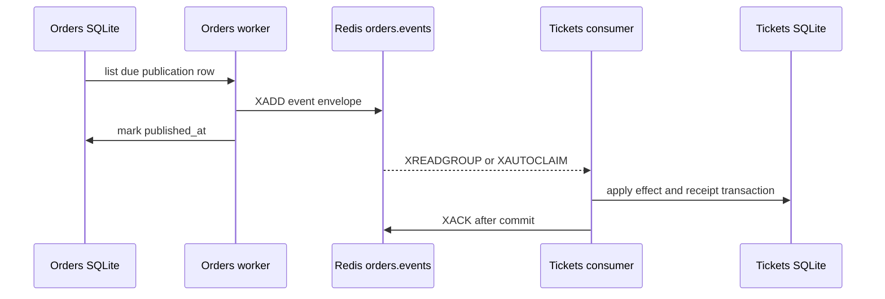

# Durable Publication and Consumption

[Companion index](./index.md) · [Exhaustive lecture map](./lecture-map-314-450.md)

## Goal

Given a terminal Order fact, explain which durable record proves each step from the Orders database to a Tickets database effect, and predict what happens when either process or Redis crashes at every boundary.

## Course mapping

This lesson maps the publishing and listening ideas that recur throughout lectures 314–450. The external course uses NATS Streaming, generic listeners and publishers, Mongoose, and (later) a separate Expiration service. Keep the reliability problem; translate the mechanism to the concrete Redis Streams and SQLite functions in this repository. A classification based only on a lecture title is labeled **title-only inference** rather than treated as proof of the video's implementation.

| Lecture | Classification | How to study it here |
|---|---|---|
| 314 — Reusable NATS Listeners | `TRANSLATE` | Translate a reusable listener into `startOrderEventsConsumer` and its focused nested functions. |
| 315 — The Listener Abstract Class | `SKIP` | **Title-only inference:** do not add an abstract listener hierarchy for one current consumer. |
| 316 — Extending the Listener | `SKIP` | **Title-only inference:** inheritance would copy course shape, not solve a current project need. |
| 317 — Quick Refactor | `SKIP` | **Title-only inference:** follow the current concrete flow instead of reproducing a historical refactor. |
| 318 — Leveraging TypeScript for Listener Validation | `TRANSLATE` | TypeScript `OrderEvent` is supplemented by runtime `orderEventSchema.safeParse`. |
| 319 — Subjects Enum | `TRANSLATE` | `stream`, `deadLetterStream`, and `group` are concrete constants; event names are validated by the schema rather than a new central enum. |
| 320 — Custom Event Interface | `TRANSLATE` | Use the `OrderEvent` envelope and `OrderEventPublication` record, not a NATS-specific interface. |
| 321 — Enforcing Listener Subjects | `TRANSLATE` | `orderEventSchema` accepts only `order.completed` and `order.expired`. |
| 323 — Enforcing Data Types | `TRANSLATE` | Parse untrusted Redis JSON before applying a Ticket change. |
| 324 — Where Does this Get Used? | `KEEP` | Trace `processEntry` from Redis delivery to `applyOrderEventOnce` and then `XACK`. |
| 325 — Custom Publisher | `TRANSLATE` | `publishOrderEventPublication` is the concrete publisher function. |
| 326 — Using the Custom Publisher | `TRANSLATE` | `redis.xAdd("orders.events", "*", { event })` replaces a NATS publisher call. |
| 327 — Awaiting Event Publication | `KEEP` | The worker awaits `xAdd` before calling `markOrderEventPublished`. |
| 328 — Common Event Definitions Summary | `TRANSLATE` | Study the current envelope fields and the stable application `messageId`. |
| 329 — Updating the Common Module | `SKIP` | **Title-only inference:** no common-module expansion is required for this one concrete flow. |
| 330 — Restarting NATS Play | `TRANSLATE` | Restart behavior means rereading due Orders rows and reclaiming stale Redis pending entries. |
| 331 — Publishing Ticket Creation | `SKIP` | `ticket.created` is not a current cross-service fact; Tickets owns its own creation. |
| 332 — More on Publishing | `TRANSLATE` | Compare direct publication with the durable publication ledger and worker retry. |
| 333 — NATS Client Singleton | `SKIP` | Do not introduce a singleton abstraction; current modules create the clients they own. |
| 334 — Node Nats Streaming Installation | `SKIP` | NATS is not a repository dependency or broker. |
| 338 — Accessing the NATS Client | `TRANSLATE` | The current client is the Redis client local to the worker or consumer. |
| 339 — Graceful Shutdown | `KEEP` | Orders and Tickets stop accepting HTTP work, drain background work, and then close Redis. |
| 341 — Ticket Update Publishing | `SKIP` | `ticket.updated` is not a current event contract. |
| 342 — Failed Event Publishing | `TRANSLATE` | Redis or publication failure leaves the ledger row unpublished and records retry metadata. |
| 343 — Handling Publish Failures | `KEEP` | `recordOrderEventPublicationFailure` keeps durable work and schedules a later attempt. |
| 349 — NATS Env Variables | `TRANSLATE` | Use `REDIS_URL`, worker timing settings, and the Kubernetes Redis service address. |
| 378 — Orders Service Events | `TRANSLATE` | Current events are only accepted terminal Order facts. |
| 379 — Creating the Events | `TRANSLATE` | The current envelope is built from the publication row and validated at Tickets. |
| 380 — Implementing the Publishers | `TRANSLATE` | The worker function is the only publisher implementation currently needed. |
| 381 — Publishing the Order Creation | `SKIP` | `order.created` is deliberately absent; Order creation is not a committed cross-service fact here. |
| 382 — Publishing Order Cancellation | `SKIP` | User-driven cancellation is a current gap and there is no `order.cancelled` event to copy. |
| 383 — Testing Event Publishing | `GAP` | **Current gap:** crash-window and ACK-ordering integration proof is not implemented. |
| 385 — Time for Listeners! | `TRANSLATE` | The listener is the Tickets Redis consumer, not a NATS subscription class. |
| 386 — Reminder on Listeners | `TRANSLATE` | A listener must parse, apply durable work, and only then acknowledge transport delivery. |
| 387 — Blueprint for Listeners | `TRANSLATE` | Read `startOrderEventsConsumer`, `processEntry`, `recoverPending`, and `readNewEntries` as the blueprint. |
| 388 — A Few More Reminders | `TRANSLATE` | **Title-only inference:** apply the same delivery-order reasoning to Redis group state and the Tickets ledger. |
| 389 — Simple onMessage Implementation | `TRANSLATE` | `processEntry` is the concrete message handler. |
| 390 — ID Adjustment | `TRANSLATE` | Separate the Redis stream entry ID from the stable envelope `messageId`. |
| 391 — Ticket Updated Listener Implementation | `SKIP` | The current consumer handles Order terminal events, not a nonexistent `ticket.updated` contract. |
| 392 — Initializing the Listeners | `KEEP` | Startup creates or reuses `tickets-order-convergence`, recovers pending entries, then starts the new-entry loop. |
| 393 — A Quick Manual Test | `GAP` | **Current gap:** manual and integration crash-window proof is a practice exercise, not an existing claim. |
| 394 — Clear Concurrency Issues | `TRANSLATE` | Duplicate delivery and competing state transitions are handled by the processed-event ledger and guarded SQL. |
| 395 — Reminder on Versioning Records | `TRANSLATE` | `aggregateVersion` is carried and recorded for diagnostics, distinct from transport delivery order. |
| 396 — Optimistic Concurrency Control | `TRANSLATE` | SQLite `BEGIN IMMEDIATE` and guarded `UPDATE` statements provide the current local transaction boundary. |
| 397 — Mongoose Update-If-Current | `SKIP` | Replace the Mongoose plugin with explicit SQLite predicates; do not copy the plugin. |
| 398 — Implementing OCC with Mongoose | `SKIP` | The implementation mechanism is not current; study only the race it addresses. |
| 400 — Testing OCC | `GAP` | **Current gap:** dedicated listener crash and ordering tests are not present. |
| 402 — Who Updates Versions? | `TRANSLATE` | Orders increments its Order version; Tickets does not authorize changes from Redis order alone. |
| 403 — Including Versions in Events | `TRANSLATE` | The envelope carries `aggregateVersion` and `eventVersion`. |
| 404 — Updating Tickets Event Definitions | `TRANSLATE` | Follow the current `OrderEvent` type and Zod schema, not a shared NATS package. |
| 406 — Applying a Version Query | `GAP` | The current code records aggregate versions but has no generic high-water-mark or ordered-replay query. |
| 407 — Did it Work? | `GAP` | **Title-only inference:** treat success as a proof question for the practice, not as a repository claim. |
| 408 — Abstracted Query Method | `SKIP` | **Title-only inference:** no generic query abstraction is needed for this one convergence path. |
| 409 — Optional: Versioning Without Update-If-Current | `GAP` | Study the alternative, but do not claim generic out-of-order protection exists. |
| 410 — Testing Listeners | `GAP` | **Current gap:** no listener crash-window test suite proves ACK ordering. |
| 411 — A Complete Listener Test | `GAP` | **Current gap:** use as a drill target, not evidence already supplied by the repository. |
| 412 — Testing the Ack Call | `GAP` | **Current gap:** ACK-after-commit is implemented, but an automated ordering test is not. |
| 413 — Testing the Ticket Updated Listener | `SKIP` | There is no current Ticket-updated listener contract. |
| 414 — Success Case Testing | `GAP` | **Current gap:** a full observable Redis-to-SQLite success test is a practice exercise. |
| 415 — Out-Of-Order Events | `GAP` | No generic version-ordered replay exists; current guarded convergence handles specific stale lock cases only. |
| 418 — Listeners in the Tickets Service | `TRANSLATE` | Tickets owns the consumer and its local processed-event ledger. |
| 419 — Building the Listener | `TRANSLATE` | Build the current function composition, not a base class. |
| 426 — Publishing While Listening | `TRANSLATE` | Study producer and consumer progress as separate ledgers; do not assume one side's progress implies the other. |
| 430 — Don't Forget to Listen! | `KEEP` | `tickets/src/index.ts` starts the consumer before it listens for HTTP traffic. |
| 444 — Defining the Expiration Complete Event | `TRANSLATE` | The accepted terminal replacement is `order.expired`, not a separate expiration-complete chain. |
| 445 — Publishing an Event on Job Processing | `TRANSLATE` | Orders persists terminal publication work, then the worker appends to Redis. |
| 446 — Handling an Expiration Event | `TRANSLATE` | Tickets handles `order.expired` in `applyOrderEventOnce`. |
| 450 — Listening for Expiration | `TRANSLATE` | The same Tickets consumer listens for both terminal event types; there is no Expiration service. |

Use the [exhaustive map](./lecture-map-314-450.md) to see every lecture from 314 through 450 exactly once and its final classification. This module's map intentionally omits unrelated course setup and test-utility lectures rather than pretending they teach this flow.

## Plain-language model

A database transaction can make an Order change and a publication row happen together. It cannot atomically include a Redis server and a second service's SQLite database. Therefore the system needs a chain of durable hand-offs:

1. **Orders SQLite** records an authoritative terminal Order state.
2. **Orders' publication ledger** records that the same fact still needs to leave Orders.
3. **The Orders worker** retries due ledger rows until it appends an event to Redis.
4. **Redis Streams** holds transport entries and delivery bookkeeping.
5. **Tickets' consumer** validates the untrusted entry and applies a guarded local effect.
6. **Tickets SQLite** commits that effect and a processed-event receipt together.
7. **`XACK`** tells Redis that this delivery no longer needs pending recovery.

The chain is deliberately at-least-once. A retry can repeat transport delivery. Safety comes from stable application identity, local transactions, and guarded state transitions—not from pretending the chain is one global transaction.

## Current StubHub flow

### 1. Orders commits the fact and its publication work

The business authority is the Orders database. `orders/src/database.ts` [`withTransaction`](../../../orders/src/database.ts#L156-L165) uses the process-wide SQLite connection and `BEGIN IMMEDIATE`, then commits or rolls back the callback. A terminal transition and its publication row must be in that boundary.

There are two current terminal paths:

- [`resolveAttempt`](../../../orders/src/payments/payment-attempt-repo.ts#L154-L235) resolves a payment attempt and, in the same `withTransaction` call, changes `payment_processing` to `complete` or `expired`. For a terminal result it inserts an `order_event_publications` row with `event_type` `order.completed` or `order.expired`.
- [`enqueueTerminal`](../../../orders/src/orders/order-repo.ts#L369-L416) is used by the Orders expiration scan. It guards `pending` plus an elapsed `expires_at`, changes the Order to `expired`, and inserts the matching publication row in the same transaction.

The publication row is not an event that has already reached Redis. It is a durable instruction to publish later. [`enqueueOrderEventPublication`](../../../orders/src/messaging/order-event-publication-repo.ts#L33-L76) stores the payload, starts `published_at` as `NULL`, and makes `next_attempt_at` immediately due. Its `id` is generated once and becomes the application's stable event identity.

`completePurchase` creates the Order after the authoritative Tickets reservation, but it does not publish `order.created`; that absence is deliberate. Only accepted terminal facts currently cross this boundary: `order.completed` and `order.expired`.

### 2. The worker turns due rows into Redis entries

[`scanOrderEventPublications`](../../../orders/src/workers.ts#L172-L193) calls [`listDueOrderEventPublications`](../../../orders/src/messaging/order-event-publication-repo.ts#L84-L102), which selects unpublished rows (`published_at IS NULL`) whose retry deadline is due, ordered and bounded to 100. The database owns the retry queue; the timer is only a wake-up mechanism.

For each row, [`publishOrderEventPublication`](../../../orders/src/workers.ts#L137-L162) builds this envelope:

```text
messageId       = publication.id
 eventType       = order.completed | order.expired
 eventVersion    = 1
 aggregateType   = order
 aggregateId     = Order ID
 aggregateVersion= Order version
 occurredAt      = publication.createdAt
 payload         = { ticketId }
```

It awaits:

```text
XADD orders.events * event=<JSON envelope>
```

Only after `xAdd` resolves does it call [`markOrderEventPublished`](../../../orders/src/messaging/order-event-publication-repo.ts#L111-L119), which compare-and-set updates `published_at`. If connection or publication fails, [`recordOrderEventPublicationFailure`](../../../orders/src/messaging/order-event-publication-repo.ts#L128-L146) increments the attempt count, records a bounded error, and schedules the same row for retry.

There are two IDs to keep separate:

| Identity | Created by | What it proves |
|---|---|---|
| `messageId` | Orders publication row `id`, copied into the envelope | The same application fact across retries and duplicate Redis entries. Tickets deduplicates on this value. |
| Redis stream entry ID | Redis because the worker passes `"*"` to `XADD` | One transport append and its position in `orders.events`; a duplicate append gets a different stream ID. |

The stable `messageId` is the reason a duplicate publication can be harmless. A Redis stream ID is not a business idempotency key.

This visual shows the durable hand-offs and their ordering. The `XACK` arrow is not a second business commit; it is Redis delivery bookkeeping after Tickets SQLite has committed.



### 3. Redis delivers through a group, not as business authority

The Tickets consumer defines:

- stream: `orders.events`
- dead-letter stream: `orders.events.dead-letter`
- consumer group: `tickets-order-convergence`
- consumer name: `${hostname()}-${process.pid}-${randomUUID()}`

These are the exact constants in [`order-events-consumer.ts`](../../../tickets/src/orders/order-events-consumer.ts#L7-L10).

A **consumer group** is Redis's shared delivery view for a set of consumers. The group lets multiple processes divide new entries rather than each receiving every entry. A **consumer name** identifies one process's delivery ownership. It is intentionally process-specific, so a restarted process does not impersonate its dead process; it can reclaim that process's stale work.

When Tickets starts, [`startOrderEventsConsumer`](../../../tickets/src/orders/order-events-consumer.ts#L67-L209):

1. requires `REDIS_URL` and connects;
2. runs `XGROUP CREATE orders.events tickets-order-convergence 0 MKSTREAM`;
3. treats `BUSYGROUP` as successful reuse of the existing group;
4. calls `recoverPending` before starting its loop;
5. reads never-delivered group entries with `XREADGROUP` and ID `>`.

`XREADGROUP` with `>` means “give this group entries that have not previously been delivered to any group consumer.” The call is bounded by `TICKETS_EVENTS_BATCH_SIZE` (default 50) and blocks for at most 1,000 ms, keeping shutdown responsive.

Once Redis gives an entry to a consumer, it enters the group's **Pending Entries List (PEL)** until that entry is acknowledged. The PEL is evidence that delivery was assigned but not finished from Redis's point of view. It is not evidence that a Ticket changed, and it is not an Orders business ledger.

Every `TICKETS_EVENTS_CLAIM_INTERVAL_MS` (default 10,000 ms), `recoverPending` uses `XAUTOCLAIM` with `TICKETS_EVENTS_CLAIM_IDLE_MS` (default 30,000 ms) and batches of 50. It transfers sufficiently idle pending entries to this process, then sends them through the same `processEntry` path. A process crash therefore leaves a PEL entry that a later consumer can recover.

### 4. Tickets commits the effect and receipt together

`processEntry` first calls [`parseEvent`](../../../tickets/src/orders/order-events-consumer.ts#L45-L58), which parses the Redis `event` field and applies [`orderEventSchema`](../../../tickets/src/tickets/schemas.ts#L34-L46). The schema requires the UUID `messageId`, event type, event and aggregate versions, `aggregateType: "order"`, an Order `aggregateId`, timestamp, and `{ ticketId }` payload.

For a valid event, `processEntry` calls [`applyOrderEventOnce`](../../../tickets/src/tickets/ticket-repo.ts#L618-L672). That function:

1. begins `BEGIN IMMEDIATE` on Tickets SQLite;
2. checks `processed_order_events` for `(consumer, message_id)`;
3. returns a committed `{ duplicate: true }` result without changing the Ticket if a receipt exists;
4. reads the current Ticket and calculates a convergence outcome;
5. changes only a matching reservation: `order.completed` makes it `sold`, while `order.expired` makes it `available` and clears the lock;
6. inserts the processed-event receipt with event and aggregate metadata plus the outcome;
7. commits both the Ticket effect and receipt.

The matching-order predicates are the safety boundary. For example, completion requires `status = 'reserved'` and `locked_by_order_id = aggregateId`; expiration uses the same order-lock match. A missing Ticket, an already available or sold Ticket, or another Order's lock becomes a recorded non-mutating outcome rather than an unsafe write. The current outcomes are defined by `ConvergenceOutcome` in [`ticket.ts`](../../../tickets/src/tickets/ticket.ts#L129-L135).

Only after `applyOrderEventOnce` returns does the consumer call `XACK`. `XACK orders.events tickets-order-convergence <stream-entry-id>` removes that delivery from the PEL. It does not delete the stream entry, change `published_at`, or prove that the Order is complete. The durable proof of a Tickets-side effect is the Tickets row plus its `processed_order_events` receipt.

### 5. Startup and graceful shutdown

Orders starts with [`startWorkers`](../../../orders/src/workers.ts#L223-L226) before `app.listen` in [`orders/src/index.ts`](../../../orders/src/index.ts#L17-L20). Its first scan immediately retries due purchases, reconciles payments, expires due Orders, and publishes due ledger rows. The recurring interval is not the source of truth. `running` prevents overlapping scans in one process; it does not replace the database ledger.

Orders shutdown closes the HTTP server first, then [`stopWorkers`](../../../orders/src/workers.ts#L235-L242) clears the timer, waits for the active scan, and quits Redis. Tickets follows the same dependency direction in [`tickets/src/index.ts`](../../../tickets/src/index.ts#L9-L47): stop HTTP, wait for the consumer loop, then quit Redis. A valid event that was in the middle of `applyOrderEventOnce` finishes its database transaction before the consumer closes. A delivery that was not acknowledged remains recoverable from the PEL or by rereading the durable stream.

## Failure analysis

### Producer crash before `XADD`

The publication row remains `published_at IS NULL`. A later startup or interval scan selects it again. No Redis entry exists yet, so retry creates the first delivery.

### Producer crash after `XADD` but before `published_at`

This is the unavoidable duplicate-publication window. Redis already has an entry, but the Orders row still says unpublished because `markOrderEventPublished` did not finish. A later scan appends the same envelope again. The two Redis stream IDs differ, but `messageId` is the same. Tickets processes the first copy and records the receipt; the second copy finds that receipt, performs no Ticket mutation, and is still acknowledged.

This is why `XADD` must happen before recording publication progress: marking first could lose the event if the process dies before Redis receives it. The chosen order favors possible duplicate transport over silent loss, and the consumer ledger makes that duplicate safe.

### Redis unavailable or `XADD` fails

Orders does not delete the publication row. It records retry metadata, including `next_attempt_at` and `last_error`, then tries later. If there are no due rows, Orders may not open Redis at all; its HTTP health response therefore does not prove Redis connectivity.

### Tickets crashes before its SQLite commit

The entry remains pending and no `processed_order_events` receipt exists. `XAUTOCLAIM` eventually gives it to a live consumer. The Ticket effect is attempted again from the authoritative current row.

### Tickets crashes after commit but before `XACK`

The Ticket effect and receipt are already durable, but Redis still shows the entry in the PEL. A later `XAUTOCLAIM` delivers it again. `applyOrderEventOnce` sees the receipt, commits no business change, and the consumer then acknowledges it. This is the consumer-side at-least-once window.

### Poison event

Malformed JSON or a schema failure does not enter Ticket business logic. `processEntry` appends the original Redis fields to `orders.events.dead-letter` first, then calls `XACK`. If dead-letter append fails, it does not ACK, so the poison entry remains pending for retry. If the append succeeds but the process crashes before ACK, the next attempt can append another dead-letter copy because there is no poison-specific receipt ledger. The current design prevents loss before ACK; it does not claim deduplicated dead-letter records.

### Duplicate, stale, or out-of-order event

Duplicate delivery is identified by `(consumer, messageId)` in `processed_order_events`. A stale `order.expired` aimed at an old Order cannot release a newer reservation because the guarded SQL requires `locked_by_order_id = aggregateId`. The outcome can be recorded as `not_matching` and the entry acknowledged.

The envelope carries `aggregateVersion`, and the receipt stores it, but the repository has no generic high-water mark or version-ordered replay mechanism. Redis order is not authorization to mutate a Ticket. This is an explicit current gap, not a promise made by this module.

### Redis restart or data loss

The manifest runs Redis 7.4 with `--appendonly yes`, mounts `/data` from the `redis-data` 1 GiB PVC, and uses one `Recreate` replica in [`infra/k8s/redis/deployment.yaml`](../../../infra/k8s/redis/deployment.yaml#L1-L60), [`infra/k8s/redis/pvc.yaml`](../../../infra/k8s/redis/pvc.yaml#L1-L12), and [`infra/k8s/redis/service.yaml`](../../../infra/k8s/redis/service.yaml#L1-L13). AOF plus the PVC is useful restart durability for stream and group state, but it is not production-high-availability Redis. A lost Redis dataset can also lose entries whose Orders rows already have `published_at` set; the current repository does not provide a second publication store or HA proof for that total-loss case.

Orders and Tickets SQLite files have their own PVCs and WAL mode. Those business databases remain the authorities for their local state; Redis is the transport and recovery aid between them.

### Health and scaling limitations

Both [`orders/src/app.ts`](../../../orders/src/app.ts#L13-L15) and [`tickets/src/app.ts`](../../../tickets/src/app.ts#L16-L18) return a static `{ service, status: "ok" }`. These endpoints do not report publication backlog, Redis connectivity, PEL depth, consumer-loop progress, or convergence lag. Tickets startup requires Redis, but its later health route can still say `ok` while consumption is failing and retrying. Consumer-aware readiness and liveness are current gaps. Kubernetes currently declares one Orders and one Tickets replica; horizontally scaled Tickets consumer behavior is not proven by this repository.

## What not to copy

- Do not install NATS or reproduce NATS subjects, queue groups, durable subscriptions, or client IDs. Translate them to the explicit Redis stream, consumer group, per-process consumer name, PEL, and `XAUTOCLAIM` behavior.
- Do not create abstract `Listener` or `Publisher` base classes, factories, or singletons merely to match the course. The current proof is in `publishOrderEventPublication`, `processEntry`, `recoverPending`, and `applyOrderEventOnce`.
- Do not acknowledge before the Tickets transaction. `XACK` is a relay-progress operation, not a substitute for a committed Ticket effect.
- Do not treat `published_at` as “Tickets processed it.” It proves only that the producer recorded successful `XADD` progress.
- Do not treat a Redis stream ID, PEL entry, AOF, or health response as the business authority. Orders owns Order lifecycle; Tickets owns Ticket state and lock matching.
- Do not add Mongoose references, update-if-current plugins, or a generic version-ordering layer. SQLite transactions, constraints, guarded predicates, and the explicit current version fields are the implementation.
- Do not add a separate Bull-backed Expiration service. Orders owns persisted deadlines, expiration scans, terminal `order.expired`, and its publication row; the Tickets consumer handles the resulting fact.
- Do not invent `order.created`, `order.cancelled`, or `ticket.updated` events. Their absence is intentional or an explicit gap, not an invitation to expand this flow.

## Practice

Draw the seven hand-offs from memory, then fill this table without opening the source:

| Injection point | Durable evidence you would inspect | Expected recovery owner |
|---|---|---|
| Orders crashes before `XADD` | `order_event_publications.published_at IS NULL`, due `next_attempt_at` | Orders worker startup or interval scan |
| Orders crashes after `XADD` before `markOrderEventPublished` | Redis stream has one entry, Orders row is still unpublished | Orders republishes; Tickets ledger deduplicates by `messageId` |
| Tickets crashes before commit | Redis group PEL entry, no processed-event receipt | Tickets `XAUTOCLAIM` |
| Tickets crashes after commit before `XACK` | Ticket effect plus `processed_order_events` receipt, entry still in PEL | Tickets replay sees duplicate, then XACKs |
| Invalid event reaches consumer | Dead-letter stream entry, source entry ACK only after dead-letter append | Tickets poison path; inspect duplicate dead-letter possibility |
| Redis restarts | AOF/PVC and stream/group state if retained, Orders ledger for unpublished rows | Redis persistence plus Orders and Tickets workers |

Then answer this concrete trace: an `order.expired` envelope has `messageId = M`, Redis stream ID `1720000000000-0`, and `aggregateId = O`. Tickets is restarted with a new consumer name. It claims the entry, commits `released` and its receipt, crashes before ACK, and a second consumer claims it. What does the second consumer find, which database row prevents a second release, and which operation finally removes the entry from the PEL? Correct answer: it finds `(tickets-order-convergence, M)` in `processed_order_events`; that receipt makes `applyOrderEventOnce` return duplicate without changing the Ticket again; `XACK` using the Redis stream ID removes the pending delivery bookkeeping.

## Checkpoint

Close this file and write, in your own words:

1. Why is the Orders publication row written in the same transaction as a terminal Order transition?
2. Why does the worker append with `XADD` before setting `published_at`?
3. Why must `messageId` remain stable while the Redis stream ID may change?
4. What is the difference between `XREADGROUP` with `>` and `XAUTOCLAIM`?
5. Which two writes are committed together in `applyOrderEventOnce`?
6. What exactly does `XACK` prove, and what does it not prove?
7. Why do AOF and a PVC improve Redis restart behavior without making Redis the business authority?

## Exit gate

You pass when you can use the current paths and symbols—not generic messaging vocabulary—to do all three of these:

1. Point to the transaction that creates a terminal Order fact and its publication row, the worker call that appends it, and the Tickets transaction that records the effect and receipt.
2. Predict the final Orders row, Tickets row, publication row, processed-event receipt, Redis stream entry, and PEL state for both producer crash windows and both consumer crash windows.
3. Explain why the design intentionally accepts duplicate transport, why stale lock guards are safe, and why generic aggregate-version ordering, consumer-aware health, horizontally scaled consumption, and production-high-availability Redis remain unproven gaps.
