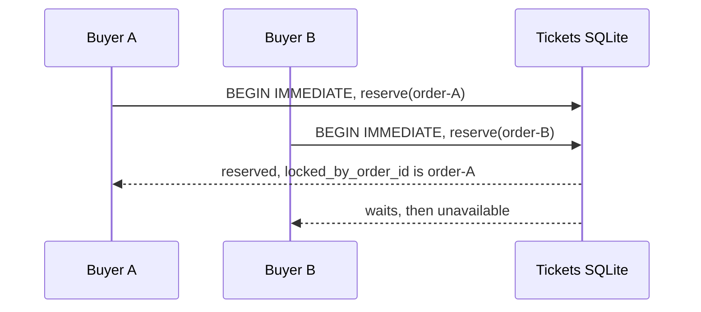

# 04 — Concurrency, Versioning, and Locks

[← Companion index](./index.md) · [Lecture map 314–450](./lecture-map-314-450.md)

## Goal

Given two requests, a retry, or a delayed event, explain which component is allowed to change state, which database predicate makes the change safe, and what durable evidence distinguishes a duplicate from stale work. You should be able to trace the answer to the current Orders and Tickets functions rather than to a generic Mongoose recipe.

## Course mapping

This module maps lectures **384–431**. The lecture titles below are copied from the authoritative local lecture list. A title is not proof of the video's exact implementation; rows marked as title-only inference say so instead of inventing details. `KEEP` means the underlying idea applies directly, `TRANSLATE` means the idea applies after replacing the course mechanism, `SKIP` means the item is obsolete or incidental for this repository, and `GAP` means the idea is useful but current implementation or proof is incomplete.

| Lecture | Exact title | Classification | What remains true in this project |
|---:|---|---|---|
| 384 | Heads Up Regarding Some Mongoose TS Errors | TRANSLATE | TypeScript still catches shape mistakes, but current evidence is concrete SQLite row/result types in [`order.ts`](../../../orders/src/orders/order.ts#L1-L21) and [`ticket.ts`](../../../tickets/src/tickets/ticket.ts#L1-L50), not Mongoose document types. |
| 385 | Time for Listeners! | TRANSLATE | A listener is still a long-running consumer, but the current implementation is [`startOrderEventsConsumer`](../../../tickets/src/orders/order-events-consumer.ts#L67-L209) over Redis Streams. |
| 386 | Reminder on Listeners | TRANSLATE | Retain the reminder that delivery code must validate, apply, and acknowledge in the right order; use [`parseEvent`](../../../tickets/src/orders/order-events-consumer.ts#L45-L58) and [`processEntry`](../../../tickets/src/orders/order-events-consumer.ts#L91-L107). |
| 387 | Blueprint for Listeners | TRANSLATE | The useful blueprint is a concrete Redis consumer: read, parse, transact, then `XACK`; there is no abstract Listener hierarchy. |
| 388 | A Few More Reminders | TRANSLATE | Retain at-least-once and restart thinking; pending-entry recovery is [`recoverPending`](../../../tickets/src/orders/order-events-consumer.ts#L124-L144). |
| 389 | Simple onMessage Implementation | TRANSLATE | The current analogue is `processEntry`, not an NATS `onMessage` callback: poison data is dead-lettered before ACK, valid data reaches [`applyOrderEventOnce`](../../../tickets/src/tickets/ticket-repo.ts#L611-L673). |
| 390 | ID Adjustment | TRANSLATE | Redis stream entry IDs are transport IDs. The stable application ID is `messageId`, copied from the Orders publication row by [`publishOrderEventPublication`](../../../orders/src/workers.ts#L137-L149). |
| 391 | Ticket Updated Listener Implementation | SKIP | `ticket.updated` is not a current event. Tickets receives only `order.completed` and `order.expired`, enforced by [`orderEventSchema`](../../../tickets/src/tickets/schemas.ts#L34-L46). |
| 392 | Initializing the Listeners | TRANSLATE | Listener startup becomes consumer-group creation plus pending recovery in `startOrderEventsConsumer`; it is not NATS subscription initialization. |
| 393 | A Quick Manual Test | GAP | A manual contention/replay test is a useful exercise, but this document does not claim that such a test has passed. |
| 394 | Clear Concurrency Issues | KEEP | The central problem is competing transitions on one Ticket or Order; see the race model and the guards below. |
| 395 | Reminder on Versioning Records | KEEP | Orders stores a positive `version`, and event ledgers store `aggregate_version`; the fields are evidence, not permission for an arbitrary consumer to mutate state. |
| 396 | Optimistic Concurrency Control | KEEP | The intent applies: make a change only if the durable row still matches the expected state. Current SQL uses guarded predicates rather than a plugin. |
| 397 | Mongoose Update-If-Current | TRANSLATE | Replace Mongoose's update-if-current plugin with guarded SQLite `UPDATE` statements and affected-row checks, for example [`schedulePurchase`](../../../orders/src/orders/order-repo.ts#L299-L328). |
| 398 | Implementing OCC with Mongoose | TRANSLATE | Keep the compare-and-set idea, not Mongoose. Orders uses [`beginPayment`](../../../orders/src/payments/payment-attempt-repo.ts#L55-L120) and Tickets uses `status` plus lock predicates. |
| 399 | Test functions cannot both take a done callback and return something Error | SKIP | This is test-framework/TypeScript trivia, not a concurrency invariant or a current production design decision. |
| 400 | Testing OCC | GAP | OCC-shaped behavior is present, but the repository does not prove all worker crash windows or contention cases with an integration test. Treat this as a drill. |
| 401 | One More Test | GAP | Title-only inference: this appears to add another listener/OCC test. There is no current evidence to claim its scenario passed; design the missing case yourself. |
| 402 | Who Updates Versions? | KEEP | The owner of an aggregate updates its version: Orders increments `orders.version` in its own state transitions; Tickets owns Ticket status and lock fields and currently has no Ticket version column. |
| 403 | Including Versions in Events | KEEP | Terminal Order facts carry both `eventVersion` and `aggregateVersion`; [`enqueueTerminal`](../../../orders/src/orders/order-repo.ts#L363-L417) records the Order version in the publication ledger. |
| 404 | Updating Tickets Event Definitions | TRANSLATE | Update the concrete [`OrderEvent`](../../../tickets/src/tickets/ticket.ts#L116-L127) type and Zod schema when a supported event changes; do not create a course-style common event base. |
| 405 | Property version is missing TS Errors After Running Skaffold | SKIP | The title describes a mechanism-specific compile/deployment interruption, not a reusable current invariant. Current event fields are already explicit and validated. |
| 406 | Applying a Version Query | GAP | A version predicate is valuable for a future ordered consumer, but the current consumer does not use `aggregateVersion` as a high-water mark. Its state guard is the matching Ticket lock. |
| 407 | Did it Work? | GAP | Title-only inference: this sounds like a behavior check. No generic version-ordering proof exists, so predict and measure it as an exercise rather than claim success. |
| 408 | Abstracted Query Method | SKIP | The project deliberately uses concrete functions such as `applyOrderEventOnce`, `reserveTicket`, and `enqueueTerminal`; an abstraction would hide the ownership rules without a second real implementation. |
| 409 | Optional: Versioning Without Update-If-Current | TRANSLATE | The project uses non-plugin compare-and-set guards (state, lock owner, expiry, retry count). It does **not** replace them with a generic version-only replay rule. |
| 410 | Testing Listeners | GAP | Current docs can specify tests, but listener crash-window and ACK-ordering integration tests are not proven by this module. |
| 411 | A Complete Listener Test | GAP | Title-only inference: a complete test is a useful target. The current durable behavior is evidenced in code, not by a claimed complete listener test. |
| 412 | Testing the Ack Call | GAP | ACK ordering is implemented—`XACK` follows the database transaction—but dedicated ACK-ordering tests remain a gap. |
| 413 | Testing the Ticket Updated Listener | SKIP | There is no Ticket Updated listener to test; the accepted stream facts are terminal Order events only. |
| 414 | Success Case Testing | GAP | A success path exists for reservation and convergence, but this assignment does not claim an automated success-case suite covers every race. |
| 415 | Out-Of-Order Events | GAP | Out-of-order delivery is a deliberate exercise. `aggregateVersion` is stored diagnostically, but no generic high-water mark or version-ordered replay exists. Lock matching can reject stale work without proving global event ordering. |
| 416 | The Next Few Videos | SKIP | Course navigation text has no current concurrency behavior to implement. |
| 417 | Fixing a Few Tests | SKIP | Test maintenance is not a design contract here; do not copy a test-only workaround as architecture. |
| 418 | Listeners in the Tickets Service | TRANSLATE | This maps to Tickets' Redis consumer and [`tickets-order-convergence`](../../../tickets/src/orders/order-events-consumer.ts#L7-L10) group, not a NATS listener class. |
| 419 | Building the Listener | TRANSLATE | Build the concrete `startOrderEventsConsumer`/`processEntry` flow, including `XAUTOCLAIM`, rather than a reusable listener framework. |
| 420 | Strategies for Locking a Ticket | KEEP | Ticket ownership is explicit: Tickets serializes writes and uses `status`, `locked_by_order_id`, `lock_expires_at`, constraints, and guarded updates. |
| 421 | Reserving a Ticket | KEEP | [`reserveTicket`](../../../tickets/src/tickets/ticket-repo.ts#L392-L466) is the authoritative reservation transition and returns reserved, replayed, conflict, unavailable, or not-found outcomes. |
| 422 | Setup for Testing Reservation | GAP | Reservation contention/replay tests are useful, but the current repository does not claim a completed integration test for every interleaving. |
| 423 | Test Implementation | GAP | Title-only inference: implement a future test around same-order replay and two-order contention; no test result is asserted here. |
| 424 | Missing Update Event | SKIP | The missing `ticket.updated` event is deliberate current scope, not a reason to add one. The only accepted terminal facts are `order.completed` and `order.expired`. |
| 425 | Private vs Protected Properties | SKIP | TypeScript visibility is incidental to this lesson; it does not decide who owns a state transition. |
| 426 | Publishing While Listening | TRANSLATE | The current split is Orders publishing durable terminal facts and Tickets listening/converging. It is not a single service's NATS publisher/listener demo. |
| 427 | Mock Function Arguments | SKIP | Mock argument assertions are not production evidence, and abstract/mock broker layers are explicitly out of scope. |
| 428 | Order Cancelled Listener | GAP | User-driven cancellation and `order.cancelled` are current gaps. Study the ownership question, but do not claim a cancellation listener exists. |
| 429 | A Lightning-Quick Test | GAP | A quick reservation/convergence smoke test is a future exercise; no unexecuted test is presented as proof. |
| 430 | Don't Forget to Listen! | TRANSLATE | Tickets starts its consumer through the service lifecycle; this is a Redis consumer-group requirement, not a NATS subscription reminder. |
| 431 | Rejecting Edits of Reserved Tickets | KEEP | [`updateTicketPrice`](../../../tickets/src/tickets/ticket-repo.ts#L270-L313) updates only owner-owned `available` rows, and the route returns `409 ticket_unavailable` for reserved or sold rows. |

The most important translation is **not** “replace one version number with another.” Retain the reasoning about competing transitions and stale work, then use the current database predicates and lock owner as the authority.

## Plain-language model

### 1. A race is two valid requests competing to change one fact

Imagine one ticket with status `available`. Buyer A and Buyer B can both read that old value. The unsafe design is to let both make a decision in application memory and then write `reserved`. The safe design gives the database a short write transaction and asks it to prove that the old condition still holds at the write.

The current writer is **Tickets**, because Tickets owns listing availability and reservation locks. Orders asks Tickets to reserve; Orders does not decide that its own request won. Orders also owns Order lifecycle and expiration. Redis transports accepted facts later, but Redis does not authorize either service's state transition.



`BEGIN IMMEDIATE` asks SQLite for the write lock before the transaction reads and decides. A second writer waits or fails according to the database timeout; after A commits, B must read the now-current row. This is local SQLite write serialization, not proof that a horizontally scaled Kubernetes deployment has been tested or that Redis ordering can replace a database guard.

### 2. Constraints are a second line of defense

Application code explains an allowed transition. SQLite constraints make impossible combinations fail even if a future caller gets the code wrong.

Tickets' rebuilt table requires these combinations ([`002_rebuild_ticket_locks_and_inbox.sql`](../../../tickets/migrations/002_rebuild_ticket_locks_and_inbox.sql#L1-L40)):

- `available` means both lock columns are `NULL`.
- `reserved` means `locked_by_order_id` and `lock_expires_at` are both present.
- `sold` means the order lock remains as evidence, but `lock_expires_at` is cleared.
- A partial unique index allows at most one ticket row to hold a given non-null order ID.

Orders' table checks valid statuses and a positive `version` ([`006_rebuild_orders.sql`](../../../orders/migrations/006_rebuild_orders.sql#L4-L14)). Its immutable trigger rejects changes to identity, ticket, amount, expiry, and captured snapshot fields ([same migration](../../../orders/migrations/006_rebuild_orders.sql#L58-L68)). A constraint is not a workflow: it cannot decide whether a payment is allowed, but it prevents an invalid row from being committed.

### 3. A guarded update is a small compare-and-set

A guarded update says: “change this row **only if** it still has the expected state and owner.” The affected-row count is the answer.

For example, `releaseReservation` updates only when all of these remain true:

```sql
WHERE id = ?
  AND status = 'reserved'
  AND locked_by_order_id = ?
```

That exact predicate prevents an old Order from unlocking a newer reservation. [`applySoldConvergence`](../../../tickets/src/tickets/ticket-repo.ts#L566-L586) and [`applyReleaseConvergence`](../../../tickets/src/tickets/ticket-repo.ts#L588-L609) use the same idea for terminal Order facts. If the row count is not one, the code does not silently claim a transition happened.

Orders uses the same intent without a Mongoose plugin:

- [`beginPayment`](../../../orders/src/payments/payment-attempt-repo.ts#L88-L120) changes `pending` to `payment_processing` only for the owned Order whose deadline is still in the future, then creates the processing attempt in one transaction.
- [`resolveAttempt`](../../../orders/src/payments/payment-attempt-repo.ts#L161-L229) changes only a `processing` attempt and a `payment_processing` Order, and records a terminal publication in that transaction.
- [`completePurchase`](../../../orders/src/orders/order-repo.ts#L210-L279) re-reads the purchase operation, checks state, deadline, and reservation deadline, inserts the Order snapshot, then guards the operation's `reserving -> completed` transition.
- [`schedulePurchase`](../../../orders/src/orders/order-repo.ts#L299-L328) compares state and retry count so an older worker cannot overwrite newer retry bookkeeping.

The word “optimistic” describes the assumption that a conflict is uncommon and can be detected at the write. It does not mean “skip the transaction,” “trust the caller,” or “let Redis decide.”

## Current StubHub flow

### Owners and versions

| Fact | Owner | Current guard/version behavior |
|---|---|---|
| Listing availability, reservation, release, sold state, edit eligibility | Tickets | `reserveTicket`, `releaseReservation`, `applySoldConvergence`, `applyReleaseConvergence`, and `updateTicketPrice` use `BEGIN IMMEDIATE`, status predicates, and `locked_by_order_id`. Ticket rows have no generic `version` field. |
| Purchase operation and Order lifecycle | Orders | `createPurchase`, `completePurchase`, `beginPayment`, `resolveAttempt`, `enqueueTerminal`, and expiration use Orders SQLite transactions and state/deadline predicates. `orders.version` increments when the Order lifecycle changes. |
| Transporting accepted terminal facts | Orders publication worker plus Tickets consumer | Orders creates `order.completed`/`order.expired` publication rows with one `eventVersion` and the Order's `aggregateVersion`; Tickets validates and records them. Redis is transport, not authority. |
| Duplicate application evidence | Tickets | [`applyOrderEventOnce`](../../../tickets/src/tickets/ticket-repo.ts#L611-L673) checks `(consumer, message_id)` in `processed_order_events` and records outcome plus aggregate diagnostics in the same transaction as the Ticket effect. |

Orders' [`withTransaction`](../../../orders/src/database.ts#L149-L166) is a process-wide Orders SQLite connection wrapped in `BEGIN IMMEDIATE`, `COMMIT`, and `ROLLBACK`. Tickets uses the same explicit transaction shape in `reserveTicket`, `releaseReservation`, and `applyOrderEventOnce`. The point is atomic durable state, not a reusable framework.

### Event schema version versus aggregate version

These names answer different questions:

1. **`eventVersion`** asks, “Which shape of this event should I parse?” The current schema accepts only event version `1` and only `order.completed` or `order.expired` ([`orderEventSchema`](../../../tickets/src/tickets/schemas.ts#L34-L46)). A future shape change would need a deliberate schema/version migration.
2. **`aggregateVersion`** asks, “What was the Order's local `version` when this fact was committed?” The Orders terminal transition increments `orders.version`, stores that number in `order_event_publications.aggregate_version`, and places it in the Redis envelope ([`enqueueTerminal`](../../../orders/src/orders/order-repo.ts#L369-L414), [`publishOrderEventPublication`](../../../orders/src/workers.ts#L140-L149)).
3. **The Tickets processed-event ledger** records `aggregate_version` for evidence and diagnostics ([`002_rebuild_ticket_locks_and_inbox.sql`](../../../tickets/migrations/002_rebuild_ticket_locks_and_inbox.sql#L42-L65)); it does not currently maintain a per-Order “highest version seen” row.

**Explicit current limitation:** `aggregateVersion` is validated as a positive number and stored diagnostically, but there is **no generic aggregate-version high-water mark and no version-ordered replay mechanism**. A valid event with an older aggregate version is not rejected merely because its number is old. State safety comes from the local guarded transition, especially the matching Ticket lock. Do not turn the diagnostic field into an implied ordering contract.

### Duplicate versus stale

A **duplicate** is the same application fact delivered again. Orders gives a publication a stable `messageId` (the publication row ID). If Redis receives a second stream entry because the worker crashed after `XADD` but before `published_at`, the transport IDs differ but `messageId` is the same. Tickets finds that `(tickets-order-convergence, messageId)` already exists and returns `{ duplicate: true }` without applying another business effect.

A **stale event** is a valid fact that no longer matches the local state it wants to change. Suppose an `order.expired` for Order A arrives after a ticket has been reserved by Order B. The event can pass schema validation and still be stale for this Ticket. `convergenceOutcome` sees `locked_by_order_id !== event.aggregateId`, returns `not_matching`, and `applyOrderEventOnce` records that outcome without releasing B's lock.

These protections are independent:

- The processed-event primary key answers, “Have I processed this exact message before?”
- The lock-owner predicate answers, “Does this event still have authority over this Ticket row?”
- `aggregateVersion` is recorded evidence, **not** a generic stale-message decision.

### Reservation replay and conflict

The internal reservation route delegates to [`reserveTicket`](../../../tickets/src/http/routes/internal-ticket-reservations.ts#L18-L65), which calls the Tickets repository in a write transaction:

1. Missing Ticket → `not_found`.
2. Same Ticket already reserved by the same `orderId` with the same expiry → `replayed`, returning the durable reservation snapshot.
3. Same Ticket and same `orderId` but a different expiry → `conflict`; this prevents one Order from silently changing its reservation deadline.
4. Ticket is not `available` → `unavailable`.
5. The requested Order already locks another Ticket → `unavailable`; this is the one-order-per-ticket guard.
6. Otherwise, the guarded `available -> reserved` update stores `locked_by_order_id = orderId` and `lock_expires_at = expiresAt`.

Orders' [`processPurchase`](../../../orders/src/orders/purchase-workflow.ts#L141-L190) treats a successful reservation as input to `completePurchase`. A known business failure (`ticket_not_found`, `ticket_unavailable`, or `reservation_conflict`) becomes a durable rejection. A transient error becomes retryable purchase work. `completePurchase` checks that the reservation deadline still equals the durable purchase operation deadline before it creates the Order snapshot, so a replay cannot complete a mismatched reservation.

### Release and sold transitions

Only a matching lock can move a reserved Ticket:

- A direct Orders release calls [`releaseReservation`](../../../tickets/src/tickets/ticket-repo.ts#L490-L539). It returns `not_matching` for another Order, `sold` for a terminal Ticket, and `already_available` when the release has already happened.
- An `order.completed` fact calls [`applySoldConvergence`](../../../tickets/src/tickets/ticket-repo.ts#L566-L586), requiring `status = 'reserved'` and `locked_by_order_id = event.aggregateId` before setting `sold` and clearing the expiry.
- An `order.expired` fact calls [`applyReleaseConvergence`](../../../tickets/src/tickets/ticket-repo.ts#L588-L609), requiring the same matching lock before setting `available` and clearing both lock fields.

The event consumer validates first, applies the Ticket transition and processed-event receipt in one SQLite transaction, then ACKs Redis. [`processEntry`](../../../tickets/src/orders/order-events-consumer.ts#L91-L107) leaves a valid entry pending if the transaction throws; [`recoverPending`](../../../tickets/src/orders/order-events-consumer.ts#L124-L144) later uses `XAUTOCLAIM`. This gives recovery, not global event ordering.

### Reserved and sold edits are rejected

A seller may edit price only while the Ticket is available. [`updateTicketPrice`](../../../tickets/src/tickets/ticket-repo.ts#L270-L313) begins an immediate transaction and executes an owner-plus-status guard:

```sql
WHERE id = ? AND owner_id = ? AND status = 'available'
```

If one row changes, the price is returned. If the owner/Ticket pair does not exist, the route returns `404`. If it exists but is reserved or sold, the repository returns `unavailable` and [`PATCH /tickets/:ticketId/price`](../../../tickets/src/http/routes/update-ticket-price.ts#L14-L65) returns `409 ticket_unavailable`. This protects the price snapshot used by an active purchase and prevents changes after sale. It is a state rule owned by Tickets, not a version check delegated to Orders or Redis.

## Failure analysis

| Situation | Safe current outcome | What is not proven |
|---|---|---|
| Two reservation requests race | `BEGIN IMMEDIATE` and the `status = 'available'` update guard allow one reservation; the other observes a non-available row and returns `unavailable`. | A horizontally scaled Tickets deployment has not been proven with contention tests. |
| Same reservation request is retried | Same `orderId` and same expiry returns `replayed` with the stored snapshot. | This does not make a changed expiry valid; that is `conflict`. |
| Older Order tries to release after a newer lock | `locked_by_order_id = orderId` fails, yielding `not_matching`; the newer lock stays intact. | Redis stream order alone is not an authorization mechanism. |
| Orders worker crashes after `XADD` before `published_at` | A later worker scan republishes the same publication `id`; Tickets' processed-event ledger deduplicates the second delivery. | The duplicate-publication crash window is not covered by a claimed integration test here. |
| Tickets consumer commits before `XACK`, then crashes | Redis redelivers the pending entry; `(consumer, message_id)` is already recorded, so no second Ticket effect occurs. | ACK-ordering tests are a current gap. |
| Tickets consumer crashes before commit | The transaction rolls back. The entry remains pending and can be reclaimed with `XAUTOCLAIM`. | Consumer-aware readiness/liveness is not implemented or proven. |
| Poison event arrives | Schema parsing fails, the raw entry is written to `orders.events.dead-letter`, then ACKed; no Ticket state is changed. | Dead-letter operational monitoring is not established by this module. |
| Payment and expiration compete | `beginPayment` requires `pending` plus a future deadline; expiration requires `pending` plus an elapsed deadline. SQLite serializes the writers, so one guarded transition wins. If payment is already `payment_processing`, the expiration scan does not change it; payment resolution handles the result. | This behavior still needs dedicated race tests; do not infer a generic scheduler guarantee. |
| Process restarts with unfinished work | Durable purchase/payment rows and publication rows are scanned again; Tickets pending Redis entries are reclaimed. | Production-high-availability Redis and horizontally scaled consumer behavior are not proven. |
| Event has an old `aggregateVersion` | The number is validated and recorded, but no generic high-water mark rejects it. The Ticket's local lock/status guard decides whether a state change is still safe. | Version-ordered replay remains an explicit gap. |

The practical rule is: **retry durable work, re-read local state, and let the owner’s guarded transaction decide.** Never “fix” a conflict by trusting the Redis position, an in-memory boolean, or a caller-provided version.

## What not to copy

- Do not add Mongoose documents, references, `updateIfCurrent` plugins, or document methods. SQLite rows, constraints, transactions, and guarded predicates provide the current equivalent.
- Do not introduce abstract `Listener` or `Publisher` classes, a singleton broker wrapper, or mock-only hierarchy to imitate the course. The current flow uses concrete functions.
- Do not add a `ticket.updated` or `order.cancelled` listener just because a lecture names one. The accepted cross-service terminal facts are `order.completed` and `order.expired`; cancellation is a current gap.
- Do not make `aggregateVersion` a hidden high-water mark. It is validated and recorded diagnostically today; generic version-ordered replay is not implemented.
- Do not claim Redis ordering authorizes a transition. Orders and Tickets make decisions in their own SQLite transactions; Redis only carries accepted facts.
- Do not claim horizontal behavior is proven because one process uses `BEGIN IMMEDIATE`. Replica, consumer-group, readiness, and production Redis behavior require separate evidence.
- Do not allow price edits on reserved or sold Tickets. That would violate the Tickets-owned state rule and could invalidate an Order's captured price evidence.

## Practice

### Exercise 1 — reservation contention

Start with one `available` Ticket and two distinct Order IDs. Predict, before reading the result:

1. Which call can return `reserved`?
2. What does the second call return after the first commits?
3. Which exact SQL predicate prevents both from winning?
4. What row values prove the winner (`status`, `locked_by_order_id`, and `lock_expires_at`)?

Then trace [`reserveTicket`](../../../tickets/src/tickets/ticket-repo.ts#L402-L461) and write the answer in your own words. Do not use Redis stream order as an answer.

### Exercise 2 — replay versus conflict

Use the same Ticket and Order ID three times: first with expiry `E`, then again with `E`, then with expiry `E + 60_000`. Predict `reserved`, `replayed`, and `conflict`. Explain why allowing the third call to overwrite the deadline would make an Orders retry unsafe.

### Exercise 3 — duplicate versus stale

Create two envelopes for a Ticket currently reserved by Order B:

- Event A: `messageId = M`, `aggregateId = A`, `eventType = order.expired`.
- A second delivery of Event A with a different Redis stream ID but the same `messageId = M`.

Predict the first outcome (`not_matching`) and the second outcome (`duplicate: true`). State which ledger column/constraint handles each case. Then change only `messageId` and predict why the lock guard still protects Order B.

### Exercise 4 — version vocabulary

Without looking at the code, complete these sentences:

- `eventVersion` tells a parser __________________.
- `aggregateVersion` tells a reader __________________.
- The current Tickets consumer uses `aggregateVersion` to __________________.
- The current Tickets consumer instead protects a transition by __________________.

Check against [`orderEventSchema`](../../../tickets/src/tickets/schemas.ts#L34-L46), [`OrderEvent`](../../../tickets/src/tickets/ticket.ts#L116-L127), and [`applyOrderEventOnce`](../../../tickets/src/tickets/ticket-repo.ts#L618-L668).

## Checkpoint

Close this file and write a short answer to each prompt:

1. Why does the state owner, not the broker, decide whether a transition is legal?
2. What does `BEGIN IMMEDIATE` protect, and what does it not prove?
3. Give one example of a constraint and one example of a guarded `UPDATE` predicate.
4. Who increments `orders.version`, and why does Tickets have a `locked_by_order_id` guard instead of borrowing an Order version?
5. Distinguish `eventVersion`, `aggregateVersion`, duplicate delivery, and stale work.
6. What happens when the same reservation is replayed with the same expiry versus a different expiry?
7. Why are reserved and sold price edits rejected?
8. State the current aggregate-version limitation without turning it into a hidden capability.

A good checkpoint answer names at least these functions: `reserveTicket`, `releaseReservation`, `applyOrderEventOnce`, `beginPayment`, `completePurchase`, and `enqueueTerminal`.

## Exit gate

You can leave this lesson when you can do all of the following without opening the module:

- Draw the Buyer A/Buyer B reservation race and annotate the owner, transaction boundary, and winning predicate.
- Trace one successful reservation from Orders' `processPurchase` to Tickets' `reserveTicket`, including replay and conflict outcomes.
- Explain why a repeated `messageId` is a duplicate while a different `messageId` with a mismatched `locked_by_order_id` is stale/not matching.
- Point to the exact place where Orders increments/stores its version and the exact place where Tickets records aggregate-version diagnostics.
- Predict the result of editing a reserved or sold Ticket and name the HTTP status/code.
- Say clearly: **aggregateVersion is validated and recorded diagnostically, but no generic high-water mark or version-ordered replay exists; Redis ordering alone does not authorize state changes; horizontal behavior is not proven.**

For the next review, repeat the checkpoint tomorrow, on day three, and one week later. On each repetition, add one failure case and its durable evidence rather than memorizing lecture vocabulary.
