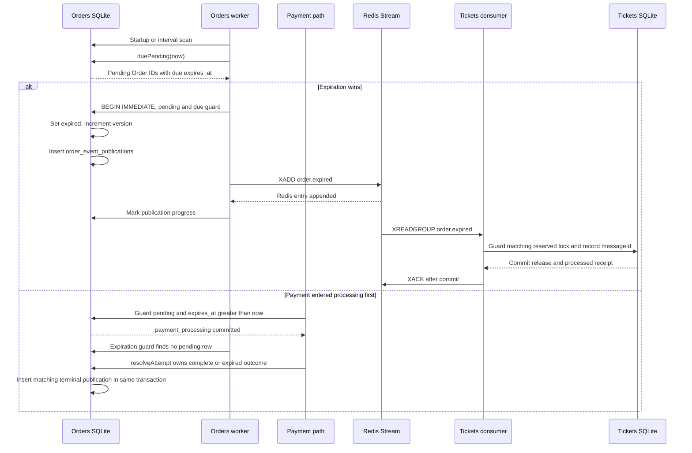

# 05. Expiration Without an Expiration Service

[Async companion index](./index.md) · [Lecture map 314–450](./lecture-map-314-450.md)

## Goal

Given an Order deadline, explain who decides that the Order expired, how that
decision survives a process restart, how a payment race is settled, and how the
expired fact eventually releases the matching Ticket reservation. You should
also be able to explain why the current Orders-internal choice is a local
fit—not a universal rule for every system.

## Course mapping: lectures 432–450

The course's expiration sequence is useful for learning durable delayed work,
but its technology and service boundary are not automatically this project's
design. The rows below use the exact supplied lecture titles. Where a title does
not establish the video's implementation, the mapping is explicitly a
title-only inference.

| Lecture | Classification | What to retain, translate, or leave out | Current StubHub evidence and learner action |
|---|---|---|---|
| **432 — The Expiration Service** | `TRANSLATE` | Retain the question “which owner changes expired state?” Translate the answer from a separate service to Orders. | Orders owns lifecycle and expiration in [`scanExpiration`](../../../orders/src/workers.ts#L74-L80) and [`enqueueTerminal`](../../../orders/src/orders/order-repo.ts#L363-L416). Trace those functions instead of creating a service. |
| **433 — Expiration Options** | `TRANSLATE` | Retain comparison of wake-up mechanisms. Translate the authoritative mechanism to a persisted deadline plus a due query. The exact video options are a title-only inference. | Compare the non-authoritative options below with [`duePending`](../../../orders/src/orders/order-repo.ts#L346-L361) and the worker interval in [`startWorkers`](../../../orders/src/workers.ts#L217-L226). |
| **434 — Initial Setup** | `SKIP` | Course scaffolding is not current application behavior. The title does not prove any reusable expiration contract. | No separate expiration package or setup is evidence to copy. Read only as historical context, then follow the current Orders files. |
| **435 — Skaffold errors - Expiration Image Can't be Pulled** | `SKIP` | A course-specific image/build failure is not an expiration design. This is title-only course context. | Do not add an Expiration image or Kubernetes workload. The current worker starts with Orders in [`orders/src/index.ts`](../../../orders/src/index.ts#L17-L48). |
| **436 — A Touch of Kubernetes Setup** | `SKIP` | Infrastructure for a separate course service is not required for the current boundary. This is title-only course context. | Do not add a deployment. The current worker is part of Orders and uses the existing service lifecycle. |
| **437 — File Sync Setup** | `SKIP` | Course development file-sync details do not define durable expiration semantics. This is title-only course context. | Skip the scaffolding and inspect the persisted Orders schema and worker instead. |
| **438 — Listener Creation** | `TRANSLATE` | Retain the idea that durable work needs a repeatedly running processor. Translate a generic listener into concrete Orders scan functions. The exact listener shape is title-only inference. | [`scan`](../../../orders/src/workers.ts#L195-L215) invokes `scanExpiration`; there is no abstract Listener hierarchy to reproduce. |
| **439 — What's Bull All About?** | `TRANSLATE` | Retain Bull's conceptual question—how does delayed work become due? Translate the product to SQLite state and a query. Do not install Bull. | [`orders.expires_at`](../../../orders/migrations/006_rebuild_orders.sql#L4-L14), its due index, and [`duePending`](../../../orders/src/orders/order-repo.ts#L346-L361) provide the current delayed-work mechanism. |
| **440 — Creating a Queue** | `TRANSLATE` | Retain bounded durable work selection. Translate a queue object into rows selected by `status='pending'` and `expires_at<=now`. | [`duePending`](../../../orders/src/orders/order-repo.ts#L346-L361) orders by deadline and ID and limits a batch to 100. There is no second queue service. |
| **441 — Queueing a Job on Event Arrival** | `TRANSLATE` | Retain “record work before relying on a later worker.” Translate an event-arrival job into the Order's persisted deadline and state. The exact event chain is title-only inference. | [`createPurchase`](../../../orders/src/orders/order-repo.ts#L179-L207) persists a deadline for the reservation operation, and [`completePurchase`](../../../orders/src/orders/order-repo.ts#L210-L279) carries it into the Order. Do not invent an `order.created` event. |
| **442 — Testing Job Processing** | `GAP` | Retain the need for observable worker proof. Current source has the worker path, but this repository does not yet prove it with worker crash-window integration tests. | Treat [`scanExpiration`](../../../orders/src/workers.ts#L74-L80) as an exercise target. Do not claim this lecture's job-processing tests passed. |
| **443 — Delaying Job Processing** | `TRANSLATE` | Retain delayed execution, not Bull's timer implementation. Translate the delay into an absolute persisted deadline and polling. | `ORDER_EXPIRATION_MS` is read in [`order-repo.ts`](../../../orders/src/orders/order-repo.ts#L56-L68), and `duePending` checks the deadline. |
| **444 — Defining the Expiration Complete Event** | `TRANSLATE` | Retain a durable terminal fact. Translate an intermediate expiration-complete event into the accepted `order.expired` fact. | [`enqueueTerminal`](../../../orders/src/orders/order-repo.ts#L363-L416) changes the Order to `expired`, increments its version, and creates an `order.expired` publication row in the same transaction. |
| **445 — Publishing an Event on Job Processing** | `TRANSLATE` | Retain publication after a durable state change. Translate a direct job callback into the Orders publication ledger and Redis Streams publisher. | [`publishOrderEventPublication`](../../../orders/src/workers.ts#L129-L162) performs `XADD` to `orders.events` before [`markOrderEventPublished`](../../../orders/src/messaging/order-event-publication-repo.ts#L105-L119). |
| **446 — Handling an Expiration Event** | `TRANSLATE` | Retain consumer-side convergence. Translate the course listener into the concrete Tickets consumer and a guarded release. | [`applyOrderEventOnce`](../../../tickets/src/tickets/ticket-repo.ts#L611-L673) validates the stable message receipt and calls [`applyReleaseConvergence`](../../../tickets/src/tickets/ticket-repo.ts#L588-L608) for a matching reserved lock. |
| **447 — Emitting the Order Cancelled Event** | `SKIP` for this expiration path | Do not copy an `order.cancelled` intermediate event into the current terminal path. User-driven cancellation is a separate current project gap, not evidence that expiration should emit cancellation. The exact course chain is title-only inference. | The accepted expiration fact is `order.expired`; only `order.completed` and `order.expired` cross to Tickets. Study the distinction, then skip implementing a cancellation event. |
| **448 — Testing the Expiration Complete Listener** | `GAP` | Retain listener-test intent, but mark the missing proof honestly. Current consumer code exists; an expiration-specific crash-window/integration test is not established here. | The exercise target is [`startOrderEventsConsumer`](../../../tickets/src/orders/order-events-consumer.ts#L67-L209) plus [`applyOrderEventOnce`](../../../tickets/src/tickets/ticket-repo.ts#L611-L673). No passing test claim is made. |
| **449 — A Touch More Testing** | `GAP` | Retain testing of duplicate, restart, and acknowledgement boundaries. The current repository does not yet prove those worker/listener windows with integration tests. | Use the failure drills in this module and the runtime-proof module. Source behavior is evidence; it is not a test result. |
| **450 — Listening for Expiration** | `TRANSLATE` | Retain the consumer responsibility. Translate the course listener boundary into the existing Redis consumer group. Keep the proof gap from lectures 448–449 visible. | [`tickets-order-convergence`](../../../tickets/src/orders/order-events-consumer.ts#L7-L10) reads `orders.events`, and `processEntry` ACKs only after [`applyOrderEventOnce`](../../../tickets/src/tickets/ticket-repo.ts#L611-L673) returns. |

The detailed exhaustive classification remains in the [lecture map](./lecture-map-314-450.md).

## Plain-language model: a deadline is a promise to check, not a timer to trust

An unpaid Order has a rule like this:

> Once the persisted `expires_at` time has arrived, a still-`pending` Order may
> become `expired`.

The time is data owned by Orders. A worker is only a janitor that wakes up and
asks the database, “Which pending Orders are overdue?” The worker may be late,
stop, or restart. None of those changes the deadline already stored in SQLite.

That distinction separates **authority** from **wake-up**:

- **Authority:** the Orders row, its `status`, its immutable `expires_at`, and the
  guarded SQL transition.
- **Wake-up:** `startWorkers`' startup scan and `setInterval` recurring scan.
- **Delivery:** the publication ledger, Redis Streams, and the Tickets consumer.

The current choice keeps expiration with Orders because expiration changes Order
state and decides which terminal Order fact is true. Tickets still owns the
Ticket lock and availability. A separate service would not become authoritative
merely by being named “Expiration.”

## Current StubHub flow

### 1. Orders persists the deadline

The purchase operation calculates `expiresAt` from `ORDER_EXPIRATION_MS` in
[`createPurchase`](../../../orders/src/orders/order-repo.ts#L179-L207). When the
authoritative Ticket reservation succeeds, [`completePurchase`](../../../orders/src/orders/order-repo.ts#L210-L279)
inserts the Order with that same deadline. The Orders schema makes `expires_at`
required and allows the lifecycle values `pending`, `payment_processing`,
`complete`, and `expired` ([migration 006](../../../orders/migrations/006_rebuild_orders.sql#L4-L14)).

There are two related durable recovery paths:

1. Before an Order row exists, `purchase_operations.expires_at` lets
   [`processPurchase`](../../../orders/src/orders/purchase-workflow.ts#L141-L190)
   notice an expired reservation operation and enter `processRelease`.
2. After the Order is inserted, `orders.expires_at` and `status='pending'` are
   the expiration decision scanned by `scanExpiration`.

The first path cleans up an unfinished reservation attempt. The second path is
the Order expiration path taught in this module.

### 2. A startup scan and an interval scan find due Orders

[`startWorkers`](../../../orders/src/workers.ts#L217-L226) awaits one `scan()`
before installing the recurring interval. [`scan`](../../../orders/src/workers.ts#L195-L215)
runs purchase recovery, payment reconciliation, expiration, and publication
scans without overlapping another scan in this process.

`scanExpiration` captures one `now`, asks [`duePending`](../../../orders/src/orders/order-repo.ts#L346-L361)
for at most 100 pending IDs with `expires_at <= now`, and calls
`enqueueTerminal(id, "order.expired", now)` for each. The partial index
`orders_due_pending` ([migration 006](../../../orders/migrations/006_rebuild_orders.sql#L52-L56))
keeps this query shaped around due pending work rather than a full table sweep.

The interval affects **how soon** an overdue row is noticed. It does not decide
whether the row is eligible. That decision is repeated in the guarded SQL.

### 3. SQLite closes the expiration race atomically

`enqueueTerminal` runs through [`withTransaction`](../../../orders/src/database.ts#L149-L166),
which uses `BEGIN IMMEDIATE`, `COMMIT`, and `ROLLBACK`. For `order.expired`, it
executes the equivalent of:

```sql
UPDATE orders
SET status = 'expired', version = version + 1, updated_at = :now
WHERE id = :orderId
  AND status = 'pending'
  AND expires_at <= :now
RETURNING ...;
```

Only a row returned by that guarded update is allowed to continue. In the same
transaction, Orders inserts an `order_event_publications` row containing the
Order aggregate ID and the Ticket ID payload. Therefore these two facts commit
together:

1. the Order is terminally `expired`; and
2. the durable work to publish `order.expired` exists.

If either operation fails, `withTransaction` rolls both back. There is no state
in which the Order is durably expired but the Orders publication work was never
recorded.

### 4. Payment processing has a deliberate race boundary

The relevant race is not “which timer fired first?” It is “which guarded state
transition committed first?”

[`beginPayment`](../../../orders/src/payments/payment-attempt-repo.ts#L55-L120)
changes an Order only when its transaction can match:

```sql
WHERE id = :orderId
  AND user_id = :userId
  AND status = 'pending'
  AND expires_at > :now
```

It then creates one processing Payment Attempt. Expiration changes only a row
that is still `pending` and already due. Consequently:

- If expiration commits first, `beginPayment` cannot move the Order to
  `payment_processing`; the payment request is not payable.
- If payment commits first while the deadline is still in the future,
  `enqueueTerminal(..., "order.expired", ...)` cannot overwrite
  `payment_processing`.
- [`resolveAttempt`](../../../orders/src/payments/payment-attempt-repo.ts#L146-L236)
  owns the next transition from `payment_processing`. A successful provider
  result makes the Order `complete`. A declined result makes it `pending` when
  still unexpired, or `expired` when the deadline has passed.
- When `resolveAttempt` produces `complete` or `expired`, it inserts the matching
  publication row in that same transaction.

This is a policy choice in the current code: a payment that entered
`payment_processing` before the deadline is not claimed by the pending-only
expiration scan. Other products may choose a different payment policy, but they
must still define and guard the competing transitions.

### 5. `order.expired` is the accepted terminal fact

The current design does not publish an intermediate “expiration complete” fact
and then ask another service to emit cancellation. `enqueueTerminal` writes the
accepted event type `order.expired`, with the Order version as its aggregate
version and `{ ticketId }` as its payload.

The Orders publisher later runs [`scanOrderEventPublications`](../../../orders/src/workers.ts#L164-L193):

1. load unpublished rows whose `next_attempt_at` is due;
2. connect to Redis if needed;
3. `XADD` the envelope to `orders.events`;
4. only then mark the row's `published_at`; or
5. record retry metadata if connection/publication fails.

This is the Orders event publication ledger (the **outbox pattern** in industry
vocabulary). A crash after `XADD` but before `published_at` can produce a
second Redis entry, so the stable publication ID remains the application
`messageId` and Tickets must deduplicate it.

### 6. Tickets releases only the matching reservation

Tickets consumes `orders.events` through the
`tickets-order-convergence` consumer group. For a valid `order.expired` event,
[`applyOrderEventOnce`](../../../tickets/src/tickets/ticket-repo.ts#L611-L673)
starts a SQLite transaction, checks `processed_order_events`, classifies the
current Ticket, and applies a release only when the Ticket is `reserved` and
`locked_by_order_id` equals the event's `aggregateId`.

[`applyReleaseConvergence`](../../../tickets/src/tickets/ticket-repo.ts#L588-L608)
uses the same predicates in its `UPDATE`:

```sql
WHERE id = :ticketId
  AND status = 'reserved'
  AND locked_by_order_id = :orderId
```

Then `applyOrderEventOnce` inserts the processed-event receipt and commits both
the Ticket effect and receipt together. The Redis consumer's
[`processEntry`](../../../tickets/src/orders/order-events-consumer.ts#L91-L107)
sends `XACK` only after that transaction succeeds.

A stale expiration cannot unlock a newer reservation: if `locked_by_order_id`
does not match, the outcome is `not_matching` and no Ticket row changes. An
already available Ticket, a sold Ticket, or a missing Ticket likewise produces
a durable non-mutating outcome rather than an unsafe unlock.

There is also a direct internal release path. When an unfinished reservation
operation expires before an Order is completed, `processRelease` calls
[`release`](../../../orders/src/tickets-client.ts#L208-L227), which reaches
Tickets' guarded [`releaseReservation`](../../../tickets/src/tickets/ticket-repo.ts#L490-L538).
That is cleanup for a purchase operation. The completed Order expiration path
uses the `order.expired` fact and Tickets convergence described above.

## One useful visual: race winner and durable release



## Why common expiration mechanisms are not authoritative

| Mechanism | What it can do | Why it cannot decide Order state |
|---|---|---|
| `setTimeout` in Orders | Wake one process near a deadline. | The process can crash, restart, stall, or have many timers. A timer callback is not durable state and cannot safely settle the payment race. |
| Browser countdown | Show a buyer an approximate remaining-time display. | The browser can close or disconnect, clocks can differ, and the client is not the Orders owner. A client display must never expire an Order. |
| Redis key-expiration notifications | Notify a subscriber that a Redis key expired. | Notifications are not the Orders SQLite transaction, can be missed while disconnected, and do not prove the guarded Order transition or publication row committed. Redis is used here for event transport, not Order authority. |
| Orders SQLite deadline plus due query | Preserve the deadline across restart and let a worker discover due rows. | This is the current authority. The interval can be late; the guarded transaction still prevents an invalid transition. |

The lesson is not “never use a timer.” A timer can improve responsiveness or
refresh a display. The lesson is “a wake-up signal must not be the source of
truth for a business transition.”

## Translating Bull without adding Bull

The course's Bull material can teach a real question: how does work become due
later without keeping an HTTP request open? In the current repository, the
smallest durable answer is already present:

- the deadline is a SQLite integer in `orders.expires_at`;
- the pending state is a SQLite value constrained by the schema;
- `orders_due_pending` indexes the due lookup;
- `duePending(now)` selects a bounded batch; and
- `scanExpiration` retries the same durable query after restart.

A Bull job would be a second representation of information Orders already owns.
Adding it would introduce another persistence and failure boundary without
solving a current requirement. The current design therefore translates “queue a
delayed expiration job” into “persist the deadline and scan due rows.” It does
not claim SQLite polling is the best option universally. A much larger workload,
independent scaling needs, a separately owned scheduling domain, or a required
queue feature could justify a different boundary after those requirements are
measured and designed.

## Failure analysis

| Failure or race | Durable result and recovery owner |
|---|---|
| Worker crashes before `enqueueTerminal` commits | The pending Order remains. A later startup/interval `duePending` scan retries it. |
| Worker crashes after the Order transition and publication-row insert | Both changes committed atomically. The Orders publication worker owns Redis delivery. |
| Orders crashes after `XADD` but before `published_at` | The row remains unpublished and is retried. Redis may contain a duplicate transport entry with the same application `messageId`; Tickets' `processed_order_events` ledger owns deduplication. |
| Redis is unavailable while publishing | `recordOrderEventPublicationFailure` stores retry timing/error. The next Orders scan owns recovery. |
| Payment starts before deadline, then expiration scan runs | Expiration's `status='pending'` guard cannot overwrite `payment_processing`. `resolveAttempt` owns the processing outcome. |
| Payment starts after expiration commits | `beginPayment`'s status and `expires_at > now` guard returns not payable. |
| Payment decline arrives after the deadline | `resolveAttempt` transitions `payment_processing` directly to `expired` and inserts `order.expired` publication atomically. |
| Duplicate `order.expired` delivery | `applyOrderEventOnce` finds the same consumer/message receipt and performs no second business effect. |
| Tickets crashes before its transaction commits | Redis leaves the entry pending. The consumer can retry or reclaim it. |
| Tickets crashes after its transaction commits but before `XACK` | Redelivery is safe because the processed-event receipt deduplicates the message. [`recoverPending`](../../../tickets/src/orders/order-events-consumer.ts#L125-L144) uses `XAUTOCLAIM`. |
| Expiration is stale against a newer Ticket reservation | `applyReleaseConvergence` requires the exact `locked_by_order_id`, so the newer reservation is not unlocked. |
| Current worker/listener behavior is not integration-proven | This remains a `GAP`: source inspection describes intended behavior, but no claim is made that crash-window, ACK-ordering, or expiration-listener integration tests have passed. |

## What not to copy

- Do not add a separate Expiration service just because the course names one.
  Expiration changes Orders-owned state in this project.
- Do not add Bull, a second queue, or a delayed-job database when the Orders row
  and due index already provide the required durable work.
- Do not make a browser countdown, `setTimeout`, or Redis key notification
  mutate an Order.
- Do not publish a course-specific intermediate expiration event and then emit
  `order.cancelled` as a substitute for the accepted `order.expired` fact.
- Do not make Tickets release by `ticketId` alone. The exact Order lock identity
  is the safety guard against stale work.
- Do not claim a generic version-ordered replay mechanism or worker/listener
  crash-test proof. The current event path has aggregate versions and durable
  receipts, but the documented proof gaps remain gaps.

## Practice

1. **Predict the race.** Draw two columns for the same Order. In column A,
   expiration's guarded `pending -> expired` update commits first. In column B,
   `beginPayment`'s guarded `pending -> payment_processing` update commits first.
   For each column, write the allowed next payment transition, terminal event,
   and Ticket effect before opening the source.
2. **Trace the restart.** Assume `enqueueTerminal` committed and the Orders
   process stopped before Redis was reachable. Starting Orders again should run
   `startWorkers`, find the unpublished publication row, and retry it. Write
   which database row, Redis stream, and Tickets ledger row you expect to see.
3. **Trace stale release.** Suppose an old `order.expired` arrives after a new
   Order has the Ticket reserved. Predict the Tickets convergence outcome and
   name the exact SQL predicate that prevents the unlock.
4. **Contrast boundaries.** In three sentences, explain when a separate
   expiration service might be reasonable and why that does not make it
   necessary here. Do not use “microservices are better” as a reason.

## Checkpoint

Close this file and answer from memory:

1. Who owns `expires_at`, who owns `locked_by_order_id`, and which service owns
   the decision to emit `order.expired`?
2. Why does `duePending` exist if the worker already has an interval?
3. What exact predicates prevent expiration from overwriting
   `payment_processing` or unlocking a newer Ticket reservation?
4. Which two writes commit together when an Order expires?
5. What can be duplicated after the Orders `XADD` crash window, and which stable
   identity makes the duplicate safe?
6. Why are browser timers and Redis keyspace notifications wake-up hints rather
   than authorities?

## Exit gate

You pass this module when you can, without this file open:

- point to `scanExpiration`, `duePending`, `enqueueTerminal`, `beginPayment`,
  `resolveAttempt`, `applyOrderEventOnce`, and `applyReleaseConvergence`;
- explain one possible outcome for each side of the payment-versus-expiration
  race;
- show that `expired` and its publication row are one Orders transaction;
- show that Tickets' release requires the matching Order lock and commits its
  processed-event receipt before `XACK`; and
- state the current `GAP` honestly: the worker/listener crash windows and
  expiration-specific integration proof are not established by this document.
