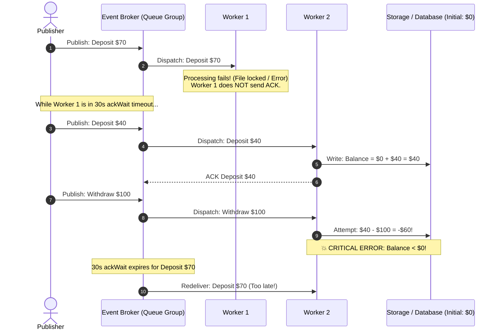
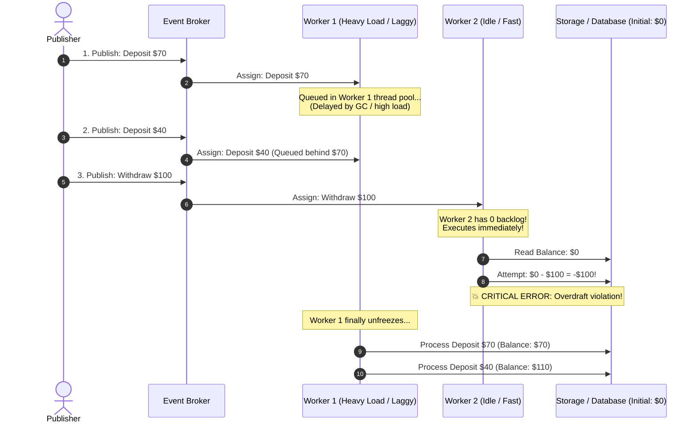
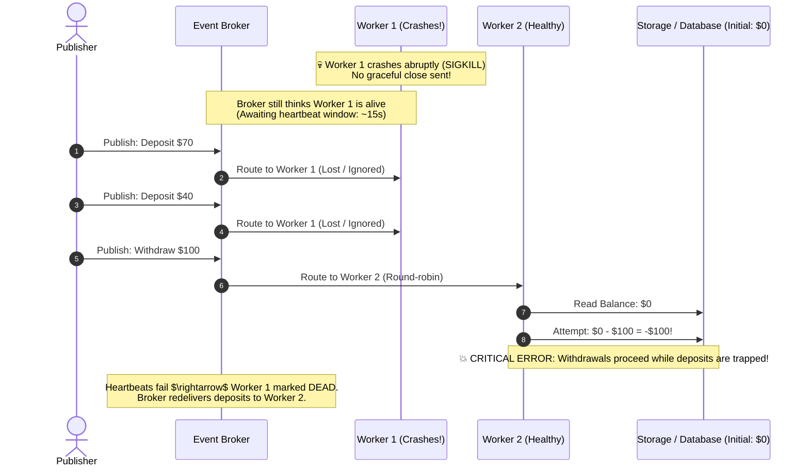
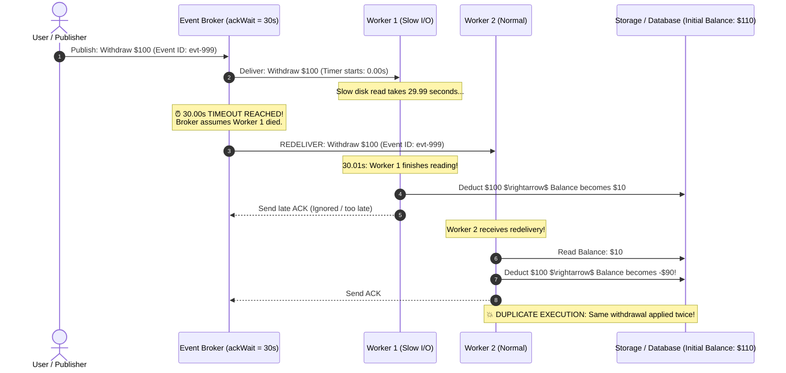
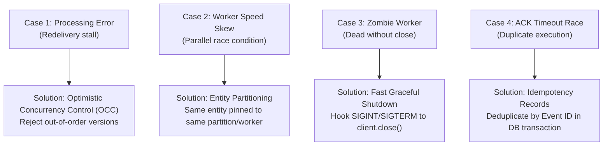

# Asynchronous Event Processing: Failure Modes and Concurrency Edge Cases

This document captures the core failure modes, concurrency anomalies, and edge cases inherent to asynchronous event-driven microservice architectures, illustrated with step-by-step sequence and flow diagrams.

---

## Executive Summary: The Illusion of Sequential Order

In a naive synchronous mental model, operations occur sequentially:
1. `Deposit $70` $\rightarrow$ Balance: `$70`
2. `Deposit $40` $\rightarrow$ Balance: `$110`
3. `Withdraw $100` $\rightarrow$ Balance: `$10` (Valid, balance remains $\ge \$0$)

In a distributed, asynchronous event-driven system with queue groups and horizontal scaling, **every single event can reorder, duplicate, stall, or fail independently**.

---

## Case 1: Listener Error & Redelivery Window Delay

### The Scenario
A listener encounters a transient error (locked file, DB lock, timeout). Because manual ACK is enabled, it does not acknowledge the message. The broker waits for the `ackWait` timeout (e.g. 30 seconds) before redelivering. In that 30-second gap, subsequent events continue to be published and processed out of sequence.

### Visual Sequence Diagram

### Key Takeaway
ACK timeouts preserve message delivery, but they **destroy event ordering**. Unacknowledged messages stall while independent subsequent messages bypass them.

---

## Case 2: Unequal Worker Speeds (Fast vs. Slow Worker Race)

### The Scenario
Both workers are running and healthy, but **Worker 1 is sluggish** (CPU throttle, garbage collection pause, or dealing with a backlog of other tasks). **Worker 2 is idle and ultra-fast**. Even though events are emitted in chronological order, Worker 2 finishes its event before Worker 1 even starts.

### Visual Sequence Diagram

### Key Takeaway
Queue groups **distribute** work; they **do not serialize** execution across multiple consumers. Parallel processing intrinsically leads to race conditions if dependencies exist between events.

---

## Case 3: Ungraceful Crash & The Heartbeat "Zombie" Window

### The Scenario
Worker 1 crashes abruptly (`SIGKILL`, OOM crash, power cut) without calling `client.close()`. The broker does not know the worker is dead until heartbeat pings fail after 10–20 seconds. During this window, the broker continues feeding messages into the black hole of the dead worker.

### Visual Flow & Sequence Diagram

### Key Takeaway
Always register graceful shutdown hooks (`SIGINT`, `SIGTERM` $\rightarrow$ `client.close()`). When a client explicitly closes, the broker removes it from the consumer group immediately, avoiding the zombie delivery black hole.

---

## Case 4: Duplicate Delivery via Ack-Timeout Race Condition

### The Scenario
Events can occur days apart. At a later time, Worker 1 receives a legitimate withdrawal event. It takes 29.99 seconds to complete due to high disk I/O. At the 30.00-second mark, the broker assumes Worker 1 died and re-emits the event to Worker 2. Both workers eventually apply the deduction, deducting the money twice!

### Visual Sequence Diagram

### Key Takeaway
Network timeouts do not mean work failed; they only mean confirmation wasn't received in time. In distributed systems, **at-least-once delivery guarantees duplicate deliveries**.

---

## Summary Matrix

