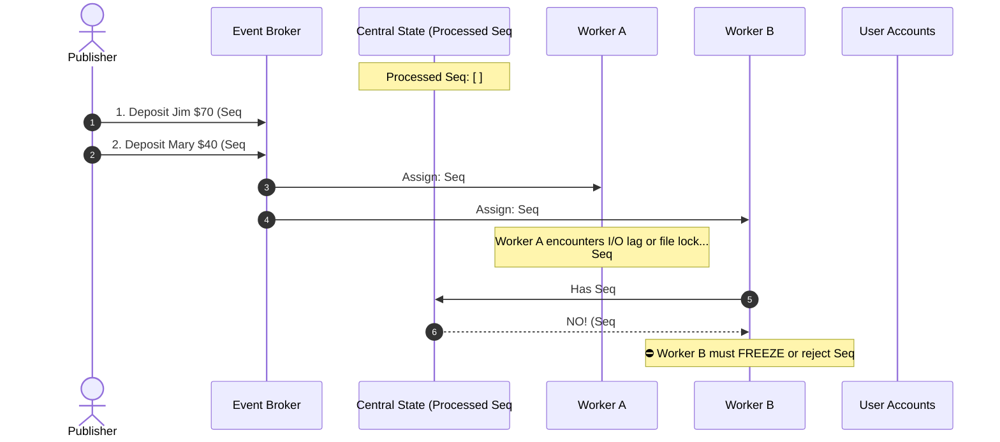
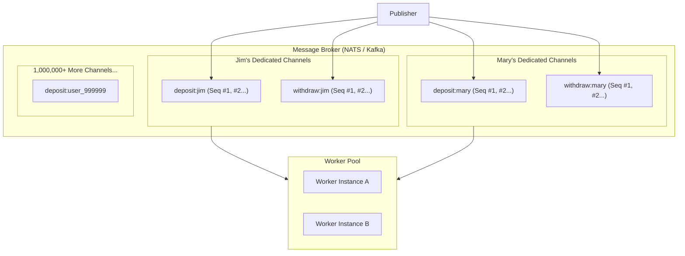
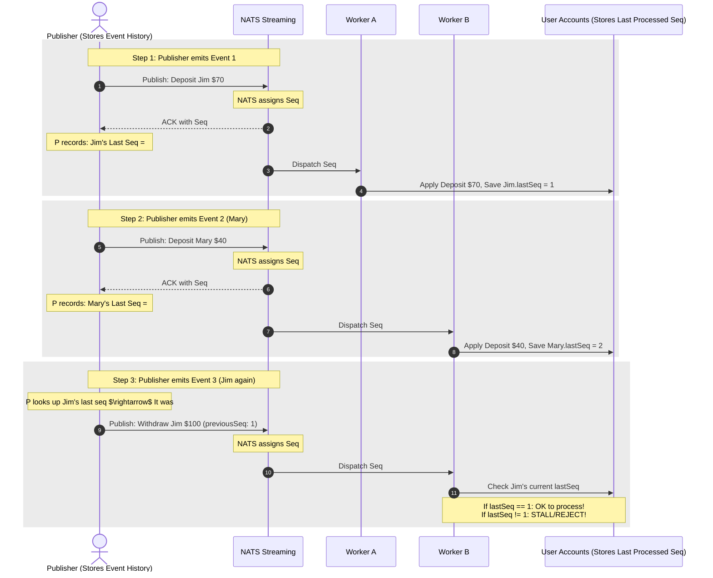

# Flawed Concurrency Patterns: Why Common "Naive" Solutions Fail

When developers first encounter asynchronous event concurrency and race conditions, they almost always attempt one of three intuitive patterns. This document breaks down each pattern, provides Mermaid sequence and architecture diagrams, and explains the fatal technical flaws that prevent them from working in production.

---

## Pattern 1: Global Sequence Number in Shared State

### The Concept
All worker instances share a central fast data store (Redis, shared cache, or central DB). 
- Every event emitted by NATS carries an auto-incrementing broker sequence number (`#1`, `#2`, `#3`, etc.).
- When a worker picks up event `#N`, it consults the shared store to verify that event `#(N - 1)` has already completed.
- If `#(N - 1)` is present in the store, the worker processes `#N` and records `#N` into the store. If not, it rejects or stalls `#N`.

### Visual Sequence



### Why It Fails (The Fatal Flaw)
1. **Global Head-of-Line Blocking**:
   - Every entity in the entire system becomes tightly coupled to a single global bottleneck.
   - If User Jim’s event encounters a transient failure or a 30-second `ackWait` timeout, **User Mary, User Bob, and every other unrelated user in the system are completely blocked from executing!**
2. **Destroys Microservice Throughput**:
   - It degrades the horizontal scalability of your worker pool into a strictly single-threaded, sequential pipeline.
3. **Shared-State Contention & Distributed Locking**:
   - High concurrent read/write churn on a single global sequence store creates severe lock contention, turning the shared store into a single point of failure (SPOF).

---

## Pattern 2: Channel-Per-Resource (User-Specific Channels)

### The Concept
To prevent User Jim from blocking User Mary, we give every entity (or user) its own isolated sequence stream:
- Jim gets his own dedicated channels: `account-deposit-jim`, `account-withdraw-jim`.
- Mary gets her own dedicated channels: `account-deposit-mary`, `account-withdraw-mary`.
- Inside Jim's channel, sequence numbers reset (`#1`, `#2`, `#3`), so Jim's failures only stall Jim, while Mary processes independently.

### Visual Architecture



### Why It Fails (The Fatal Flaw)
1. **Broker Channel Limits & Memory Exhaustion**:
   - NATS Streaming, Kafka, and RabbitMQ have practical limits on active channels/topics/partitions (e.g., NATS Streaming default channel limit is **1,000 channels**).
   - In an e-commerce or marketplace system with millions of users, orders, or tickets, creating dynamic channels per resource quickly causes broker memory exhaustion, slow leader-elections, and cluster crashes.
2. **Subscription Management Nightmare**:
   - Workers cannot statically subscribe to known topics; they must dynamically discover, open, maintain, and heartbeat thousands of individual channel subscriptions.
3. **High Protocol Overhead**:
   - Broker internal bookkeeping (tracking consumer offsets, file descriptors, in-memory state machines per channel) scales with channel count, degrading broker performance exponentially.

---

## Pattern 3: Publisher Event Store with "Previous Sequence Pointer"

### The Concept (Detailed Breakdown)
This pattern attempts to achieve resource-level ordering on a **single shared channel** by having the publisher act as an intelligent coordinator.

#### How It Is Supposed to Work:
1. The publisher maintains an internal database (`events_history`) recording every event it has ever emitted.
2. When the publisher sends an event to NATS, NATS assigns it a broker sequence number (e.g., `#1`).
3. The publisher receives this sequence number back and saves it: `Last sequence for Jim = #1`.
4. When the publisher later prepares a second event for Jim, it attaches a pointer:
   ```json
   {
     "resource": "jim",
     "action": "deposit",
     "amount": 40,
     "previousSeq": 1
   }
   ```
5. When this second event is dispatched, NATS gives it sequence `#3` (because sequence `#2` was used for Mary).
6. When Worker B receives `#3`, it checks its local/shared store:
   - *"Does the last processed event for Jim match `previousSeq: 1`?"*
   - If yes, Worker B proceeds and updates Jim's pointer to `#3`.
   - If no (e.g., `#1` is still running or lagged), Worker B refuses to process `#3` until `#1` finishes!

### Visual Sequence



### Why Pattern 3 Fails in the Real World

Despite appearing mathematically sound, this pattern collapses under four concrete distributed systems limitations:

#### 1. The Asynchronous Broker Boundary (The Missing Sequence Number)
- When a publisher calls `client.publish('ticket:created', data, callback)`, the callback only confirms that the message was received by the broker (`guid`). 
- **The internal stream sequence number is NOT returned to the publisher in standard broker protocols!** 
- Sequence numbers are assigned deep inside the broker's commit log for consumers, making it impossible for the publisher to synchronously know what sequence number the broker chose.

#### 2. Publisher Multi-Instance Concurrency (Split-Brain History)
- In real deployments, the **Publisher Service itself runs multiple horizontal replicas** behind a load balancer.
- If Publisher Instance 1 publishes for Jim, Publisher Instance 2 has no immediate knowledge of the sequence number assigned unless they also synchronize through a central distributed lock, creating another massive bottleneck.

#### 3. Outbox Atomicity Violation
- If the publisher writes the event to its local history table, sends it to the broker, but crashes before recording the broker's sequence number confirmation, the publisher's history becomes corrupted or out of sync with the broker's actual commit log.

#### 4. The Deadlock of Rejected Messages
- If Worker B receives event `#3` and rejects it because event `#1` hasn't arrived yet, what does Worker B do with event `#3`?
- If it does not acknowledge event `#3`, NATS will keep redelivering event `#3` every `ackWait` period (spamming the worker).
- If it acknowledges and drops event `#3`, event `#3` is permanently lost.
- Stashing event `#3` in an in-memory queue risks memory overflow if event `#1` is delayed for minutes.

---

## Comparison Matrix: Why These 3 Solutions Fail

| Flawed Pattern | Core Idea | Fatal Flaw | Real-World Consequence |
| :--- | :--- | :--- | :--- |
| **Pattern 1: Global Sequence** | Check previous sequence number in a shared store before executing. | **Head-of-Line Blocking** across unrelated entities. | A timeout on Jim's account freezes Mary, Bob, and the entire platform. |
| **Pattern 2: Channel-Per-User** | Create a separate channel for every user/resource. | **Broker Channel & Resource Limits**. | Hits broker channel caps (e.g. 1,000 channels max), causing memory exhaustion. |
| **Pattern 3: Publisher Pointers** | Publisher tracks previous sequence and attaches it to payload. | **Protocol Asymmetry & Publisher Concurrency**. | Brokers don't return sequence IDs to publishers; fails across multiple publisher replicas. |

---

## The Correct Architectural Answer: Optimistic Concurrency Control (OCC)

Instead of relying on the **broker's sequence numbers** or the **publisher's memory**, the solution is to place the versioning authority directly inside the **resource itself** (the Database record).

1. **Entity Owns Its Version**:
   - The entity in the database owns an integer `version` field (starts at `0`).
2. **Publisher Increments Entity Version**:
   - When the Ticket or Account service updates state, it increments `version: version + 1` and embeds that version into the event payload.
3. **Consumer Enforces Consecutive Version Transitions**:
   - The consumer only applies an update if `event.version === record.version + 1`.
   - If `event.version > record.version + 1`, the consumer knows an intermediate event is still in transit and refuses to commit the update.
   - If `event.version <= record.version`, the consumer knows it's a duplicate and ignores it (idempotency).

This decouples the system from broker-specific sequence mechanics and ensures consistency purely through database-level invariants.
