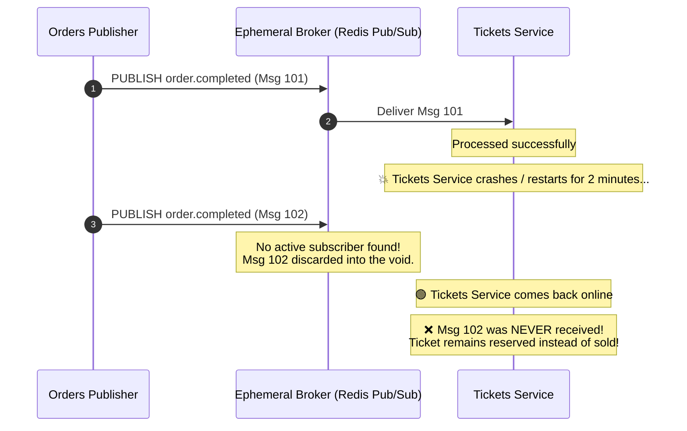
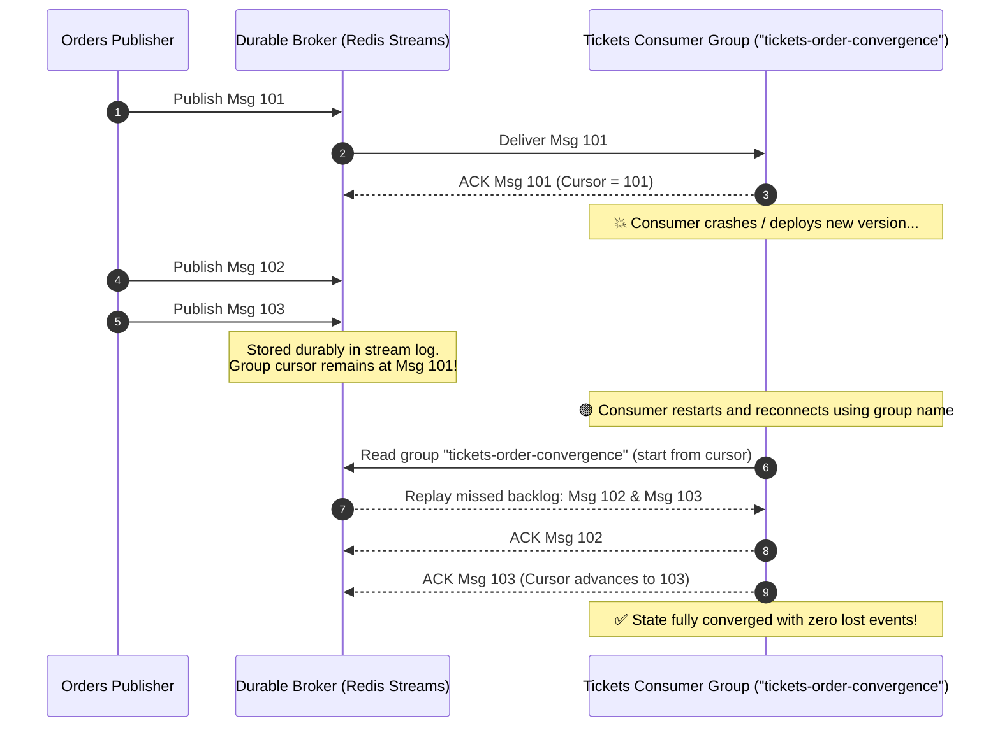
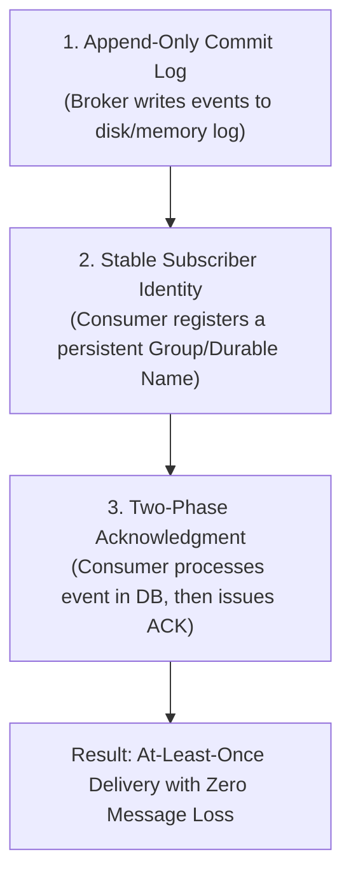

# Durable Subscriptions in Event-Driven Systems

This guide explains what **Durable Subscriptions** are, why they are essential in distributed event-driven systems, how they contrast with ephemeral subscriptions, and how the concept translates between NATS Streaming (the course reference) and Redis Streams (our production implementation in this repository).

---

## 1. What is a Durable Subscription?

A **Durable Subscription** is a messaging mechanism where the message broker (such as NATS Streaming, Apache Kafka, or Redis Streams) **remembers the identity of a consumer and tracks its progress (offsets / cursors) across restarts, network disconnects, and service crashes**.

### The Core Analogy

* **Ephemeral Subscription (Radio Broadcast):**
  If you turn off your radio for 10 minutes and turn it back on, the songs played during those 10 minutes are lost forever.
* **Durable Subscription (DVR / Bookmarked Stream):**
  When you pause or walk away, the stream keeps recording. When you return with your unique profile name, playback resumes exactly from your last bookmarked timestamp.

---

## 2. Ephemeral vs. Durable Subscriptions

| Feature | Ephemeral Subscription (e.g. Redis Pub/Sub, Core NATS) | Durable Subscription (e.g. Redis Streams Consumer Groups, NATS Streaming) |
| :--- | :--- | :--- |
| **Broker State** | Fire-and-forget. Broker holds no state about who is listening. | Stateful. Broker records consumer group name, last delivered ID, and unacknowledged messages. |
| **Consumer Offline Behavior** | Any messages published while the consumer is offline or restarting are **permanently lost**. | Messages accumulate safely in the broker log. When the consumer reconnects, it receives all missed messages. |
| **Acknowledgments** | None (at-most-once delivery). | Required (`ACK` / `XACK`). Broker only advances cursor once the consumer confirms safe persistence. |
| **Crash Recovery** | Messages in-flight during a crash are lost. | Unacknowledged messages sit in a Pending List and can be reclaimed by surviving workers. |
| **Suitable For** | Live chat, presence indicators, ephemeral metrics. | Financial transactions, orders, ticket inventory, ledger updates. |

---

## 3. Visual Sequence: Ephemeral vs. Durable During a Crash

### Scenario A: Ephemeral Subscription (Message Loss)

---

### Scenario B: Durable Subscription (Zero Loss & Safe Catch-up)

---

## 4. How Durable Subscriptions Work Under the Hood

To create a durable subscription, three cooperating components are required:

1. **The Commit Log:**
   Messages are appended to an ordered, durable sequence (e.g. `orders.events`). They are not deleted simply because they were delivered to one client.
2. **Stable Identity (Durable Name):**
   The consumer registers with a deterministic name (e.g., `tickets-order-convergence`). If the consumer pod dies and a new pod launches, it supplies the exact same name, allowing the broker to match it to its previous cursor.
3. **The Pending Entries List (PEL):**
   When the broker delivers a message, it marks it as *pending*. If the worker dies before acknowledging, the message stays in the PEL until reclaimed (`XAUTOCLAIM`).

---

## 5. Course Mapping: NATS Streaming vs. Our Redis Streams Implementation

| Concept | NATS Streaming (Course Reference) | Redis Streams (Our Implementation) |
| :--- | :--- | :--- |
| **Stream Channel** | `stan.subscribe('orders:events')` | `orders.events` Stream key |
| **Durable Identifier** | `subscriptionOptions.setDurableName('tickets-service')` | `XGROUP CREATE orders.events tickets-order-convergence` |
| **Load-Balanced Workers** | `subscriptionOptions.setQueueGroupName('tickets-workers')` | Consumer Group with individual consumer names (`XREADGROUP GROUP tickets-order-convergence worker-1`) |
| **Delivery Confirmation** | `msg.ack()` | `client.xAck('orders.events', 'tickets-order-convergence', entryId)` |
| **Dead-Worker Recovery** | NATS broker re-delivers after `ackWait` timeout | `XAUTOCLAIM` actively scans Pending Entries List (PEL) for entries idle > 30s |
| **Crash Protection** | Reconnects using same client ID + durable name | Reconnects using same consumer group name |

---

## 6. Implementation Reference in This Repository

In this repository, durable subscription mechanics are implemented concretely in the Tickets service:

- **Consumer Group Registration & Auto-Creation:**
  [`tickets/src/orders/order-events-consumer.ts`](../../../tickets/src/orders/order-events-consumer.ts) creates group `tickets-order-convergence` if it does not exist using `XGROUP CREATE ... MKSTREAM`.
- **Pending Entry Reclamation (`XAUTOCLAIM`):**
  Before polling new messages, `recoverPending()` reclaims messages left abandoned by crashed workers exceeding `TICKETS_EVENTS_CLAIM_IDLE_MS` (30s).
- **Post-Transaction Acknowledgment (`XACK`):**
  `client.xAck(...)` is called **only after** `applyOrderEventOnce` safely commits both the Ticket status change and the `processed_order_events` inbox record inside SQLite.
