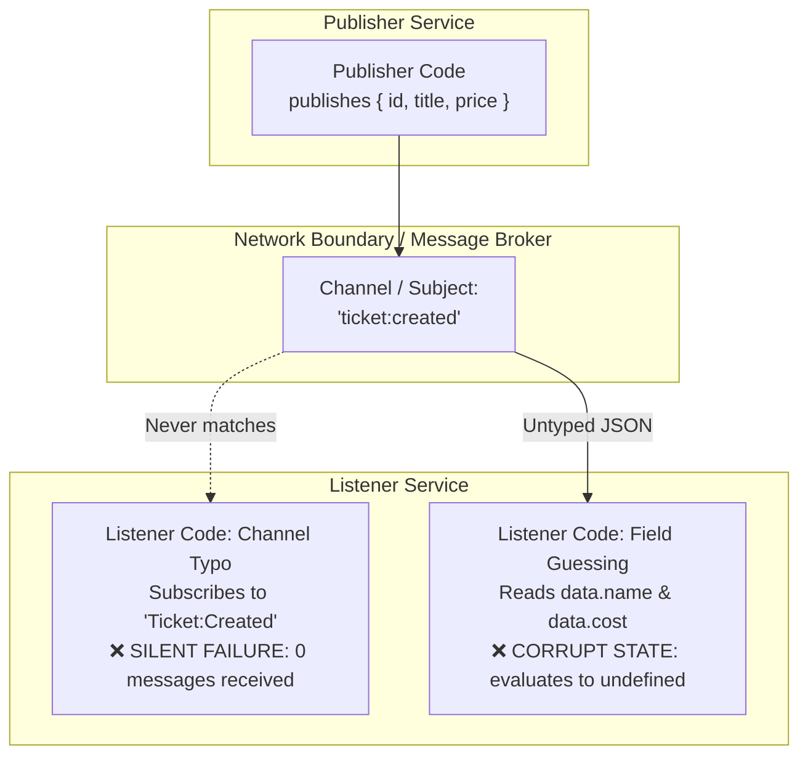
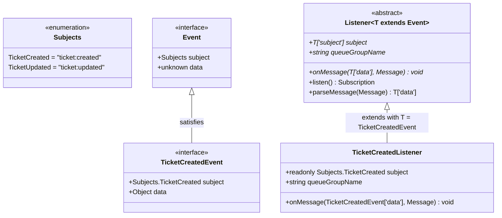

# 09. Strongly-Typed Event Pipeline & Deep Module Design

[Companion index](./index.md) · [Course lecture map](./lecture-map-314-450.md) · [Typed Event Contracts (01)](./01-typed-event-contracts.md)

## Purpose

This guide explains how to construct an end-to-end, strongly-typed asynchronous event pipeline using TypeScript, bounded generics, and Deep Module architecture. It documents the patterns implemented in [`nats-test/src/events/`](../../../nats-test/src/events/) (covering course lectures 314–327) and shows how these concepts translate into robust distributed backend systems.

---

## 1. The Core Distributed Problem: Untyped Messaging Hazards

In monolithic applications, function calls are checked by the compiler. In microservices, services communicate across network boundaries via serialization formats (JSON, Protobuf) over message brokers (NATS, Redis Streams, Kafka).

Without explicit compile-time contracts, two catastrophic classes of bugs arise:



### Hazard 1: Silent Channel Typos

Brokers treat subjects as arbitrary strings. If a publisher emits to `ticket:created` while a listener subscribes to `Ticket:Created` or `ticket:creatd`:

- The broker does not complain.
- The listener does not throw an error.
- **Result:** The listener sits idle forever, and domain events are silently dropped from downstream processing.

### Hazard 2: Property Guessing & `undefined` Propagation

If the publisher emits `{ id, title, price }`, but the consumer expects `{ id, name, cost }`:

- In JavaScript, `data.cost` returns `undefined` without throwing a runtime error.
- The downstream service writes `undefined` or `null` into its database.
- **Result:** Corrupted records and broken financial invariants discovered weeks later.

---

## 2. The Solution: Strongly-Typed Event Contracts

To eliminate both hazards, we enforce an unbreakable pairing between the **Subject (channel)** and the **Data (payload)** at compile time.



### Step 1: Single Source of Truth for Channels (`subjects.ts`)

Instead of raw string literals, define an enum representing all legal subjects:

```ts
export enum Subjects {
  TicketCreated = "ticket:created",
  TicketUpdated = "ticket:updated",
}

export interface Event {
  subject: Subjects;
  data: unknown;
}
```

### Step 2: The Specific Domain Event Contract (`ticket-created-event.ts`)

Each event binds an exact subject literal to its payload structure:

```ts
import type { Subjects } from "./subjects.js";

export interface TicketCreatedEvent {
  subject: Subjects.TicketCreated; // Exact literal type, not generic Subjects
  data: {
    id: string;
    title: string;
    price: number;
    userId?: string;
  };
}
```

### Step 3: Generic Bounded Abstract Base Class (`base-listener.ts`)

The base listener uses TypeScript's **Indexed Access Types** (`T["subject"]` and `T["data"]`) to dynamically bind the subclass's configuration to the event contract:

```ts
export abstract class Listener<T extends Event> {
  abstract subject: T["subject"];
  abstract queueGroupName: string;
  abstract onMessage(data: T["data"], msg: Message): void;

  // ... transport mechanics (subscriptionOptions, parseMessage, ack)
}
```

### Step 4: Concrete Subclass Implementation (`ticket-created-listener.ts`)

By supplying `TicketCreatedEvent` as the generic type argument, TypeScript locks the subclass down:

```ts
export class TicketCreatedListener extends Listener<TicketCreatedEvent> {
  readonly subject = Subjects.TicketCreated;
  queueGroupName = "tickets-service-queue-group";

  onMessage(data: TicketCreatedEvent["data"], msg: Message): void {
    console.log(data.title, data.price); // ✅ Fully typed
    // console.log(data.cost);           // ❌ Compiler Error: Property 'cost' does not exist
    msg.ack();
  }
}
```

### Critical Detail: Why `readonly` is Mandatory in TypeScript

Notice the `readonly` modifier on `readonly subject = Subjects.TicketCreated;`:

- **Without `readonly`:** TypeScript infers the type of `this.subject` as `Subjects` (type widening). Since `Subjects` includes *all* enum variants, it fails to satisfy the specific literal `Subjects.TicketCreated` required by `TicketCreatedEvent["subject"]`.
- **With `readonly`:** TypeScript preserves the exact literal type `Subjects.TicketCreated`, satisfying the base class generic constraint.

---

## 3. Asynchronous Promisified Publishing (`base-publisher.ts`)

A critical requirement in microservices is making event emission **awaitable**.

### The Flaw of Raw Callbacks in Route Handlers

By default, transport client libraries (like `node-nats-streaming`) use Node.js callback signatures:

```ts
// ❌ Dangerous callback / fire-and-forget pattern
client.publish("ticket:created", JSON.stringify(data), (err) => {
  if (err) console.error("Failed to publish", err);
});
```

When used inside an HTTP handler:

```ts
app.post("/api/tickets", async (req, res) => {
  const ticket = await Ticket.create(req.body);
  
  // Fire-and-forget publish:
  publisher.publish(ticket);
  
  // Tells the client "Created" before the message broker confirms receipt!
  res.status(201).send(ticket);
});
```

If the broker crashes or network partitions, the client received a `201 Created`, but no downstream service will ever hear about the ticket.

### The Promisified Solution (`base-publisher.ts`)

The abstract `Publisher` converts the broker callback into a native `Promise`:

```ts
export abstract class Publisher<T extends Event> {
  abstract subject: T["subject"];
  protected client: Stan;

  constructor(client: Stan) {
    this.client = client;
  }

  publish(data: T["data"]): Promise<string> {
    return new Promise((resolve, reject) => {
      this.client.publish(this.subject, JSON.stringify(data), (err, guid) => {
        if (err) {
          return reject(err);
        }
        resolve(guid);
      });
    });
  }
}
```

### The Result: Clean, Linear Business Logic

Now, creating a concrete publisher is a **3-line class**:

```ts
export class TicketCreatedPublisher extends Publisher<TicketCreatedEvent> {
  readonly subject = Subjects.TicketCreated;
}
```

And publishing inside business logic provides sequential certainty and clean error handling:

```ts
try {
  await new TicketCreatedPublisher(client).publish({
    id: "123",
    title: "Concert Tour",
    price: 50,
  });
  res.status(201).send({ success: true });
} catch (err) {
  // Broker rejected -> abort or rollback before acknowledging caller
  res.status(500).send({ error: "Messaging failure" });
}
```

---

## 4. Deep Module Architecture: Mechanism vs. Domain Policy

The base listener and publisher are prime examples of **Deep Modules** (narrow interface, rich functionality).

When enhancing messaging infrastructure, use the following division of responsibility:

```mermaid
flowchart TB
    subgraph Base Class / Deep Module (Mechanism & Plumbing)
        M1["JSON serialization & deserialization"]
        M2["Promise wrapper for async/await flow"]
        M3["Default subscription options (ackWait, durableName, manualAck)"]
        M4["Standardized broker connection handling & error catching"]
        M5["Future infrastructure: retries, metrics, tracing headers"]
    end

    subgraph Concrete Subclass (Domain Policy & Intent)
        D1["Domain subject declaration (e.g. Subjects.TicketCreated)"]
        D2["Queue group name"]
        D3["Domain business logic in onMessage(data)"]
        D4["Database persistence & domain state transitions"]
    end

    Base Class -->|Hides transport mechanics from| Concrete Subclass
```

### The Decision Boundary: Where Does New Logic Belong?

| Question | If YES | If NO |
| :--- | :--- | :--- |
| Does this logic apply to *every* event regardless of domain meaning? (e.g. parsing, ack timeouts, tracing) | **Put in Base Class** (`Listener` / `Publisher`) | Keep out of base class |
| Does this logic require knowledge of Tickets, Orders, or Users? (e.g. database transactions, business validation) | **Put in Concrete Subclass** (`onMessage`) | Belongs in shared plumbing |
| Does only one specific listener need a non-standard configuration? (e.g. 30s timeout instead of 5s) | **Provide a configurable default hook** in the base class with an override in the subclass | Do not hardcode custom `if` conditions in the base class |

---

## 5. Architectural Rule: Grounded Flexibility vs. Speculative Over-Engineering

A common temptation when building generic base classes is **speculative flexibility**—adding complex plugin architectures, strategy factories, and endless configuration switches for hypothetical future requirements.

Adhere to the **Ponytail Principle**:

1. **Sensible Defaults:** The base class provides defaults that satisfy 95% of consumers (`ackWait = 5000`, `manualAck = true`, `deliverAllAvailable = true`).
2. **Simple Overrides (Hooks):** Expose fields or constructor options allowing edge cases to override defaults without touching the underlying engine.
3. **No Hypothetical Abstractions (YAGNI):** Do not introduce middleware runners or dynamic serialization engines until multiple disparate serialization formats (e.g. Protobuf + Avro) exist as concrete requirements today.

---

## 6. Conceptual Anchor: Comparison with Java Generics

For developers with an Object-Oriented background (e.g., Java or C#):

| Concept | Java Equivalent | TypeScript Implementation |
| :--- | :--- | :--- |
| **Bounded Generic** | `public abstract class Publisher<T extends Event>` | `export abstract class Publisher<T extends Event>` |
| **Enum Source of Truth** | `public enum Subjects { TICKET_CREATED, ... }` | `export enum Subjects { TicketCreated = "ticket:created" }` |
| **Payload Extraction** | `T.getData()` via an interface method | **Indexed Access Type:** `T["data"]` directly indexes the JSON shape at compile time |
| **Enforced Literal Subject** | Runtime check or constructor parameter | Compile-time literal type constraint (`subject: Subjects.TicketCreated`) |

---

## 7. Translation: NATS Streaming vs. Repository Production Pattern (Redis Streams)

| Architectural Concern | Course Pattern (NATS Streaming in `nats-test`) | Production Pattern (Redis Streams in `stubhub`) |
| :--- | :--- | :--- |
| **Channel / Stream Name** | `enum Subjects` -> NATS subject string | Redis Stream Key (`orders.events`) + validated `eventType` |
| **Contract Enforcement** | TypeScript `T extends Event` + compile-time indexed types | TypeScript types + **Zod runtime schema** (`orderEventSchema.parse()`) |
| **Publishing Guarantees** | `await publisher.publish(data)` | **Transactional Outbox Pattern**: event written to database outbox table in same ACID transaction as entity, then published |
| **Durable Cursor** | NATS Durable Name + Queue Group | Redis Consumer Group (`XREADGROUP` + `XACK`) |
| **Pending Recovery** | NATS redelivers unacked messages after `ackWait` | `XAUTOCLAIM` actively scans Pending Entries List (PEL) |
