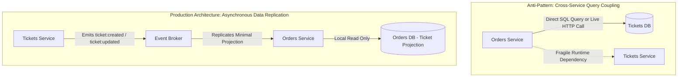
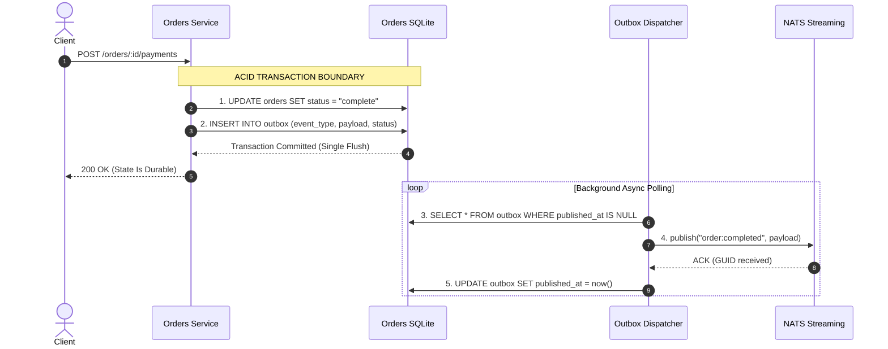
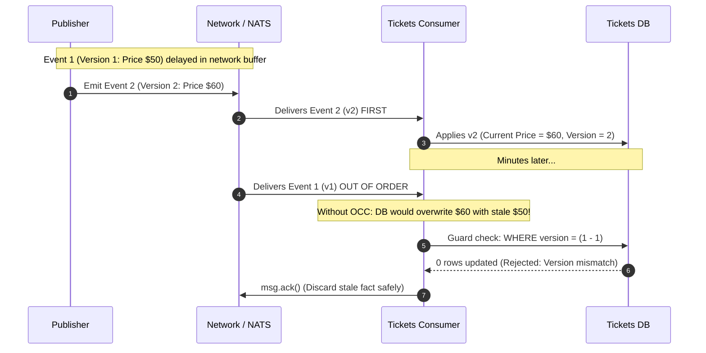
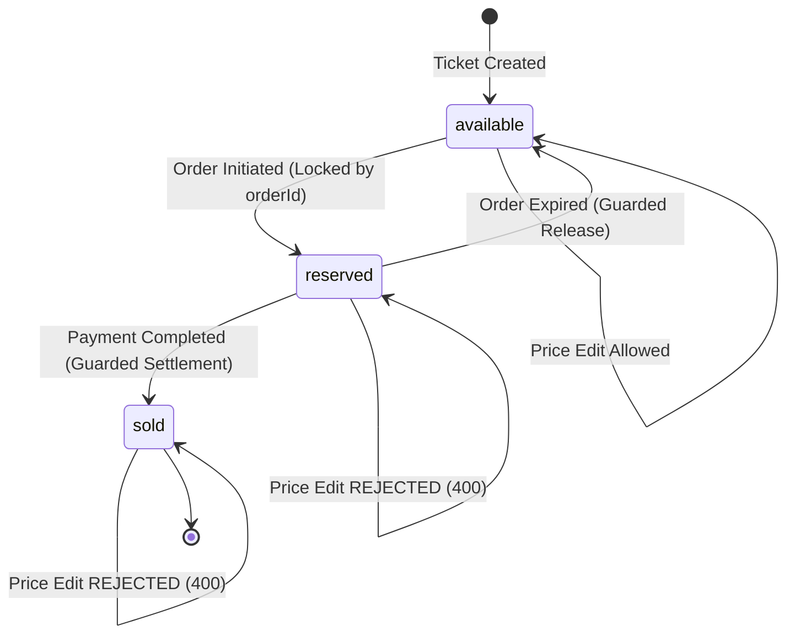
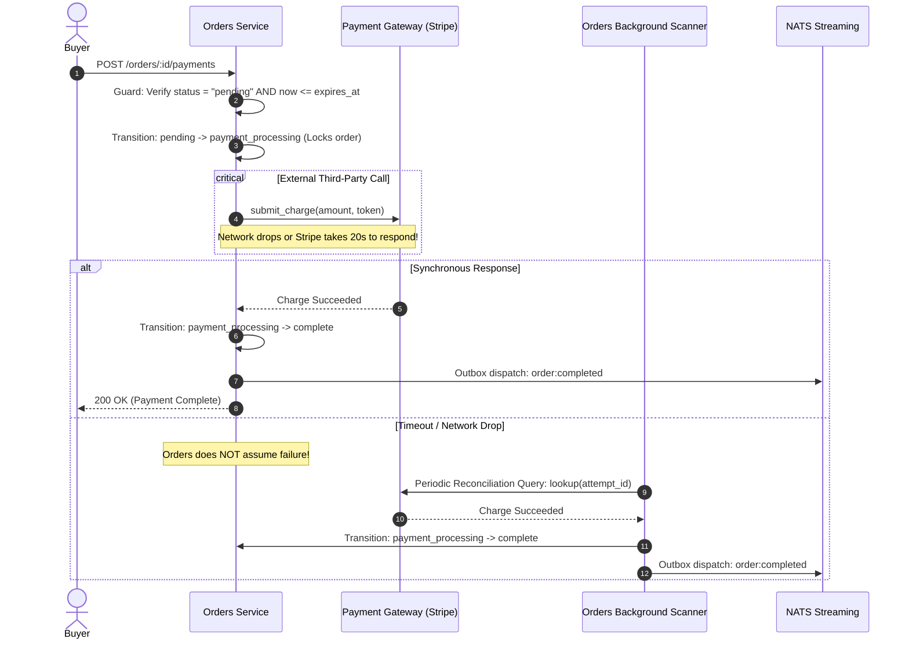

# Deep Architectural Analysis & Judgment Curriculum: Lectures 350–532

**Target Audience:** Engineers building long-term architectural judgment in distributed systems and backend engineering.  
**Companion Documents:** [Async Systems Index](./index.md) · [Strongly-Typed Event Pipeline (09)](./09-strongly-typed-event-pipeline.md) · [The NATS Streaming Pivot (10)](./10-nats-streaming-pivot.md) · [Lecture Map 314–450](./lecture-map-314-450.md)

---

## 1. The Modern Engineering Thesis: AI Commodity vs. Human Judgment

In contemporary software engineering, Large Language Models (LLMs) can generate syntactically correct Express handlers, Mongoose schemas, Dockerfiles, and Jest unit tests in seconds.

However, LLMs possess a fatal architectural blind spot: **they optimize for the happy path and local syntactical correctness, remaining inherently oblivious to distributed failure modes, crash windows, network partitions, and data loss.**

If you prompt an AI assistant to build a checkout flow, it will almost certainly write:

```ts
// ❌ WHAT AI ROUTINELY GENERATES (Disaster in Production):
app.post("/api/orders", async (req, res) => {
  const order = await Order.create(req.body);         // Step 1: Write DB
  await natsClient.publish("order:created", order);    // Step 2: Write Broker
  res.status(201).send(order);                        // Step 3: Return 201
});
```

This naive snippet contains at least three critical architectural bugs that produce silent financial corruption:

1. **The Dual-Write Hazard:** If the network to NATS partitions after line 2, the Order exists in the database, but no downstream service (Tickets, Expiration, Payments) ever learns of it.
2. **Missing Authoritative Lock:** It creates an Order without verifying that the underlying Ticket was locked atomically, allowing concurrent users to double-book the same seat.
3. **Premature Acknowledgment:** It announces state before network confirmation of durability.

**Human Engineering Judgment** is the ability to anticipate how the system behaves when the network drops, power cuts mid-statement, messages arrive out of order, or third-party APIs hang for 15 seconds.

---

## 2. Deep Dive 1: Service Boundaries, Data Coupling & The Anti-Pattern of Live Reads (350–365)



### The Architectural Dilemma

When an Order is being drafted or displayed, it needs ticket details (title, price, seller). How should Orders obtain this data?

- **Option A (Naive):** Query the Tickets database directly.
- **Option B (Synchronous RPC):** Call `GET http://tickets/api/tickets/:id` on every order request.
- **Option C (Eventual Consistency / Data Replication):** Orders maintains an internal projection of Ticket records by subscribing to `ticket:created` and `ticket:updated`.

### Failure Modes of Options A and B

- **Shared Database (Option A):** Violates service autonomy. If Tickets renames a column or changes its migration schema, Orders crashes. Database connections become a shared bottleneck.
- **Synchronous HTTP (Option B):** Temporal coupling. If the Tickets service experiences high load, redeploys, or encounters a garbage collection pause, the entire checkout pipeline halts. Latency compounds multiplicatively ($L_{total} = L_{orders} + L_{tickets}$).

### The Snapshot Principle (Lectures 356, 361, 365)

Why does Orders need its own Ticket record? **Because price is an immutable temporal fact, not a live reference.**

- If User A starts checkout for a $50 ticket, and the seller edits the price to $150 while User A enters their credit card, User A must be charged $50.
- Orders must capture a **frozen snapshot** of the price at the moment purchase begins. The price of an active Order can never track subsequent seller edits.

### The Human Judgment Rule

> **Never perform live cross-service synchronous queries for historical or financial transactions. Replicate data forward asynchronously, and capture an immutable local snapshot at the transaction boundary.**

---

## 3. Deep Dive 2: The Dual-Write Hazard & The Transactional Outbox (378–383, 445, 477)



### The Fatal Flaw of the Course Implementation

In lectures 378–383, the course implements event publishing inside route handlers using callbacks or awaited promises directly against NATS:

```ts
// ❌ Course pattern: Vulnerable to crash windows
await order.save();
await new OrderCreatedPublisher(natsClient).publish(order);
```

### The 4 Lethal Crash Windows

| Crash Moment | State in Database | State in Event Bus | Real-World Consequence |
| :--- | :--- | :--- | :--- |
| **Crash 1: Before DB save** | Nothing saved | Nothing published | Clean failure. Client gets 500, safely retries. |
| **Crash 2: After DB save, before publish** | `Order: Complete` | **Zero messages** | **Catastrophic state drift.** Order is marked paid in Orders, but Tickets never marks ticket sold. Ticket remains available; another buyer purchases it. |
| **Crash 3: Broker accepts publish, network drops before client receives ACK** | `Order: Complete` | Message published | Publisher assumes failure, retries, publishing duplicate event (requires consumer idempotency). |
| **Crash 4: After publish, before response** | `Order: Complete` | Message published | Client receives connection reset; retries transaction. |

### The Production Solution: The Transactional Outbox

To eliminate Crash Window 2, you must never publish directly over a network inside an HTTP mutation handler. Instead:

1. Write the state mutation AND the event publication ledger row into the database in the **exact same local ACID database transaction**.
2. A separate background worker reads unpublished ledger rows, transmits them to NATS Streaming, and marks them published only after receiving the broker GUID.
3. If NATS is down for 6 hours, zero events are lost; the dispatcher simply retries with exponential backoff once NATS recovers.

---

## 4. Deep Dive 3: Concurrency, OCC & The Fallacy of Stream Ordering (394–409, 415)



### Why Global Ordering Does Not Exist

Developers frequently assume that because NATS or Kafka guarantees ordering within a single partition/channel, the consumer receives events in real-world chronological order. **This is mathematically false across networks:**

- Multiple publisher instances process HTTP requests concurrently.
- Network retransmissions, thread scheduling, and consumer group worker pools scramble message arrival times.
- Event 2 (Ticket Updated to $60) can easily reach a consumer before Event 1 (Ticket Created at $50).

### Optimistic Concurrency Control (OCC) Mechanics

To prevent stale writes from overwriting fresh state:

1. Every mutable aggregate carries an integer `version` property.
2. Every mutation increments `version = version + 1`.
3. When publishing an event, the current `version` is included in the contract payload.
4. When a consumer receives an event, it executes a **Compare-And-Set (CAS)** update:

   ```sql
   UPDATE tickets 
   SET title = :title, price = :price, version = version + 1
   WHERE id = :id AND version = :incomingVersion - 1;
   ```

5. If the affected row count is `0`, the consumer knows it has encountered an out-of-order event or duplicate, preventing state corruption.

### Why Mongoose `updateIfCurrent` Plugin is a Trap (397–398)

The course relies on the `mongoose-update-if-current` plugin. While good for an educational demo:

- It hides the CAS logic behind magic hooks that fail invisibly on bulk operations or raw queries.
- It conflates internal database ORM versioning with cross-service contractual versioning.
- In production, explicit SQL predicates (`WHERE id = ? AND version = ?`) or explicit aggregate version checks ensure that concurrency rules are clear, testable, and independent of ORM magic.

---

## 5. Deep Dive 4: The Acknowledgment Invariant & Poison Messages (385–390, 410–415)

### The Absolute Law of Consumer Acknowledgment

```text
  [ Receive Message ]
          │
          ▼
  [ Parse & Validate Schema ] ──(Invalid)──► [ Route to Dead-Letter Queue ] ──► [ ACK ]
          │ (Valid)
          ▼
  [ BEGIN LOCAL TRANSACTION ]
          │
  [ Check Idempotency Ledger (Processed Events) ] ──(Duplicate)──► [ COMMIT ] ──► [ ACK ]
          │ (Unseen)
          ▼
  [ Apply Guarded Domain State Mutation ]
          │
  [ Record Processed Event Ledger Row ]
          │
          ▼
  [ COMMIT TRANSACTION ]
          │
          ▼
  [ Send msg.ack() to Broker ]
```

### Why Early Acknowledgment Destroys Systems

Many junior engineers call `msg.ack()` immediately upon receiving a message:

```ts
// ❌ CRITICAL BUG: Early Ack
onMessage(data, msg) {
  msg.ack(); // Tells broker "I am done!"
  await updateDatabase(data); // If pod crashes here, event is gone forever
}
```

If the node crashes or memory exceeds limits during `updateDatabase`, NATS Streaming assumes the message was safely stored and will never redeliver it.

**The Golden Invariant:**
`msg.ack()` must **only** be executed after the local database transaction has physically committed to disk.

### The Poison Message Trap (410–412)

What happens if someone publishes a malformed JSON string or an event with an unsupported schema version?

- If the consumer throws an unhandled exception before `msg.ack()`, NATS redelivers the message after `ackWait` (5 seconds).
- The consumer crashes again.
- **Result: Infinite Poison Loop.** The consumer group locks up, pending entry lists (PEL) explode in memory, and legitimate messages queued behind the poison message are blocked indefinitely.
- **Production Solution:** Schema validation (via Zod or TypeBox) at the consumer boundary. If payload validation fails, the consumer records diagnostic evidence, forwards the poison message to a Dead-Letter Queue (DLQ), and acknowledges the original message to unblock the channel.

---

## 6. Deep Dive 5: The Ticket Lock Lifecycle & Guarded Transitions (420–431)



### The State Machine Invariants

The Ticket lifecycle is governed by three non-negotiable business constraints:

1. An `available` ticket can be locked by exactly one Order for a bounded TTL.
2. A `reserved` ticket cannot have its price, title, or details edited by the seller.
3. A `sold` ticket is terminal; it can never return to `available` or `reserved`.

### Guarded Release: Preventing Delayed Expiration Race Conditions

Consider this distributed race:

1. User A reserves Ticket 101 for Order 1.
2. Order 1 expires. Orders publishes `order:expired` for Order 1.
3. The message is delayed in network transit for 10 seconds.
4. Meanwhile, User B immediately initiates Order 2 and successfully reserves Ticket 101.
5. The delayed `order:expired` message for Order 1 finally arrives at Tickets!

**If Tickets naively unlocked the ticket:**

```sql
-- ❌ DANGEROUS: Unlocks whatever is currently reserved!
UPDATE tickets SET status = "available", locked_by_order_id = NULL WHERE id = "101";
```

User B's valid, active reservation would be stolen, allowing User C to book the ticket over User B!

**The Guarded Invariant:**

```sql
-- ✅ PRODUCTION GUARD: Unlocks ONLY IF the lock matches the expired order!
UPDATE tickets 
SET status = "available", locked_by_order_id = NULL 
WHERE id = :ticketId 
  AND status = "reserved" 
  AND locked_by_order_id = :expiredOrderId;
```

If Order 1's expiration arrives late, `locked_by_order_id` is now Order 2; the query affects `0` rows, and User B's lock remains completely secure.

---

## 7. Deep Dive 6: Distributed Expiration — Autonomous vs. Dedicated Microservice (432–450)

```mermaid
flowchart TD
    subgraph MicroserviceOverengineering["Course Architecture: 3-Service Asynchronous Dependency Chain"]
        O[Orders Service] -->|Emits order:created| NATS1[NATS Streaming]
        NATS1 -->|Consumes| EXP[Separate Expiration Service]
        EXP -->|Schedules job in| Bull[Redis / Bull Queue]
        Bull -.->|15 Min Delay| EXP
        EXP -->|Emits expiration:complete| NATS2[NATS Streaming]
        NATS2 -->|Consumes| O
        O -->|Emits order:cancelled| NATS3[NATS Streaming]
        NATS3 -->|Consumes| T[Tickets Service]
    end

    subgraph PragmaticDeepModule["Pragmatic Architecture: Autonomous Orders Worker"]
        O2[Orders Service<br/>(Stores expires_at in DB)]
        O2_Worker[Orders Background Worker<br/>(SELECT * WHERE status = 'pending' AND expires_at <= now)]
        O2_Worker -->|Guarded DB Transition to 'expired'| O2
        O2_Worker -->|Emits order:expired via Outbox| NATS_P[NATS Streaming]
        NATS_P -->|Guarded Lock Release| T2[Tickets Service]
    end
```

### The Architectural Flaw of a Separate Expiration Service

In lectures 432–450, the course introduces a dedicated `Expiration` microservice that spins up a Bull queue (Redis-backed delayed jobs):

1. Orders emits `order:created` $\rightarrow$ Expiration service enqueues a delayed job in Redis $\rightarrow$ 15 minutes later, Bull fires $\rightarrow$ Expiration emits `expiration:complete` $\rightarrow$ Orders marks order cancelled $\rightarrow$ Orders emits `order:cancelled` $\rightarrow$ Tickets releases ticket.

**Why this is an over-engineered failure risk:**

- **Tripled Network Failure Points:** The event crosses three service boundaries over the network to perform a single logical action.
- **Data Ownership Inversion:** The Expiration service does not own the Order, the payment state, or the deadline; it is merely an external timer with its own Redis dependency.
- **Split-Brain Timer Hazard:** If the user pays at minute 14:59, and the payment gateway webhook takes 2 seconds to arrive, Bull fires at minute 15:00 and cancels the order while Stripe processes the card.

### The Autonomous Solution

Orders already owns the Order record and its authoritative deadline (`expires_at` column in SQLite/Postgres).

- An internal Orders background worker queries:

  ```sql
  SELECT id FROM orders WHERE status = "pending" AND expires_at <= :now;
  ```

- Orders executes the terminal transition internally, stages `order:expired` into its outbox, and publishes directly to Tickets.
- **Result:** Deletes an entire microservice, eliminates Bull queue dependency, removes 2 network hops, and guarantees that Orders can check payment status before expiring.

---

## 8. Deep Dive 7: Payments, Third-Party Providers & The Terminal Race (451–481)



### The Split-Brain Dilemma with External APIs

When integrating with Stripe, PayPal, or any banking gateway, the most dangerous state is the **Uncertain Result Window**:

- You send a charge request to Stripe.
- Stripe successfully debits the customer credit card.
- The return HTTP packet drops before reaching your server.
- Your application throws a `SocketTimeoutException`.

**What junior engineers/AI do:** Catch the exception and update the order to `failed` or `expired`.  
**The catastrophic result:** The customer was billed $150, but your database says "Expired", and their ticket was given to someone else!

### The Two Non-Negotiable Payment Invariants

1. **The `payment_processing` Intermediary State:**
   An order must transition from `pending` to `payment_processing` *before* contacting the provider. While in `payment_processing`, the expiration worker **cannot** expire the order.
2. **Reconciliation Over Assumption:**
   If a payment call times out, the system must never declare failure. It marks the payment attempt as `unresolved`. A background reconciliation worker periodically calls `stripe.charges.retrieve(paymentIntentId)` using an idempotent key until the definitive truth is established.
3. **Terminal Sink Rule (Lecture 481):**
   `complete` and `expired` are mutually exclusive, irreversible terminal sinks. Once an order is `complete`, no late cancellation event, timer, or refund hook can transition it to `expired`.

---

## 9. Deep Dive 8: Production Deployment, CI/CD & Kubernetes Realities (503–532)

### What AI Generates vs. What Production Demands

| Concern | AI / Course Template (Commodity) | Production Distributed System (Human Judgment) |
| :--- | :--- | :--- |
| **Containers** | Standard `FROM node:alpine`, runs as `root`. | Non-root users (`USER 1000:1000`), dropped Linux capabilities, read-only root filesystems, seccomp security profiles. |
| **Health Probes** | Generic `GET /` probe. | Separated **Liveness** (is the process deadlocked?) and **Readiness** (are DB connections healthy and NATS connected to serve traffic?). |
| **Deployments** | `kubectl apply -f depl.yaml` blindly restarts pods. | Zero-downtime rolling updates with `maxSurge`/`maxUnavailable`, graceful shutdown signal handling (`SIGTERM` draining in-flight HTTP requests and flushing outbox). |
| **Secrets** | Hardcoded base64 strings in git. | Secret references injected via Kubernetes Secret stores, HashiCorp Vault, or AWS Secrets Manager. |
| **Database Migrations** | Run migrations on application startup in every pod. | **Race condition disaster!** 5 pods starting concurrently run `ALTER TABLE` simultaneously. Migrations must run in an isolated Kubernetes `Job` *before* the application rollout starts. |

---

## 10. The Exhaustive Master Matrix: Lectures 350 to 532

Legend:

- **`[GOLD]` (Deep Judgment):** High-leverage distributed systems theory. Study deeply; will distinguish you as a senior engineer.
- **`[COMMODITY]` (AI-Replaceable):** Standard CRUD, syntax, boilerplate, or unit tests. Understand the concept, let AI generate the code.
- **`[SKIP]` (Accidental Detour):** Library quirks, obsolete bugs, or repetitive course administration. Skip entirely.

| Lecture # & Title | Tier | Underlying Engineering Question | Failure Mode If Misunderstood | Senior Invariant / Mental Model |
| :--- | :---: | :--- | :--- | :--- |
| **350. The Orders Service** | `[COMMODITY]` | Service boundary definition. | Splitting services prematurely before understanding invariants. | Orders owns purchase lifecycle; Tickets owns availability. |
| **351–354. Scaffolding & Routes** | `[COMMODITY]` | HTTP route skeleton. | Wasting time handwriting boilerplate. | Let AI scaffold standard REST routes. |
| **355. Subtle Service Coupling** | `[GOLD]` | How coupled are Orders and Tickets? | Querying Tickets DB directly from Orders, destroying independence. | Microservices share zero memory and zero database tables. |
| **356. Associating Orders & Tickets** | `[GOLD]` | How does an Order reference a Ticket? | Storing live mutable references instead of immutable historical snapshots. | Orders must capture a frozen snapshot of the price at order inception. |
| **357. Order Model Setup** | `[COMMODITY]` | Defining schema fields. | Forgetting foreign key constraints and aggregate versions. | Model data strictly around state machine requirements. |
| **358–359. Order Status Enum** | `[GOLD]` | Single source of truth for states. | String typos causing invalid order transitions. | Centralize legal states in shared enum; validate at I/O boundary. |
| **360. More on Mongoose Refs** | `[SKIP]` | Mongoose .populate() mechanics. | Emulating SQL JOIN across microservice boundaries. | Skip Mongoose refs; cross-service references are opaque UUID strings. |
| **361. Defining the Ticket Model** | `[GOLD]` | Replicating data into Orders. | Expecting one global Ticket table across all services. | Each service owns a tailored projection of the entity it needs. |
| **362. Order Creation Logic** | `[GOLD]` | Transaction coordination. | Writing Order before securing Ticket reservation. | Authoritative reservation MUST precede Order persistence. |
| **363. Finding Reserved Tickets** | `[GOLD]` | Checking availability. | Overwriting a ticket that is already locked by another buyer. | Lock verification must be atomic with the reservation command. |
| **364. Convenience Methods** | `[SKIP]` | Mongoose document methods. | Bloating domain objects with database transport logic. | Plain functions over data structures yield clearer deep modules. |
| **365. Order Expiration Times** | `[GOLD]` | Persisted deadlines. | Relying on ephemeral in-memory timers or client-side clocks. | Authority is a persisted expires_at timestamp in the database. |
| **366. globalThis TS Error** | `[SKIP]` | Incidental TypeScript error. | Getting bogged down in outdated compiler quirks. | Skip; solved by modern tsconfig settings. |
| **367. Test Suite Setup** | `[COMMODITY]` | Test harness configuration. | Spending hours writing test infrastructure. | Standard runner setup; delegate to AI. |
| **368. ObjectId TS Error** | `[SKIP]` | Mongoose typing error. | Debugging MongoDB ObjectId trivia. | Skip; modern systems use UUIDv4/v7 strings. |
| **369–371. Asserting Tickets/Orders** | `[COMMODITY]` | Route unit testing. | Testing trivial status codes instead of crash recovery. | Unit test assertions are commodity; prioritize failure drills. |
| **372. Fetching User Orders** | `[COMMODITY]` | Scoped user query. | Leaking other users orders (broken authorization). | Enforce ownership filter: WHERE userId = :authUserId. |
| **373. Complicated Test** | `[COMMODITY]` | Multi-step integration test. | Complex test suites that are brittle and unmaintainable. | Skim; focus on invariant coverage rather than test size. |
| **374–375. Fetching Individual Orders** | `[COMMODITY]` | Single resource lookup. | Returning 404 for unauthenticated vs 403 for unauthorized. | Consistent error responses prevent identity leakage. |
| **376–377. Cancelling an Order** | `[GOLD]` | Voluntary user cancellation. | Cancelling an order that has already been paid or shipped. | Cancellation is only valid from pending or created status. |
| **378. Orders Service Events** | `[GOLD]` | Deciding what facts cross boundaries. | Emitting every intermediate draft state as an event. | Only emit committed terminal facts (completed, expired). |
| **379. Creating the Events** | `[GOLD]` | Strongly-typed event contracts. | Untyped JSON payloads causing silent property guessing. | Pair Subject literal directly with payload type via generics. |
| **380–382. Implementing Publishers** | `[GOLD]` | Promisified event emission. | Fire-and-forget publishing that ignores network failures. | Publishers must be awaitable promises. |
| **383. Testing Event Publishing** | `[COMMODITY]` | Verifying publisher calls. | Mock call-count verification that proves nothing about durability. | Verify that the outbox row exists in DB before broker dispatch. |
| **384. Mongoose TS Errors** | `[SKIP]` | Library compilation issue. | Detour into ORM trivia. | Skip entirely. |
| **385–387. Listeners & Blueprints** | `[GOLD]` | Message consumer architecture. | Reinventing message parsing and connection setup in every consumer. | Deep Module Base Listener hides boilerplate; subclasses own business policy. |
| **388. A Few More Reminders** | `[GOLD]` | At-least-once delivery implications. | Assuming messages arrive exactly once. | Every listener MUST be idempotent. |
| **389. onMessage Implementation** | `[GOLD]` | Core consumer handler. | Acknowledging message before DB transaction finishes. | Commit DB transaction first, then execute msg.ack(). |
| **390. ID Adjustment** | `[GOLD]` | Message ID vs Broker ID. | Deduplicating using ephemeral broker IDs on re-publish. | Stable domain messageId must survive broker redeliveries. |
| **391. Ticket Updated Listener** | `[SKIP]` | Course-specific listener. | Adding listeners for events that have no consumer. | Skip unless your business domain requires live price updates in Orders. |
| **392. Initializing Listeners** | `[GOLD]` | Startup lifecycle. | Serving HTTP requests before event listeners are ready. | Initialize consumer groups and recover pending entries before listening on HTTP. |
| **393. Quick Manual Test** | `[COMMODITY]` | Verifying flow manually. | Guessing whether events were received. | Verify channel stats and subscriber queues via monitoring endpoints. |
| **394. Clear Concurrency Issues** | `[GOLD]` | Race conditions in distributed systems. | Blindly updating database rows based on incoming events. | Concurrent writes without guards corrupt financial state. |
| **395. Versioning Records** | `[GOLD]` | Aggregate versioning. | Relying on timestamps to sequence events (clock drift!). | Use integer aggregate versions (version + 1) to order mutations. |
| **396. Optimistic Concurrency Control** | `[GOLD]` | OCC theory and mechanics. | Pessimistic locking that destroys database throughput. | Compare-and-set updates detect conflicts without locking entire tables. |
| **397–398. OCC with Mongoose** | `[COMMODITY]` | Mongoose OCC plugin. | Relying on ORM magic that hides concurrency mechanics. | Translate plugin logic into explicit database update predicates. |
| **399. Done Callback TS Error** | `[SKIP]` | Test runner syntax error. | Detour into Jest callback rules. | Skip entirely. |
| **400–401. Testing OCC** | `[GOLD]` | Verifying conflict detection. | Shipping OCC without verifying that concurrent writers fail safely. | Test two concurrent updates: verify one succeeds, one throws OCC error. |
| **402. Who Updates Versions?** | `[GOLD]` | Single source of version authority. | Letting consumers alter the version of an aggregate they do not own. | Only the service that OWNS the aggregate increments its version. |
| **403. Including Versions in Events** | `[GOLD]` | Contract schema evolution. | Publishing unversioned events that consumers cannot sequence. | Every event carries version of the emitting aggregate. |
| **404. Updating Tickets Event Defs** | `[COMMODITY]` | Updating interfaces. | Breaking compile-time contracts. | Propagate version property across shared contracts. |
| **405. Property version Missing** | `[SKIP]` | Compilation error. | Distraction by build cache issues. | Skip; standard TS type alignment. |
| **406–408. Version Query & Queries** | `[GOLD]` | Version matching logic. | Processing version 3 when version 1 was skipped. | Consumer rejects or defers event.version !== current.version + 1. |
| **409. Versioning Without Plugins** | `[GOLD]` | Native SQL/DB concurrency. | Thinking OCC is unique to MongoDB/Mongoose. | Implement OCC via SQL: WHERE id = ? AND version = ?. |
| **410–412. Testing Ack & Listeners** | `[GOLD]` | Proving acknowledgment invariants. | Failing to prove that exceptions skip ACK. | Test that thrown errors leave message in broker pending list (PEL). |
| **413–414. Listener Testing** | `[COMMODITY]` | Standard test cases. | Mock testing instead of verifying durable outcomes. | Verify database state after message receipt. |
| **415. Out-Of-Order Events** | `[GOLD]` | Network reordering edge case. | Late events reverting newer state. | Guard updates with matching lock IDs or higher version checks. |
| **416–417. Preview & Fixing Tests** | `[SKIP]` | Incidental test maintenance. | Course administrative detour. | Skip entirely. |
| **418–419. Tickets Service Listeners** | `[GOLD]` | Ticket convergence from Order events. | Orders reaching into Tickets database. | Tickets autonomously converges local state from Order facts. |
| **420. Strategies for Locking** | `[GOLD]` | Reservation locking patterns. | Global mutex locks vs state-based row locks. | State column (status = 'reserved') with timeout is optimal. |
| **421. Reserving a Ticket** | `[GOLD]` | Synchronous reservation command. | Making reservation asynchronous over event bus (race condition!). | Lock acquisition must be synchronous and immediately authoritative. |
| **422–423. Setup & Test Reservation** | `[COMMODITY]` | Testing lock acquisition. | Double booking under high load. | Verify that second concurrent reservation request receives 409 Conflict. |
| **424. Missing Update Event** | `[SKIP]` | Course design discussion. | Adding events speculatively. | Skip; YAGNI. Only publish events that have concrete consumers. |
| **425. Private vs Protected Props** | `[SKIP]` | TypeScript modifier trivia. | Language syntax detour. | Skip; basic OOP knowledge. |
| **426. Publishing While Listening** | `[GOLD]` | Sagas / Choreography pipelines. | Infinite event loops (Service A emits $\rightarrow$ B emits $\rightarrow$ A emits). | Design explicit directed acyclic graphs for event flows. |
| **427. Mock Function Arguments** | `[SKIP]` | Jest mock inspection. | Brittle tests coupled to mock implementation details. | Skip; test system outcomes, not mock call arguments. |
| **428–429. Order Cancelled Listener** | `[COMMODITY]` | Releasing locks on cancellation. | Unlocking a ticket that has already been sold or locked by another. | Guard release with WHERE locked_by_order_id = :orderId. |
| **430. Don’t Forget to Listen!** | `[GOLD]` | Lifecycle dependency ordering. | Starting HTTP server before message subscriptions are active. | Initialize broker subscriptions before serving public HTTP traffic. |
| **431. Rejecting Edits on Reserved** | `[GOLD]` | Guarding in-flight reservations. | Seller altering price while buyer is at payment screen. | Reject updates: WHERE status = 'available'. |
| **432–434. The Expiration Service** | `[GOLD]` | Distributed timing architecture. | Spinning up separate microservices for simple database timers. | Autonomous DB worker beats separate Expiration microservice. |
| **435–437. Expiration Setup & K8s** | `[COMMODITY]` | Kubernetes deployment YAML. | Copy-pasting manifests without understanding resource limits. | Standard K8s manifest setup; delegate to AI. |
| **438. Listener Creation** | `[COMMODITY]` | Consumer setup. | Boilerplate listener instantiation. | Standard listener implementation. |
| **439–441. What’s Bull & Queues** | `[GOLD]` | Redis-backed delayed job queues. | Relying on in-memory timers (setTimeout) across server restarts. | Delayed jobs survive process restarts; in-memory timers do not. |
| **442–444. Delaying Job Processing** | `[GOLD]` | Bounded expiration TTLs. | Hardcoded countdowns that drift across services. | Pass explicit expiration duration or calculate from timestamp. |
| **445. Publishing on Job Process** | `[GOLD]` | Triggering state change on timer. | Direct webhook emission without database audit trail. | Worker updates state durably, then publishes via outbox. |
| **446. Handling Expiration Event** | `[GOLD]` | Converging expired state. | Releasing ticket when payment has already succeeded. | Check order payment status before executing expiration release. |
| **447. Emitting Order Cancelled** | `[SKIP]` | Course event chain. | Chaining expiration into artificial cancellation event. | Skip; order:expired is the direct terminal fact. |
| **448–450. Testing Expiration** | `[COMMODITY]` | Integration testing. | Testing happy path; skipping race with payment gateway. | Test payment clearing at identical millisecond as expiration. |
| **451–453. Payments Service Setup** | `[COMMODITY]` | Service scaffolding. | Standard microservice skeleton. | Standard Express setup; delegate to AI. |
| **454–457. Replicating Orders** | `[GOLD]` | Payments order projection. | Querying Orders DB over HTTP during credit card charge. | Payments stores local order projection (id, amount, status, userId). |
| **458–461. Order Sync Testing** | `[COMMODITY]` | Testing replication. | Boilerplate replication tests. | Standard consumer testing. |
| **462. Payments Flow with Stripe** | `[GOLD]` | Third-party payment gateway flow. | Storing raw credit card numbers on your server (PCI-DSS violation!). | Use payment tokens / PaymentIntents; never touch raw card numbers. |
| **463. Create Charge Handler** | `[COMMODITY]` | HTTP charge endpoint. | Missing idempotency keys on payment gateway calls. | Pass unique idempotency_key to Stripe to prevent double charging. |
| **464–466. Validating Payment** | `[GOLD]` | Trust boundary authorization. | Allowing User B to pay for User A order. | Enforce order.userId === currentUser.id and status === 'pending'. |
| **467–470. Stripe Integration** | `[COMMODITY]` | Stripe SDK calls. | Reading Stripe API documentation manually. | Standard Stripe API calls; delegate to AI. |
| **471–474. Realistic Payment Tests** | `[COMMODITY]` | Mocking payment providers. | Testing against live Stripe API in automated CI runs. | Mock gateway responses or use local provider simulator. |
| **475. Tying Order & Charge** | `[GOLD]` | Linking payment to order. | Storing charge reference without foreign key constraint. | Record PaymentAttempt row linked to orderId atomically. |
| **476. Testing Payment Creation** | `[COMMODITY]` | Unit testing payments. | Standard route test. | Delegate to AI. |
| **477. Publishing Payment Created** | `[GOLD]` | Emitting terminal payment fact. | Announcing payment before provider confirms charge capture. | Publish payment:created / order:completed only after provider confirms. |
| **478. More on Publishing** | `[GOLD]` | Outbox guarantees for payments. | Dual-write vulnerability on the financial settlement boundary. | Save payment record and outbox event in one ACID transaction. |
| **479. Marking Order as Complete** | `[GOLD]` | Terminal state machine transition. | Allowing completed order to be expired later. | complete is a terminal sink; guard against expiration. |
| **480–481. Don’t Cancel Paid Orders** | `[GOLD]` | Mutually exclusive terminal states. | Late expiration worker cancelling an order that was just paid. | State machine guard: WHERE status = 'pending' (rejects if complete). |
| **503–504. Development & Git** | `[COMMODITY]` | Monorepo vs multi-repo. | Splitting tiny services into 10 separate Git repositories. | Monorepo with workspaces (npm workspaces) simplifies contract sharing. |
| **505–506. GitHub Actions CI** | `[COMMODITY]` | CI test pipeline. | Syntax debugging in YAML. | Let AI write standard GitHub Actions workflows. |
| **507. Jest Hangs in Actions** | `[SKIP]` | Jest --forceExit flag workaround. | Debugging 5-year-old Jest event loop bugs. | Skip; use modern Node native test runner (node --test). |
| **508–512. Parallel & Selective CI** | `[COMMODITY]` | CI optimization. | Running 45-minute CI suites on every 1-line documentation edit. | Run tests selectively based on changed workspace path. |
| **513–517. K8s Cloud Hosting** | `[COMMODITY]` | Cloud provider provisioning. | Manual click-ops in cloud consoles. | Use declarative Terraform/Pulumi or local Minikube/Docker Desktop. |
| **518–520. Docker Builds in CI** | `[COMMODITY]` | Automated image building. | Building bloated images that take 10 minutes to download. | Use multi-stage Docker builds with Alpine base images. |
| **521–523. K8s Manifests & Secrets** | `[GOLD]` | Production configuration hygiene. | Committing plain-text secrets into Git repositories. | Inject secrets via environment variables from K8s Secret stores. |
| **524. Ingress-Nginx Setup** | `[GOLD]` | Ingress routing & SSL. | Exposing backend microservice ports directly to the public internet. | Keep backend services private (ClusterIP); route traffic via Ingress. |
| **525–527. Deployment Automation** | `[COMMODITY]` | CD release pipeline. | Manual kubectl apply commands on production servers. | Automate deployments via GitOps (ArgoCD) or CI actions. |
| **528–530. Custom Domains & DNS** | `[COMMODITY]` | DNS A-records and CNAMEs. | Waiting 24 hours for DNS propagation. | Basic networking; delegate DNS setup to AI. |
| **531–532. Next Steps** | `[SKIP]` | Course conclusion. | Course wrap-up commentary. | Skip. |
