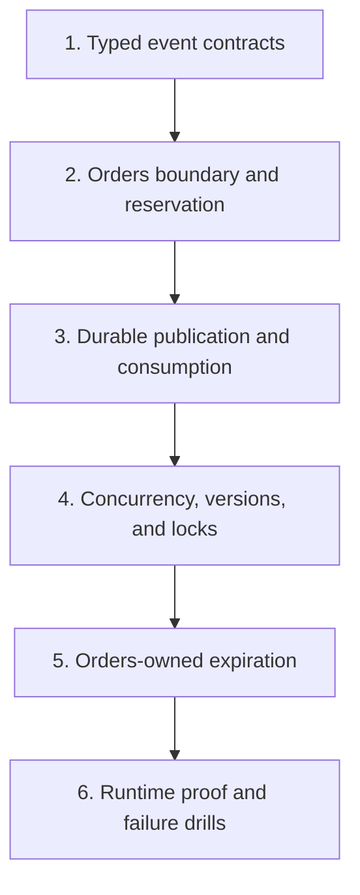

# Async Systems Course Companion

## Purpose

This companion translates external course lectures 314–450 into the architecture that actually exists in this repository.

Complete [`../index.md`](../index.md) lessons 01–10 first. Those lessons establish ownership, communication timing, broker behavior, durable delivery, and the design loop. This companion assumes those foundations and moves into implementation detail.

The goal is not to reproduce NATS Streaming, Mongoose, Bull, or the course's exact service boundaries. The goal is to keep the durable distributed-systems ideas, translate them to Redis Streams and SQLite, and skip machinery this project does not need.

## How the course and repository relate

Use the external lectures as concept prompts, not as the repository specification:

```text
Course lecture
    -> identify the underlying problem
    -> classify the original solution
    -> inspect the current StubHub decision
    -> predict failures
    -> prove behavior from durable evidence
```

The complete lecture-by-lecture classification is in [`lecture-map-314-450.md`](lecture-map-314-450.md).

## Classification legend

| Label | Meaning | What you should do |
|---|---|---|
| `KEEP` | The concept directly applies here. | Study it, then trace the linked current code. |
| `TRANSLATE` | The concept applies, but the technology or boundary differs. | Learn the problem, then use the documented current replacement. |
| `SKIP` | The item is obsolete, product-specific, redundant, or needless here. | Skip it or treat it as historical context; do not implement it. |
| `GAP` | The concept is valuable but current implementation or proof is incomplete. | Use it as an explicit exercise or future design decision. |

## Current translation in one view

| External-course mechanism | Current StubHub mechanism |
|---|---|
| NATS Streaming | Redis Streams |
| NATS subject | Stream name plus validated `eventType` |
| Queue group | Redis consumer group |
| Manual ACK | Redis `XACK` after durable consumer commit |
| Durable subscription | Stable group, Pending Entries List, Redis persistence, and `XAUTOCLAIM` |
| Generic Listener/Publisher base classes | Focused concrete worker and consumer functions |
| Mongoose model/ref/plugin | SQLite schema, opaque IDs, transactions, constraints, and guarded SQL |
| Bull delayed job | Orders-owned persisted deadlines and due-work scans |
| Separate Expiration service | Expiration capability inside Orders |
| Mocked broker calls | Observable HTTP, SQLite, filesystem, Redis, and pending-entry evidence |

## Dependency map

Read one module at a time. Each module supplies concepts needed by the next.



## Reading order

1. [`01-typed-event-contracts.md`](01-typed-event-contracts.md)
2. [`02-orders-boundary-and-reservation.md`](02-orders-boundary-and-reservation.md)
3. [`03-durable-publication-and-consumption.md`](03-durable-publication-and-consumption.md)
4. [`04-concurrency-versioning-and-locks.md`](04-concurrency-versioning-and-locks.md)
5. [`05-expiration-without-an-expiration-service.md`](05-expiration-without-an-expiration-service.md)
6. [`06-runtime-proof-and-failure-drills.md`](06-runtime-proof-and-failure-drills.md)

Keep [`lecture-map-314-450.md`](lecture-map-314-450.md) open beside the external course. It tells you whether to keep, translate, skip, or treat each lecture as a gap.

## Study rhythm

For each module:

1. Read the named course mapping before watching the lectures.
2. Watch only the `KEEP` and `TRANSLATE` items for the current concept.
3. Close the module and explain the problem without saying NATS, Redis, Mongoose, or SQLite.
4. Trace the exact current source path named in the module.
5. Predict one crash or race outcome before checking the answer.
6. Complete the checkpoint in writing.
7. Continue only when you pass the exit gate.

Review again the next day, three days later, and one week later. On each review, redraw the module's visual and explain which durable record or guard survives failure.

## Course rule

Never port a course mechanism merely because the instructor implemented it.

Before adopting anything, answer:

- Which business need forces it to exist?
- Which service owns the decision and durable state?
- Is the interaction an immediate command or a committed fact?
- Which crash window does the mechanism close?
- How are retries, duplicates, stale work, and ordering handled?
- What row, metric, broker state, or reconciliation query proves completion?

If the current implementation already answers those questions with less machinery, keep the smaller design.
