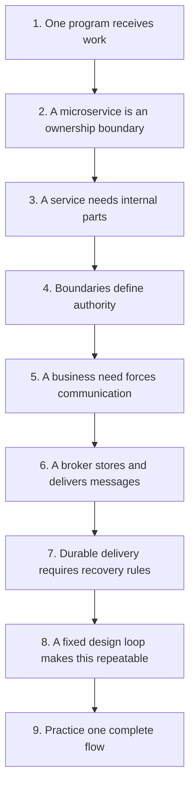

# Durable Service Design from First Principles

This folder turns the gaps in
[`service-design-growth-gaps.md`](../goals/service-design-growth-gaps.md) into a
slow, repeatable learning path.

The goal is not to memorize Redis, Kafka, queues, or design patterns. The goal is
to derive a safe design from the business problem, then choose technology.

## How to use this course

Read **one lesson at a time**. Do not read the whole folder in one sitting.

For each lesson:

1. Read it once.
2. Close it and explain the main idea aloud without using product names.
3. Complete its checkpoint in writing.
4. Reopen it and correct your explanation.
5. Continue only when you pass its exit gate.

Use this review rhythm to make the idea durable:

| When | What to do |
|---|---|
| Same day | Explain the lesson from memory |
| Next day | Redraw its visual from memory |
| Three days later | Apply it to a different feature |
| One week later | Explain which failure would break the design |

## Dependency map

Each lesson establishes a fact needed by the next lesson.

## Reading order

1. [`01-one-program-first.md`](01-one-program-first.md)
2. [`02-what-a-microservice-is.md`](02-what-a-microservice-is.md)
3. [`03-inside-one-service.md`](03-inside-one-service.md)
4. [`04-boundaries-and-data-ownership.md`](04-boundaries-and-data-ownership.md)
5. [`05-communication-before-transport.md`](05-communication-before-transport.md)
6. [`06-message-brokers-and-event-buses.md`](06-message-brokers-and-event-buses.md)
7. [`07-how-durable-delivery-works.md`](07-how-durable-delivery-works.md)
8. [`08-the-durable-design-loop.md`](08-the-durable-design-loop.md)
9. [`09-guided-practice.md`](09-guided-practice.md)
10. [`10-pocket-checklist.md`](10-pocket-checklist.md)

## Course rule

Do not ask **“REST or Redis?”** until you can name:

- the business rule;
- the stateful entity;
- the authoritative owner;
- the required timing;
- the failure outcomes;
- the retry and recovery owner; and
- the evidence that proves completion.

Transport is a late decision.