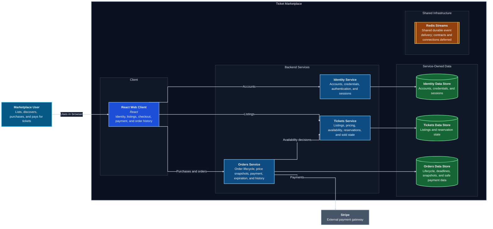

# C4 Level 2 — Container Diagram

**Source of truth:** `../../service-boundary.md`

This level expands the Ticket Marketplace into four visual layers: the React
client, backend services, service-owned data, and shared infrastructure.
Technologies and transports that have not been selected remain unnamed.

The diagram uses Mermaid flowchart layout to render the C4 container model with
explicit layers and straight relationships.

## Container decisions

- The visual layers organize the diagram; they are not additional deployable
  containers.
- The React Web Client never accesses a database directly.
- Identity, Tickets, and Orders own separate logical data stores and never share
  database access.
- Tickets alone changes ticket availability, reservation, release, and sold
  state.
- Orders owns Order state and coordinates with Tickets; it never modifies the
  Tickets data store.
- Payments and Expiration remain internal Orders capabilities, not separate
  services or containers.
- Redis Streams is the selected shared event-delivery infrastructure. Its
  relationships remain omitted until communication and event contracts are
  chosen.
- Authenticated identity propagation between backend services remains an open
  design question and is not invented in this diagram.

